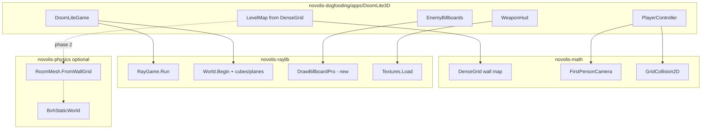

# 3D Doom-lite dogfood plan

You chose **simplified 3D** (Raylib `BeginMode3D`), not a classic 2.5D raycaster. That aligns with existing pieces: [`XFighter`](d:\novolis\novolis-raylib\samples\XFighter\Game\XFighterGame.cs) (`RayGame.Run` + `BeginWorld`/`EndWorld`), [`DenseGrid`](d:\novolis\novolis-math\src\Novolis.Math.Arrays\DenseGrid.cs), and [`RayGameContext`](d:\novolis\novolis-raylib\src\Novolis.Raylib.Game\RayGame.cs).



---

## Game scope (single level MVP)

| Feature | Implementation |
|---------|----------------|
| One dungeon level | Hand-authored `DenseGrid<byte>` (0 = walkable, 1 = wall); ~20×20 cells |
| World geometry | Each wall cell → `World.DrawCubeV` (1×2×1 m); floor → `DrawPlane` (new binding) |
| Player | WASD on XZ plane, mouse look, `DisableCursor`; height ~1.7 m eye offset |
| Enemies | 3–5 positions; `DrawBillboardPro` with Kenney sprite textures; simple chase or idle |
| Combat | Left-click / Space: ray or distance check; enemy “dies” (hide billboard) |
| HUD | Crosshair + optional weapon sprite (`DrawHudTexture`, same pattern as [`CockpitHud`](d:\novolis\novolis-raylib\samples\XFighter\Game\CockpitHud.cs)) |
| Controls | Esc = exit, R = reset level (mirror XFighter) |

**Out of scope for v1:** multiplayer, WAD loader, doors, audio (raylib sound not in generated bindings yet), full OBJ modular kit (depends on wave 7b).

---

## Where code lives

| Layer | Location |
|-------|----------|
| Dogfood app | [`novolis-dogfooding/apps/DoomLite3D/`](d:\novolis\novolis-dogfooding\apps\DoomLite3D\) — new project + entry in [`Novolis.Dogfooding.slnx`](d:\novolis\novolis-dogfooding\Novolis.Dogfooding.slnx) |
| Reusable math | [`novolis-math/src/Novolis.Math.Geometry/`](d:\novolis\novolis-math\src\Novolis.Math.Geometry\) |
| Reusable raylib | [`novolis-raylib/pipeline/raylib6/`](d:\novolis\novolis-raylib\pipeline\raylib6\) manifests + codegen → `World` / `RayGameContext` |
| Optional physics helper | [`novolis-physics/src/Novolis.Physics.Collision.Simple/`](d:\novolis\novolis-physics\src\Novolis.Physics.Collision.Simple\) |
| Governance brief | [`novolis-governance/docs/extraction-briefs/wave-9-doom-dogfood.md`](d:\novolis\novolis-governance\docs\extraction-briefs\wave-9-doom-dogfood.md) (new) |

**References (dogfood csproj):** `ProjectReference` to submodules `novolis-raylib`, `novolis-math` (Arrays + Geometry), and optionally `novolis-physics` — same pattern as [`RaylibHello.csproj`](d:\novolis\novolis-dogfooding\apps\RaylibHello\RaylibHello.csproj).

**Run:**

```powershell
cd d:\novolis\novolis-dogfooding
dotnet run --project apps/DoomLite3D/DoomLite3D.csproj
```

---

## Library gaps to close

### 1. `novolis-math` — FPS camera + grid collision

Frank’s [`FpsCameraState`](d:\novolis\bootstrap\scratch\frank-eval\Frank.GameEngine\src\libraries\Frank.GameEngine.Primitives\FpsCameraState.cs) is listed as **do not migrate** as-is in [gameengine-reference-policy](d:\novolis\novolis-governance\docs\gameengine-reference-policy.md), but the **idea** is approved via selective mining with a Novolis redesign.

Add to `Novolis.Math.Geometry`:

- **`FirstPersonCamera`** — `Vector3 Position`, yaw/pitch radians, `GetForward()` / `GetRight()` on XZ + Y pitch, `AddLookDelta(mouseDx, mouseDy, sensitivity)`, clamp pitch.
- **`GridCollision2D`** — `TryMove(DenseGrid<byte> map, Vector2 pos, Vector2 delta, float radius)` → slide against blocked cells (Doom-style grid blocking, no GameObject graph).

**Tests:** `Novolis.Math.Geometry.Tests` — known map, blocked corner slide, forward vector at yaw=0/π/2.

### 2. `novolis-raylib` — 3D sprites + jam API

Raylib 6 already exposes `DrawBillboard*` and `DrawPlane` in [`vendor/raylib-6/include/raylib.h`](d:\novolis\novolis-raylib\vendor\raylib-6\include\raylib.h), but they are **not** in generated [`World.g.cs`](d:\novolis\novolis-raylib\src\Novolis.Raylib.Runtime\Rendering\World.g.cs).

| API to add (codegen manifest) | Why |
|-------------------------------|-----|
| `DrawBillboard` / `DrawBillboardPro` | Enemy pickups, items |
| `DrawPlane` | Floor/ceiling |
| (optional) `DrawCubeTexture` | Textured walls later |

Extend **`RayGameContext`** ([`RayGame.cs`](d:\novolis\novolis-raylib\src\Novolis.Raylib.Game\RayGame.cs)):

- `LoadTexture(path)` / `UnloadTexture` — thin wrappers over `Textures.Load` (XFighter calls `Textures` directly; jam API should match `DrawHudTexture` ergonomics).
- `DrawBillboard(camera, texture, position, scale, tint)` — requires active `BeginWorld` pass (camera parameter matches raylib).

Regenerate bindings: `dotnet run pipeline/raylib6/run.cs all` per [novolis-raylib README](d:\novolis\novolis-raylib\README.md).

**Tests:** extend `Novolis.Raylib.Game.Unit` or Runtime tests if headless billboard draw is feasible; at minimum compile + manual dogfood run.

### 3. `novolis-physics` — optional phase 2 dogfood

**v1:** use `GridCollision2D` only (fast, correct for axis-aligned cube walls).

**v2 (validates physics package):** add `RoomMeshBuilder.FromWallGrid(DenseGrid<byte>, cellSize, wallHeight)` → `StaticTriangleMesh` → `BvhStaticWorld`; player movement via `SweepSphere` on a capsule. This dogfoods [`BvhStaticWorld`](d:\novolis\novolis-physics\src\Novolis.Physics.Collision.Simple\BvhStaticWorld.cs) without pulling Frank’s scene graph.

### 4. Not needed for this demo

| Package | Reason |
|---------|--------|
| Classic 2D raycaster lib | You chose 3D |
| `novolis-physics` in v1 | Grid collision suffices |
| OBJ / wave 7b | Grid cubes are enough for one level; modular Kenney OBJ can follow wave 7b |
| Audio bindings | Defer unless you explicitly want gunshot in v1 |

---

## Assets (GitHub / Kenney, CC0)

Vendor a **small subset** into `apps/DoomLite3D/Assets/` (committed or downloaded via script — prefer committed PNGs for reproducible CI).

| Asset | Source | License | Use |
|-------|--------|---------|-----|
| Enemy / item sprites | [Kenney — Tiny Dungeon](https://kenney.nl/assets/tiny-dungeon) | [CC0 1.0](https://creativecommons.org/publicdomain/zero/1.0/) | Billboards |
| Weapon / UI | Same pack or [Roguelike Caves & Dungeons](https://kenney.nl/assets/roguelike-caves-dungeons) | CC0 | HUD overlay |
| (Optional later) Modular pieces | [Modular Dungeon Kit](https://kenney.nl/assets/modular-dungeon-kit) | CC0 | After OBJ helper ships |

**Attribution file:** `apps/DoomLite3D/Assets/CREDITS.md` (mirror [`novolis-security CREDIT.md`](d:\novolis\novolis-security\src\Novolis.Security.Resources\CREDIT.md) style):

```markdown
## Kenney — Tiny Dungeon
- Source: https://kenney.nl/assets/tiny-dungeon
- License: CC0 1.0 Universal (https://creativecommons.org/publicdomain/zero/1.0/)
- Files used: <list filenames vendored in Assets/>
```

Do **not** use id Software Doom/Wolfenstein copyrighted WAD art.

**Optional script:** `apps/DoomLite3D/scripts/fetch-kenney-assets.ps1` documents download URL + which files to copy (developer convenience, not required at runtime if assets are committed).

---

## App structure (dogfood)

```
apps/DoomLite3D/
  Program.cs              # RayGame.Run("Doom Lite", 1280, 720, init, update)
  DoomLite3D.csproj
  Assets/
    CREDITS.md
    enemies/*.png
    weapon.png
  Game/
    DoomLiteGame.cs       # loop orchestration
    LevelMap.cs           # grid → wall positions, spawn points
    LevelRenderer.cs      # cubes + plane + billboards
    PlayerController.cs   # input + FirstPersonCamera + GridCollision2D
    EnemySystem.cs
    WeaponHud.cs
```

**Camera bridge:** `PlayerController.BuildRaylibCamera()` maps `FirstPersonCamera` → `Novolis.Raylib.Rendering.Camera.Perspective` (XFighter’s [`PlayerFlight.BuildCamera`](d:\novolis\novolis-raylib\samples\XFighter\Game\PlayerFlight.cs) pattern, with yaw/pitch).

---

## Governance

Add brief [`wave-9-doom-dogfood.md`](d:\novolis\novolis-governance\docs\extraction-briefs\wave-9-doom-dogfood.md):

- Documents what was extracted vs what stays in the app
- Confirms no `Frank.GameEngine.Rendering.*` migration
- Links dogfood app as acceptance test for math + raylib billboard APIs

---

## Acceptance criteria

- `dotnet build` / `dotnet run` from `novolis-dogfooding` on Windows (desktop; native raylib DLL)
- Walk one level, look with mouse, shoot enemies, reset with R
- `CREDITS.md` lists every external PNG and source URL
- New math APIs have TUnit tests
- New raylib APIs appear in generated `World` and `RayGameContext` after codegen

