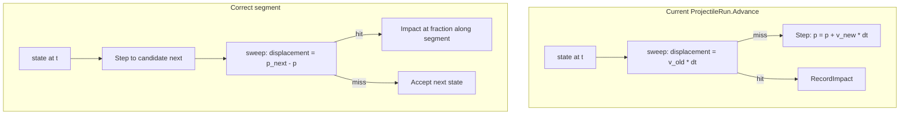

# ArtillerySimulator polish — finished-product pass

## What is already right

- App structure ([`Program.cs`](d:\novolis\novolis-dogfooding\apps\ArtillerySimulator\Program.cs), [`ArtillerySimulatorGame`](d:\novolis\novolis-dogfooding\apps\ArtillerySimulator\Game\ArtillerySimulatorGame.cs)) matches other dogfood apps.
- Libraries are wired correctly: `ProjectileBallisticSimulation`, `BvhStaticWorld`, `BallisticsQueries.SweepProjectileSphere`.
- Gun preset, HUD, fire/reset flow, and impact marker drawing exist.
- Screenshot symptoms (straight trail through hills, `Impact —`, ~27 FPS, weak gun presence) match **fixable bugs and rendering cost**, not a wrong product direction.

## Root causes (from code + physics docs)

| Symptom | Cause |
|--------|--------|
| Trail clips through terrain, never `Impacted` | Sweep uses **`v_old * dt`** but [`ProjectileSemiImplicitIntegrator`](d:\novolis\novolis-physics\src\Novolis.Physics.Ballistics\ProjectileSemiImplicitIntegrator.cs) moves **`p + v_new * dt`** where `v_new = v_old + a*dt` — segment does not match motion ([`ProjectileRun.cs`](d:\novolis\novolis-dogfooding\apps\ArtillerySimulator\Game\ProjectileRun.cs) L68–81). |
| Occasional tunneling even after fix | `SweepSphere` is an **inflated raycast**, not true CCD; steps ~3–7 m at 400–800 m/s can overshoot features ([INTEGRATION.md §3](d:\novolis\novolis-physics\docs\INTEGRATION.md), [`SweepLimitationScenarioTests`](d:\novolis\novolis-physics\tests\Novolis.Physics.Unit\SweepLimitationScenarioTests.cs)). |
| ~27 FPS | [`TerrainWorld.Draw`](d:\novolis\novolis-dogfooding\apps\ArtillerySimulator\Game\TerrainWorld.cs) issues **3 `DrawBolt` per triangle** (~8k tris → ~24k lines/frame). |
| Gun hard to see | [`OverviewCamera`](d:\novolis\novolis-dogfooding\apps\ArtillerySimulator\Game\OverviewCamera.cs) targets map center; gun at **x=40** with **5 m** line art is tiny in a **500 m** scene. |
| Trail looks “straight” | Low sample density + wrong motion + camera angle; subsample every 3 steps is fine once physics and FPS are fixed. |

Your choices for this pass: **fast wireframe terrain** (not solid mesh) and **C toggles fixed vs chase camera**.

---

## Phase 1 — Correct ballistic + terrain collision (must-have)

**Refactor [`ProjectileRun.Advance`](d:\novolis\novolis-dogfooding\apps\ArtillerySimulator\Game\ProjectileRun.cs)** to match the integrator and [`CollisionSweepScenarioTests`](d:\novolis\novolis-physics\tests\Novolis.Physics.Unit\CollisionSweepScenarioTests.cs) pattern:

1. `candidate = sim.Step(_state, dt, env)`
2. `displacement = candidate.Position - _state.Position`
3. `SweepProjectileSphere` from `_state.Position` with that displacement
4. On hit:
   - `frac = hit.Distance / |displacement|`
   - Impact position = `_state.Position + displacement * frac`
   - Impact time = `_state.TimeSeconds + dt * frac` (fix currently using pre-impact time in `RecordImpact`)
   - Impact velocity ≈ `_state.Velocity` (acceptable for HUD; optional: one partial `Step` only if needed later)
5. On miss: `_state = candidate`

**Sub-step sweeps** (documented mitigation, stay in app — no library change required):

- Cap max sweep length (e.g. **2 m** or `min(2, |displacement|)`).
- If `|displacement| > cap`, split into `ceil(|disp|/cap)` substeps: integrate one sub-`dt`, sweep, stop on hit.
- Keep physics `dt = 1/120`; run **multiple substeps per frame** in [`ArtillerySimulatorGame.Update`](d:\novolis\novolis-dogfooding\apps\ArtillerySimulator\Game\ArtillerySimulatorGame.cs) until a budget (e.g. 16–32 substeps/frame) instead of fixed `4` blind loops.

**Trail sampling:** append trail point **every substep** (or every 2nd) while in flight so the arc reads clearly at 60 FPS.

**Acceptance:** firing charge 2 at ~45° over hills shows a **curved** trail, stops on surface, HUD shows range/TOF/speed; flat + vacuum still logs ~`2*vx*vy/g` sanity line.

---

## Phase 2 — Terrain draw performance (wireframe, fast)

In [`TerrainWorld`](d:\novolis\novolis-dogfooding\apps\ArtillerySimulator\Game\TerrainWorld.cs):

- **Collision mesh:** keep **64×64** (unchanged BVH).
- **Draw mesh:** separate **32×32** heightfield (or draw only **grid lines**: `(GridDraw+1)` polylines in X and Z ≈ 130×2 segments — far fewer than 24k triangle edges).
- Keep height-based color (`_wireLow` / `_wireHigh`).
- Optional: skip drawing every other line when FPS &lt; 45 (only if needed after grid-line draw).

**Acceptance:** FPS **≥ 55** on typical hardware with terrain on.

---

## Phase 3 — Camera + gun readability

**Replace static [`OverviewCamera`](d:\novolis\novolis-dogfooding\apps\ArtillerySimulator\Game\OverviewCamera.cs) with `ArtilleryCamera`:**

| Mode | Eye / target | Toggle |
|------|----------------|--------|
| **Fixed** (default) | Target ≈ `GunBaseline + barrelDir * 120m`; eye offset back/up-left so gun + downrange fill view | — |
| **Chase** | Target = projectile position + small lead; eye behind/above velocity | **C** |

- Smooth lerp on target/eye (0.1–0.15s time constant) to avoid jitter.
- Persist mode in game state; show `Cam fixed` / `Cam chase` on HUD.

**Gun draw** in [`GunModel.Draw`](d:\novolis\novolis-dogfooding\apps\ArtillerySimulator\Game\GunModel.cs):

- Add a **ground plate** (2–3 m triangle or cross) at pivot so the piece reads at map scale.
- Thicker tube line + slightly larger muzzle wire.
- Draw **pivot glow** only in Ready (reduce clutter in flight).

---

## Phase 4 — UX: aim preview + HUD polish

**Aim preview (Ready only)** — new small helper e.g. `BallisticArcPreview.cs`:

- Clone current `ProjectileBallisticSimulation` + environment from [`GunModel`](d:\novolis\novolis-dogfooding\apps\ArtillerySimulator\Game\GunModel.cs).
- Integrate up to **8–12 s** or until below local terrain sample (`TerrainWorld.SampleHeight`) — **no BVH** for preview (cheap).
- Draw dimmer color (`Color` ~50% alpha of trail) as polyline from muzzle.
- Update when elevation/azimuth/charge/drag changes.

**HUD** ([`SimulationHud.cs`](d:\novolis\novolis-dogfooding\apps\ArtillerySimulator\Game\SimulationHud.cs)):

- In flight: show `Alt`, `Spd`, `Time` live.
- Show camera mode; controls line: add **`C` cam**.
- Keep non-violent disclaimer.

**Shot flow:**

- `R` / `F` already reset — ensure they reset camera blend target to gun.
- After impact, stay in `Impacted` until Space (already); optionally auto-clear trail on next aim nudge (low priority).

---

## Phase 5 — Validation (dogfood, no new package yet)

| Check | How |
|-------|-----|
| Vacuum flat range | Existing `LogVacuumFlatSanity` on fire |
| Terrain hit | Manual: hills on, fire, impact marker + HUD stats |
| Sweep regression | Manual compare with sub-steps off vs on (should not miss ground) |
| Performance | HUD FPS with terrain on |

**Defer to physics library** (only if a second app needs it): `SimulateProjectileUntilTerrainHit` wrapping sub-step sweep loop — not required for this polish pass.

---

## Files to touch (focused)

| File | Change |
|------|--------|
| [`ProjectileRun.cs`](d:\novolis\novolis-dogfooding\apps\ArtillerySimulator\Game\ProjectileRun.cs) | Integrate-then-sweep, sub-steps, trail density, impact time |
| [`ArtillerySimulatorGame.cs`](d:\novolis\novolis-dogfooding\apps\ArtillerySimulator\Game\ArtillerySimulatorGame.cs) | Substep budget, aim preview draw, camera mode input |
| [`TerrainWorld.cs`](d:\novolis\novolis-dogfooding\apps\ArtillerySimulator\Game\TerrainWorld.cs) | Decoupled draw grid / LOD mesh |
| [`GunModel.cs`](d:\novolis\novolis-dogfooding\apps\ArtillerySimulator\Game\GunModel.cs) | Larger silhouette |
| [`OverviewCamera.cs`](d:\novolis\novolis-dogfooding\apps\ArtillerySimulator\Game\OverviewCamera.cs) → `ArtilleryCamera.cs` | Fixed + chase + toggle |
| [`SimulationHud.cs`](d:\novolis\novolis-dogfooding\apps\ArtillerySimulator\Game\SimulationHud.cs) | In-flight stats, cam hint |
| New `BallisticArcPreview.cs` | Preview polyline |

No edits to [`artillerysimulator_dogfood_b3198318.plan.md`](d:\novolis\.cursor\plans\artillerysimulator_dogfood_b3198318.plan.md).

---

## Out of scope (later)

- Solid shaded terrain / `DrawMesh` material pipeline in Raylib facade.
- Real charge tables, targets, explosions, ImGui panels.
- Library extraction of terrain-impact loop until another consumer appears.

