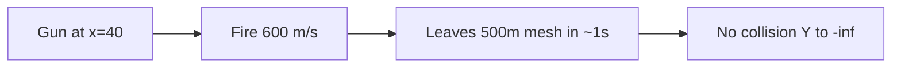

# ArtillerySimulator — 10× scale-down + bounds safety

## Problem

Your screenshot (`Alt -25871 m`, `T 147 s`, `InFlight`) is a **range mismatch**, not a sweep bug:

| Setting | Current value | Effect |
|---------|---------------|--------|
| [`TerrainWorld.ExtentMeters`](d:\novolis\novolis-dogfooding\apps\ArtillerySimulator\Game\TerrainWorld.cs) | **500 m** | Collision mesh only covers `X,Z ∈ [0, 500]` |
| [`GunModel` charge speeds](d:\novolis\novolis-dogfooding\apps\ArtillerySimulator\Game\GunModel.cs) | **400 / 600 / 800 m/s** | Vacuum 45° range for 600 m/s ≈ **37 km** |
| BVH outside mesh | No triangles | `SweepProjectileSphere` never hits; projectile falls forever |

You chose **scale down 10×** (not 5 km expansion).

---

## Approach: single `SimulationUnits` + proportional retune

Add [`Game/SimulationUnits.cs`](d:\novolis\novolis-dogfooding\apps\ArtillerySimulator\Game\SimulationUnits.cs) as the one place for world scale (easy to tune later):

| Constant | Was | New (÷10) |
|----------|-----|-----------|
| `ExtentMeters` | 500 | **50** |
| Charge speeds | 400/600/800 | **40/60/80** |
| Gun pivot X | 40 | **4** |
| Fixed cam look-ahead | 120 | **12** |
| Fixed cam eye offset | (-55, 38, 42) | **(-5.5, 3.8, 4.2)** |
| Chase cam offsets | 28 / 25 | **2.8 / 2.5** |
| Hill amplitudes in `SampleHeight` | 18, 28, 22, 14 | **1.8, 2.8, 2.2, 1.4** (scale with extent so hills stay ~15% of map, not 160%) |

Keep **collision 64×64** and **draw 32×32** on 50 m → ~0.78 m / ~1.6 m quads (good for sweeps). No mesh density change needed.

**Gun visuals:** keep [`BarrelLength`](d:\novolis\novolis-dogfooding\apps\ArtillerySimulator\Game\GunModel.cs) ~5.2 m so the piece stays visible on a 50 m map (~10% of width); only world placement and speeds scale.

---

## Files to update

### 1. [`SimulationUnits.cs`](d:\novolis\novolis-dogfooding\apps\ArtillerySimulator\Game\SimulationUnits.cs) (new)

Central constants: `ExtentMeters`, `GunPivotX`, `GunHeightOffset`, charge speed array, camera offsets, height amplitude scalars.

### 2. [`TerrainWorld.cs`](d:\novolis\novolis-dogfooding\apps\ArtillerySimulator\Game\TerrainWorld.cs)

- Replace `ExtentMeters = 500f` with `SimulationUnits.ExtentMeters`.
- Gun baseline: `(GunPivotX, SampleHeight(...), Extent * 0.5f)`.
- Scale `SampleHeight` base amplitudes via `SimulationUnits`.

### 3. [`GunModel.cs`](d:\novolis\novolis-dogfooding\apps\ArtillerySimulator\Game\GunModel.cs)

- Charge speeds from `SimulationUnits.ChargeSpeedsMps`.

### 4. [`ArtilleryCamera.cs`](d:\novolis\novolis-dogfooding\apps\ArtillerySimulator\Game\ArtilleryCamera.cs)

- Fixed/chase offsets from `SimulationUnits`.

### 5. [`ProjectileRun.cs`](d:\novolis\novolis-dogfooding\apps\ArtillerySimulator\Game\ProjectileRun.cs) — **bounds safety** (required even after scale)

After each accepted integration step (and on sub-steps), call `TerrainWorld` helpers:

- `IsInside(x, z)` → `x,z ∈ [0, Extent]` with small margin.
- `TryHeightfieldContact(position, radius)` → `Y <= SampleHeight(x,z) + radius` when inside (catches mesh edge misses).

If outside bounds or below heightfield: `RecordImpact` and set phase `Impacted` (optional `ImpactResult` flag or HUD text **"Beyond range"** when OOB vs mesh hit).

Pass `TerrainWorld` into `AdvanceWithBudget` instead of only `BvhStaticWorld` so heightfield checks are available.

Reduce `MaxSteps` proportionally (e.g. **12_000** ≈ 100 s cap at 1/120 s — enough for 50 m world).

### 6. [`BallisticArcPreview.cs`](d:\novolis\novolis-dogfooding\apps\ArtillerySimulator\Game\BallisticArcPreview.cs)

- Stop preview when `!terrain.IsInside(p.X, p.Z)` (not only height sample).
- `MaxTimeSeconds` can stay 12 s (plenty at 80 m/s).

### 7. [`SimulationHud.cs`](d:\novolis\novolis-dogfooding\apps\ArtillerySimulator\Game\SimulationHud.cs)

- Show `Beyond range` when impact was OOB (if we add a bool on `ImpactResult` or `ShotEndReason` enum).

### 8. [`ArtillerySimulatorGame.cs`](d:\novolis\novolis-dogfooding\apps\ArtillerySimulator\Game\ArtillerySimulatorGame.cs)

- Wire `AdvanceWithBudget(_terrain, ...)` signature change only.

---

## Expected outcome

- Charge 2 @ 45° over hills: lands **inside** 50 m patch within a few seconds; HUD shows impact range **&lt; ~50 m**, altitude sane.
- Flat + vacuum sanity log still valid (`2*vx*vy/g` with new speeds).
- No more multi-minute `InFlight` with huge negative altitude.

---

## Validation

1. `dotnet build` Release on ArtillerySimulator.
2. Manual: fire all three charges at 45° — each should `Impacted` with range on HUD &lt; 50 m.
3. Fire at max elevation toward edge — should end as **Beyond range** or terrain hit, not infinite fall.

No edits to the polish plan file or physics libraries.

