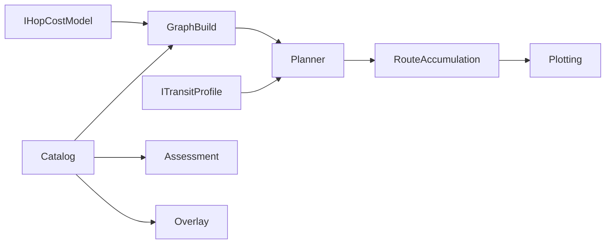
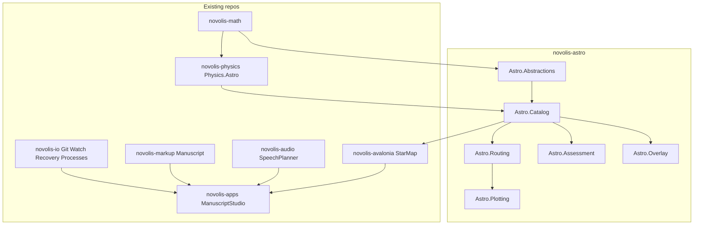

# Universal Astro + IO platform libraries

## Locked decisions

- **New repo:** `Novolis-Platform/novolis-astro` — domain family for stellar catalogs, interstellar routing, and worldbuilding assessment. **Not** in Math→Physics→Simulation; may reference Math and thin Physics.Astro.
- **Universal APIs, prototype-compatible:** Design for games, simulations, and worldbuilding. The books/tools star stack is a **reference prototype** for capability and rough parameter shapes (range bands, weighted hop cost, route totals)—not a fiction-specific product API. Defaults and models must be able to reproduce prototype-class behavior when configured, without hard-coding story registries, campaign names, or content paths.
- **Physics:** thin `Novolis.Physics.Astro` for SI unit bridges only (ly/pc/AU ↔ meters); no catalogs or jump graphs.
- **Git / IO:** real Git CLI wrappers and file helpers in **`novolis-io`**, not `novolis-workspaces` (workspaces own zip save-points and avoid SCM vocabulary).
- **Authoring consumer (Wave 2):** ManuscriptStudio and other apps compose packages; no books-repo retarget wave.
- **NuGet-only:** GPR `2026.1.*`; no local feeds.
- **Wave 1 depth:** working Astro + IO APIs and tests. StarMap / Manuscript / speech planning are Wave 2.

## Domain ideas (Astro)

Frame the library around reusable concepts, not a single campaign:

| Concept | Meaning | Prototype compatibility |
|---------|---------|-------------------------|
| **Catalog** | Named systems with 3D positions (ly/pc), optional spectral/body metadata | HYG-like imports as one adapter |
| **Jump / hop range** | Max Euclidean distance for an edge | Configurable; prototype used multi-ly economic vs longer “painful” bands |
| **Hop cost model** | Pluggable cost from distance (+ optional risk, fuel, time) | Include a stock model with range bands and weights that can match prototype tradeoffs when parameterized—not a fixed “economic/painful” enum as the only API |
| **Transit profile** | Speed / duration / resource burn per hop or per ly | Separate from cost so games can optimize for time vs risk vs fuel |
| **Route planner** | Graph build + shortest path under a chosen cost model | Dijkstra-style; graph may be dense within max range |
| **Route accumulation** | Totals along a path: distance, cost, time, hop count by class/band | Same idea as prototype waypoint totals—generic accumulators |
| **Assessment** | Pluggable scorers (habitability, strategic value, settlement fitness, …) | Prototype habitability/usefulness are **example scorers**, not the only tiers |
| **Overlay** | Alias / faction / campaign labels bound to catalog IDs | General worldbuilding overlay—not story-specific schemas |
| **Plotting** | Project XYZ→2D, draw paths, export SVG/tables | Headless; no product UI |

### Routing API shape (locked intent)

- `IHopCostModel.Evaluate(from, to, distanceLy) → HopEvaluation` with cost, optional band/tag, feasibility.
- `ITransitProfile.Evaluate(...) → TransitEvaluation` with duration and/or resource deltas (games/speed separate from pathfinding cost).
- `RouteGraph.Build(systems, maxRangeLy, costModel)`.
- `RoutePlanner.Find(fromId, toId, graph)` → `RouteResult` with waypoints + **`RouteAccumulation`** (sum ly, sum cost, sum time, counts by band/tag).
- Stock models shipped for common defaults; consumers inject custom models for hard-SF, soft-FTL, or game balance.

### Assessment API shape (locked intent)

- `ISystemAssessor` / scored facets with reasons list.
- Stock assessors may cover habitability-like and strategic-value-like scores; tiers are data, not campaign lore.

### Package layout (`novolis-astro`)

| Package | Owns |
|---------|------|
| `Novolis.Astro.Abstractions` | Coords, IDs, hop/transit evaluation records — no I/O |
| `Novolis.Astro.Catalog` | Catalog store, queries, import adapters (e.g. HYG CSV) |
| `Novolis.Astro.Routing` | Graph, cost/transit models, planner, accumulation |
| `Novolis.Astro.Assessment` | Scorer interfaces + stock assessors |
| `Novolis.Astro.Overlay` | Alias/label overlays bound to catalog IDs + validation hooks |
| `Novolis.Astro.Plotting` | Projection, path SVG/TSV export (headless) |

**Out of Wave 1:** interactive Spectre CLI, product Avalonia UI, any campaign content packs.

**Inspiration only (do not encode as platform API):** books tools `astroforge.cs`, voyage plot scripts, prototype JSON maps. Use them to calibrate stock model parameters and tests that prove “prototype-compatible configuration exists.”

## Target layout

## Wave 1 — `novolis-astro` + `novolis-io` + thin Physics.Astro

### A. Bootstrap `novolis-astro`

Template from `novolis-template-dotnet` (same pattern as economy skeleton): `net10.0`, TUnit, `.novolis/packages.json`, docs (`design`, `getting-started`, `release`), GPR on merge.

Implement packages above with synthetic fixtures (hand-built star fields). Add at least one test that configures the stock hop model to approximate prototype band/weight behavior (tolerance-based), proving compatibility without depending on campaign data.

### B. `novolis-physics` — `Novolis.Physics.Astro`

Next to [`Novolis.Physics.Orbits`](d:\novolis\novolis-physics\src\Novolis.Physics.Orbits\README.md):

- ly ↔ m, pc ↔ m, AU ↔ m (SI-first).
- Helper to map catalog coords (ly) → `Vector3` meters when wiring real orbits.

No catalog/routing here. Document in Physics ARCHITECTURE.

### C. `novolis-io` — universal studio IO

Today: [`IFileWorkspace`](d:\novolis\novolis-io\src\Novolis.IO.Workspace\IFileWorkspace.cs). Add:

| Package | Owns |
|---------|------|
| **`Novolis.IO.Git`** | Process-based `git` on PATH: status, checkpoint (add/commit/push options), pass start/finish, revision tags. Structured results. Injectable pass-metadata path (default `.novolis/git-passes.json`). Injectable `IGitProcessRunner`. No LibGit2Sharp in Wave 1. |
| **`Novolis.IO.Watching`** | Single-file watcher + optional debounce. |
| **`Novolis.IO.Recovery`** | Content-hash draft snapshots under configurable root; trim/clear. Not Workspaces zip save-points. |
| **`Novolis.IO.Processes`** | Concurrent process job queue + kill process tree on cancel. |
| **`Novolis.IO.Paths`** | `RootFinder.TryFind(start, markers)` — caller supplies markers. |

**Non-goals:** Avalonia SCM chrome; Workspaces timeline merge; product folder layouts.

## Wave 2 — authoring + StarMap

| Repo | Package / change |
|------|------------------|
| `novolis-markup` | `Novolis.Markup.Manuscript` — chapter callout/YAML metadata parse+apply, body strip for word count |
| `novolis-audio` | Speech planning facet — chunking, scene-break pauses, pronunciation rewrite map for TTS |
| `novolis-avalonia` | `Novolis.Avalonia.StarMap` — pan/zoom catalog + routes over Astro types via Rendering/TwoD |
| `novolis-apps` | ManuscriptStudio PackageReferences IO + optional StarMap rail; use existing Markdown `BookAuthoring` highlighting |

## Governance

- `Novolis.Astro.*` = domain family (like Economy): Math/Physics.Astro OK; no Simulation/Avalonia/Raylib references from Astro core.
- `Novolis.IO.Git` ≠ Workspaces save-points.
- Publish order: Physics.Astro → astro → io → (Wave 2) markup/audio/avalonia → apps.
- `verify-nuget-only.ps1` on consumer config changes.

## Verification

- Build + TUnit green per repo.
- Restore via nuget.org + github only.
- Smokes: Git status on temp repo; route + accumulation on synthetic catalog; recovery round-trip; stock cost model prototype-compatibility test.

