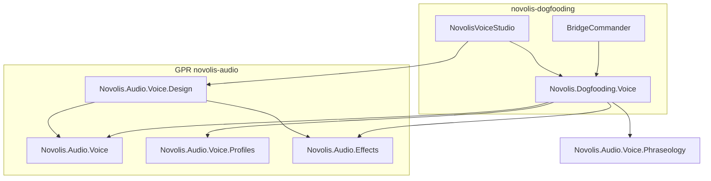
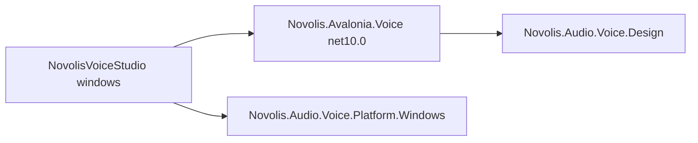

# Audio cleanup: XML docs + ATC to dogfooding

## Goals

1. **Documentation** — All packable projects under [`novolis-audio/src`](novolis-audio/src) satisfy [documentation policy](novolis-governance/docs/documentation-policy.md): `GenerateDocumentationFile`, no CS1591 gaps on public/protected members, README Install + Quick start.
2. **ATC scope** — Remove [`Novolis.Audio.Voice.Atc`](novolis-audio/src/Novolis.Audio.Voice.Atc) from GPR; host ATC/radio delivery in dogfooding as **`Novolis.Dogfooding.Voice`** (non-packable, `ProjectReference` only).
3. **Keep GPR Design generic** — [`Novolis.Audio.Voice.Design`](novolis-audio/src/Novolis.Audio.Voice.Design) stays on GPR for [`Novolis.Avalonia.Voice`](novolis-avalonia/src/Novolis.Avalonia.Voice); ATC-specific code export moves to dogfooding extensions (your choice).
4. **Platform.Windows is opt-in** — Generic GPR/UI packages target `net10.0` only; [`Novolis.Audio.Voice.Platform.Windows`](novolis-audio/src/Novolis.Audio.Voice.Platform.Windows) is referenced only by Windows hosts (e.g. NovolisVoiceStudio), fixing [avalonia merge CI](https://github.com/Novolis-Platform/novolis-avalonia/actions/runs/26697754971/job/78685059921).

---

## Part A — XML documentation (strict public API)

### Current state

- [`Directory.Build.props`](novolis-audio/Directory.Build.props) sets `TreatWarningsAsErrors` and imports [`build/Novolis.Audio.Documentation.props`](novolis-audio/build/Novolis.Audio.Documentation.props) → `GenerateDocumentationFile=true`.
- **Gap:** Recent packages (especially [`Voice.Design`](novolis-audio/src/Novolis.Audio.Voice.Design)) build with many **CS1591** warnings on public members (e.g. `VoicePresetDraft` properties, `VoiceDeliveryEffectStep` fields) — not yet documentation-complete.
- No [`build/.novolis-documentation-complete`](novolis-governance/docs/documentation-policy.md) marker in `novolis-audio` (CI doc-audit is optional until marker exists).

### Approach

| Step | Action |
|------|--------|
| 1 | Run Release build and collect CS1591 list; use [`novolis-governance/scripts/add-missing-xml-docs.ps1`](novolis-governance/scripts/add-missing-xml-docs.ps1) (iterative) as a bootstrap, then hand-fix summaries/`<param>`/`<returns>` on non-obvious APIs. |
| 2 | Prioritize **voice stack** packables: `Voice`, `Voice.Abstractions`, `Voice.Profiles`, `Voice.Phraseology`, `SherpaOnnx`, `Kokoro`, `Platform.*`, `Design`, `Effects`, `Filters`, `Playback`, `Core`. |
| 3 | Document **public fields** on design types ([`VoiceDeliveryEffectStep`](novolis-audio/src/Novolis.Audio.Voice.Design/VoiceDeliveryEffectStep.cs), [`VoicePresetDraft`](novolis-audio/src/Novolis.Audio.Voice.Design/VoicePresetDraft.cs)) or convert to properties with `{ get; set; }` if that matches repo style elsewhere. |
| 4 | Run [`doc-audit.ps1`](novolis-governance/scripts/doc-audit.ps1) with `-RequireDocumentationProps`; fix README gaps (Install / Quick start) on any new packages. |
| 5 | Add `build/.novolis-documentation-complete` only when `dotnet build -c Release` is **0 warnings** on packable projects and doc-audit passes. |

### CI alignment

- Ensure PR workflow (via `novolis-workflows`) runs doc-audit when marker is present, or add explicit doc-audit step to [`pull-request.yml`](novolis-audio/.github/workflows/pull-request.yml) after marker lands.

---

## Part B — Move ATC to dogfooding

### What moves (4 types today)

From [`Novolis.Audio.Voice.Atc`](novolis-audio/src/Novolis.Audio.Voice.Atc):

| File | Role |
|------|------|
| [`AtcVoiceOptions.cs`](novolis-audio/src/Novolis.Audio.Voice.Atc/AtcVoiceOptions.cs) | Radio/phraseology delivery DTO |
| [`AtcVoiceProfile.cs`](novolis-audio/src/Novolis.Audio.Voice.Atc/AtcVoiceProfile.cs) | `ApplyDelivery` on `VoiceServiceBuilder` |
| [`AtcRadioEffects.cs`](novolis-audio/src/Novolis.Audio.Voice.Atc/AtcRadioEffects.cs) | `atc-radio` filter chain |
| [`AtcVoiceServiceCollectionExtensions.cs`](novolis-audio/src/Novolis.Audio.Voice.Atc/AtcVoiceServiceCollectionExtensions.cs) | `AddNovolisAtcVoice` DI sugar |

**New project:** `novolis-dogfooding/apps/shared/Novolis.Dogfooding.Voice/`

- `IsPackable=false`
- Namespace: `Novolis.Dogfooding.Voice` (types renamed optional: keep `AtcVoiceOptions` / `AtcVoiceProfile` names to minimize churn)
- **PackageReferences (GPR):** `Novolis.Audio.Voice`, `Novolis.Audio.Voice.Profiles`, `Novolis.Audio.Voice.Phraseology`, `Novolis.Audio.Voice.SherpaOnnx`, `Novolis.Audio.Effects`, `Novolis.Audio.Filters` — **not** `Novolis.Audio.Voice.Atc`
- Add to [`Novolis.Dogfooding.slnx`](novolis-dogfooding/Novolis.Dogfooding.slnx)

**Dogfood consumers** (switch `PackageReference` → `ProjectReference`):

- [`BridgeCommander`](novolis-dogfooding/apps/BridgeCommander/BridgeCommander.csproj), [`XFighter`](novolis-dogfooding/apps/raylib/XFighter/XFighter.csproj), [`VoiceSmoke`](novolis-dogfooding/apps/audio/VoiceSmoke/VoiceSmoke.csproj), [`NovolisVoiceStudio`](novolis-dogfooding/apps/audio/NovolisVoiceStudio/NovolisVoiceStudio.csproj)
- Update [`novolis-dogfooding/Directory.Packages.props`](novolis-dogfooding/Directory.Packages.props): **remove** `Novolis.Audio.Voice.Atc`
- C# usings: `Novolis.Audio.Voice.Atc` → `Novolis.Dogfooding.Voice`

### Decouple GPR `Voice.Design` from ATC

[`Voice.Design`](novolis-audio/src/Novolis.Audio.Voice.Design) must not reference ATC after removal.

| Area | Change |
|------|--------|
| [`VoiceEffectChainBuilder.cs`](novolis-audio/src/Novolis.Audio.Voice.Design/VoiceEffectChainBuilder.cs) | Remove `AtcVoiceProfile.ApplyDelivery` fallback; when `EffectSteps` is empty, apply phraseology/radio only via existing `BuildFilters` + `NormalizeWith` from draft flags (mirror current step logic). |
| [`VoicePresetDraft.cs`](novolis-audio/src/Novolis.Audio.Voice.Design/VoicePresetDraft.cs) | Remove `ToAtcOptions()` and `using Novolis.Audio.Voice.Atc`; keep legacy scalar fields for UI or derive purely from `EffectSteps`. |
| [`VoicePresetCodeEmitter.cs`](novolis-audio/src/Novolis.Audio.Voice.Design/VoicePresetCodeEmitter.cs) | Remove `EmitAtcDelivery` / `AtcDeliveryStatic` template and `BridgeCharacter` template **or** keep enum values but move emitters to dogfooding (recommended: trim enum to generic templates only: `ArchetypeCatalogEntry`, `UsageSnippet`). |
| **Dogfooding extension** | New `VoicePresetCodeEmitterAtcExtensions` (or static `DogfoodingVoiceCodeEmitter`) in `Novolis.Dogfooding.Voice` implementing former `AtcDeliveryStatic` + `BridgeCharacter` output using `AtcVoiceOptions`. |
| [`VoiceCodeExportPanel`](novolis-avalonia/src/Novolis.Avalonia.Voice/VoiceCodeExportPanel.cs) | Remains bound to GPR `VoicePresetCodeTemplate`; dogfood-only templates registered in **NovolisVoiceStudio** subclass or optional extra combo (studio-only), not in Avalonia package. |

### Remove ATC from `novolis-audio`

- Delete [`src/Novolis.Audio.Voice.Atc/`](novolis-audio/src/Novolis.Audio.Voice.Atc)
- Remove from [`Novolis.Audio.slnx`](novolis-audio/Novolis.Audio.slnx)
- Update docs: [`README.md`](novolis-audio/README.md), [`docs/release.md`](novolis-audio/docs/release.md), [`docs/design.md`](novolis-audio/docs/design.md), [`docs/getting-started.md`](novolis-audio/docs/getting-started.md), [`AGENTS.md`](novolis-audio/AGENTS.md), package READMEs that mention ATC

### Tests

| Tests | Destination |
|-------|----------------|
| `AtcVoiceProfile_*`, `AtcRadioEffects_*`, `AudioEffectsTests` ATC paths | New `novolis-dogfooding/tests/Novolis.Dogfooding.Voice.Unit` **or** keep minimal coverage in dogfood app smoke |
| [`VoiceArchetypeCatalogTests`](novolis-audio/tests/Novolis.Audio.Unit/VoiceArchetypeCatalogTests.cs) `ApplyDelivery` | Move to dogfooding tests |
| [`VoicePresetCodeEmitterTests`](novolis-audio/tests/Novolis.Audio.Unit/VoicePresetCodeEmitterTests.cs) ATC delivery | Move to dogfooding |
| [`VoiceStackTests`](novolis-audio/tests/Novolis.Audio.Unit/VoiceStackTests.cs) | Remove `AtcVoiceProfile` from assembly scan; add dogfooding assembly check |

---

## Part D — Platform.Windows not required from generic libraries

### Problem ([avalonia merge CI #30](https://github.com/Novolis-Platform/novolis-avalonia/actions/runs/26697754971/job/78685059921))

[`Novolis.Avalonia.Voice`](novolis-avalonia/src/Novolis.Avalonia.Voice) targets **`net10.0`** but has a compile-time `PackageReference` to **`Novolis.Audio.Voice.Platform.Windows`** (`net10.0-windows10.0.19041.0`). Linux CI cannot build that dependency graph (same class of error as audio before `EnableWindowsTargeting` on the Windows package itself).

Today [`PlatformVoicePreviewFactory`](novolis-avalonia/src/Novolis.Avalonia.Voice/PlatformVoicePreviewFactory.cs) uses reflection, but the **package reference still pulls the Windows TFM** into the Avalonia build.

### Design rule

| Layer | May reference `Platform.Windows`? |
|-------|-----------------------------------|
| `Novolis.Audio.Voice`, `Voice.Design`, `Platform.Abstractions`, `Kokoro`, `SherpaOnnx` | **No** |
| `Novolis.Avalonia.Voice` (GPR, `net10.0`) | **No** |
| `NovolisVoiceStudio`, `Novolis.Dogfooding.Voice` (`net10.0-windows` host) | **Yes** |
| `Novolis.Audio.Voice.Platform.Windows` (GPR, windows TFM + `EnableWindowsTargeting` for pack on Linux) | Standalone optional package |

### Implementation

1. **Remove** from [`Novolis.Avalonia.Voice.csproj`](novolis-avalonia/src/Novolis.Avalonia.Voice/Novolis.Avalonia.Voice.csproj) and [`Directory.Packages.props`](novolis-avalonia/Directory.Packages.props): `Novolis.Audio.Voice.Platform.Windows`.
2. **Extend** [`VoicePreviewController`](novolis-avalonia/src/Novolis.Avalonia.Voice/VoicePreviewController.cs) with an optional host hook, e.g. `Func<VoicePresetDraft, IVoiceService>? PlatformPreviewFactory` (or `IVoicePreviewVoiceFactory` interface in Avalonia.Voice).
   - When `draft.Backend == Platform` and factory is null → clear status: *"Platform TTS preview requires a Windows host; set PlatformPreviewFactory."*
   - Sherpa/Kokoro unchanged: still use [`VoicePresetPreviewFactory`](novolis-audio/src/Novolis.Audio.Voice.Design/VoicePresetPreviewFactory.cs).
3. **Delete** `PlatformVoicePreviewFactory.cs` from Avalonia.Voice (move wiring to host).
4. **NovolisVoiceStudio** ([`NovolisVoiceStudio.csproj`](novolis-dogfooding/apps/audio/NovolisVoiceStudio/NovolisVoiceStudio.csproj), already `net10.0-windows`):
   - `PackageReference` / `ProjectReference` to `Novolis.Audio.Voice.Platform.Windows`
   - On startup: `previewController.PlatformPreviewFactory = (draft) => new WindowsPlatformVoiceService(draft.Platform ?? new(), phraseology?)`
5. **Voice.Design** — keep platform preview throwing `PlatformNotSupportedException` (host-provided); no Windows package reference (already true).

### Verify

- `dotnet build` **novolis-avalonia** on Linux (CI) — must pass without Windows targeting on Avalonia projects.
- `dotnet build` NovolisVoiceStudio on Windows — platform preview still works.

**Can land early** as a small avalonia PR before the full ATC/doc cleanup.

---

## Part C — Breaking change and publish

**GPR breaking change (document in release notes):**

- **`Novolis.Audio.Voice.Atc` deprecated/removed** — use `Novolis.Dogfooding.Voice` source or copy `AtcVoiceProfile` pattern into your app.
- **`Novolis.Audio.Voice.Design`** — `VoicePresetCodeTemplate.AtcDeliveryStatic` / `BridgeCharacter` removed from GPR enum (dogfooding-only export).
- Consumers on GPR: **`Novolis.Audio.Voice` + `Profiles` + optional `SherpaOnnx` / `Kokoro` / `Platform.Abstractions`**; add **`Platform.Windows`** only in Windows executables.
- **`Novolis.Avalonia.Voice`** — no longer depends on `Platform.Windows`; hosts supply platform preview via factory.

**Version:** Bump [`build/version.json`](novolis-audio/build/version.json) minor; publish `novolis-audio` to GPR; then update dogfood/avalonia `Directory.Packages.props` after packages land.

**Verify:** `verify-nuget-only.ps1`, `dotnet build`, `dotnet test` in both repos.

---

## Recommended PR split

| PR | Repo | Contents |
|----|------|----------|
| 0 | `novolis-avalonia` | **Hotfix:** remove `Platform.Windows` from `Novolis.Avalonia.Voice`; preview factory hook; wire in NovolisVoiceStudio — unblocks [CI #30](https://github.com/Novolis-Platform/novolis-avalonia/actions/runs/26697754971/job/78685059921) |
| 1 | `novolis-audio` | XML docs + `.novolis-documentation-complete` (no ATC move) |
| 2 | `novolis-audio` | Remove `Voice.Atc`; decouple `Voice.Design`; doc/README updates |
| 3 | `novolis-dogfooding` | Add `Novolis.Dogfooding.Voice`; migrate apps/tests; studio Platform.Windows + export extensions |
| 4 | `novolis-avalonia` | Dogfood-only code-export templates (if needed beyond studio app) |

---

## Non-goals (this cleanup)

- Moving [`Novolis.Audio.Voice.Design`](novolis-audio/src/Novolis.Audio.Voice.Design) entirely to dogfooding (Avalonia stays on GPR Design).
- Publishing `Novolis.Dogfooding.Voice` to GitHub Packages.
- Renaming [`Novolis.Audio.Voice.Phraseology`](novolis-audio/src/Novolis.Audio.Voice.Phraseology) (stays generic GPR).

