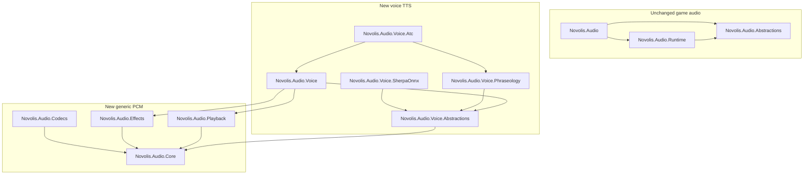

# Novolis.Audio voice stack (scaffold milestone)

## Context

[`novolis-audio`](d:\novolis\novolis-audio) today ships **game SFX** only:

| Existing | Role |
|----------|------|
| [`Novolis.Audio.Abstractions`](d:\novolis\novolis-audio\src\Novolis.Audio.Abstractions\IAudioEngine.cs) | `IAudioEngine` / `ISoundHandle` (miniaudio path) |
| [`Novolis.Audio.Runtime`](d:\novolis\novolis-audio\src\Novolis.Audio.Runtime\MiniaudioAudioEngine.cs) | Generated `AudioDevice` / `Sound` facades |
| [`Novolis.Audio`](d:\novolis\novolis-audio\src\Novolis.Audio\Novolis.Audio.csproj) | Meta-package for game audio |

There is **no** Voice, Core, Sherpa, or PCM pipeline code. Governance import doc [`gameengine-audio.md`](d:\novolis\novolis-governance\docs\imports-todo\gameengine-audio.md) expected Ogg/MIDI from Frank; your layout correctly **splits generic PCM** from **Voice/TTS** and keeps ATC in its own package for future `Bridge` / `Dispatch` / `Naval` profiles.

**Naming note (intentional):** `Novolis.Audio.Abstractions` stays the **engine** contract. `Novolis.Audio.Voice.Abstractions` is a **separate** TTS contract—same pattern as `Novolis.Audio.Host.Abstractions` vs engine abstractions.



**Consumer entry (voice):** `PackageReference Novolis.Audio.Voice` — **not** folded into [`Novolis.Audio`](d:\novolis\novolis-audio\src\Novolis.Audio\Novolis.Audio.csproj) meta (game apps stay lean).

---

## Target layout under `src/`

| Project | Depends on | Packable |
|---------|------------|----------|
| [`Novolis.Audio.Core`](d:\novolis\novolis-audio\src\Novolis.Audio.Core) | — | yes |
| [`Novolis.Audio.Codecs`](d:\novolis\novolis-audio\src\Novolis.Audio.Codecs) | Core | yes (thin v1) |
| [`Novolis.Audio.Effects`](d:\novolis\novolis-audio\src\Novolis.Audio.Effects) | Core | yes |
| [`Novolis.Audio.Playback`](d:\novolis\novolis-audio\src\Novolis.Audio.Playback) | Core | yes |
| [`Novolis.Audio.Voice.Abstractions`](d:\novolis\novolis-audio\src\Novolis.Audio.Voice.Abstractions) | Core | yes |
| [`Novolis.Audio.Voice.SherpaOnnx`](d:\novolis\novolis-audio\src\Novolis.Audio.Voice.SherpaOnnx) | Voice.Abstractions | yes (stub impl in scaffold PR) |
| [`Novolis.Audio.Voice.Phraseology`](d:\novolis\novolis-audio\src\Novolis.Audio.Voice.Phraseology) | Voice.Abstractions | yes |
| [`Novolis.Audio.Voice`](d:\novolis\novolis-audio\src\Novolis.Audio.Voice) | Voice.Abstractions, Effects, Playback, SherpaOnnx | yes |
| [`Novolis.Audio.Voice.Atc`](d:\novolis\novolis-audio\src\Novolis.Audio.Voice.Atc) | Voice, Phraseology | yes |

Each project: copy [`Novolis.Audio.Abstractions.csproj`](d:\novolis\novolis-audio\src\Novolis.Audio.Abstractions\Novolis.Audio.Abstractions.csproj) pattern (`net10.0`, `Novolis.Audio.Packaging.props`, `IsPackable`, README via governance props).

---

## Public API sketch (scaffold)

### `Novolis.Audio.Core`

- `PcmFormat` (sample rate, channels, `PcmSampleFormat` Int16/Float32)
- `PcmBuffer` / `PcmSpan` (immutable frame container)
- `IWavEncoder` / `IWavDecoder` (RIFF WAV read/write—no voice semantics)
- Optional `IPcmMixer` interface stub (no impl yet)

### `Novolis.Audio.Codecs` (minimal)

- Placeholder `IAudioCodec` + `PassThroughCodec` or empty assembly with README stating “WAV lives in Core; Ogg/Opus later”—avoids empty pack failure by including one internal type.

### `Novolis.Audio.Effects`

- `IAudioEffect` + `IAudioEffectPipeline`
- `IdentityEffectPipeline` (no-op) as default

### `Novolis.Audio.Playback`

- `IAudioPlayback` with `PlayAsync(PcmBuffer, CancellationToken)`
- `NullAudioPlayback` (no-op, CI-safe)
- **Do not** reference `Novolis.Audio.Runtime` here (keeps Voice off miniaudio coupling); follow-up can add `Playback.Miniaudio` if needed.

### `Novolis.Audio.Voice.Abstractions`

- `IVoiceSynthesizer` — `Task<PcmBuffer> SynthesizeAsync(string text, VoiceSynthesisOptions options, CancellationToken ct)`
- `VoiceProfile` / `VoiceSynthesisOptions` (rate, profile id, seed paths for models—optional in scaffold)
- `IVoiceService` — the facade contract:

```csharp
Task SpeakAsync(string text, CancellationToken cancellationToken = default);
Task WriteToFileAsync(string text, FileInfo destination, CancellationToken cancellationToken = default);
```

### `Novolis.Audio.Voice.SherpaOnnx` (scaffold only)

- `SherpaVoiceSynthesizer` class implementing `IVoiceSynthesizer` but **delegates to `NullVoiceSynthesizer`** or throws `NotSupportedException` with message “Sherpa wiring in next PR”
- **No** `PackageReference` to `org.k2fsa.sherpa.onnx` in scaffold PR (keeps CI lean; add in follow-up)
- README: model download URLs (Piper/VITS/ZipVoice per sherpa docs), local path via options

### `Novolis.Audio.Voice` (facade)

- `VoiceService` implements `IVoiceService`:
  - Normalize text (optional hook to phraseology)
  - `IVoiceSynthesizer` → `IAudioEffectPipeline` → `IAudioPlayback` / `IWavEncoder` for file path
- `AddNovolisVoice()` DI extension (registers null synth + identity effects + null playback by default)
- `VoiceServiceBuilder` for swapping synthesizer/profile

### `Novolis.Audio.Voice.Phraseology`

- `IPhraseologyNormalizer` — ICAO-style digit expansion stub (`123` → `one two three` for ATC samples)
- `DefaultPhraseologyNormalizer` with unit tests

### `Novolis.Audio.Voice.Atc`

- `AtcVoiceProfile` / `AtcVoiceOptions` (preset speaking rate, effect chain id, phraseology flags)
- `AddAtcVoice(IConfiguration)` or `UseAtcProfile()` extension on `VoiceServiceBuilder`
- **No** sim-specific callsign logic—only voice/phrase presets

---

## Solution, versioning, docs

- Add all projects to [`Novolis.Audio.slnx`](d:\novolis\novolis-audio\Novolis.Audio.slnx) under `/src/` folder.
- Bump [`build/version.json`](d:\novolis\novolis-audio\build\version.json) **minor** (`2026.1.1` → `2026.1.2`) when publishing new packages (same `2026.1.*` float for consumers).
- New package READMEs (governance [`Novolis.PackageReadme.props`](d:\novolis\novolis-governance\build\Novolis.PackageReadme.props))—mirror existing audio README style.
- Extend [`docs/design.md`](d:\novolis\novolis-audio\docs\design.md) with a “Voice / PCM pipeline” section and dependency diagram.
- Update [`AGENTS.md`](d:\novolis\novolis-audio\AGENTS.md) layout table.

---

## Tests (scaffold)

Extend [`tests/Novolis.Audio.Unit`](d:\novolis\novolis-audio\tests\Novolis.Audio.Unit) or add `Novolis.Audio.Voice.Unit`:

| Test | Asserts |
|------|---------|
| WAV round-trip | Core encoder/decoder preserves samples |
| Phraseology | `SAS 123` → contains `one two three` |
| `VoiceService` + null synth | `WriteToFileAsync` writes valid WAV header; `SpeakAsync` completes without throw |
| Dependency graph | No project references Runtime/Bindings from Voice.* |

---

## Governance / CI

Before claiming done:

```powershell
pwsh -File novolis-governance/scripts/verify-nuget-only.ps1
dotnet build d:\novolis\novolis-audio\Novolis.Audio.slnx -c Release
```

- **No** local feeds, **no** `ProjectReference` outside repo.
- Merge to `main` publishes new `Novolis.Audio.*` packages to GitHub Packages (`2026.1.*`).

---

## Follow-up PR (not in scaffold milestone)

| Item | Notes |
|------|-------|
| Sherpa ONNX | `PackageReference org.k2fsa.sherpa.onnx` on **nuget.org**; real `SherpaVoiceSynthesizer` |
| Models | User-local dirs (gitignored); document env var e.g. `NOVOLIS_VOICE_MODEL_DIR` |
| Live `SpeakAsync` | `Playback` impl via temp WAV + existing `MiniaudioAudioEngine` **or** NAudio `WaveOut` adapter package |
| Radio effects | Band-limit / crackle in `Effects` for ATC |
| `Novolis.Audio.Voice.Bridge` etc. | Clone `Atc` pattern when domains need it |

---

## Explicit non-goals (scaffold PR)

- Changing existing `IAudioEngine` / miniaudio manifests
- Bundling ONNX models or LucasArts voice assets in git
- Porting Frank `GameEngine.Audio` Ogg/MIDI (separate track per [`gameengine-audio.md`](d:\novolis\novolis-governance\docs\imports-todo\gameengine-audio.md))

