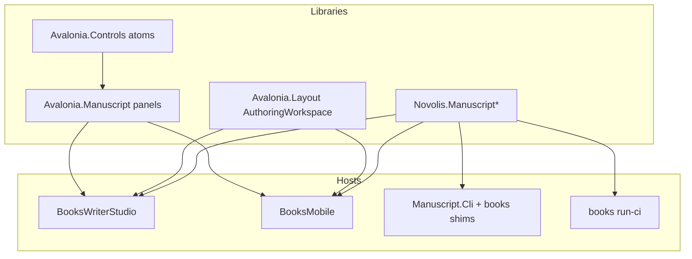

# Author tooling spine (from canvas)

Source: [author-tooling-first-principles.canvas.tsx](C:\Users\frank\.cursor\projects\d-novolis\canvases\author-tooling-first-principles.canvas.tsx)

## Locked decisions

| Decision | Choice |
|----------|--------|
| Product jobs | Seven jobs: draft, structure, continuity, listen, publish, sync, agent |
| Studio mission | Desktop draft + continuity glance + publish |
| Mobile mission | Field sync + light edit + full-chapter listen (no publish) |
| Behavior home | Libraries own ops; CLIs/tools/apps are shallow hosts |
| Avalonia | Apps compose Layout + Controls; kill app-as-control; Layout vocabulary shared by desktop + mobile |
| Structure | Studio eventually calls [`LegacyChapterSurgery`](d:\novolis\novolis-manuscript\src\Novolis.Manuscript.IO\LegacyChapterSurgery.cs) — never reimplement surgery in UI |
| Calypso / starsystems | Stay in books content repo — not product chrome |
| Ship Novolis | Push to `main` (no maintainer PRs) |
| Forbidden word | No standalone **session** (desktop / Studio / shell / session only) |



## Current gap snapshot

- Studio [`MainWindow.cs`](d:\novolis\novolis-apps\src\BooksWriterStudio\MainWindow.cs) (~1338 lines) hand-builds chrome; uses `StudioChrome` but **not** `StudioWorkspace` / **not** `Novolis.Avalonia.Layout`.
- Mobile [`MainView.cs`](d:\novolis\novolis-apps\src\BooksMobile\BooksMobile\Views\MainView.cs) (~879 lines) parallel chrome; Layout unused.
- [`Novolis.Avalonia.Layout`](d:\novolis\novolis-avalonia\src\Novolis.Avalonia.Layout) today is WireShark `AnalyzerWorkspace` only — **no adaptive authoring shell**.
- [`Novolis.Avalonia.Manuscript`](d:\novolis\novolis-manuscript\src\Novolis.Avalonia.Manuscript) is only `ChapterListFormatting` (unused by apps).
- Apps reference `Manuscript.IO` but never call surgery; **Metrics/Ascii unused** in Studio/Mobile.
- Libraries mostly exist; deepen book-context Ascii, pure Metrics compute, shared chapters-dir resolution; CLI mostly thin.

---

## Phase 0 — Contracts and policy (governance + docs)

1. Document composition grain in governance (or avalonia README): **Layout shell → Controls atoms → Avalonia.Manuscript panels → apps wire session/jobs**.
2. Document library-vs-CLI rule next to [contribution-policy.md](d:\novolis\novolis-governance\docs\contribution-policy.md) / manuscript CONTRIBUTING: analysis/mutation in libraries; tools are wrappers.
3. Control-grain checklist (too specific / not specific enough / app-as-control) as acceptance for Avalonia PRs (push to main).
4. Keep canvas as living product brief; update when phases land.

**Done when:** written contracts exist; no code required beyond docs.

---

## Phase 1 — Library deepening (Manuscript)

All work in [novolis-manuscript](d:\novolis\novolis-manuscript); CLI stays shallow.

### 1a Shared book path resolution

- Add library helper (e.g. on `ManuscriptCatalog` / small `ManuscriptPaths`) : workspace + series/book | book.yaml | chaptersDir → chapters directory (`Chapters`/`chapters`).
- Replace duplicated resolve logic in [`BookCommands.cs`](d:\novolis\novolis-manuscript\src\Novolis.Manuscript.Cli\BookCommands.cs).

### 1b Ascii (chapter- and book-aware)

Extend [`ManuscriptAscii.cs`](d:\novolis\novolis-manuscript\src\Novolis.Manuscript\ManuscriptAscii.cs):

- `ScanChaptersDirectory`
- `ScanBook` / `NormalizeBook` over workspace + series/book or `BookInfo`
- Keep string/file APIs; CLI only maps argv → these

### 1c Metrics purity

Split [`ManuscriptMetrics.cs`](d:\novolis\novolis-manuscript\src\Novolis.Manuscript.Metrics\ManuscriptMetrics.cs):

- `ComputeAll` / `ComputeOne` → DTOs only (no `Console`, optional write)
- `WriteReports` / reporter type for `out/...` side effects
- Studio can call compute without touching disk

### 1d Character slices

- `Build(BookInfo)` / workspace façades on [`ManuscriptCharacterSlices`](d:\novolis\novolis-manuscript\src\Novolis.Manuscript.Metrics\ManuscriptCharacterSlices.cs)
- Optional JSON DTO alongside `ToMarkdown`

### 1e Editorial

- Keep [`Novolis.Manuscript.Editorial`](d:\novolis\novolis-manuscript\src\Novolis.Manuscript.Editorial) separate from doctor
- Port high-value patterns from `D:\repos\books\tools\dev\scan-calypso-llmisms.cs` into rule packs (not Calypso-hardcoded product UI)
- CLI flags for profile / enable lexicon|slop|naming
- Do **not** lift Calypso metadata apply/seed/patch scripts into Manuscript

### 1f CLI audit

- [`Novolis.Manuscript.Cli`](d:\novolis\novolis-manuscript\src\Novolis.Manuscript.Cli): argv, resolve, format, exit codes only
- Unit tests for new library APIs; smoke CLI against `D:\repos\books`
- Publish via push to `main` → GPR

**Done when:** Studio could call Ascii/Metrics/Slices/Editorial without any CLI process; CLI body shrinks or stays glue-only.

---

## Phase 2 — Avalonia composition redesign

Repos: [novolis-avalonia](d:\novolis\novolis-avalonia) (+ thin manuscript chrome package).

### 2a Layout: authoring + adaptive shells

Today Layout = analyzer-only. Extend:

- `AuthoringWorkspace` (or equivalent): injectable regions — nav | primary | context; optional command bar / status
- Adaptive mode: `Wide` (three columns) vs `Narrow` (stack / page host) driven by width or host flag — **one vocabulary for desktop Studio and Mobile**
- Keep `AnalyzerWorkspace` for WireFish; do not force analyzer shape onto writers

### 2b Studio package alignment

- [`Novolis.Avalonia.Studio`](d:\novolis\novolis-avalonia\src\Novolis.Avalonia.Studio): `StudioWorkspace` / `StudioChrome` become façades over Layout authoring shell (or migrate types into Layout and leave Studio as theme/feedback helpers)
- Dogfood: SketchLab or existing studio host on new shell before BooksWriterStudio

### 2c Control grain pass

Audit Controls used by writers:

- Keep atoms: `MarkedListBox`, `JobQueuePanel`, `FilteredPickerDialog`, `ChoiceDialog`
- Reject / split any control that embeds publish+TTS+SCM+doctor
- Typed contracts: `ChapterRef`, `BookSelection`, `JobHandle` (Manuscript or Avalonia.Manuscript)

### 2d Avalonia.Manuscript panels (chrome, not app)

Grow [`Novolis.Avalonia.Manuscript`](d:\novolis\novolis-manuscript\src\Novolis.Avalonia.Manuscript) into **composable panels** only:

- Chapter list pane, metadata form pane, diagnostics list pane (bind to library DTOs)
- No workspace open, no export orchestration, no menus

**Done when:** a dogfood host shows AuthoringWorkspace Wide+Narrow; Manuscript panels have no product I/O; package READMEs state composition rules.

---

## Phase 3 — BooksWriterStudio thin host

Repo: [novolis-apps](d:\novolis\novolis-apps) `BooksWriterStudio`.

1. Replace custom three-column tree in `MainWindow` with Layout `AuthoringWorkspace` (Wide).
2. Peel god-class into session + region binders: draft / continuity / publish / sync.
3. Wire existing library calls (doctor, metadata, Export.Pdf/Audio, recovery, git checkpoint) through panels — no behavior duplication.
4. Visual hierarchy: draft primary; publish one loud secondary; continuity support; TTS/SCM demoted.
5. Use `ChapterListFormatting` / new Manuscript panels; drop unused dead PackageReferences or actually use them.
6. Freeze / document deprecate path for `D:\repos\books\tools\apps\books-writer`.

**Done when:** MainWindow is composition + session; draft loop unchanged or better; publish still works; no Layout-free custom chrome tree.

---

## Phase 4 — BooksMobile on same Layout vocabulary

1. Host `AuthoringWorkspace` Narrow (page stack maps to regions).
2. Keep mission: sync + read/edit + listen; **no** PDF/M4B/surgery/ascii-apply UI.
3. Share Manuscript list/metadata-read panels where they fit; keep Mobile platform packages for auth/paths.
4. Optional later: read-only metadata jump; offline conflict UX.

**Done when:** Mobile and Studio share Layout region names/APIs; Mobile chrome is not a second design system.

---

## Phase 5 — Structure surgery in Studio (job: structure)

1. UI actions over `LegacyChapterSurgery`: insert-after / insert-between / promote-decimal / sync-filenames with dry-run → apply.
2. Refresh catalog after mutate; validate-order feedback.
3. Agents keep CLI; same library.

**Done when:** structure is no longer “CLI-only” for humans; matrix row structure: Studio support/primary, CLI support.

---

## Phase 6 — Continuity diagnostics in Studio (job: continuity)

Read-only first (library compute):

1. Diagnostics tab: doctor + metadata debt + optional editorial summary
2. Metrics overview (words/todos) from pure compute
3. Character slices report viewer (filter by name)
4. Ascii **scan** report (normalize apply stays agent/CLI or explicit Studio command later)

**Done when:** continuity aids are library-backed views, not new algorithms in MainWindow.

---

## Phase 7 — CLI / books tools completion

1. Re-audit Cli after Phase 1 — delete leftover loops.
2. books shims remain thin (`manuscript-cli.cs` forwarders).
3. `run-ci` stays orchestration/invariants/CalVer only.
4. Explicit **stay in books**: Calypso one-offs, starsystems, writer-tool pass/revision (defer unless weekly use).
5. Delete or archive legacy books-writer when Studio parity for spine is signed off.

**Done when:** no domain algorithm left in tool `.cs` bodies except domain generators + CI.

---

## Phase 8 — Cross-cutting hygiene

- Ban **session** in all touched Novolis docs/UI strings
- Platform ProjectRef + GPR publish after each library/avalonia/apps push to `main`
- Update Studio/Mobile READMEs and books AGENTS pointers to library/CLI paths
- Refresh author-tooling canvas spine checkboxes mentally / in a follow-up canvas edit when phases complete

---

## Explicit non-goals

- Moving Calypso/starsystems into Manuscript or Avalonia
- Mobile publish / print settings
- Merging Editorial into ManuscriptDoctor
- Rewriting Cad/Voice/Audio/Live app-as-control packages in this program (separate backlog; grain rule applies when touched)
- Dual content trees / local NuGet feeds

---

## Suggested ship order (completionist, dependency-respecting)

```text
0 docs → 1 libraries+CLI → 2 Layout/Controls/Manuscript chrome
  → 3 Studio shell → 4 Mobile shell → 5 surgery UI → 6 diagnostics → 7 books cleanup → 8 hygiene
```

Each Novolis phase ends with **push to `main`** and green merge CI / GPR where packages changed. Books content changes only when shims/docs/deprecations need it.

