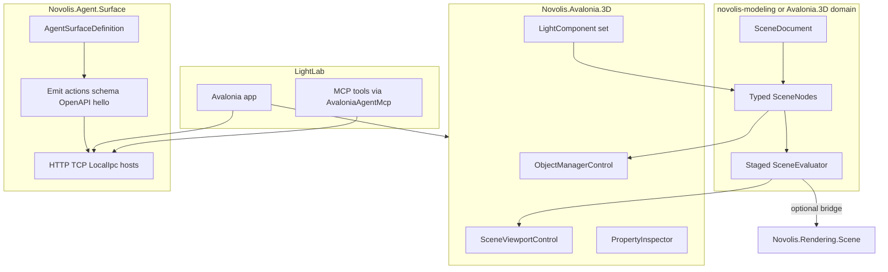

# Novolis.Avalonia.3D — CinemaLight component set

## Relationship to the hard-surface CAD plan

[hard-surface_cad_toolkit_1fbbdc84.plan.md](d:\novolis\.cursor\plans\hard-surface_cad_toolkit_1fbbdc84.plan.md) stays on **Cad**: exact solids, MeshFromSolid, workspaces CAD|Modeling|Preview, `.cadjson`. It explicitly avoids Cinema4D branding and treats lights as Cad Preview stubs.

**This plan is parallel, not a Cad rewrite.**

| Concern | Cad (existing plan) | Avalonia.3D (this plan) |
|---------|---------------------|-------------------------|
| Document | `.cadjson` / solids | Own `.nov3djson` mesh/scene graph |
| Metaphor | Manufacturing CAD | C4D-lite Object Manager modeling |
| Lights | Preview entity stubs | First-class typed light **components** |
| Host | CalypsoCad | New dogfood app |
| Session | Cad HTTP/TCP `:18775/6` | Scene session `:18785/6` + LocalIpc + MCP |

Later Cad Preview may **consume** Avalonia.3D light/camera gizmos via PackageReference; v1 does not wire CadDocument into Avalonia.3D.

## Product naming

- Package / API: `Novolis.Avalonia.3D` (and `Novolis.Modeling.Scene` for pure domain)
- Dogfood app: **LightLab** under `novolis-dogfooding/apps/avalonia/LightLab`
- Docs may say “C4D-inspired”; UI strings use **Object Manager / Modeling / Look** — no commercial product trademarks in chrome

## Architecture (separations of concern)



### Package split

| Package | Repo | Owns |
|---------|------|------|
| **`Novolis.Modeling.Scene`** | Prefer new thin project under `novolis-avalonia/src` *or* `novolis-rendering` if path-trace sharing dominates; **default: `novolis-avalonia/src/Novolis.Modeling.Scene`** so Avalonia.3D stays same-repo ProjectReference | `SceneDocument`, typed nodes, staged evaluator, serialization DTOs — **no Avalonia, no transports** |
| **`Novolis.Avalonia.3D`** | `novolis-avalonia/src/Novolis.Avalonia.3D` | Avalonia controls, Raylib viewport (reuse [`Novolis.Avalonia.Raylib`](novolis-avalonia/src/Novolis.Avalonia.Raylib)), light/camera gizmos, property panels, `SceneSessionService` that mutates the document |
| **`Novolis.Agent.Surface`** | `novolis-avalonia/src/Novolis.Agent.Surface` (shared; Cad/Game can migrate later) | Attributes + builder that **auto-constructs** hello/actions/command schemas, port/env/marker metadata, OpenAPI fragment, MCP tool descriptors; thin loopback HTTP + TCP JSONL host helpers (HttpListener / TcpListener pattern from Cad/Game — **not** under `Novolis.Transports.*`) |
| **LightLab** | `novolis-dogfooding/apps/avalonia/LightLab` | Composes Avalonia.3D + attaches Agent.Surface; sample scenes; enables env session |
| **MCP** | Extend [`AvaloniaAgentMcp`](novolis-dogfooding/apps/AvaloniaAgentMcp) | `scene_*` tools generated/driven from the same Definition (HTTP client to `:18785`) |

Reuse: [`Novolis.Math.Geometry`](novolis-math/src/Novolis.Math.Geometry) for mesh ops; [`Novolis.Rendering.Scene.LightDefinition`](novolis-rendering/src/Novolis.Rendering.Scene/LightDefinition.cs) as **export bridge** (extend Spot/Area later in Rendering when needed). Do **not** put agent hosts into `Novolis.Transports.*`.

After adding packable projects: regen platform map via `Generate-Platform-Slnx.ps1`; NuGet-only / GPR publish order: Modeling.Scene → Agent.Surface → Avalonia.3D → dogfood restore from github+nuget.org.

## Domain model (C4D-lite, mesh-first)

Inspired by the CAD plan’s node categories, but **no solid CSG / MeshFromSolid** here.

```csharp
// Novolis.Modeling.Scene
public abstract record SceneNode(Guid Id, string Name, Guid? ParentId);
public sealed record GroupNode(...) : SceneNode;
public sealed record MeshNode(...) : SceneNode;           // editable / primitive mesh
public sealed record GeneratorNode(...) : SceneNode;      // Cloner, Symmetry, Extrude (mesh)
public sealed record ModifierNode(...) : SceneNode;       // Weld, Subdivision, ...
public sealed record MaterialNode(...) : SceneNode;
public sealed record LightNode(...) : SceneNode;          // typed light params
public sealed record CameraNode(...) : SceneNode;
public sealed record NullNode(...) : SceneNode;           // transform helper
```

**Light kinds (v1 component set):** `Omni`, `Spot`, `Infinite` (sun/dir), `Area`. Fields: color, intensity, temperature optional, cone/penumbra (Spot), size (Area), castShadows flag, enable.

Staged eval (narrow invalidation, same idea as Cad):

```text
Generators → Modifier stack → World transforms → Look (materials/lights/cameras) → Viewport / optional path-trace export
```

Persistence: `novolis-governance/schemas/modeling/` + `novolis.scene.schema.json` (hand schema for interchange; C# DTOs in Modeling.Scene). File extension `.nov3djson`.

## Avalonia.3D component set

Compose like Cad’s editor surface, but Object-Manager-centric:

1. **`SceneEditorSurface`** — shell: Object Manager | Viewport | Properties  
2. **`ObjectManagerControl`** — hierarchy, icons by node kind, reparent groups  
3. **`SceneViewportControl`** — Raylib host + orbit; draw mesh + **light/camera gizmos**  
4. **`LightComponents`** — place/edit Omni/Spot/Infinite/Area (toolbar + property editors)  
5. **`CameraComponents`** — place camera, set active look-through  
6. **`PropertyInspector`** — selection-driven fields  
7. **`SceneToolStrip`** — Create Primitive / Light / Camera / Generator (phased)

All mutations go through `SceneSessionService.Execute` so UI and LLM share one path (Cad pattern in [`CadSessionService`](novolis-avalonia/src/Novolis.Avalonia.Cad/Session/CadSessionService.cs)).

## Definition mechanism (core SoC for LLM)

Today Cad/Game **hand-write** `BuildActions()`, endpoints, MCP attributes separately. New apps that attach transports should get that for free.

### Author once

```csharp
[AgentSurface("scene",
    HttpPort = 18785, TcpPort = 18786,
    EnableEnv = "NOVOLIS_SCENE_SESSION",
    MarkerPrefix = "novolis-scene-session")]
public interface ISceneSession
{
    [AgentMethod("session.hello")] AgentHello Hello();
    [AgentMethod("session.snapshot")] SceneSnapshot Snapshot();
    [AgentMethod("session.actions")] AgentActionCatalog Actions();
    [AgentMethod("session.command")] AgentActionResult Command(AgentCommandDto command);

    [AgentAction("addlight", Summary = "Place a typed light",
        Params = "lightKind|omni,spot,infinite,area; parentId?; intensity?")]
    // ... other actions as attributes on the service or a companion Actions type
}
```

### Auto-construct

`AgentSurfaceDefinition.From<T>()` / source-gen emits:

- **Hello** payload (protocol version, surface id, ports, capabilities)
- **Action catalog** (id, enabled policy hooks, param schema, descriptions) — replaces hand `BuildActions`
- **JSON Schema** for command DTOs (for LLM tool args)
- **OpenAPI 3 fragment** for HTTP REST routes (`/hello`, `/snapshot`, `/actions`, `/command`, SSE `/subscribe`)
- **MCP tool descriptors** (name, description, inputSchema) consumed by AvaloniaAgentMcp
- **Discovery**: env var names, `%TEMP%` marker paths (mirror [`CadSessionEndpoints`](novolis-avalonia/src/Novolis.Avalonia.Cad/Session/CadSessionEndpoints.cs))

Hosts: `AgentSurface.AttachHttpTcp(session, definition)` + optional LocalIpc MessagePack (Game/Live pattern) + stdio only in MCP sidecar (never on Avalonia GUI process).

LightLab calls one line: `AgentSurface.AttachAll(sceneSession)` when `NOVOLIS_SCENE_SESSION=1`.

## Dogfood app — LightLab

Path: [`novolis-dogfooding/apps/avalonia/LightLab`](novolis-dogfooding/apps/avalonia/) (same layout as SketchLab).

- Hosts `SceneEditorSurface` full screen
- Ships 2–3 sample `.nov3djson` scenes (lit primitive stage, spot rim setup, multi-light studio)
- Default HardPause / interactive; env enables session for agents
- README: ports, curl examples, MCP tool names

## Transport matrix (v1)

| Channel | Port / pipe | Consumer |
|---------|-------------|----------|
| HTTP REST + SSE | `18785` | curl, scripts, MCP |
| TCP JSONL | `18786` | line agents |
| LocalIpc MessagePack | named pipe/UDS | glass / AvaloniaAgentMcp parity |
| stdio MCP | AvaloniaAgentMcp process | Cursor |

Methods mirror Cad: `session.hello|snapshot|actions|command|subscribe` + events `changed|actionResult`. Action ids include at least: `new/open/save`, `select`, `addlight`, `addcamera`, `setlight`, `settransform`, `delete`, `fit`, `setactivecamera`, later generator/modifier actions.

## Delivery slices (PRs)

1. **Modeling.Scene + schema** — document, nodes, light/camera/mesh primitive, load/save `.nov3djson`, unit tests  
2. **Agent.Surface** — attributes, definition builder, HTTP+TCP hosts, marker/env; golden tests that emitted OpenAPI/actions match fixtures  
3. **Avalonia.3D shell + lights** — Object Manager, viewport gizmos, Omni/Spot/Infinite/Area, PropertyInspector, `SceneSessionService` wired to Definition  
4. **LightLab dogfood** — samples, session attach, README  
5. **MCP scene tools** — AvaloniaAgentMcp reads Definition (or generated descriptors) against `:18785`  
6. **Mesh generators/modifiers (phase 2)** — Cloner/Symmetry/Weld using Math.Geometry; Look materials; optional export to `LightDefinition` for path-trace

## Explicit non-goals (near term)

- Merging into CadDocument / replacing Cad Preview lights in the same PR train  
- Commercial B-rep / Cad boolean tree inside Avalonia.3D  
- Putting session hosts in `Novolis.Transports.*`  
- Full animation timeline / IES profiles / volumetric lights in v1  
- Local NuGet feeds (GPR only)

## Verification

- Unit: light node round-trip; evaluator invalidation (light change does not rebuild mesh); Definition emission snapshots  
- LightLab smoke: place Spot → move → save/load → HTTP `actions` lists `addlight` with schema → TCP command places Omni  
- `gpr-health-check` / nuget-only + project-ref scripts; ProjectRef via Platform slnx for local multi-repo  
- Publish: Modeling.Scene → Agent.Surface → Avalonia.3D

## Cad coexistence note

Hard-surface Cad continues independently. When Cad Preview needs real light gizmos, add a thin adapter that maps `LightNode` ↔ Cad light entities **or** embed `LightComponents` visually — track as a follow-up, not a blocker for LightLab.
