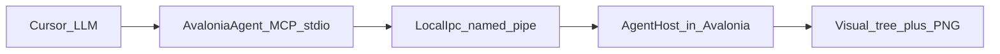

# Avalonia agent protocol (see + drive)

## Why this shape

Cursor MCP uses **stdio**. An Avalonia window process cannot own that pipe the way [BridgeCommander](novolis-dogfooding/apps/BridgeCommander/Bridge/Mcp/BridgeMcpHost.cs) does. Mirror Audio Live instead: **app listens on LocalIpc**; a **thin MCP process** talks LocalIpc and exposes tools to Cursor.



No new framing in `Novolis.Transports.*` — reuse [`LocalIpcFrame`](novolis-transports/src/Novolis.Transports.LocalIpc/) (`request` / `response` / `event`) like [`Novolis.Audio.Live.Protocol`](novolis-audio/src/Novolis.Audio.Live.Protocol/).

**Pilot:** wire [StudioChromeLab](novolis-dogfooding/apps/avalonia/StudioChromeLab/) first (buttons, lists, dialogs). Product apps (DraftStudio / Sins) stay a follow-up once the lab proves screenshot + click.

## Packages (under `novolis-avalonia`)

| Package | Role |
|---------|------|
| `Novolis.Avalonia.Agent.Protocol` | MessagePack DTOs, method names, endpoint helper, codec (copy Live.Protocol layout) |
| `Novolis.Avalonia.Agent` | In-UI host: attach to `Window`, tree walk, input injection, `RenderTargetBitmap` PNG, LocalIpc listener loop |

Both packable `2026.1.*` via existing Avalonia repo CI. Same-repo consumers use ProjectReference; cross-repo later uses GPR only (nuget-only policy).

Regenerate platform map after adding packable projects (`Generate-Platform-Slnx.ps1`).

## Attributes (stable agent handles)

```csharp
[AttributeUsage(AttributeTargets.Class | AttributeTargets.Field | AttributeTargets.Property)]
public sealed class AgentIdAttribute(string id) : Attribute { public string Id { get; } = id; }

// Prefer attached property on live controls (code-built UI has no fields):
// AgentProperties.SetId(button, "lab.recovery");
// AgentProperties.SetRole(button, AgentRole.Button);
```

- **`AgentProperties.Id` / `Role` / `Ignore`** attached Avalonia properties (primary for code-built trees).
- Optional `[AgentId]` for typed view/model metadata if useful later; host resolves **attached props first**, then `AutomationProperties.Name` / `Name`, then a generated path (`Window/Grid[0]/Button[2]`).
- Lab annotates interactive controls with stable ids (`lab.recovery`, `lab.nav`, `lab.status`).

## Protocol methods (LocalIpc `frame.Name`)

Mirror Live naming:

| Method | Purpose |
|--------|---------|
| `ui.hello` | Handshake: app title, process id, protocol version |
| `ui.tree` | Flattened interactive nodes: id, role, type, bounds, enabled, text/content, focused |
| `ui.screenshot` | PNG bytes of main window (or named control id); optional max width |
| `ui.click` | Click by id or by x/y in window coords |
| `ui.type` | Focus target + text / special keys (`Enter`, `Tab`, …) |
| `ui.wait` | Wait until id appears / enabled / text contains (timeout ms) |

Payloads: MessagePack DTOs with `RequestId`, success/error string — same pattern as [`LiveSnapshotRequestDto`](novolis-audio/src/Novolis.Audio.Live.Protocol/Dto/LiveSnapshotRequestDto.cs).

Endpoint: pipe `novolis-avalonia-agent` (Windows) / temp `novolis-avalonia-agent.sock` (else), overridable via env `NOVOLIS_AVALONIA_AGENT_ENDPOINT`.

## Host implementation notes

In `Novolis.Avalonia.Agent`:

1. **`AgentHost.Attach(Window)`** — starts LocalIpc listener on a background thread; all UI work on `Dispatcher.UIThread`.
2. **Tree** — walk visual descendants; skip `AgentProperties.Ignore`; include buttons, text boxes, list boxes, checkboxes, menus; report bounds via `TranslatePoint` to window.
3. **Screenshot** — `RenderTargetBitmap` of window (or subtree), encode PNG (ImageSharp already used elsewhere, or Avalonia encoding if already referenced). Return base64 in MCP JSON; raw bytes on LocalIpc.
4. **Click / type** — synthesize pointer/`Key` events or invoke `Button.RaiseEvent` / set `TextBox.Text` + raise; prefer real input routing so handlers fire.
5. **One-liner for apps:** `AgentHost.Attach(desktop.MainWindow);` from `App` / after main window created (env gate `NOVOLIS_AVALONIA_AGENT=1` so normal runs stay quiet).

Do **not** put domain game orders (Captain haul accept) into this protocol — those stay app-specific later, on top of generic `ui.*`.

## MCP sidecar (Cursor-facing)

New console app: [`novolis-dogfooding/apps/AvaloniaAgentMcp`](novolis-dogfooding/apps/) — copy Bridge MCP host shape:

- `AddMcpServer().WithStdioServerTransport().WithToolsFromAssembly(...)`
- Tools: `ui_hello`, `ui_tree`, `ui_screenshot`, `ui_click`, `ui_type`, `ui_wait` → LocalIpc client using Protocol package
- `ui_screenshot` returns a short path or base64; prefer writing PNG under `%TEMP%/novolis-avalonia-agent/` and returning the path so Cursor can `Read` the image (same pattern as browser screenshots)

Register in [`.cursor/mcp.json`](.cursor/mcp.json) as `avalonia-agent` pointing at the built DLL (same style as `bridge-commander`).

## Dogfood: StudioChromeLab

- PackageReference / ProjectRef to `Novolis.Avalonia.Agent`
- `AgentHost.Attach` when env set
- Tag key controls with `AgentProperties.SetId`
- Tiny smoke script or MCP QA: hello → tree contains `lab.recovery` → click → screenshot shows flash/status change

## Validation

```powershell
dotnet build novolis-avalonia -p:NovolisUseProjectReferences=true
dotnet build novolis-dogfooding/apps/avalonia/StudioChromeLab -p:NovolisUseProjectReferences=true
dotnet build novolis-dogfooding/apps/AvaloniaAgentMcp -p:NovolisUseProjectReferences=true
pwsh -File novolis-governance/scripts/verify-nuget-only.ps1
pwsh -File novolis-governance/scripts/verify-project-ref-mode.ps1 -SkipBuild
```

Manual: run lab with `NOVOLIS_AVALONIA_AGENT=1`, enable MCP server, call `ui_tree` / `ui_screenshot` / `ui_click` from Cursor.

## Out of scope (this pass)

- Extending Transport packages themselves
- DraftStudio / Sins Captain wiring (next PR once lab works)
- Full Accessibility AutomationPeer rewrite
- HTTP/SSE MCP transport
- Natural-language `Novolis.Commands` orders over UI (typed `ui.*` only)
