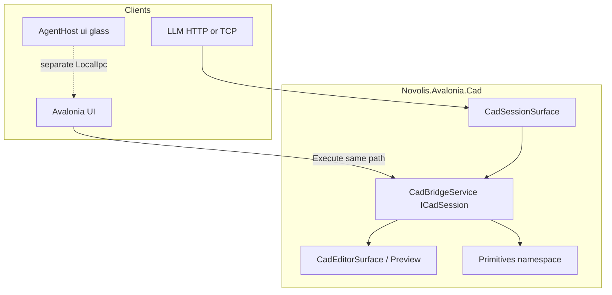

# Novolis.Avalonia.Cad (Primitives namespace + LLM session)

## Goal

One shared Avalonia CAD NuGet for **DraftStudio** (editor) and **CalypsoCad** (preview), with unified plan/Raylib export, plus a **Sins-style domain session** (localhost HTTP + TCP JSONL) so LLMs can control and read CAD with **action parity** to the UI.

CAD interchange types use namespace **`Novolis.Cad.Primitives`** in a special folder inside the Cad project. **No** separate `Novolis.Cad.Primitives` NuGet yet.

“Drawing export” = plan `RenderTargetBitmap` ([`DraftArtifactDumper`](novolis-apps/src/DraftStudio/Services/DraftArtifactDumper.cs)). Raylib export = [`TrySaveLastPresentedFramePng`](novolis-avalonia/src/Novolis.Avalonia.Raylib/RaylibHostControl.cs) + Calypso wait loop ([`ViewportPngExporter`](novolis-dogfooding/apps/cad/CalypsoCad/Services/ViewportPngExporter.cs)).



## Package layout (locked)

| PackageId | Path | Role |
|-----------|------|------|
| `Novolis.Avalonia.Cad` | [`novolis-avalonia/src/Novolis.Avalonia.Cad/`](novolis-avalonia/src/) | **Only** packable CAD package |

Inside that project:

- `Primitives/` — DTOs under **`Novolis.Cad.Primitives`** (compiled into Avalonia.Cad assembly)
- UI: `Novolis.Avalonia.Cad` (editor, preview, exporter)
- Session: `Novolis.Avalonia.Cad.Session` (hosts + DTOs + bridge) — still same assembly/package

**Deferred:** extract Primitives NuGet / `novolis-cad` repo. Consumers PackageReference **`Novolis.Avalonia.Cad` only**.

Register in [`.novolis/packages.json`](novolis-avalonia/.novolis/packages.json); regen platform map. Version `2026.1.*`.

Do **not** reuse `Novolis.Game.Session` voyage DTOs; **copy the host pattern** from [`SessionHttpHost`](novolis-gaming/src/Novolis.Game.Session/SessionHttpHost.cs) / [`SessionTcpJsonlHost`](novolis-gaming/src/Novolis.Game.Session) / [`SessionSurface`](novolis-gaming/src/Novolis.Game.Session) with Cad-specific ports, env, markers, and DTOs.

## 1. Namespace `Novolis.Cad.Primitives` (folder only)

Lift DraftStudio [`Models/`](novolis-apps/src/DraftStudio/Models/) + align Calypso [`CadModels.cs`](novolis-dogfooding/apps/cad/CalypsoCad/Models/CadModels.cs): document/entities/layers/phys + JSON load/save per [`cadjson.md`](novolis-governance/docs/cadjson.md).

## 2. Editor + preview (UI)

- `CadDraftViewport`, `CadModelRenderer`, `CadToolController`, command bus
- `CadEditorSurface` — draft/model shell
- `CadPreviewControl` — Raylib lifecycle + `FrameRendering`
- `CadViewportExporter` — plan PNG, model PNG, view tour, phys

**Parity rule:** toolbar / tools / command bar / export buttons must call **`CadBridgeService.Execute`** (or thin wrappers that only build a `CadCommandDto`). No parallel mutation paths.

## 3. LLM session surface (Sins pattern)

Mirror Sins dual-channel model:

| Layer | Transport | In Cad package? |
|-------|-----------|-----------------|
| **Domain** `cad.session.*` | HTTP REST+SSE, TCP JSONL, optional LocalIpc | **Yes** — `CadSessionSurface` |
| **Glass** `ui.*` | Avalonia `AgentHost` LocalIpc | **No** — stay in DraftStudio / CalypsoCad EXEs |

### Contract (`ICadSession`)

Same shape as [`IGameSession`](novolis-gaming/src/Novolis.Game.Session/IGameSession.cs):

- `Hello()` / `Snapshot()` / `Actions()` / `Execute(CadCommandDto)`
- Events: `Changed`, `ActionResult` (and optional decision-style hints)

**`CadBridgeService`** implements `ICadSession`: owns document session, tools, selection, exporter; UI and transports both use it.

### Transports

- `CadSessionHttpHost` — `HttpListener` loopback (no Kestrel), CORS as in Sins
- `CadSessionTcpJsonlHost` — one JSON object per line
- `CadSessionSurface.AttachAll(bridge)` / `TryAttachFromEnvironment`

**Defaults (Cad-specific, avoid clashing with Sins 18765/18766):**

- HTTP `http://127.0.0.1:18775`
- TCP `127.0.0.1:18776`
- Env: `NOVOLIS_CAD_SESSION`, `_HTTP`, `_HTTP_PORT`, `_TCP`, `_TCP_PORT`
- Markers under `%TEMP%` e.g. `novolis-cad-session.http` / `.tcp`

### HTTP routes (parity with Sins)

| Method | Path |
|--------|------|
| GET | `/health`, `/session/hello`, `/session/snapshot`, `/session/actions` |
| POST | `/session/command`, `/session/rpc` |
| GET SSE | `/session/events` |

Envelope: `{ "ok": true, "result": ... }` camelCase.

### Snapshot / actions (LLM data)

**Snapshot** (illustrative): document name/path, dirty, entityCount, selection ids, active tool, viewMode (draft/model), drawElevation, units, lastAction, recent export paths.

**Actions list:** `{ id, label, enabled, disabledReason? }[]` — must match what the UI can do.

**Command:** `{ "actionId": "...", ...typed fields }` → `{ ok, actionId, message, errorCode?, snapshot? }`.

### Action catalog (UI parity — locked minimum)

Document/edit: `new`, `open`, `save`, `undo`, `redo`, `deleteSelection`, `select`, `fit`  
Tools: `setTool` (line/circle/rect/spline/select), `setViewMode` (draft/model), `setElevation`, `setSnap`, `setGrid`  
Geometry DSL (optional thin): `runCommand` for existing `Line(...)` / `Box(...)` text  
Export: `exportPlanPng`, `exportModelPng`, `exportPreviewPng`, `exportViewTour`, `exportPhys`  
Preview (Calypso host may extend): `setOrbit` / app-specific view ids via `properties` bag if needed

Host apps may register **extra** action handlers on the bridge for ship-specific preview acts without forking the HTTP host.

## 4. Consumer wire-up

```csharp
var bridge = new CadBridgeService(/* document + editor + exporter */);
_ = CadSessionSurface.AttachAll(bridge);              // LLM HTTP/TCP
AgentHost.TryAttachFromEnvironment(mainWindow);     // glass only (EXE)
// UI buttons → bridge.Execute(...)
```

**DraftStudio / CalypsoCad:** PackageReference `Novolis.Avalonia.Cad` only; delete duplicated models/exporters; keep product chrome + `AgentProperties` ids (`draft.*` / `calypso.*`).

## 5. Out of scope

- Separate `Novolis.Cad.Primitives` package / `novolis-cad` repo
- Stuffing CAD into `Novolis.Game.Session` DTOs
- SketchControl → Cad; walkthrough/ffmpeg inside Cad NuGet
- Replacing glass `AgentHost` with HTTP (both coexist like Sins)

## 6. Verification

- Unit: Primitives JSON round-trip; `CadBridgeService.Execute` action matrix without GLFW
- Integration smoke: start DraftStudio → `GET /session/snapshot` → `POST /session/command` (`setTool` / `exportPlanPng`) and confirm UI state matches
- Policy scripts + ProjectRef local build; GPR publish before CI consumers without ProjectRef

