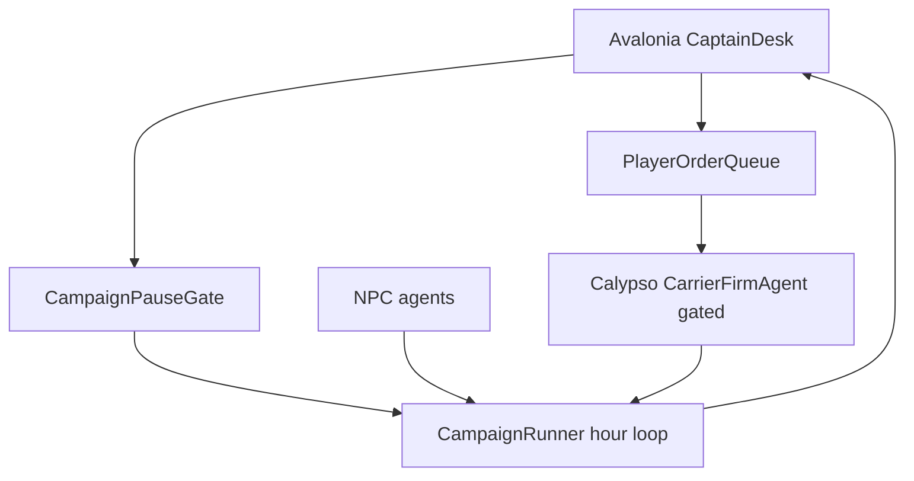

# Avalonia playable: James aboard Calypso

## Locked product shape

**Captain’s bridge** (not free-roam 3D, not chapter-mission runner):

- Avalonia is the **live cockpit** for one owner-operator hull.
- You play **James Roberto Simmons** aboard **ST *Calypso*** (`ST-7749-63325116` flavor id).
- The Johnston 100-system campaign keeps running as NPC weather (Mining / Industry / Station / other tramps / Bulk River / drama).
- Victory is **survival with standing**: stay insured, fueled, and escrow-clean for a run horizon; failure is registry hold + cash death + lien spiral.

Fiction anchors (source of truth for voice/constraints): `D:\repos\books\content\series\the-calypso-cycle\references\characters\crew\james-simmons.md`, `references\ships\calypso\`, CCA/Meridian refs already bridged in [`docs/calypso-canon.md`](novolis-apps/src/SinsOfACapitalismTycoon/docs/calypso-canon.md).



## What exists today

- Avalonia [`MainWindow`](novolis-apps/src/SinsOfACapitalismTycoon/Ui/MainWindow.cs): **post-run** briefing (map/radio/tabs) after `CampaignRunner.RunAsync` finishes.
- First tramp is [`MV Independent`](novolis-apps/src/SinsOfACapitalismTycoon/Universe/CampaignWorld.cs) — NPC `CarrierFirmAgent`.
- Commerce teeth already map to James’s universe: registry bridge, escrow, opportunities, jump-refuse, drive life, premiums ([`docs/commerce-stack.md`](novolis-apps/src/SinsOfACapitalismTycoon/docs/commerce-stack.md)).
- James is only `vox.james` flavor ([`characters.md`](novolis-apps/src/SinsOfACapitalismTycoon/docs/characters.md)).

## Phase 1 — Player hull identity

In [`CampaignWorld`](novolis-apps/src/SinsOfACapitalismTycoon/Universe/CampaignWorld.cs) / registry seed:

- Rename player firm/hull: **ST Calypso** (registry name), firm **Simmons Transport** / James as owner-master.
- Keep firm Guid of current `carriers[0]` for determinism (or new fixed Guid `…00c0` only if Independent Guid can stay as NPC sibling — prefer **replace Independent** so one owner-master player slot).
- Opening cash lean (~`OpeningFirmCash * 0.35` ≈ post-cert scrap), lien optional from “restoration loan.”
- Register Priority license as today; Spectre/Briefing brand string: *James Simmons · ST Calypso*.
- CLI: `--mode avalonia` implies player mode; headless stays spectator (Calypso AI-driven) unless `--player on`.

Docs: update characters/houses table; calypso-canon “do claim James’s plot” exception for this mode only.

## Phase 2 — Agency hook in the sim

Add Sins-local (not a new package):

1. **`PlayerOrderQueue`** — thread-safe queue of player intents: `AcceptHaul`, `SetDefaultProfile`, `PayPremium`, `RequestOverhaul`, `AcceptStandby`, `RefuseStandby`, `Wait`.
2. **`PlayerCarrierGate`** — for Calypso’s `CarrierFirmAgent`: `CanOperate` still registry; **auto haul planning off** when `PlayerControl=true` unless queue empty *and* `--autopilot on` (default off in Avalonia).
3. Prefer extending existing policy hooks (`CanOperate`, `RefuseHaul`, `EffectiveMinMargin`) with a Sins wrapper agent **`PlayerTrampAgent`** that:
   - If order present → enqueue `PlanShipment` / bunker / profile from order.
   - Else → `LastDecision = "awaiting James"` (idle on berth).
4. **`CampaignRunner` pause gate**: between day pulses (or each N hours), if Avalonia live mode, wait on `ManualResetEventSlim` / channel until UI calls `Resume(hours)` or `StepDay()`.

Headless path unchanged (no wait).

## Phase 3 — Avalonia Captain Bridge UI

Evolve [`MainWindow`](novolis-apps/src/SinsOfACapitalismTycoon/Ui/MainWindow.cs) from post-run bind to **session host**:

| Panel | Behavior |
|-------|----------|
| StarMap | Live hub highlight = Calypso current hub; select hub shows CCA-ish detail |
| Radio feed | Stream milestones/`vox.james` as days advance (enable story feed in UI) |
| **Orders** (new) | Job list from open hub sell/buy spreads Calypso can lift + Opportunities standby; buttons Accept / Refuse / Wait |
| **Hull** (new) | Standing, Life%, premium due, lien, cash, profile Slow/Std/Priority picker |
| Scorecard / ledgers | Refresh on each stepped day (reuse `CampaignBriefingModel` incremental rebuild) |
| Transport | Pause / Step 1d / Resume to horizon |

Implementation notes:

- Run sim on background thread as today; marshal UI via `Dispatcher.UIThread`.
- After each stepped day, rebuild a slim `CaptainBridgeModel` (subset of briefing: Calypso-centric metrics + job candidates computed from world snapshot).
- Job candidates: read `HubOrders` + margin estimate via existing `HaulCostEstimator` / gate prices — **no new Economy package**; Sins-local query helper `CaptainJobBoard.cs`.

Keep Briefing/StarMap packages presentational (DTOs only); domain stays in Sins.

## Phase 4 — Hard-universe tutorial spine (light)

Seed-deterministic **onboarding beats** (drama host / Opportunities), not full Book 1:

1. **Day 0–2** — “Registered / Marsh check” flavor; first escrowed short charter suggested (Industrial/Mining &lt;8 ly).
2. **Day 12–18** — empty-berth + ugly standby already exist; player can Accept/Refuse (`standby-pass` ≠ premium).
3. **Ongoing** — jump-refuse, fuel famine, grounding = the difficulty.

No Prize Court combat / repossession mini-game in this pass (roadmap later). Soft fail toast when `!CanOperate` for 7+ days.

## Phase 5 — Docs + validation

- [`gameplay.md`](novolis-apps/src/SinsOfACapitalismTycoon/docs/gameplay.md): Avalonia captain loop; headless remains judge mode.
- [`vision.md`](novolis-apps/src/SinsOfACapitalismTycoon/docs/vision.md) / [`roadmap.md`](novolis-apps/src/SinsOfACapitalismTycoon/docs/roadmap.md): playable bridge shipped; mid-tick fleet animation still later.
- [`cli-and-reports.md`](novolis-apps/src/SinsOfACapitalismTycoon/docs/cli-and-reports.md): `--player on|off`, `--autopilot on|off`.

Validation:

```powershell
dotnet build novolis-apps/src/SinsOfACapitalismTycoon -p:NovolisUseProjectReferences=true
dotnet run --project … -- --engine campaign --days 30d --seed 1001 --mode avalonia --player on
# Headless regression
dotnet run --project … -- --engine campaign --days 100d --seed 1001 --quiet
pwsh -File novolis-governance/scripts/verify-nuget-only.ps1
```

Acceptance: Avalonia shows Calypso cash/standing; player can accept one haul and see shipment underway; refuse standby without actuarial spike; NPC world still moves Final/ore.

## Out of scope (this plan)

- Full Book 1 mission graph / Prize Court / fraudulent repossession
- Live per-hour StarMap fleet animation
- 3D / Raylib cockpit
- Extracting `Novolis.Economy.Campaign`
- Making every tramp player-controllable

