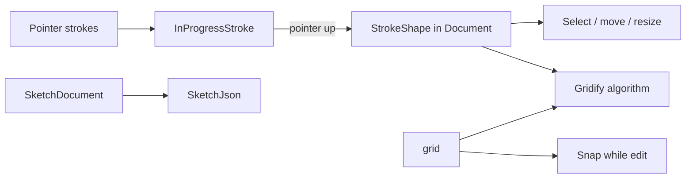

# SketchControl in Novolis.Avalonia.Controls

## Placement

**Home:** [`Novolis.Avalonia.Controls`](novolis-avalonia/src/Novolis.Avalonia.Controls) — new `SketchControl` (and supporting types) in namespace `Novolis.Avalonia.Controls`.

**No new packages.** Do not create `Novolis.Sketch` or `Novolis.Avalonia.Sketch`. Document model, Gridify, JSON helpers, and the Avalonia control all live in Controls.

**Dependencies (only):**

- Existing: `Avalonia`, `Avalonia.Controls.DataGrid`, `Novolis.Avalonia.Layout` ([csproj](novolis-avalonia/src/Novolis.Avalonia.Controls/Novolis.Avalonia.Controls.csproj))
- Optional adds: only free, maintained packages from **nuget.org** if needed (prefer BCL `System.Text.Json` — already available). No `Novolis.IO`, no local feeds, no unmaintained/sketchy deps.

**MVP scope (v1):** freehand pen → stroke shapes, select / move / resize, pan/zoom, visible **resizable** grid, snap-while-draw/edit toggle, **Gridify** on selection (or all). Undo/redo via a small command stack. **Out of v1:** rect/ellipse/arrow/text, rough-js style, collaboration.

## Document model (same package)

Pure C# types in Controls (testable without UI when logic is extracted, same pattern as `ChoiceDialogLogic`):

- **`SketchDocument`**: elements list, selection ids, `GridSettings` (`Size`, `Visible`, `SnapEnabled`), `Version`.
- **`StrokeShape`**: id, points (world `double` X/Y), stroke color/width. Bounds = AABB.
- **Resize:** `ApplyBoundsTransform(oldBounds, newBounds)` scales points with the AABB.
- **JSON:** `SketchJson.Serialize` / `Deserialize` via `System.Text.Json` (in-package helpers — not `Novolis.IO`).

## Gridify

On-demand (not only snap-while-drawing):

1. For each selected `StrokeShape` (or all if none selected): snap every point to nearest grid intersection using current `GridSize`.
2. Collapse consecutive duplicates.
3. Light cleanup only (no heavy simplification engine).
4. Undoable via the document command stack.

Unit tests under [`tests/Novolis.Avalonia.Unit/Controls/`](novolis-avalonia/tests/Novolis.Avalonia.Unit/Controls/).

## Avalonia control (`SketchControl`)

Follow [`StarMapControl`](novolis-avalonia/src/Novolis.Avalonia.StarMap/StarMapControl.cs): inherit `Control`, `StyledProperty` + `InvalidateVisual`, override `Render(DrawingContext)`. Code-only (no XAML / ControlThemes).

| Tool / mode | Behavior |
|-------------|----------|
| Pen | Sample points (optional live snap) → on release commit `StrokeShape` |
| Select | Hit-test; selection AABB + 8 resize grips; drag move / grip resize |
| Pan | Middle button or Space+drag; wheel zoom toward cursor |
| Grid | Draw from `GridSettings`; `GridSize` / `GridVisible` / `SnapEnabled` as StyledProperties |

**API:**

- `Document`, `Tool` (`Pen` | `Select`)
- `GridSize`, `GridVisible`, `SnapEnabled`
- `GridifySelection()`, `Undo()`, `Redo()`, `Clear()`
- `DocumentChanged`, `SelectionChanged`

Render order: grid → strokes → selection/grips → in-progress stroke.

Suggested files under `src/Novolis.Avalonia.Controls/`:

- `SketchControl.cs` — control + pointer/render
- `SketchDocument.cs`, `StrokeShape.cs`, `GridSettings.cs` — model
- `SketchGridify.cs`, `SketchBounds.cs` — pure logic
- `SketchJson.cs` — serialize
- `SketchHistory.cs` — undo/redo

## Scaffolding / packaging

1. Add types + control to existing Controls project (no slnx / packages.json package adds).
2. Update Controls [`README.md`](novolis-avalonia/src/Novolis.Avalonia.Controls/README.md) + package `Description` to mention sketch.
3. Unit tests for Gridify, snap, bounds transform, JSON round-trip.

## Explicit non-goals (v1)

- No separate Sketch NuGet package.
- No `Novolis.IO` dependency.
- Do not reuse DraftStudio CAD / `.cadjson`.
- Imperative `DrawingContext` only (no Avalonia `Shape` visual tree).
- No rough/hand-drawn stroke styling yet.

## Verification

- `dotnet test` Controls unit tests exit 0.
- `dotnet build` `Novolis.Avalonia.Controls`.
- Smoke: draw → select → resize → change grid size → Gridify → undo.

