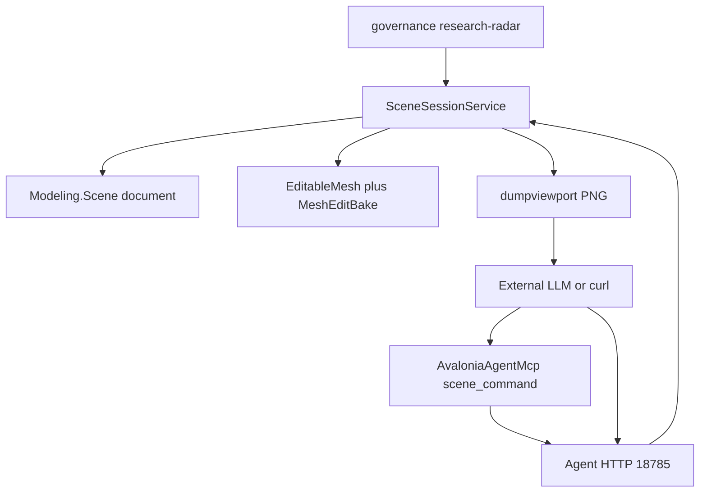

# Implement Awesome-LLM-3D recommendations (adapted)

## Architecture fit (adaptations from canvas)

The canvas’s “new MCP verbs / Agent.Surface package / Rendering language fields” do **not** match how Novolis works today. Implement against what already exists:

| Canvas play | Actual home | Adaptation |
|-------------|-------------|------------|
| Research radar | [novolis-governance](d:\novolis\novolis-governance) | New doc under `docs/research-radar/` (folder does not exist yet) |
| Spatial tools | [SceneSessionContract.cs](d:\novolis\novolis-avalonia\src\Novolis.Avalonia.3D\Session\SceneSessionContract.cs) + `SceneSessionService` | New **`[AgentAction]`** entries on `ISceneSession` (catalog/MCP `_command` auto-update). **No** new wire methods; **no** LLM inside libraries |
| LLM → mesh | Assimp `importmesh` + [MeshEditBake](d:\novolis\novolis-cad\src\Novolis.Modeling.Scene\Editing\MeshEditBake.cs) | Add **`importtriangles`** sibling that builds `EditableMesh` → `WriteBaked` (same bake path as Assimp). Do **not** invent a second mesh stack or Assimp fork |
| Viewport → LLM | Existing `dumpviewport` + SceneLab dumper | Document + MCP convenience; do **not** put CLIP/LERF in `Novolis.Rendering.*` |
| Spatial QA smoke | dogfooding | Thin harness calling the new actions against a tiny `.nov3djson` |

**Explicit non-goals:** PyTorch/ONNX in NuGet; `propose_mesh_ops` (already covered by `meshedit` / `addmodifier`); embodied VLA packages; ScanNet-scale benchmarks; changing Agent wire protocol.

---

## 1. Governance research radar

Add [novolis-governance/docs/research-radar/awesome-llm-3d.md](d:\novolis\novolis-governance\docs\research-radar\awesome-llm-3d.md):

- Cite Awesome-LLM-3D + survey `arXiv:2405.10255`
- Table of Awesome buckets → Novolis home → **Adopt / Adapter / Skip**
- Point to concrete actions: `describescene`, `groundphrase`, `importtriangles`, `dumpviewport`
- Conventional `SceneDocument.Properties` keys: `description`, `caption`, `source` (reuse existing bag in [SceneDocument.cs](d:\novolis\novolis-cad\src\Novolis.Modeling.Scene\Primitives\SceneDocument.cs); confirm against [novolis.scene.schema.json](d:\novolis\novolis-governance\schemas\modeling\novolis.scene.schema.json)—extend schema **only** if `properties` is missing)

Link the radar from a short note in governance docs index / imports-todo README if one already lists research docs.

---

## 2. Deterministic spatial AgentActions (library-side “tools”)

Extend the attributed contract and implement in Avalonia.3D session host (same pattern as `importmesh` / dumps):

**Files:** [SceneSessionContract.cs](d:\novolis\novolis-avalonia\src\Novolis.Avalonia.3D\Session\SceneSessionContract.cs), `SceneSessionActionIds`, [SceneSessionService.cs](d:\novolis\novolis-avalonia\src\Novolis.Avalonia.3D\Session\SceneSessionService.cs)

| Action | Params | Behavior |
|--------|--------|----------|
| `describescene` | (none) | Return structured summary: name, unit scale, node count by kind, selection, active camera, `Properties`, top-level hierarchy names/ids. Pure document walk—**not** an LLM call |
| `groundphrase` | `phrase`; `select?=true` | Case-insensitive match on node `Name` / `Id`; return ranked hits; optionally `select` best match |
| `setsceneprops` | `key`; `value?` | Set/clear `SceneDocument.Properties[key]` so captions persist in `.nov3djson` |

Skip canvas’s `listinstances` / `propose_mesh_ops`: hierarchy already visible via `dumpscene` / snapshot; mesh ops already exist (`meshedit`, `addmodifier`, …).

Keep action ids lowercase single-token to match the existing catalog style.

---

## 3. Triangle-soup ingest (generation papers → bake path)

Add **`importtriangles`** on the same session surface:

- Params: `path` to a small JSON file `{ "vertices":[x,y,z,...], "indices":[i,...], "name"? }` **or** inline `vertices`/`indices` when size is modest
- Implementation: `new EditableMesh(...)` → `MeshEditBake.WriteBaked` → select node (mirror `DoImportMesh` framing where useful: center / scale via existing transform helpers, not a new importer package)
- Leave Assimp `importmesh` for FBX/OBJ/glTF; document both in radar + SceneLab README

Optional dogfood: tiny fixture under SceneLab `samples/` (or tests) proving round-trip without Assimp.

**Do not** add a parallel “LLM mesh” type in Math or Rendering.

---

## 4. Viewport as VLM context (reuse dumpviewport)

Already implemented: `dumpviewport` → SceneLab `DumpArtifactsRequested` → PNG under dumps/.

Work remaining:

- Document in radar + SceneLab agent notes: “LLM multimodal input = `dumpviewport` then read artifact path from command result / `last-artifact.json`”
- In [AvaloniaAgentMcp](d:\novolis\novolis-dogfooding\apps\AvaloniaAgentMcp): ensure `scene_command` forwards `path` (and any missing dump fields); add thin wrappers `scene_dumpviewport` / `scene_describescene` only if the MCP tool list is hard for agents to use via generic `scene_command`—prefer fixing param forwarding first over tool sprawl

No Rendering package changes for language embeddings.

---

## 5. Spatial QA smoke (dogfood)

Add a small harness under dogfooding (headless preferred):

- Load a **tiny** authored `.nov3djson` (few named nodes—not freighter mega-file)
- Construct / use `SceneSessionService` **or** HTTP against a running SceneLab
- Assert: `describescene` mentions expected names; `groundphrase` hits correct `nodeId`; optional `setsceneprops` round-trips on save/open

Wire as `dotnet run -- --spatial-smoke` on SceneLab **or** a dedicated console under `apps/`—match whatever pattern TorrentLab `--smoke` / existing SceneLab CLI flags use.

---

## Verification

- Build Avalonia.3D + SceneLab with `-p:NovolisUseProjectReferences=true`
- Manual: SceneLab up → `POST /agent/command` with `describescene` / `groundphrase` / `importtriangles` / `dumpviewport`
- Run spatial-smoke exit 0
- NuGet policy: no new local feeds; same-repo ProjectReference for cad/avalonia changes; no new PyTorch deps

## Sequencing

1. Radar doc + Properties convention  
2. `describescene` / `groundphrase` / `setsceneprops` + Execute handlers  
3. `importtriangles` + fixture  
4. MCP forwarding / docs for dumpviewport  
5. Spatial-smoke harness  

