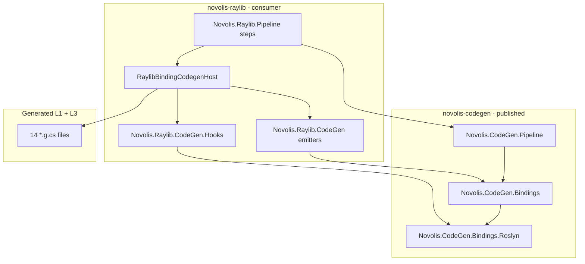
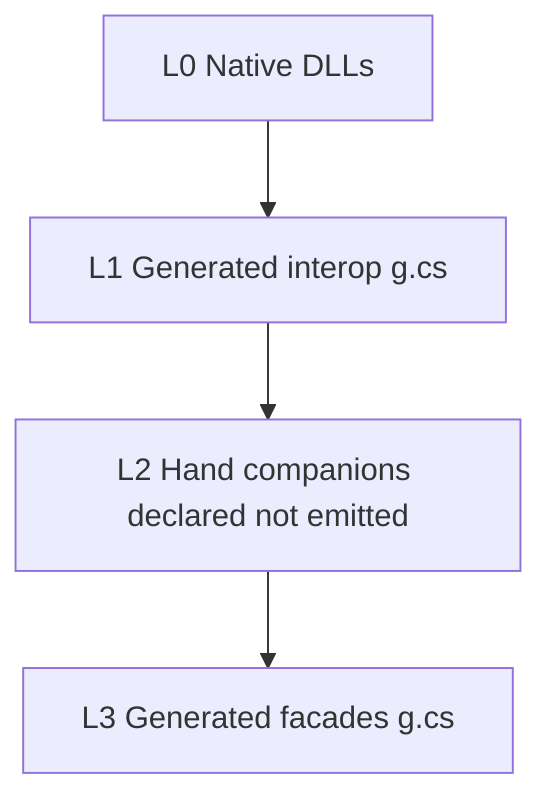

# Binding CodeGen Library — Comprehensive Plan

## Locked decisions (from your choices + analysis)

| Decision | Choice |
|----------|--------|
| Parity gate | **T1** — AST-normalized equivalence (not byte-identical) |
| First milestone | **Through Phase 4** — library shipped + raylib wired + parity tests green |
| Binding stack | **Adopt L0-L3** with explicit L2 companions (P0-1) |
| Façade authority v1 | **JSON stays authoritative** for façades; C# manifests deferred to Phase 5+ (P0-5) |
| Emit inlining | **Option A** — keep emitter inlining for parity; hooks only for EndDrawing + XML docs (P1-9) |

## Target architecture



### Binding stack (spec v2 core model)



L2 examples in raylib today: [`GuiControls.cs`](d:\novolis\novolis-raylib\src\Novolis.Raylib.Runtime\Gui\GuiControls.cs), [`ImguiShimHost.cs`](d:\novolis\novolis-raylib\src\Novolis.Raylib.Runtime\ImguiShimHost.cs), [`Utf8StringMarshaller.cs`](d:\novolis\novolis-raylib\src\Novolis.Raylib.Bindings\Interop\Utf8StringMarshaller.cs).

---

## Phase 0 — Spec consolidation (docs only)

Create [`initial-idea-v2.md`](d:\novolis\novolis-codegen\docs\specs\binding-codegen-library\initial-idea-v2.md) merging accepted plugs from [analysis.md](d:\novolis\novolis-codegen\docs\specs\binding-codegen-library\analysis.md). Do **not** edit [initial-idea.md](d:\novolis\novolis-codegen\docs\specs\binding-codegen-library\initial-idea.md).

**v2 must explicitly add:**
- L0-L3 binding stack + `CompanionDeclaration` (paths + symbol surface for validation)
- Per-file JSON wire serializers (`imports` vs `functions` vs debug)
- Scoped template types: `InteropTemplate`, `ImGuiTemplate`, `RayguiTemplate`
- `IBindingEmitter`, `IBindingCodegenHost`, `BindingEmitContext` (no disk reads in hooks)
- Parity tiers T0/T1/T2; **Phase 4 gate = T1**
- Single codegen host replacing Pipeline step_06, MSBuild target, and legacy CLI

Update [summary.md](d:\novolis\novolis-codegen\docs\specs\binding-codegen-library\summary.md) document map to link v2.

---

## Phase 1 — Extract shared packages (novolis-codegen)

Add three projects under [`novolis-codegen/src/`](d:\novolis\novolis-codegen\src) and register in [`Novolis.CodeGen.slnx`](d:\novolis\novolis-codegen\Novolis.CodeGen.slnx):

### 1a. `Novolis.CodeGen.Pipeline` (no Roslyn)

**Move/adapt from** [`novolis-raylib/codegen/Novolis.Raylib.Pipeline/`](d:\novolis\novolis-raylib\codegen\Novolis.Raylib.Pipeline):
- `IPipelineStep`, `PipelineContext`, `StepExecutionResult`, `StepResultDocument`
- `PipelineRunner`, `StepSkipEvaluator`, `StepResultWriter`, `StepFileFingerprint`

**Generalize:**
- Replace hardcoded [`PipelinePaths`](d:\novolis\novolis-raylib\codegen\Novolis.Raylib.CodeGen.Abstractions\PipelinePaths.cs) with injectable `IPipelineLayout` (`RepoRoot`, `StepsRoot`, `StepDir`, `ManifestDir`)

Raylib keeps `RaylibPipelineLayout` in its Pipeline project.

### 1b. `Novolis.CodeGen.Bindings.Roslyn`

**Move/adapt from** [`Novolis.Raylib.CodeGen.Abstractions`](d:\novolis\novolis-raylib\codegen\Novolis.Raylib.CodeGen.Abstractions) + [`CodegenFormatter.cs`](d:\novolis\novolis-raylib\codegen\Novolis.Raylib.CodeGen\CodegenFormatter.cs):
- Generic `ICodegenHook<TPhase, TContext>` where `TPhase : struct, Enum`
- `RoslynEmitWriter<TPhase,TContext>` (parse → ordered hooks → format policy)
- `FormatPolicy`: `RoslynFormatter` vs `NormalizeWhitespace` (matches current [`WriteUnit`](d:\novolis\novolis-raylib\codegen\Novolis.Raylib.CodeGen\RaylibCodegenPipeline.cs) split)
- `HookDiscovery`, starter `SyntaxRewriters` helpers

### 1c. `Novolis.CodeGen.Bindings` (no Roslyn)

Core manifest + orchestration types:
- `FragmentKind`, `IManifestFragment`, fragment records (interop, shim, debug, facade)
- **Split serializers** per wire format (P0-2)
- `EmitStrategy`, `EmitTarget` (assembly, path, namespace, class name — fixes P1-4)
- `CompanionDeclaration`, `RequiredCompanion`
- `BindingProject`, merge plan builders (Bindings, Facades, NativePack validate-only)
- `IBindingEmitter`, `EmitRequest`, `IBindingCodegenHost`

**Package dependency graph:**
```
Pipeline          (standalone)
Bindings          (standalone)
Bindings.Roslyn   → Bindings, Microsoft.CodeAnalysis.CSharp
Bindings.Emit     → Bindings, Bindings.Roslyn  [optional thin orchestrator package OR fold into Bindings.Roslyn]
```

Prefer **3 packages** initially (Pipeline, Bindings, Bindings.Roslyn) to avoid over-splitting.

### 1d. Tests + registry

- New test project `Novolis.CodeGen.Bindings.Unit` in [`novolis-codegen/tests/`](d:\novolis\novolis-codegen\tests)
- Add registry entries in [`novolis-registry/packages/`](d:\novolis\novolis-registry\packages) for new package IDs (mirror [`novolis-codegen-reflection.json`](d:\novolis\novolis-registry\packages\novolis-codegen-reflection.json))

---

## Phase 2 — JSON round-trip + manifest model parity

Bootstrap fragment models from committed raylib manifests (8 files under [`codegen/pipeline/raylib6/`](d:\novolis\novolis-raylib\codegen\pipeline\raylib6)):

| File | Serializer |
|------|------------|
| `raylib-exports.manifest.json` | `InteropExportsSerializer` |
| `imgui-exports.manifest.json`, `raygui-exports.manifest.json` | `ShimExportsSerializer` |
| `raylib-debug.manifest.json` | `DebugConfigSerializer` |
| `facades`, `hud`, `gui`, `raygui` manifests | `FacadeTypesSerializer` |

**Tests (in novolis-codegen):**
- Load JSON → fragment → serialize → **semantic equality** (not necessarily byte-identical JSON whitespace)
- SHA256 of canonical UTF-8 bytes matches what emitters use today
- Template catalogs: exhaustive list from [`RaylibInteropEmitter`](d:\novolis\novolis-raylib\codegen\Novolis.Raylib.CodeGen\Emit\RaylibInteropEmitter.cs), [`ImguiInteropEmitter`](d:\novolis\novolis-raylib\codegen\Novolis.Raylib.CodeGen\Emit\ImguiInteropEmitter.cs), [`RayguiInteropEmitter`](d:\novolis\novolis-raylib\codegen\Novolis.Raylib.CodeGen\Emit\RayguiInteropEmitter.cs) — including Raygui embedded struct as `EmbeddedTypeSpec`, not manifest data

**Copy test fixtures:** vendor manifest JSON into `novolis-codegen/tests/fixtures/raylib6/` (small committed snapshots, not full raylib repo).

---

## Phase 3 — Raylib adapter: emitters as plugins + unified host

In **novolis-raylib** (minimal churn to emitters):

### 3a. Wrap existing emitters with `IBindingEmitter`

Thin adapters around unchanged string emitters:
- `RaylibInteropEmitter` → `LibraryImport`
- `ImguiInteropEmitter`, `RayguiInteropEmitter` → `DynamicExports`
- `RaylibDebugHooksEmitter` → `DebugHooks`
- `FacadeEmitter` → `FacadeForward`

### 3b. `RaylibBindingCodegenHost` implements `IBindingCodegenHost`

Replaces orchestration in [`RaylibCodegenPipeline.GenerateBindingsOnly`](d:\novolis\novolis-raylib\codegen\Novolis.Raylib.CodeGen\RaylibCodegenPipeline.cs) with declarative plan:

**14 emit targets** (from [summary parity scope](d:\novolis\novolis-codegen\docs\specs\binding-codegen-library\summary.md)):
- Bindings: `Raylib6Native`, `ImguiShimExports`, `RaylibDebugFrameHooks`
- Runtime: 7 façade types + `Hud` + `Gui`
- Raygui (optional): `RayguiShimExports`, `RayGui`

**Companion declarations** (L2, validate-only):
- Bindings: `Utf8StringMarshaller.cs`, `RaylibColor.cs`, `RaylibInteropMarshaling.cs`, `RaylibDebugCaptureGate.cs`
- Runtime GUI: `ImguiShimHost.cs`, `GuiControls.cs`
- Raygui: `RayGuiControls.cs`

### 3c. Fix hook context (P0-4)

Refactor [`InjectEndDrawingNotifyHook`](d:\novolis\novolis-raylib\codegen\Novolis.Raylib.CodeGen.Hooks\InjectEndDrawingNotifyHook.cs) to read `NotifyAfterNativeCall` / `FrameHubNotifyAfter` from `RaylibCodegenContext` (populated by host from debug fragment), not from disk.

Raylib hooks implement `ICodegenHook<RaylibCodegenPhase, RaylibCodegenContext>` via type alias.

### 3d. Slim `Novolis.Raylib.CodeGen.Abstractions`

Becomes a thin re-export / raylib-specific types only:
- `RaylibCodegenPhase`, `RaylibCodegenContext` extensions
- References `Novolis.CodeGen.Bindings` + `Novolis.CodeGen.Bindings.Roslyn`

Pipeline project references `Novolis.CodeGen.Pipeline` package (ProjectReference during monorepo dev or NuGet once published).

---

## Phase 4 — Wire entry points + T1 parity gate

### 4a. Single host, three callers

| Caller | Change |
|--------|--------|
| [`step_06_codegen`](d:\novolis\novolis-raylib\codegen\Novolis.Raylib.Pipeline\Steps\PipelineSteps.cs) | `RaylibBindingCodegenHost.Emit(...)` |
| [`Novolis.Raylib.CodeGen.targets`](d:\novolis\novolis-raylib\build\Novolis.Raylib.CodeGen.targets) | Same host via Pipeline `run generate` (unchanged UX) |
| [`Program.cs generate`](d:\novolis\novolis-raylib\codegen\Novolis.Raylib.CodeGen\Program.cs) | Delegate to host |

Update regenerate hints in emitted headers to canonical Pipeline command.

### 4b. T1 parity test suite (novolis-raylib)

New test class `RaylibBindingParityTests` in [`Novolis.Raylib.CodeGen.Unit`](d:\novolis\novolis-raylib\tests\Novolis.Raylib.CodeGen.Unit):

**T0 (fast, keep existing):** ManifestSha256 header lines match.

**T1 (gate):** For each of 14 outputs:
1. Run host emit to temp dir
2. Parse committed + emitted with Roslyn
3. Assert structural equivalence via normalized syntax tree compare (ignore whitespace/trivia) OR dedicated `CompilationUnitComparer` that compares member signatures, attributes, and statement structure

Extend existing [`RaylibCodegenPipelineTests`](d:\novolis\novolis-raylib\tests\Novolis.Raylib.CodeGen.Unit\RaylibCodegenPipelineTests.cs) rather than replacing.

**Optional raygui:** test both `IncludeRaygui=true/false` paths.

### 4c. CI gate

- `novolis-codegen`: unit tests for serializers + pipeline kernel
- `novolis-raylib`: `dotnet test` includes T1 parity; maintainer `agent-verify` profile unchanged in behavior

### 4d. Phase 4 exit criteria

- [ ] All 14 files pass T1 when host drives existing emitters + hooks
- [ ] `InjectEndDrawingNotifyHook` uses context only
- [ ] Raylib Pipeline + MSBuild + CLI all call same host
- [ ] No behavior change to committed `*.g.cs` on clean tree (git diff empty after generate)
- [ ] New packages published to GitHub Packages on novolis-codegen merge

---

## Deferred (document in v2, not Phase 4 scope)

### Phase 5 — C# manifests (interop/shim/debug only)
- `Novolis.Raylib.Manifests` project; JSON derived via `SerializeDerivedManifests`
- Fluent builders for ~200 interop imports — bootstrap via `FromJson` initially

### Phase 6 — Façade C# + doc model
- Requires enrich/resolver decision (move defaults out of [`FacadeDocResolver`](d:\novolis\novolis-raylib\codegen\Novolis.Raylib.CodeGen\Docs\FacadeDocResolver.cs))
- Keep step_04 enrich writing JSON until then

### Backlog (P2)
- NativePack MSBuild generator
- `BindingSurface` fluent sugar
- Second consumer (e.g. Silk) after raylib parity stable
- Semantic validation of façade bodies against companion symbol table

---

## Risk register

| Risk | Mitigation |
|------|------------|
| Roslyn version drift between repos | Pin `Microsoft.CodeAnalysis.CSharp` in both `Directory.Packages.props`; T1 not T2 |
| Cross-repo package refs during dev | Use ProjectReference / local NuGet feed until first codegen publish |
| Raygui tri-state | Host accepts `IncludeRaygui` flag; parity tests cover both paths |
| Large interop manifest in C# (Phase 5) | Phase 4 stays JSON; `FromJson` bootstrap |

---

## File touch map (Phase 1-4)

**novolis-codegen (new):**
- `src/Novolis.CodeGen.Pipeline/**`
- `src/Novolis.CodeGen.Bindings/**`
- `src/Novolis.CodeGen.Bindings.Roslyn/**`
- `tests/Novolis.CodeGen.Bindings.Unit/**`
- `tests/fixtures/raylib6/*.manifest.json`
- `docs/specs/binding-codegen-library/initial-idea-v2.md`

**novolis-raylib (modify):**
- `codegen/Novolis.Raylib.CodeGen.Abstractions/` — slim to raylib types
- `codegen/Novolis.Raylib.CodeGen/` — host + emitter adapters; hook context fix
- `codegen/Novolis.Raylib.Pipeline/` — use shared Pipeline; step_06 calls host
- `codegen/Novolis.Raylib.CodeGen.Hooks/` — context-only debug config
- `tests/Novolis.Raylib.CodeGen.Unit/` — T1 parity tests

**novolis-registry (new):**
- `packages/novolis-codegen-bindings.json`, `novolis-codegen-pipeline.json`, etc.

