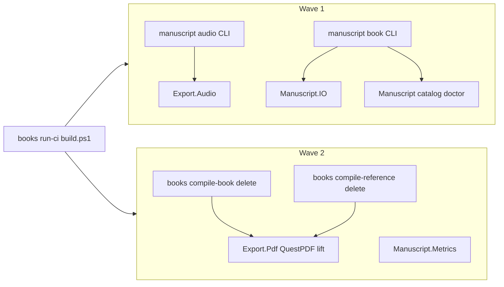

# Lift books tooling into Novolis.Manuscript

## Locked decisions

| Decision | Choice |
|----------|--------|
| PDF strategy | **Lift** books QuestPDF document builders into Manuscript (preserve print look); do not wait on Markup-only parity |
| First PR tranche | **Audio + book-tool** over packages already used by Studio; PDF + metrics in a second wave |
| Books end state | Content + thin CI (`run-ci` / `build.ps1` shells) + Calypso/starsystems domain generators — no local QuestPDF/audio/surgery implementations |

## Wave 1 — CLIs over existing packages (delete audio/surgery duplication)

### Add packable / runnable CLIs in `novolis-manuscript`

Create `d:\novolis\novolis-manuscript\tools\` (or a small `src/Novolis.Manuscript.Cli` with `OutputType=Exe` + pack as tool) with two entrypoints that PackageReference Manuscript packages (ProjectRef locally):

1. **`manuscript-audio`** — CLI façade over [`AudiobookPipeline`](d:\novolis\novolis-manuscript\src\Novolis.Manuscript.Export.Audio\AudiobookPipeline.cs) + [`VoiceMapStore`](d:\novolis\novolis-manuscript\src\Novolis.Manuscript.Export.Audio) + Edge TTS. Preserve books-compatible flags where Studio/CI need them (`--series`/`--book`, jobs, chapter range, verify). Prefer library assembly over ffmpeg where `AudiobookAssembler` already covers M4B; keep optional ffprobe verify only if CI still requires duration checks.

2. **`manuscript-book`** — CLI façade over [`ManuscriptWorkspace`/`ManuscriptCatalog`/`ManuscriptDoctor`](d:\novolis\novolis-manuscript\src\Novolis.Manuscript) + [`LegacyChapterSurgery`](d:\novolis\novolis-manuscript\src\Novolis.Manuscript.IO\LegacyChapterSurgery.cs). Commands: `list-books`, `doctor`, `validate-order`, `validate-staged`, `insert-after`/`insert-between`, `promote-decimal`, `sync-filenames`, optional `ascii-scan`. Extend surgery for NMP `Chapters/` (rename type later if desired; behavior must work on migrated books tree).

Publish via merge → GPR float `2026.1.*`.

### Shrink books

| Books file | After Wave 1 |
|------------|--------------|
| [`tools/audio/generate-audiobook.cs`](D:\repos\books\tools\audio\generate-audiobook.cs) | Delete or ~20-line shim that `dotnet run`s / invokes Manuscript CLI |
| [`tools/dev/book-tool.cs`](D:\repos\books\tools\dev\book-tool.cs) | Same — agent docs point at Manuscript CLI |
| [`tools/ci/run-ci.cs`](D:\repos\books\tools\ci\run-ci.cs) | Call Manuscript CLIs for audio staging / pre-commit validate-staged; keep invariants + staging + CalVer here |
| [`tools/apps/books-writer`](D:\repos\books\tools\apps\books-writer) | Retarget job shells to Manuscript CLIs **or** document Studio as canonical and leave writer as thin/deprecated |

Studio already uses packages in-process ([`MainWindow.cs`](d:\novolis\novolis-apps\src\BooksWriterStudio\MainWindow.cs)); no change required beyond optional bump after publish.

### Verify Wave 1

- Unit tests for CLI argument → API wiring (manuscript repo)
- Books: `dotnet run … manuscript-book doctor` on Calypso; one audiobook chapter dry-run; `run-ci --pre-commit` green
- No new local NuGet feeds

## Wave 2 — Lift QuestPDF + metrics (delete compile-* implementations)

### Export.Pdf fidelity lift

Move the QuestPDF document construction from:

- [`D:\repos\books\tools\dev\compile-book.cs`](D:\repos\books\tools\dev\compile-book.cs)
- [`D:\repos\books\tools\dev\compile-reference.cs`](D:\repos\books\tools\dev\compile-reference.cs)

into [`Novolis.Manuscript.Export.Pdf`](d:\novolis\novolis-manuscript\src\Novolis.Manuscript.Export.Pdf) (replace or sit beside the thin Markup concat path). Public API shape:

- `ManuscriptBookPdfExporter.ExportBook(...)` gains books-grade cover / chapter-metadata filtering / print-settings behavior (Studio already calls this — keep signature stable, deepen implementation)
- `ExportReferenceSet` / dedicated `ExportReferenceManual` for series reference TOC/tables

Add **`manuscript-print`** CLI (discover NMP books, write `out/…`) so books `build.ps1` becomes a thin loop or single call.

### Metrics

New packable `Novolis.Manuscript.Metrics` (or fold into Manuscript + CLI) porting [`compile-metrics.cs`](D:\repos\books\tools\dev\compile-metrics.cs) → JSON/MD overview. Wire into `manuscript-print` or `manuscript-metrics` CLI.

### Delete from books after green

- `compile-book.cs`, `compile-reference.cs`, `compile-metrics.cs` bodies
- QuestPDF package refs from books tools
- Update `build.ps1` / `run-ci` to invoke Manuscript CLIs only

### Verify Wave 2

- Golden or smoke: Calypso + one reference PDF byte-size/page-count sanity vs prior `out/`
- Full `pwsh -File D:\repos\books\build.ps1` and `run-ci` exit 0
- Studio ProjectRef PDF export still works

## Explicitly stay in books

- `run-ci` invariants, release-staging, CalVer `gh release`
- Calypso / `tools/starsystems` / one-off lore generators
- Content under `src/`, `style/`, `manuscript.yaml`
- Optional thin shims that only forward to Manuscript CLIs (acceptable until agents learn new paths)

## PR / merge sequence

1. **novolis-manuscript** Wave 1 CLIs + surgery NMP paths → publish GPR  
2. **books** Wave 1: retarget / delete generate-audiobook + book-tool; CI shells new CLIs  
3. **novolis-manuscript** Wave 2 QuestPDF + metrics → publish  
4. **books** Wave 2: delete compile-*; thin build.ps1  
5. Apps: bump floats only if pinned; Studio already package-native

## Non-goals

- Moving Avalonia Writer host into manuscript (Studio in novolis-apps is the product host)
- Moving Calypso/AstroForge/starsystems into Manuscript
- Dual-tree content layout (NMP already landed)

