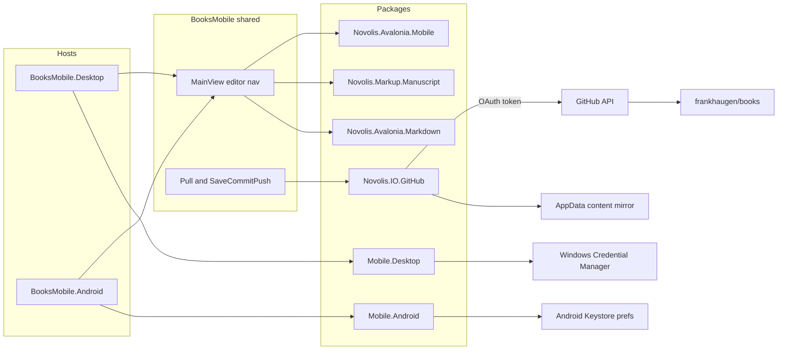

# BooksMobile (Avalonia Android + Windows)

## Locked decisions

| Topic | Choice |
|-------|--------|
| Repo synced | `frankhaugen/books` (private) |
| Auth | GitHub **OAuth Device Authorization Grant** — opens verification URL so Android GitHub app / browser + **1Password passkey** can approve; no PAT paste |
| SCM UX | **Pull**; **Save/Commit/Push** (one action, auto message `BooksMobile yyyy-MM-dd HH:mm`) |
| Transport | New **`Novolis.IO.GitHub`** (Octokit) — not `Novolis.IO.Git` process runner on either head |
| Sync scope | Sparse mirror of `content/` (markdown + yaml catalog). Skip heavy `assets/` unless later needed |
| Storage | Tokens in platform secure store; workspace under app data (not shared storage / not Documents) |
| UI stack | Avalonia 12.0.2 xplat: shared core + Desktop + Android heads |
| Framework | `Novolis.Avalonia.Mobile*` in [novolis-avalonia](novolis-avalonia) |
| App home | [novolis-apps/src/BooksMobile/](novolis-apps/src/BooksMobile/) — **omit** from [`Get-NovolisAppCatalog`](novolis-apps/scripts/Publish-NovolisApp.ps1) |
| Pipeline | No Android/CI release; local scripts only |



## 1. Platform framework — `Novolis.Avalonia.Mobile*`

Add under [novolis-avalonia/src/](novolis-avalonia/src/) (override TFM only on Android; keep root `Directory.Build.props` at `net10.0` for other packages):

| Package | TFM | Responsibility |
|---------|-----|----------------|
| `Novolis.Avalonia.Mobile` | `net10.0` | `ISecureTokenStore`, `IAppDataPaths`, `IBrowserLauncher`, `IDeviceFlowPresenter` (show user code + open verify URL), DI `AddNovolisMobileCore()` |
| `Novolis.Avalonia.Mobile.Android` | `net10.0-android` | EncryptedSharedPreferences / Keystore-backed token store; `Context.FilesDir` workspace root; Custom Tabs / `Intent` for verify URL |
| `Novolis.Avalonia.Mobile.Desktop` | `net10.0` | Windows Credential Manager (`Credential` / DPAPI-backed); `%LocalAppData%\Novolis\BooksMobile\`; `Process.Start` browser |

Wire: csproj + CPM pins (`Avalonia.Android` **12.0.2**, AndroidX.Browser as needed) in [Directory.Packages.props](novolis-avalonia/Directory.Packages.props), [Novolis.Avalonia.slnx](novolis-avalonia/Novolis.Avalonia.slnx), `.novolis/packages.json`, package READMEs. Publish to GPR before apps consume.

**Best-practice paths**

- Android workspace: `{FilesDir}/workspace/` (private app storage; survives update; cleared on uninstall)
- Windows workspace: `%LocalAppData%\Novolis\BooksMobile\workspace\`
- Token key: `github.oauth.access_token` in secure store only (never prefs plaintext / never files)

## 2. GitHub sync — `Novolis.IO.GitHub`

New packable project in [novolis-io/src/Novolis.IO.GitHub/](novolis-io/src/Novolis.IO.GitHub/):

- Octokit client with injected token accessor
- `GitHubDeviceAuth` — device code request + poll (`repo` scope for private `frankhaugen/books`)
- `BooksRepoMirror`:
  - **Pull**: resolve default branch → git tree under `content/` → download blobs → write into local workspace root so [`ManuscriptWorkspace.TryOpen`](novolis-markup/src/Novolis.Markup.Manuscript/ManuscriptWorkspace.cs) works
  - **SaveCommitPush**: write dirty files → Git Data API (blobs → tree → commit → update ref) or Contents API multi-file update with base SHA; auto message; single user gesture
- Track local dirty set (in-memory + optional `.novolis/mobile-dirty.json` under workspace)
- Unit tests with mocked HTTP / Octokit fakes for tree + commit path

Do **not** call [`GitRepositoryService`](novolis-io/src/Novolis.IO.Git/GitRepositoryService.cs) from the mobile app (no `git` on Android; keep desktop Studio on process git).

## 3. App — Avalonia xplat in `novolis-apps`

```
novolis-apps/src/BooksMobile/
  BooksMobile/                 # net10.0 shared: App, MainView, ViewModels, services
  BooksMobile.Desktop/         # WinExe + Avalonia.Desktop
  BooksMobile.Android/         # net10.0-android + Avalonia.Android + AvaloniaAndroidApplication
```

**Shared UI (v0)**

- Sign-in screen: start device flow → show user code → “Open GitHub” (launcher) → poll until token → store via `ISecureTokenStore`
- Nav: series → book → chapter (via `Novolis.Markup.Manuscript`)
- Editor: `MarkdownSourceEditor` from `Novolis.Avalonia.Markdown` (preview/Mermaid deferred if Android cost is high)
- Toolbar: **Pull** | **Save/Commit/Push** | Sign out
- Status line: branch, dirty count, last sync error

**Bootstrap**

- Desktop: classic lifetime + `MainWindow` hosting `MainView` (same pattern as [BooksWriterStudio/Program.cs](novolis-apps/src/BooksWriterStudio/Program.cs))
- Android: `AvaloniaAndroidApplication<App>` + `AvaloniaMainActivity`; `ISingleViewApplicationLifetime` / `MainViewFactory`
- Register `AddNovolisMobileAndroid()` / `AddNovolisMobileDesktop()` in each head

**Exclusion from pipeline**

- Do **not** add to `Get-NovolisAppCatalog` in [Publish-NovolisApp.ps1](novolis-apps/scripts/Publish-NovolisApp.ps1)
- Do **not** add to `ValidateSet` in [build-installer.ps1](novolis-apps/scripts/build-installer.ps1)
- Optional: mention in [README](novolis-apps/README.md) as “local Android/Desktop — not released”

**CPM**: add `Avalonia.Android`, `Octokit`, Mobile package versions to [novolis-apps/Directory.Packages.props](novolis-apps/Directory.Packages.props).

## 4. OAuth app (one-time, outside code)

Create a GitHub OAuth App (account `frankhaugen` is fine):

- Name: `Novolis BooksMobile`
- Device flow enabled (no callback required for device grant)
- Client ID embedded as public config in app (`GitHub:ClientId`); **no client secret** in the app
- Scope requested: `repo`

Document Client ID setup in `src/BooksMobile/README.md` (how to set via `appsettings` / env `BOOKSMOBILE_GITHUB_CLIENT_ID` for local).

## 5. Local scripts (no CI install)

Under [novolis-apps/scripts/](novolis-apps/scripts/):

| Script | Behavior |
|--------|----------|
| `deploy-booksmobile-android.ps1` | Set `ANDROID_HOME` if missing; `adb get-state` must be `device`; `dotnet build …BooksMobile.Android -f net10.0-android -t:Install -c Debug`; optional `-Serial R5CX63BVGYR` |
| `run-booksmobile-desktop.ps1` | `dotnet run --project src/BooksMobile/BooksMobile.Desktop` |

Both scripts fail fast with clear text if GPR packages missing or adb unauthorized.

## 6. Implementation order

1. `Novolis.Avalonia.Mobile` (+ Android/Desktop) — secure store, paths, browser launcher, device-flow presenter helpers
2. `Novolis.IO.GitHub` — device auth + content mirror Pull / SaveCommitPush + tests
3. Publish both package lines to GitHub Packages (merge CI)
4. Scaffold BooksMobile xplat app + scripts; PackageReference only
5. Smoke: desktop run against OAuth; Android `deploy-booksmobile-android.ps1` onto SM-F741B; Pull → edit chapter → Save/Commit/Push → verify on github.com/frankhaugen/books

## Out of scope (explicit)

- Play Store / Inno / merge release catalog
- Full `Novolis.IO.Git` on device
- Audiobook/PDF publish, spellcheck, Mermaid-first preview
- Wireless adb as default
- iOS / browser heads

