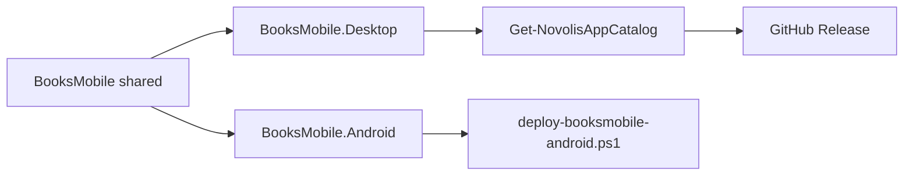

# BooksMobile hybrid Desktop release

## Current state

BooksMobile is already a hybrid Avalonia stack under [`d:\novolis\novolis-apps\src\BooksMobile\`](d:\novolis\novolis-apps\src\BooksMobile\):

| Head | Status |
|------|--------|
| `BooksMobile.Desktop` | WinExe; run via `run-booksmobile-desktop.ps1` |
| `BooksMobile.Android` | APK via `deploy-booksmobile-android.ps1`; **omitted** from [`Novolis.Apps.slnx`](d:\novolis\novolis-apps\Novolis.Apps.slnx) (android workload) |
| Release catalog | **Excluded** — README says “local deploy only” |

No app UI rewrite is required. Work is packaging + catalog + docs + verification.



## Concrete packaging choices

- **Catalog Choice / Key:** `BooksMobile` / `books-mobile`
- **Project:** `src/BooksMobile/BooksMobile.Desktop/BooksMobile.Desktop.csproj`
- **Ship exe name:** set Desktop `<AssemblyName>` / product title to `BooksMobile` so assets are `BooksMobile-{version}-win-x64.zip` and start menu target `BooksMobile.exe` (not `BooksMobile.Desktop.exe`)
- **Inno:** `Novolis.Avalonia.Packaging.Inno` (already pinned `2026.1.*` in [`Directory.Packages.props`](d:\novolis\novolis-apps\Directory.Packages.props)) — same PrivateAssets pattern as [`DraftStudio.csproj`](d:\novolis\novolis-apps\src\DraftStudio\DraftStudio.csproj)
- **InstallDir / SetupBase / AppId:** `Novolis\Books Mobile` / `BooksMobileSetup` / `Novolis.BooksMobile`
- **User-space:** inherited from Avalonia Packaging.Inno (`PrivilegesRequired=lowest` → `%LocalAppData%\Programs\Novolis\Books Mobile`) — no admin, no MSIX
- **APK:** never added to catalog, merge/release workflows, or `SHA256SUMS`; keep Android out of `Novolis.Apps.slnx`; local only via [`deploy-booksmobile-android.ps1`](d:\novolis\novolis-apps\scripts\deploy-booksmobile-android.ps1)

## Implementation steps

1. **Desktop csproj** — add `Novolis.Avalonia.Packaging.Inno`; set `AssemblyName`/`ApplicationTitle` to `BooksMobile`; ensure `ApplicationIcon` can use repo-root `icon.ico` if other apps do (Packaging.Inno already wires SetupIcon from repo root in `Get-NovolisAppInnoProfile`).

2. **Catalog** — append entry in [`Get-NovolisAppCatalog`](d:\novolis\novolis-apps\scripts\Publish-NovolisApp.ps1) matching the field shape of existing studios.

3. **Entrypoints** — add `BooksMobile` to:
   - [`build-installer.ps1`](d:\novolis\novolis-apps\scripts\build-installer.ps1) `ValidateSet`
   - [`release.yml`](d:\novolis\novolis-apps\.github\workflows\release.yml) `workflow_dispatch` `app` options  
   (Merge workflow already publishes **all** catalog apps — no list edit needed beyond catalog.)

4. **Docs** — update:
   - [`BooksMobile/README.md`](d:\novolis\novolis-apps\src\BooksMobile\README.md): Desktop released (installer + zip); APK still local
   - [`novolis-apps/README.md`](d:\novolis\novolis-apps\README.md): release table row; apps table no longer “not released”
   - [`docs/release.md`](d:\novolis\novolis-apps\docs\release.md) + [`docs/getting-started.md`](d:\novolis\novolis-apps\docs\getting-started.md): asset names + install path

5. **Do not** wire Android into CI, upload APKs, or add sibling-checkout/local NuGet feeds.

## Verification of the release workflow (required)

Run in order; all must pass before calling the change done.

### A. Catalog + local publish (Windows)

```powershell
pwsh -NoProfile -Command "
  . 'd:\novolis\novolis-apps\scripts\Publish-NovolisApp.ps1'
  \$c = Get-NovolisAppCatalog | Where-Object Choice -eq 'BooksMobile'
  if (-not \$c) { throw 'BooksMobile missing from catalog' }
  \$c | Format-List Key,Choice,Project,ExeName,InstallDir,SetupBase
"

pwsh -File d:\novolis\novolis-apps\scripts\build-installer.ps1 -App BooksMobile -SkipInstaller
# Expect: d:\novolis\novolis-apps\artifacts\books-mobile\app\BooksMobile.exe
# Expect zip: ...\artifacts\books-mobile\BooksMobile-*-win-x64.zip

pwsh -File d:\novolis\novolis-apps\scripts\build-installer.ps1 -App BooksMobile
# Requires Inno Setup 6; expect BooksMobileSetup-*-win-x64.exe under artifacts\books-mobile\installer\
# and SHA256SUMS.txt under artifacts\
```

Assert:

- Zip and setup exist; hashes in `SHA256SUMS.txt` match `Get-FileHash`
- Generated `.iss` (under artifacts) contains `PrivilegesRequired=lowest` and DefaultDir under `{localappdata}\Programs\...`
- `artifacts/` contains **no** `.apk`

### B. APK stays local-only

```powershell
# Smoke only when Android SDK/device available — not part of CI release:
pwsh -File d:\novolis\novolis-apps\scripts\deploy-booksmobile-android.ps1
# Confirm: no references to apk in merge.yml / release.yml / Get-NovolisAppCatalog
Select-String -Path d:\novolis\novolis-apps\.github\workflows\*.yml,d:\novolis\novolis-apps\scripts\Publish-NovolisApp.ps1 -Pattern 'apk|BooksMobile\.Android' -SimpleMatch
# Expect: no catalog/workflow hits for Android APK upload
```

### C. Workflow surface

- Confirm `BooksMobile` appears in `release.yml` choices.
- Confirm merge path still publishes via `foreach ($app in (Get-NovolisAppCatalog))` so the new entry is included without a separate job.
- After merge to `main` (or manual **Release** with `app=BooksMobile`):  
  `gh release view v{version} --repo Novolis-Platform/novolis-apps`  
  and verify assets include `BooksMobileSetup-*-win-x64.exe`, `BooksMobile-*-win-x64.zip`, updated `SHA256SUMS.txt`, and **no** APK.

### D. Policy checks (repo hygiene)

```powershell
pwsh -File d:\novolis\novolis-governance\scripts\verify-nuget-only.ps1
pwsh -File d:\novolis\novolis-governance\scripts\verify-project-ref-mode.ps1 -SkipBuild
```

