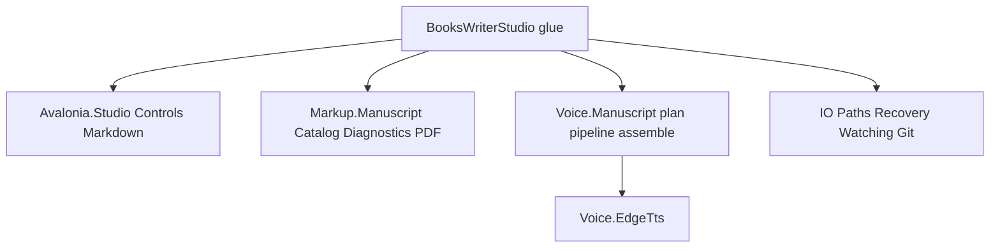
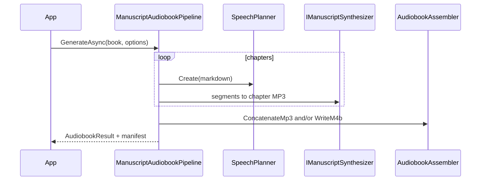

# BooksWriterStudio remake

## Decisions locked

- **App:** new [`novolis-apps/src/BooksWriterStudio/`](d:\novolis\novolis-apps\src\BooksWriterStudio) (parity remake). Leave [`ManuscriptStudio`](d:\novolis\novolis-apps\src\ManuscriptStudio) alone.
- **Audio:** extend [`Novolis.Audio.Voice.Manuscript`](d:\novolis\novolis-audio\src\Novolis.Audio.Voice.Manuscript) (not a separate Audiobook package). Assemble outputs: **concatenated MP3** and/or **chapterized M4B**.
- **No scripts:** zero `dotnet run --file`, zero Python/`edge-tts` CLI, zero ffmpeg process. TTS via `EdgeTtsClient` library; Git may still spawn `git` through [`Novolis.IO.Git`](d:\novolis\novolis-io\src\Novolis.IO.Git) (system tool, not a script).

## Architecture

App owns UX orchestration only. Domain/publish logic lives in packages published to GitHub Packages, then referenced as `2026.1.*`.

Reuse Avalonia lifts already in tree: `ChoiceDialog`, `FilteredPickerDialog`, `MarkedListBox`, `JobQueuePanel` / `IJobQueueRow`, `StudioFocusMode` ([`generic_avalonia_lifts` plan](d:\novolis\.cursor\plans\generic_avalonia_lifts_063df7a9.plan.md)).

---

## Package work (publish before app wires)

### 1. Extend `Novolis.Markup.Manuscript` — Catalog

Lift from Manuscript Studio’s internal [`ContentCatalog`](d:\novolis\novolis-apps\src\ManuscriptStudio\Extensions\BookAuthoring\Content\ContentCatalog.cs) into the package (do not add a second Catalog package).

**Public API**

| Type | Role |
|------|------|
| `ManuscriptWorkspace` | `TryOpen(startDir)` using `RootFinder` markers: `content/series` or `content/books` (+ optional `build.ps1`) |
| `ManuscriptCatalog` | `Load(contentRoot)` → series/books/chapters/refs |
| `SeriesInfo`, `BookInfo`, `ChapterInfo`, `ReferenceSetInfo` | Immutable models (`Id`, `Title`, paths, `ChapterKind`, sort key) |
| `ChapterOrder` | Heading/filename sort keys (from Studio) |
| `BookYaml` / thin YAML helpers | Load `series.yaml` / `book.yaml` via YamlDotNet |

**Behavior:** same layout as books repo / Studio (`content/series/{id}/books/{id}/chapters/*.md`, appendices, references, standalone `content/books/{id}`).

**Tests:** fixture tree with 1 series × 2 chapters + 1 standalone book; assert ids, titles, order.

### 2. Extend `Novolis.Markup.Manuscript` — Diagnostics

Replace `book-tool doctor --json`.

**Public API**

| Type | Role |
|------|------|
| `ManuscriptDoctor` | `Diagnose(BookInfo\|SeriesInfo\|contentRoot)` → `IReadOnlyList<DiagnosticFinding>` |
| `DiagnosticFinding` | `Severity` (Error/Warning/Info), `Code`, `Message`, `Path?` |

**Checks (v1):** missing `book.yaml`/`series.yaml`; chapter file missing/empty; duplicate chapter stems; heading title mismatch; unreadable markdown; orphan refs under `references/`; `chapter_order_from_heading` vs filename order conflicts.

**Tests:** fixture with planted errors; assert codes.

### 3. Extend `Novolis.Markup.Manuscript` — Book PDF

Replace `compile-book.cs` / `compile-reference.cs` process shell-outs. Prefer composing [`MarkdownPdfExporter`](d:\novolis\novolis-markup\src\Novolis.Markup.Markdown.Rendering\MarkdownPdfExporter.cs) (add PackageReference from Manuscript → Markdown.Rendering).

**Public API**

| Type | Role |
|------|------|
| `ManuscriptPrintSettings` | Page size (default 6×9), margins, body/heading fonts, font sizes, include cover — round-trip JSON compatible with books-writer `.writer/print-settings.json` shape where practical |
| `ManuscriptBookPdfExporter` | `ExportBook(BookInfo, outputPath, ManuscriptPrintSettings?)` — cover + ordered chapter markdown concat, page breaks between chapters |
| | `ExportReferenceSet(ReferenceSetInfo, outputPath, settings?)` — series reference PDF |

**Tests:** export tiny fixture book to bytes; assert non-empty PDF header `%PDF`.

### 4. Extend `Novolis.Audio.Voice.Manuscript` — pipeline + assemble

Keep existing `SpeechPlanner` / `SpeechPlan` / `ManuscriptSpeechOptions`. Add synthesis orchestration and assemble **in this package**.

**New dependencies (nuget.org, allowed):** `Novolis.Audio.Voice.EdgeTts` (GPR) for TTS; for M4B: **NAudio** MediaFoundation AAC encode (Windows) + small in-package ISOBMFF chapter writer (no ffmpeg).

**Public API**

| Type | Role |
|------|------|
| `IManuscriptSynthesizer` | `Task SynthesizeMp3Async(string text, Stream/path, ManuscriptVoiceSettings, ct)` — abstraction; default `EdgeTtsManuscriptSynthesizer` wraps `EdgeTtsClient` |
| `ManuscriptVoiceSettings` / `VoiceMapStore` | Load/save voice-map YAML (voice, rate, pitch, volume, pauses, pronunciation) — compatible with books `tools/audio/voice-map.yaml` fields the writer edits |
| `ManuscriptSpeechPreview` | **Selected-text preview:** normalize/pronounce selection with current voice settings → synthesize via `IManuscriptSynthesizer` → play through `IManuscriptAudioPlayer`; cancel/replace in-flight preview on re-trigger |
| `IManuscriptAudioPlayer` | Play/stop MP3 bytes (default `NaudioMp3Player` using NAudio; no ffmpeg). Shared by preview so publish pipeline stays file-oriented |
| `ManuscriptAudiobookOptions` | Output dirs, force rebuild, parallel jobs, chapter filter, assemble mode (`None` / `ConcatMp3` / `M4b` / `Both`), chapter gap ms |
| `ManuscriptAudiobookPipeline` | For each chapter: `SpeechPlanner.Create` → synthesize segments (concat spoken MP3 chunks; insert silence for pauses) → write `chapters/{id}.mp3` + cache by `PlanHash`; write `manifest.json` |
| `AudiobookAssembler.ConcatenateMp3(...)` | Ordered chapter MP3s → `{bookId}.mp3` with gap silence (same bitrate as Edge TTS: 24 kHz / 48 kbps mono) |
| `AudiobookAssembler.WriteM4b(...)` | Chapter MP3s → AAC → `{bookId}.m4b` with chapter titles/start times from manifest; optional cover image path |
| `AudiobookVerifier` | Assert chapter count, non-empty files, manifest vs disk, M4B chapter count/titles when M4B present |

**Speech preview behavior (library)**

- Input: raw editor selection (or current line/word if selection empty — **app chooses**; library accepts a non-empty string).
- Apply `SpeechPlanner.ApplyPronunciation` + light strip of markdown markers from the snippet (not full chapter planning).
- Use the same `ManuscriptVoiceSettings` as audiobook generation (voice/rate/pitch/volume).
- `PreviewAsync(text, settings, ct)` synthesizes then plays; a second call cancels the previous playback/synthesis.
- Cap preview length (e.g. 4k chars) with a clear exception so accidental whole-chapter selects do not hammer Edge TTS.

**Pipeline flow**

**Tests:** planner hash stability (existing); concat of two tiny MP3 fixtures → length increases; verifier fails on missing chapter; preview cancels prior run / rejects over-limit text (fake synthesizer + null/spy player); M4B test gated `[Fact(Skip=...)]` or Windows-only if MediaFoundation required.

**Package description** update: planning + chapter TTS orchestration + MP3/M4B assemble + selection speech preview.

---

## App: `BooksWriterStudio`

Path: [`novolis-apps/src/BooksWriterStudio/`](d:\novolis\novolis-apps\src\BooksWriterStudio)

**Shape:** Avalonia 12 WinExe, `Microsoft.Extensions.Hosting` DI (same pattern as Manuscript/Concept). MVVM with CommunityToolkit.Mvvm. **No** process runners for catalog/doctor/PDF/audio.

### PackageReferences

- `Novolis.Avalonia.Studio`, `.Controls`, `.Markdown`
- `Novolis.Markup.Manuscript` (catalog/doctor/PDF/metadata/word count)
- `Novolis.Audio.Voice.Manuscript`, `Novolis.Audio.Voice.EdgeTts` (preview + publish TTS)
- `Novolis.IO.Paths`, `.Recovery`, `.Watching`, `.Git`
- nuget.org: Avalonia stack, AvaloniaEdit, YamlDotNet, WeCantSpell.Hunspell (spell — app glue)

Add floating versions to [`Directory.Packages.props`](d:\novolis\novolis-apps\Directory.Packages.props); register project in [`Novolis.Apps.slnx`](d:\novolis\novolis-apps\Novolis.Apps.slnx).

### Feature map (glue only)

| books-writer | Implementation |
|--------------|----------------|
| Workspace open | `ManuscriptWorkspace` + folder picker; auto-open cwd if valid |
| Series/book/chapter nav | Catalog + `MarkedListBox` |
| Editor | `Novolis.Avalonia.Markdown` BookAuthoring highlighting |
| Autosave / dirty | Idle timer + `EditorSession` |
| Recovery | `ContentRecoveryStore` under `.writer/recovery/`; `ChoiceDialog` on reopen |
| External change | `SingleFileWatcher` + conflict `ChoiceDialog` |
| Metadata panel | `ManuscriptMetadata.Parse` / `ApplyCallouts` |
| Search / Goto | In-app scan of catalog chapter files; `FilteredPickerDialog` for Ctrl+P |
| Spellcheck | Hunspell + optional dict under Assets (same as writer) |
| Word count | `ManuscriptMetadata.CountWords` (chapter + book aggregate) |
| Diagnostics tab | `ManuscriptDoctor` |
| Source control | `GitRepositoryService.GetStatus` / `Checkpoint`; open folder / `wt.exe` |
| Publish PDF / ref PDF | `ManuscriptBookPdfExporter` on in-app job queue |
| Publish audio | `ManuscriptAudiobookPipeline` (jobs parallelism inside pipeline); assemble ConcatMp3 and/or M4B |
| **Audio preview** | **Read selection aloud** via `ManuscriptSpeechPreview` + current `VoiceMapStore` settings; toolbar/context action + shortcut (Ctrl+Shift+Space); Stop cancels; empty selection → status hint, no call |
| Jobs UI | `JobQueuePanel` + cancel via `CancellationToken` (in-process; not `ProcessTree`) |
| Print / voice settings | Bind `ManuscriptPrintSettings` / `VoiceMapStore` (preview and publish share the same configured voice) |
| Focus / theme / font | `StudioFocusMode` + existing Studio theme; editor zoom |
| Settings | `%LocalAppData%/Novolis/BooksWriterStudio/` + workspace `.writer/settings.json` / `workspace.json` when inside a books tree |

### Layout (parity)

Three-column writing chrome inspired by books-writer (not Manuscript’s preview-first rail): chapter list | AvaloniaEdit | context tabs (Metadata, Search, Diagnostics, Publish, SCM). Editor chrome includes **Speak selection / Stop** next to save/zoom. Dialogs: Settings, Goto, Reference picker, Conflict, Recovery via Controls package.

### Out of scope for v1

- Pass start/finish / revision tags UI (APIs exist on `GitRepositoryService`; wire later)
- Mermaid/StarMap views (stay in Manuscript Studio)
- Generic-markdown / Concept modes
- Installer/release workflow wiring (follow-up; can add later per [`release.md`](d:\novolis\novolis-apps\docs\release.md))

---

## Delivery order

1. **Markup.Manuscript** Catalog + Diagnostics + Book PDF → unit tests → pack/publish GPR  
2. **Voice.Manuscript** synthesizer + pipeline + ConcatMp3 + M4b + verifier + VoiceMap + **ManuscriptSpeechPreview** → tests → publish GPR  
3. **BooksWriterStudio** app scaffold + editor/session/IO wiring  
4. Publish panel + audio/PDF jobs + **selection audio preview**  
5. Polish: spell, focus, SCM checkpoint, settings persistence  
6. `pwsh -File novolis-governance/scripts/verify-nuget-only.ps1`; `dotnet restore`/`build` apps with nuget.org + github only  

## Done criteria

- Open a books-layout workspace, edit/autosave a chapter, recover after simulated crash, see doctor findings, checkpoint git, export book PDF, generate chapter MP3 and assemble **concat MP3 and M4B**, and **preview selected text with the configured voice** — all in-process libraries, no Python/ffmpeg/`dotnet run --file`.

