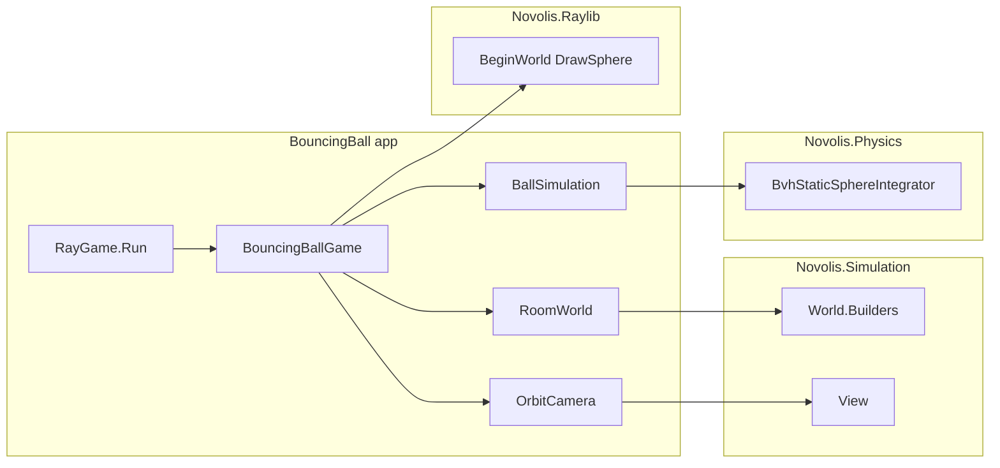

# Bouncing Ball dogfood project

## Goal

New app **`BouncingBall`** in [`novolis-dogfooding`](d:\novolis\novolis-dogfooding) that:

- Uses **Jam `.Game` pattern**: thin `Program.cs` + `Game/*Game.cs` with `RayGame.Run(..., initialize, update)` (same shape as [DoomLite3D/Program.cs](d:\novolis\novolis-dogfooding\apps\DoomLite3D\Program.cs) and [XFighter](d:\novolis\novolis-raylib\samples\XFighter\Program.cs)).
- Dogfoods **Simulation** via occupancy grid → [`OccupancyColumnMeshBuilder.FromWallGrid`](d:\novolis\novolis-simulation\src\Novolis.Simulation.World.Builders\OccupancyColumnMeshBuilder.cs) + [`YawPitchController`](d:\novolis\novolis-simulation\src\Novolis.Simulation.View\YawPitchController.cs) (orbit camera).
- Wires **Physics** at the app layer: [`BvhStaticSphereIntegrator`](d:\novolis\novolis-physics\src\Novolis.Physics.Collision.Simple\BvhStaticSphereIntegrator.cs) (pattern from [`BouncingBallCollisionTests`](d:\novolis\novolis-physics\tests\Novolis.Physics.Unit\BouncingBallCollisionTests.cs)).
- Consumes libraries **only via local NuGet** (`PackageReference`, versions from [`Directory.Packages.props`](d:\novolis\novolis-dogfooding\Directory.Packages.props)).
- **Validation**: run the app and observe continuous bouncing (no unit test required unless you want CI smoke later).



---

## Phase 0 — Refresh local NuGet feed (before coding)

Per [local-nuget-development.md](d:\novolis\novolis-governance\docs\local-nuget-development.md):

```powershell
cd d:\novolis
.\novolis-governance\scripts\verify-stack-boundaries.ps1   # optional but recommended
.\scripts\pack-novolis-local.ps1
```

Verify `d:\novolis\artifacts\nuget-local` contains at least:

- `Novolis.Math.Arrays`, `Novolis.Math.Geometry` @ `0.3.0-local`
- `Novolis.Physics.Collision.Simple`, `Novolis.Physics.Numerics`, `Novolis.Physics.Abstractions` @ `0.3.0-local`
- `Novolis.Simulation.World.Builders`, `Novolis.Simulation.View` @ `0.3.0-local`
- `Novolis.Raylib` @ `0.3.0-local`

Then:

```powershell
cd d:\novolis\novolis-dogfooding
dotnet restore Novolis.Dogfooding.slnx
```

If restore fails (stale/missing packages), re-run pack and restore.

---

## Phase 1 — New app scaffold

### Project layout

```
novolis-dogfooding/apps/BouncingBall/
  Program.cs
  BouncingBall.csproj
  Game/
    BouncingBallGame.cs    # Initialize + Update; owns subsystems
    RoomWorld.cs           # occupancy grid → mesh → BvhStaticWorld
    BallSimulation.cs      # sphere state + integrator step
    OrbitCamera.cs         # YawPitchController → Raylib Camera.Perspective
```

### Entry ([`Program.cs`](d:\novolis\novolis-dogfooding\apps\DoomLite3D\Program.cs) pattern)

```csharp
using BouncingBall.Game;
using Novolis.Raylib.Game;

var game = new BouncingBallGame();
RayGame.Run("Bouncing Ball", 960, 720, game.Initialize, game.Update);
```

### [`BouncingBall.csproj`](d:\novolis\novolis-dogfooding\apps\DoomLite3D\DoomLite3D.csproj) packages

| Package | Role |
|---------|------|
| `Novolis.Raylib` | Jam loop + 3D draw |
| `Novolis.Math.Arrays` | `DenseGrid<byte>` for room layout |
| `Novolis.Simulation.World.Builders` | `OccupancyColumnMeshBuilder` |
| `Novolis.Simulation.View` | `YawPitchController` |
| `Novolis.Physics.Collision.Simple` | `BvhStaticSphereIntegrator`, `BvhStaticWorld`, `StaticTriangleMesh` |

No `ProjectReference` to library repos. `Novolis.Physics.Numerics` comes transitively from Collision.Simple.

### Solution + docs

- Add project to [`Novolis.Dogfooding.slnx`](d:\novolis\novolis-dogfooding\Novolis.Dogfooding.slnx).
- Add row to apps table in [`docs/design.md`](d:\novolis\novolis-dogfooding\docs\design.md).

---

## Phase 2 — Simulation-first room (`RoomWorld`)

**Your choice (grid + caps):** perimeter defined as occupancy, walls from Simulation, floor/ceiling as small app glue.

### Occupancy grid

- e.g. `12×12` `DenseGrid<byte>`: `1` on border, `0` interior (same spirit as DoomLite maze walls).
- `cellSize = 1.0`, `wallHeight = 4.0`.

### Walls via Simulation

```csharp
var world = OccupancyColumnMeshBuilder.FromWallGrid(width, height, cells, cellSize, wallHeight);
```

This is the primary **Simulation** dogfood surface (DoomLite still uses grid + `PlanarOccupancy` only).

### Floor + ceiling (app-layer glue)

`OccupancyColumnMeshBuilder` extrudes **columns per wall cell**; it does not create a full 6-face box. In `RoomWorld.Build()`:

1. Build wall mesh from builder (or extract verts/tris if API only returns `BvhStaticWorld`—if needed, duplicate the builder’s quad helpers privately in `RoomWorld` for floor/ceiling quads at `y=0` and `y=roomHeight`).
2. Append floor + ceiling quads for interior bounds `(1..width-1) × (1..height-1)` in world meters.
3. Construct one `StaticTriangleMesh` → `BvhStaticWorld`.

Keep glue **minimal** (~40 lines, no new platform APIs).

### Interior bounds for physics

Map grid to world AABB, e.g. interior `(1, 0.5, 1)` to `(width-1, wallHeight-0.5, height-1)` in meters, matching column placement.

---

## Phase 3 — Ball simulation (Physics at app layer)

`BallSimulation` holds `Vector3` position/velocity, `float` radius (~0.22, matching physics tests).

Per frame (fixed sub-steps for stability, e.g. 4× `dt/4`):

```csharp
BvhStaticSphereIntegrator.AdvanceOneStep(
    world, ref pos, ref vel, radius, subDt, normalRestitution: 0.95f);
```

- Initial state: center of room, velocity like `(2.5, -2.0, 1.8)` (non-axis-aligned, avoids grazing degeneracy from tests).
- No gravity (matches elastic closed-box tests); ball stays airborne and bounces indefinitely.

**Reset**: `R` key re-seeds position/velocity (jam-friendly, like XFighter).

---

## Phase 4 — View + Raylib render (`OrbitCamera` + `BouncingBallGame`)

### Orbit camera (Simulation.View)

`OrbitCamera` wraps `YawPitchController`:

- **Target** = ball position.
- **Eye** = target + offset from yaw/pitch and orbit distance (~8–12 m).
- Mouse drag adjusts yaw/pitch via `AddLookDelta`.
- `BuildRaylibCamera()` → `Camera.Perspective(eye, target, Vector3.UnitY, 60f)` (same bridge pattern as [`PlayerController.BuildRaylibCamera`](d:\novolis\novolis-dogfooding\apps\DoomLite3D\Game\PlayerController.cs)).

### Frame loop (`BouncingBallGame.Update`)

1. Input: mouse look, `R` reset, `Esc` exits via default shell behavior.
2. `BallSimulation.Step(ctx.DeltaSeconds)`.
3. `OrbitCamera.Follow(ball.Position)`.
4. `ctx.Clear(dark background)`.
5. `ctx.BeginWorld(camera)`.
6. Draw ball: `ctx.DrawGlowSphere` + `ctx.DrawGlowSphereWires`.
7. Optional: draw wall columns as wireframe cubes at occupied grid cells (visualizes occupancy without parsing BVH).
8. `ctx.EndWorld()`.
9. HUD text: speed, reflection hint, controls (`R` reset).

---

## Phase 5 — Validation (acceptance)

```powershell
cd d:\novolis\novolis-dogfooding
dotnet build apps/BouncingBall/BouncingBall.csproj -c Release
dotnet run --project apps/BouncingBall/BouncingBall.csproj -c Release --no-build
```

**Pass criteria:**

- Window opens; sphere moves and bounces off walls for 30+ seconds without escaping the room.
- Mouse orbit works; `R` resets motion.

**Headless smoke (optional):** `NOVOLIS_RAYLIB_HEADLESS=1` exits cleanly (CI-friendly later; not required for initial validation).

**CI:** Existing [`.github/workflows/ci.yml`](d:\novolis\novolis-dogfooding\.github\workflows\ci.yml) will build the new project once it is in the solution (pack step already covers math/physics/simulation/raylib).

---

## Boundaries (do not violate)

- **No** `Novolis.Simulation` ↔ `Novolis.Raylib` package references ([simulation-layer-policy.md](d:\novolis\novolis-governance\docs\simulation-layer-policy.md)).
- **No** `PlanarAgent` / `PlanarOccupancy` unless we add a secondary 2D mode—out of scope for this 3D bouncing ball.
- **No** new platform APIs in simulation/physics repos for this task; room caps stay in app `RoomWorld`.

---

## Files to touch (summary)

| File | Change |
|------|--------|
| `novolis-dogfooding/apps/BouncingBall/**` | New app (5–6 files) |
| `novolis-dogfooding/Novolis.Dogfooding.slnx` | Add project |
| `novolis-dogfooding/docs/design.md` | Document app + packages |

No changes to library repos unless pack versions drift (then re-pack only).

