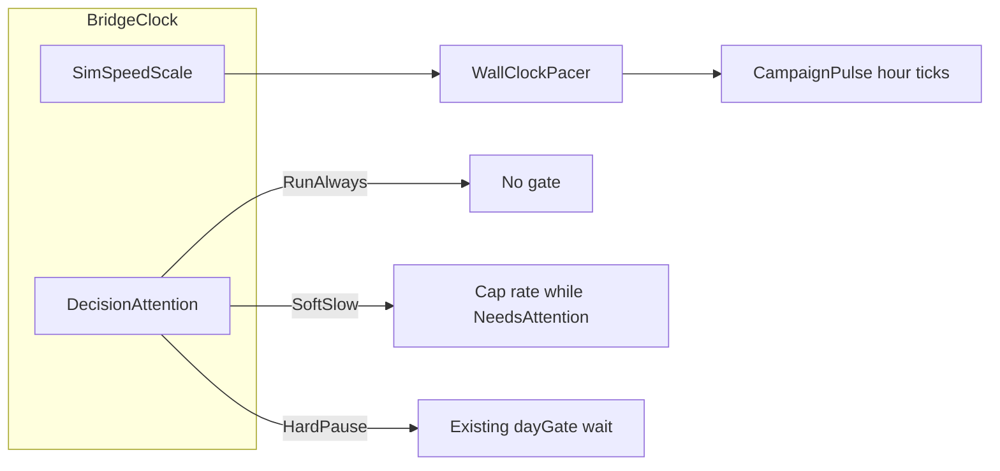
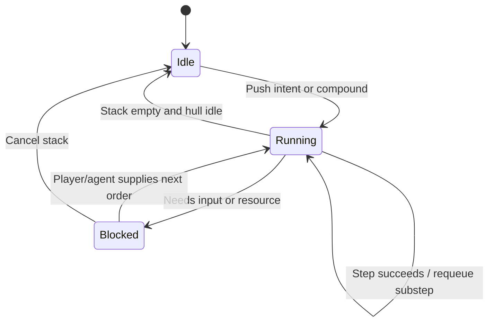

# Captain bridge: clock, map marker, action stacks

## Current baseline

- Time runs at **max CPU** in 24h outer pulses of 1h ticks ([`CampaignRunner.LiveSession.RunAsync`](novolis-apps/src/SinsOfACapitalismTycoon/Universe/CampaignRunner.cs) + [`CampaignPulse`](novolis-apps/src/SinsOfACapitalismTycoon/Universe/CampaignPulse.cs)). No wall-clock pacing.
- Pause policy is [`CaptainPauseMode`](novolis-apps/src/SinsOfACapitalismTycoon/Universe/Player/PlayerControlState.cs): player default is **`UntilDecision`** (hard gate). UI: Step / Continue / To horizon / Pause next day only.
- Orders already FIFO in [`PlayerOrderQueue`](novolis-apps/src/SinsOfACapitalismTycoon/Universe/Player/PlayerOrderQueue.cs); agent drains **one per tick**. No named multi-step SM; bunker/lift requeues the same verb.
- Map ([`StarMapControl`](novolis-avalonia/src/Novolis.Avalonia.StarMap/StarMapControl.cs)): hubs + route highlight; **no** ship marker. Position is voyage text + hub-level `CurrentHubId`.

## 1. Simulation speed + decision attention

**Model (bridge-owned, exposed on snapshot + session commands):**

- **`DecisionAttention`** (replace sticky misuse of Continue/Resume as the only policy):
  - `RunAlways` — **default**: never hard-pause for dock decisions; time flows at selected speed; stack stays fillable.
  - `SoftSlow` — while `NeedsPlayerDecision()` (or non-empty *blocking* stack), multiply speed by a fixed factor (e.g. 0.1×) instead of blocking.
  - `HardPause` — today’s `UntilDecision` gate (Continue/Step wake).
- Keep `EveryDay` / Step 1d / Pause-next-day as **one-shot** overlays that restore to the sticky `DecisionAttention` after the wait (same pattern as today restoring `UntilDecision`).
- **`SimSpeedScale`**: continuous control mapped to wall delay between sim hours (or between outer day pulses at the fast end):
  - Slow end: ~**1 real minute ≈ 1 game hour** → ~60s delay per hour tick (or batch with equivalent average).
  - Fast end: **no delay** — current CPU max; outer pulse remains ~1 game day per pulse (already `hoursPerPulse = 24`).
  - UI: slider + presets (Crawl / Play / Fast / Max). Persist in bridge prefs for the process; expose via HTTP (`setClock` / snapshot fields) so agents can set speed without UI.
- Implement pacing in `LiveSession.RunAsync` **between** hour/day steps with cancellable delay; **do not** sleep inside `sim.AdvanceAsync`. When `HardPause` waits on `_dayGate`, cancel pending pace delays.
- Invert player ctor default: `DecisionAttention = RunAlways` (not `UntilDecision`). “To horizon” remains `PauseMode.Never` / attention ignored until complete.
- Avalonia: replace/augment transport strip with **Attention** control (3-way) + **Speed** slider; keep Step/Continue for HardPause and one-shot Step.

**Primary files:** [`CampaignRunner.cs`](novolis-apps/src/SinsOfACapitalismTycoon/Universe/CampaignRunner.cs), [`PlayerControlState.cs`](novolis-apps/src/SinsOfACapitalismTycoon/Universe/Player/PlayerControlState.cs), [`CaptainBridgeService.cs`](novolis-apps/src/SinsOfACapitalismTycoon/Universe/CaptainBridgeService.cs), [`MainWindow.cs`](novolis-apps/src/SinsOfACapitalismTycoon/Ui/MainWindow.cs), session DTOs in `Novolis.Game.Session`.

## 2. You-are-here map marker (incl. transit)

- Extend star-map model with an explicit ship pose, separate from `SelectedId`:
  - Docked: marker on `CurrentSystemId`.
  - In transit: interpolate along the **current corridor** using shipment progress (`LegIndex`, `SegmentHoursRemaining` / `LegHoursTotal` when available; else sit on `CurrentHubId`).
- [`StarMapControl`](novolis-avalonia/src/Novolis.Avalonia.StarMap/StarMapControl.cs): add `ShipWorldX/Y` (or `ShipMarker` point) + distinct draw (not selection yellow). Selection stays for travel/job target.
- [`CaptainBridgeModel`](novolis-apps/src/SinsOfACapitalismTycoon/Ui/CaptainBridgeModel.cs): compute pose each capture; always refresh marker (not only when a hub is selected). Detail pane can still say HERE when selected hub matches dock; marker is authoritative for “we are”.

## 3. Per-actor intent stack + state machine

**Scope for this pass:** Calypso/James as the first `ICaptainActor` (HTTP + UI). Scaffold the interface so later AI captains can plug in; do not rewrite all economy firm agents yet.

- Introduce **`CaptainIntentStack`** on top of (or replacing the public face of) `PlayerOrderQueue`:
  - Ordered stack of **intents** (atomic `PlayerOrder` or **compound** recipes).
  - Compound examples: `PrepareAndDepart` → ensure premium (if required) → elective overhaul (if flagged) → bunker → lift cargo → `PlanShipment`/`DepartManifest`; `Reposition` → bunker → `PlanReposition`.
  - Each step reports status (`Pending`, `Active`, `WaitingFuel`, `WaitingCargo`, `Failed`, `Done`) into snapshot / bridge panel.
  - Drain policy: still **one atomic order per agent tick**, but the SM owns expansion/requeue instead of ad-hoc logic only inside `DepartManifest`/`TravelTo`.
- UI + session: “stack” strip listing pending steps; enqueue without requiring HardPause; **Cancel stack** clears queue + aborts compound. Bridge buttons push onto the stack (multi-decision) rather than only firing one-shot and hoping Continue.
- Move bunker/lift gates from opaque requeues into named stack steps (fixes false “depart ok” UX by surfacing `WaitingCargo` / `WaitingFuel`).
- `NeedsPlayerDecision()` under `HardPause`/`SoftSlow`: true when hull idle **and** (stack empty needing a new plan, **or** stack `Blocked` needing input)—not merely “orders count == 0”.

**Primary files:** new types under `Universe/Player/` (e.g. `CaptainIntentStack.cs`, `CaptainIntentKind.cs`), [`PlayerTrampAgent.cs`](novolis-apps/src/SinsOfACapitalismTycoon/Universe/Player/PlayerTrampAgent.cs), [`CaptainActions.cs`](novolis-apps/src/SinsOfACapitalismTycoon/Universe/Player/CaptainActions.cs), bridge snapshot/actions, MainWindow stack panel.

## 4. Hygiene while touching this path

- Remove session `#region agent log` / `debug-cc3657` instrumentation from [`PlayerTrampAgent`](novolis-apps/src/SinsOfACapitalismTycoon/Universe/Player/PlayerTrampAgent.cs) / [`StubPhases`](novolis-economy/src/Novolis.Economy.Simulation/Phases/StubPhases.cs) once this work ships (or as first commit of the implementation branch).
- Keep cargo-lift-before-`PlanShipment` and dock-stock room gating (already proven); express them as stack steps.

## Acceptance

- Default launch: time runs at selected speed with **no** decision hard-pause; slider moves from crawl (~1 real min / game hour) to max CPU (~day per pulse).
- Attention SoftSlow / HardPause behave as above; Step 1d still works.
- Star map always shows ship marker docked or along current leg.
- Captain can queue e.g. premium → fuel/lift → depart as a visible stack; HTTP agent can push the same sequence; progress/failure visible without false Ok.

