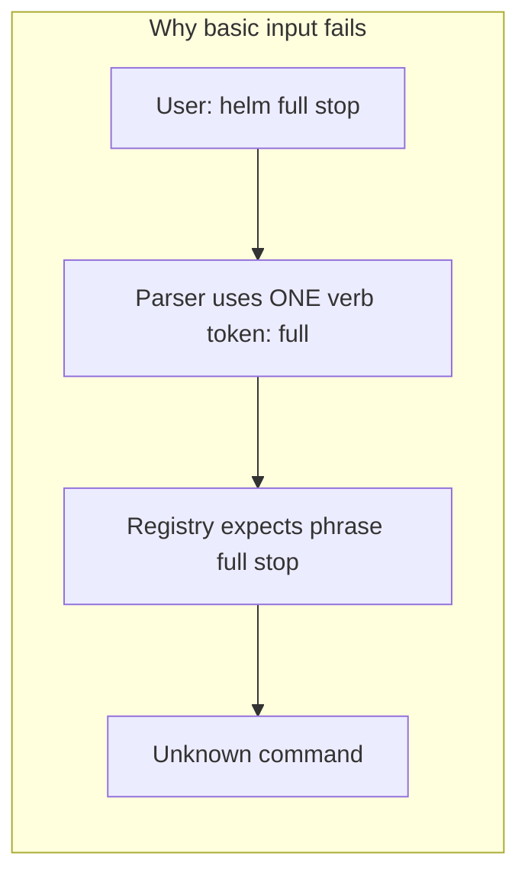

# Bridge Commander: parser, context, and UI cleanup

## Problems (from screenshot + code review)



| Issue | Cause |
|-------|--------|
| `helm full stop`, `tactical lock target`, `engineering divert shields` fail | [`CommandParser`](d:\novolis\novolis-commands\src\Novolis.Commands.Engine\CommandParser.cs) matches **one** verb token; registry lists `["full","stop"]` as **alternatives**, not a phrase |
| `help` works in log but status shows `Unknown command` | Likely **stale status** + Hex1b not re-rendering after fire-and-forget `SubmitPromptAsync` ([`BridgeHexApp.Transmit`](d:\novolis\novolis-dogfooding\apps\BridgeCommander\Bridge\BridgeHexApp.cs)) |
| Chaotic log | Full help text (40+ lines) dumped into command log; static Help panel duplicates it |
| Station buttons | User wants **explicit prefix only** (`helm`, `tactical`, aliases `weaps`/`pilot`) — not a separate “selected station” UI |

## Target behavior

**Every order must start with a context prefix** (station name or alias). No implicit active station.

| Input | Result |
|-------|--------|
| `helm heading 270` | Parse → `helm.set-heading`, heading 270 |
| `pilot heading 180` | `pilot` alias → helm context, same command |
| `tactical lock target` | Parse → `tactical.lock-target` |
| `weaps fire` | `weaps` alias → tactical, fire weapons |
| `help` / `help tactical` | Built-in or system help (not unknown) |
| `heading 270` (no prefix) | `UnknownContext` with hint: “Prefix with station (helm, tactical, weaps…)” |

---

## Part 1 — Engine: multi-word verbs (novolis-commands)

**Change** [`CommandDefinition`](d:\novolis\novolis-commands\src\Novolis.Commands.Engine\CommandDefinition.cs): treat each entry in `Verbs` as a **phrase** (space-separated), not a single-token alternative.

**Change** [`CommandParser`](d:\novolis\novolis-commands\src\Novolis.Commands.Engine\CommandParser.cs):

- After context resolution, **longest-prefix match** verb phrases against remaining tokens (e.g. `full stop`, `lock target`, `set heading`, `fire weapons`, `divert shields`).
- Argument tokens = everything after the matched phrase.
- Keep single-token verbs (`fire`, `hail`, `repair`) working.

**Tests** in [`Novolis.Commands.Engine.Tests`](d:\novolis\novolis-commands\tests\Novolis.Commands.Engine.Tests): add cases for multi-word phrases and regression for existing single-token verbs.

---

## Part 2 — Engine: explicit context prefixes + aliases

**Change** [`ICommandContextResolver<TContext>`](d:\novolis\novolis-commands\src\Novolis.Commands.Engine\ICommandContextResolver.cs):

```csharp
IReadOnlyDictionary<string, string> GetContextAliases(TContext context);
// existing GetAliases → rename/clarify as verb aliases only
```

**Change** [`CommandEngine`](d:\novolis\novolis-commands\src\Novolis.Commands.Engine\CommandEngine.cs):

1. First token → resolve via `GetContextAliases`, then check registry context words.
2. If missing/unknown → `ParseFailureCode.UnknownContext` with message listing valid contexts/aliases.
3. **Stop using** `GetActiveContextWord` for parse filtering (pass `null` as `activeContextWord` to parser, or remove that branch in v0.1 parser).

**Built-in** [`BuiltInCommandMatcher`](d:\novolis\novolis-commands\src\Novolis.Commands.Engine\BuiltInCommandMatcher.cs) + [`BuiltInCommands`](d:\novolis\novolis-commands\src\Novolis.Commands.Abstractions\BuiltInCommands.cs):

- Add `system.help` for exact `help` and `help <topic>` (topic in `Arguments["topic"]`).
- Remove app-only help bypass in Bridge once processor handles it.

---

## Part 3 — Bridge: expanded command tree

Rewrite [`BridgeCommandRegistry`](d:\novolis\novolis-dogfooding\apps\BridgeCommander\Bridge\BridgeCommandRegistry.cs) with **phrase verbs**:

| Command | Prefix | Phrase(s) | Args |
|---------|--------|-----------|------|
| `helm.set-heading` | helm | `set heading`, `heading` | int heading |
| `helm.full-stop` | helm | `full stop`, `all stop` | — |
| `helm.set-speed` | helm | `set warp`, `warp` | int warp |
| `tactical.lock-target` | tactical | `lock target`, `target lock` | — |
| `tactical.fire-weapons` | tactical | `fire`, `fire weapons` | — |
| `engineering.divert-shields` | engineering | `divert shields`, `shields max` | — |
| `engineering.divert-weapons` | engineering | `divert weapons` | — |
| `engineering.repair` | engineering | `repair`, `damage control` | — |
| `nav.set-course` | nav | `set course`, `course` | string destination (multi-token) |
| `comms.hail` | comms | `hail`, `open channel` | — |
| `crew.dismiss-personnel` | admin | `fire` | — (ambiguity demo with tactical `fire`) |

**Context aliases** in [`BridgeContextResolver`](d:\novolis\novolis-dogfooding\apps\BridgeCommander\Bridge\BridgeContextResolver.cs):

| Alias | Context |
|-------|---------|
| `pilot`, `conn` | helm |
| `weaps`, `guns`, `tac` | tactical |
| `eng`, `damage` | engineering |
| `nav` | nav |
| `comms` | comms |

Remove verb aliases that tried to patch broken single-token parsing (`stop` → `full stop`, etc.).

**Processor** [`BridgeCommandProcessor`](d:\novolis\novolis-dogfooding\apps\BridgeCommander\Bridge\BridgeCommandProcessor.cs): handle `system.help` — set `BridgeState.HelpPanelLines` (new property), do not enqueue.

**State** [`BridgeState`](d:\novolis\novolis-dogfooding\apps\BridgeCommander\Bridge\BridgeState.cs):

- Remove `ActiveStation` (or stop exposing in UI).
- Add `HelpPanelLines` for dedicated help view.
- Log: one-line summary for help (`HELP help — opened reference panel`), not 40 log lines.

Delete [`BridgeHelp.TryGetHelpLines`](d:\novolis\novolis-dogfooding\apps\BridgeCommander\Bridge\BridgeHelp.cs) bypass from [`BridgeCommandService`](d:\novolis\novolis-dogfooding\apps\BridgeCommander\Bridge\BridgeCommandService.cs) once built-in help exists; keep `BridgeHelp` as content provider called from processor.

**Nav multi-word destination**: engine follow-up in same PR — if phrase matching leaves multiple arg tokens, join as destination string (`alpha centauri`).

---

## Part 4 — Hex1b UI: less chaos

Redesign [`BridgeHexApp`](d:\novolis\novolis-dogfooding\apps\BridgeCommander\Bridge\BridgeHexApp.cs):

```text
┌─ Status (ship + last status line only) ─────────────┐
├─ Command log (compact: PARSE/DONE/FAIL one-liners) ┤  ← no help walls
├─ Help panel (state.HelpPanelLines, scrollable)     ┤  ← replaces static Help box
├─ Order: [TextBox] [Transmit]                       ┤
└─ InfoBar: prefix required | help | belay | Ctrl+C  ┘
```

- **Remove** station button row and `Active station:` label.
- **Remove** static Help border (content moves to Help panel).
- **Transmit**: `await commands.SubmitPromptAsync(...)` so status/log/help panel refresh reliably.
- **Log formatting** [`BridgeState.FormatHistory`](d:\novolis\novolis-dogfooding\apps\BridgeCommander\Bridge\BridgeState.cs): only expand details for `ParseFailure` (candidates), not Help.

Update [`BridgeHelp`](d:\novolis\novolis-dogfooding\apps\BridgeCommander\Bridge\BridgeHelp.cs) copy to say **prefix required** (no “active station” / buttons).

---

## Part 5 — Verification

```powershell
cd d:\novolis\novolis-commands && dotnet test
cd d:\novolis\novolis-dogfooding && dotnet run --project apps/BridgeCommander
```

Manual checklist:

- `helm heading 270`, `pilot warp 6`, `tactical lock target`, `weaps fire`, `engineering divert shields`
- `heading 270` → clear UnknownContext hint
- `help`, `help tactical` → help panel updates, log stays short
- `belay that` during long engineering repair cancels
- `fire` without prefix → ambiguity (admin vs tactical)

---

## Scope boundaries

- **In scope**: engine phrase matching, context aliases, built-in help, Bridge registry/UI, tests.
- **Out of scope**: NLP, fuzzy match, confirmation flows, publishing new NuGet until engine changes are merged in `novolis-commands`.

