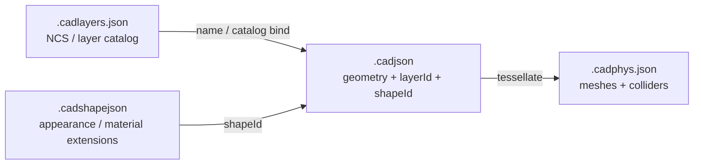

# CAD layer catalog + shape companion schemas

## Default scope

**Governance only:** schemas, docs, and examples under [`novolis-governance/schemas/cad/`](novolis-governance/schemas/cad/) + update [`novolis-governance/docs/cadjson.md`](novolis-governance/docs/cadjson.md). No Draft Studio load/save, no `.archijson`, no ACadSharp.

## Roles (keep `.cadjson` lean)



| Format | Extension | Role |
|--------|-----------|------|
| `novolis.cad` | `.cadjson` | Analytic geometry + instance ids only (existing) |
| `novolis.cad.layers` | `.cadlayers.json` | Reusable layer catalog (NCS house set first) |
| `novolis.cad.shape` | `.cadshapejson` | Shared shape metadata: fill/stroke + extension namespaces (materials, later arch) |
| `novolis.cad.phys` | `.cadphys.json` | Unchanged — tessellation sidecar |

Same rules as today: no CadKit; apps own DTOs; UTF-8 camelCase; `format` + `schemaVersion: 1`; UUID ids; SI meters / radians where lengths apply.

## 1. `novolis.cad.layers` (NCS companion)

New schema: [`novolis-governance/schemas/cad/novolis.cad.layers.schema.json`](novolis-governance/schemas/cad/novolis.cad.layers.schema.json)

Top-level:

- `format: "novolis.cad.layers"`
- `standard`: `"NCS" | "ISO13567" | "custom"`
- `standardVersion` (string, e.g. `"6"` for NCS v6)
- `name`, `generator`, timestamps (same pattern as cad/phys)
- `layers[]` entries:

```json
{
  "id": "uuid",
  "name": "A-WALL-FULL",
  "discipline": "A",
  "major": "WALL",
  "minor": ["FULL"],
  "status": null,
  "description": "Full-height walls",
  "defaultColor": [0.2, 0.2, 0.2],
  "defaultLineWeightMm": 0.5,
  "defaultLinetype": "Continuous",
  "plot": true,
  "properties": {}
}
```

Ship a starter catalog example (not the full NCS book): house floor-plan subset — `A-WALL-FULL`, `A-WALL-PATT`, `A-DOOR`, `A-GLAZ`, `A-AREA`, `A-ANNO-TEXT`, `A-ANNO-DIMS`, `S-COLS`, `S-BEAM`, `S-GRID`, `A-FLOR`, `G-ANNO-TTLB` — at [`schemas/cad/examples/ncs-house.cadlayers.json`](novolis-governance/schemas/cad/examples/ncs-house.cadlayers.json).

Document that `.archijson` (later) and DXF export will *project* onto these names; this file is the catalog, not the building model.

## 2. `novolis.cad.shape` (appearance + extensions)

New schema: [`novolis-governance/schemas/cad/novolis.cad.shape.schema.json`](novolis-governance/schemas/cad/novolis.cad.shape.schema.json)

Top-level:

- `format: "novolis.cad.shape"`
- optional `baseDocument` (relative path to `.cadjson`, same sidecar pattern as phys)
- `shapes[]`:

```json
{
  "id": "uuid",
  "name": "filled-blue",
  "extensions": {
    "appearance": {
      "fill": { "enabled": true, "color": [0.15, 0.35, 0.85] },
      "stroke": { "color": [0.05, 0.1, 0.3], "lineWeightMm": 0.25, "linetype": "Continuous" },
      "colorIndex": 5
    },
    "material": {
      "preset": "painted-metal",
      "albedo": [0.15, 0.35, 0.85],
      "roughness": 0.6,
      "metalness": 0.1
    }
  },
  "properties": {}
}
```

**Extension model (concrete):**

- `extensions` is an object of named namespaces; unknown namespaces allowed (forward-compatible) but known ones validated via `$defs`.
- v1 known namespaces: `appearance`, `material`.
- Do **not** invent `.cadmatjson` yet — materials live under `extensions.material` until a second consumer needs a split.
- Geometry never lives here (no box extents); a shape only answers “how this instance looks / what material preset it uses.”

Example: [`schemas/cad/examples/hull.cadshapejson`](novolis-governance/schemas/cad/examples/hull.cadshapejson) binding the hull box to a filled color + material preset.

## 3. Additive hooks on `novolis.cad` (non-breaking)

Update [`novolis.cad.schema.json`](novolis-governance/schemas/cad/novolis.cad.schema.json) **without** bumping `schemaVersion` (optional fields only):

- Document-level optional `layersDocument` (relative path to `.cadlayers.json`) and optional `shapesDocument` (relative path to `.cadshapejson`).
- On `entityBase`: optional `shapeId` (UUID → entry in shapes document or inlined shapes — see below).
- Keep existing entity `style` / `color` / `material` as **local overrides**; resolution order documented as: shape extensions → entity fields win if set. Prefer `shapeId` for shared looks to avoid cadjson bloat.

Optional inline escape hatch on cad document (mirrors phys inlining): `shapes` array allowed in `.cadjson` for single-file sketches; sidecar preferred when shapes are shared across docs. Same for small projects that do not want a separate layers file: keep authoring `layers[]` as today; `layersDocument` only when using a catalog.

Layer binding: existing `layers[].name` should match catalog names when `layersDocument` is set (e.g. `"A-WALL-FULL"`). Optional `catalogId` on a document layer pointing at the companion layer UUID — include if cheap; otherwise name-match is enough for v1.

## 4. Docs

Expand [`novolis-governance/docs/cadjson.md`](novolis-governance/docs/cadjson.md):

- Table rows for layers + shape companions
- Pipeline diagram including both sidecars
- Resolution rules for shape vs entity style
- Pointer: NCS house catalog is a template, not a license to paste the entire NCS PDF
- Explicit deferral: `.archijson` / Wall-Opening-Space kinds come later and will *reference* these catalogs

Update hull example: add `shapeId` + companion shape file; keep geometry in [`hull.cadjson`](novolis-governance/schemas/cad/examples/hull.cadjson).

## 5. Out of scope (this pass)

- Draft Studio DTO/load/save for the new fields
- `.archijson` / building semantics
- Full NCS layer list, ISO 13567 full set
- DXF/DWG / ACadSharp
- Separate materials package or CadKit

## Implementation order

1. Author `novolis.cad.layers` + `novolis.cad.shape` schemas
2. Patch `novolis.cad` with optional document/entity hooks
3. Examples: `ncs-house.cadlayers.json`, `hull.cadshapejson`, lightly update `hull.cadjson`
4. Rewrite `cadjson.md` pipeline + conventions

