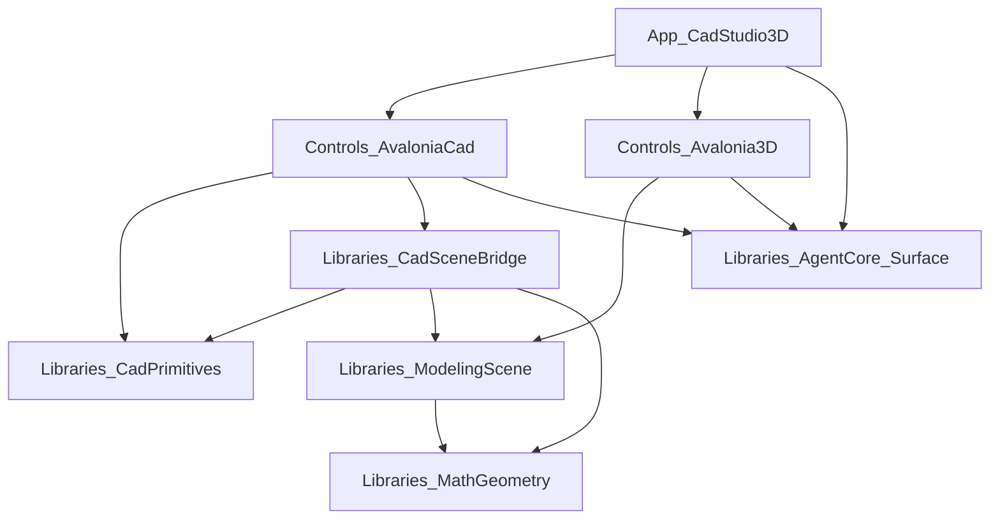

# Novolis CAD Studio 3D — Implementation Plan

## Product definition (locked)

**Novolis CAD Studio 3D** is one app for beginner/intermediate **2D and 3D technical CAD drafting**, appearance (sides/materials), **limited** mesh modelling, staging (lights/cameras), and lit PNG render.

**Agent Surface (locked):** LLM interaction **mirrors user interaction natively**. Every mutation or mode change a human can perform in the Studio UI is available as a catalogued session `Execute` action (Cad and/or Scene). UI chrome is a thin client over the same `IAgentHost` / session services the LLM uses — not a parallel code path. Perception for the LLM uses the same dumps/snapshots a power user would (plan/model/viewport PNGs, document snapshot, `describescene` / Cad snapshot fields).

Architecture rule (no exceptions in this plan):



- **App** never contains domain algorithms (tessellate, bake, assign rules); App **does** attach Agent transports for both Cad and Scene sessions.
- **Controls** never write `.nov3djson` / `.cadjson` formats by hand — they call Libraries.
- **Controls** never mutate the document only in UI event handlers — they call `session.Execute(...)` (or a shared command helper that does) so agent and UI stay identical.
- **Libraries** never reference Avalonia or app hosts.
- **Agent catalogs** are exhaustive for product-facing tools: if a toolbar button or property edit exists, an `[AgentAction]` / `CadSessionActionIds` / `SceneSessionActionIds` entry exists with the same parameters.

**App home (locked):** Evolve [`novolis-apps/src/DraftStudio`](d:\novolis\novolis-apps\src\DraftStudio) into the product (display name **Novolis CAD Studio 3D**). SceneLab remains dogfood for `Avalonia.3D` only.

**Document truth (locked):** Authoring document stays `.cadjson` (`CadDocument`). Stage/render/mesh-edit work on a derived `.nov3djson` (`SceneDocument`) produced by the bridge. Round-trip Scene→Cad is **out of scope** for v1.

---

## Phase 0 — Library foundation: `Novolis.Cad.SceneBridge`

**Repo:** [`novolis-cad`](d:\novolis\novolis-cad)  
**New packable project:** `src/Novolis.Cad.SceneBridge/Novolis.Cad.SceneBridge.csproj`  
**PackageId:** `Novolis.Cad.SceneBridge`  
**Deps:** `Novolis.Cad.Primitives`, `Novolis.Modeling.Scene`, `Novolis.Math.Geometry` only.

### 0.1 Move Avalonia-free tessellation into the library

Today [`CadSolidTessellator`](d:\novolis\novolis-avalonia\src\Novolis.Avalonia.Cad\Evaluation\CadSolidTessellator.cs) already depends only on Cad.Primitives + Math.Geometry but lives under Avalonia.Cad.

- Move type to `Novolis.Cad.SceneBridge.Tessellation.CadSolidTessellator` (same API: `TryTessellate(CadEntity)` → `EditableMesh?`).
- Keep a thin type-forward shim in Avalonia.Cad (`using CadSolidTessellator = Novolis.Cad.SceneBridge...` or one-line wrappers) so existing `CadModelEvaluator` / phys paths compile without behavior change.
- Unit tests in `novolis-cad/tests/Novolis.Cad.Unit` for box/sphere/cylinder/stored mesh (golden vertex counts + AABB).

### 0.2 Wall / space tessellation (3D CAD → mesh)

Add `CadWallTessellator` / `CadSpaceTessellator` in the same package:

- **Wall:** extrude `Points` (or A–B segment) by `Thickness` / `Height` / `Deck` using existing helpers in [`CadDocument.cs`](d:\novolis\novolis-cad\src\Novolis.Cad.Primitives\CadDocument.cs) / `CadVec` / `OpeningDerivation` — produce closed `EditableMesh` slabs (openings cut where `OpeningDerivation` already defines them).
- **Space:** floor (+ optional ceiling slab) from footprint `Points` at deck elevation.
- Skip unknown kinds (return null); never throw on unsupported entities.

### 0.3 Bridge API (complete, not a stub)

```csharp
public static class CadSceneBridge
{
  public static SceneDocument ToSceneDocument(CadDocument cad, CadSceneBridgeOptions? options = null);
  public static void SaveNov3dJson(CadDocument cad, string path, CadSceneBridgeOptions? options = null);
}
```

Behavior:

1. `SceneDocument.CreateEmpty()`; name from Cad document name.
2. For each tessellatable entity (solids first pass types: box/sphere/cylinder/mesh; then wall/space): create `MeshNode`, `MeshEditBake.WriteBaked`, set transform identity (mesh already world-baked) or preserve Cad transform consistently — **pick world-baked verts** to match phys exporter mental model.
3. Materials: if `CadEntity.Material` is set, ensure a `MaterialNode` (color from material name lookup table or default albedo) and set `MeshNode.MaterialId`. Wall sides A/B: if `Sides.A/B.ShapeId` present, create/attach materials named by shape id (color from `.cadshapejson` when path provided in options; else distinct placeholder colors).
4. Copy Cad cameras/lights entities when kind is `camera`/`light` into Scene `CameraNode`/`LightNode` with best-effort field mapping (position, intensity, kind).
5. Add default Key/Fill/Rim only when `options.EnsureStudioLights` and scene has zero lights.
6. `SceneEvaluator.Save` for `SaveNov3dJson`.

**Tests:** Cad fixture with 1 box + 1 wall + 1 material string → SceneDocument with expected node counts; round-trip file load via `SceneEvaluator.Load`.

### 0.4 Platform wiring

- Regenerate package map / Platform slnx after adding the packable project ([`Generate-Platform-Slnx.ps1`](d:\novolis\novolis-governance\build\Generate-Platform-Slnx.ps1)).
- PackageReference only across repos; local iteration via `NovolisUseProjectReferences=true`.
- Publish `Novolis.Cad.SceneBridge` to GitHub Packages with the rest of novolis-cad (no local feeds).

---

## Phase 1 — Controls: Cad export + material assign + 2D/3D draft tools

**Repo:** [`novolis-avalonia/src/Novolis.Avalonia.Cad`](d:\novolis\novolis-avalonia\src\Novolis.Avalonia.Cad)

### 1.1 Session actions (complete implementations) — UI and LLM share these

Extend [`CadSessionActionIds`](d:\novolis\novolis-avalonia\src\Novolis.Avalonia.Cad\Session\CadSessionEndpoints.cs) + `CadSessionService.Execute`. **Every new UI control in this phase calls these actions** (no direct `CadDocument` mutation from click handlers except through Execute).

| ActionId | Behavior |
|----------|----------|
| `exportscene` | `CadSceneBridge.SaveNov3dJson(doc, path)`; path required (or default beside `.cadjson`) |
| `bridgescene` | In-memory `ToSceneDocument` result handed to App/Scene session (same as entering Model workspace) |
| `setmaterial` | `nodeId` + `material` string on entity |
| `setwallside` | `nodeId` + `side`=`A`\|`B` + `shapeId` (updates `CadWallSides`) |
| `addwall` | Creates wall entity from `points` JSON or A/B + thickness/height/deck |
| `extrudeprofile` | Closed polyline `points` + `height` → wall-or-solid entity (v1: create `wall` loop or `box` when rect) |
| `adddimension` | Store linear dim entity (`kind=dimension`, two points + offset) in CadDocument |
| `addline` / `addcircle` / `addrect` / `addspline` | Parametric create matching sketch tools (so LLMs need not drive pointer state) |
| `settool` / `setworkspace` / `setviewmode` / `setsnap` / `setgrid` | Already present — keep as the only way UI switches modes |
| `exportplanpng` / `exportmodelpng` / `exportpreviewpng` | Already present — primary LLM perception for Cad |

Wire each through `BuildActions()` with `Summary`/`Params` rich enough for LLM tool choice (human-readable summaries, required vs optional params). Enable/disable mirrors UI (e.g. `deleteselection` disabled with no selection).

### 1.2 UI Controls (no stub buttons; Execute-only)

- **Export Scene…** / **Bridge to Model** → `exportscene` / `bridgescene`.
- **Property panel** ([`CadPropertyPanel`](d:\novolis\novolis-avalonia\src\Novolis.Avalonia.Cad\Ui\CadPropertyPanel.cs)): editable Material / Side A/B → `setmaterial` / `setwallside`.
- **Tools:** `CadToolKind` Wall + Dimension; pointer completion commits via `addwall` / `adddimension` (LLM can skip pointer and call those directly).
- **Extrude:** UI → `extrudeprofile`.
- Sketch strip buttons for Line/Circle/Rect/Spline either set tool **or** expose “place with params” that maps to `add*`.

### 1.3 Tessellator consumers

Update Avalonia.Cad evaluation/phys to call `Novolis.Cad.SceneBridge` tessellators (remove duplicated geometry code after shim period).

### 1.4 Scene Controls: material bind + stage/render agent parity

In [`Novolis.Avalonia.3D`](d:\novolis\novolis-avalonia\src\Novolis.Avalonia.3D):

- Add `setmeshmaterial` (`nodeId` mesh + `materialId`).
- Ensure stage/render UI maps to session (or documented SceneRender session actions): `setactivecamera`, `matchviewport`, `addlight`, `addcamera`, `setlight`, `settransform`, plus **`openshaderender` / `saverenderpng` / `ensurestudiolights`** if today those are UI-only — promote them to `SceneSessionActionIds` so an LLM can finish the pipeline without clicking Render….
- Property inspector and Render chrome call Execute only.
- Keep `describescene`, `groundphrase`, `dumpviewport`, `dumpwindow`, `dumpscene` as LLM perception tools (already on Scene session).

---

## Phase 1.5 — Agent Surface parity (extensive, native mirror)

**Goal:** An LLM using Cad HTTP `:18775` and Scene HTTP `:18785` (plus TCP/MCP attach) can perform the same product workflows as a human in CadStudio3D without special “agent-only” APIs.

### Parity rule (enforced)

1. **Single write path:** Document mutations go through `CadSessionService.Execute` / `SceneSessionService.Execute`.
2. **Catalog completeness:** For every product toolbar/menu/property control shipped in Phases 1–2, there is a matching action id in the session catalog with params the LLM can fill without UI state (coordinates, ids, enums as strings).
3. **Pointer tools have parametric twins:** Interactive Wall/Line/Dimension tools remain for humans; `addwall` / `addline` / `adddimension` / etc. are the LLM-native equivalents (same resulting entities).
4. **Workspace/mode is agent-visible:** `setworkspace`, App-level Draft2D/Draft3D/Model/Stage switch exposed as Cad or App session actions (`setstudioworkspace` on Cad session or a thin App host action forwarded to both).
5. **Perception:** LLM can `snapshot` + export/dump PNGs after each step; Cad snapshot includes selection, workspace, tool, entity counts; Scene keeps `describescene` / dumps.
6. **Parity gate test:** Unit/integration test lists UI-backed action ids (source-generated or hand-maintained allowlist in Controls) and asserts `Actions()` returns each id with `Enabled` semantics documented. Fail CI if a chrome command invokes a private mutate helper not registered as an action.
7. **MCP / HTTP:** CadStudio3D attaches both `AgentSurface`s (same as today DraftStudio + SceneLab). Document the dual-port workflow in app README: Cad for draft/appearance/bridge; Scene for mesh/stage/render. No third protocol.

### LLM-native end-to-end script (also the smoke)

```text
Cad: new → setworkspace Cad → addrect → extrudeprofile → setmaterial → exportplanpng
Cad: exportscene / bridgescene
Scene: ensurestudiolights → setactivecamera → matchviewport → saverenderpng → dumpviewport
```

All steps are `Execute` calls; no UI required.

---

## Phase 2 — App: Novolis CAD Studio 3D host

**Repo:** [`novolis-apps/src/DraftStudio`](d:\novolis\novolis-apps\src\DraftStudio)

### 2.1 Product identity

- `ApplicationTitle` / window title / installer display name → **Novolis CAD Studio 3D**.
- Keep assembly name `DraftStudio` **or** rename to `CadStudio3D` in the same folder with InternalsVisibleTo/test project updates — **choose rename to `CadStudio3D`** for clarity; update `DraftStudio.Unit` → `CadStudio3D.Unit`, Inno packaging refs, and any installer scripts that mention Draft Studio.

### 2.2 Package references

Add (ProjectRef-friendly PackageReferences):

- `Novolis.Avalonia.3D`
- `Novolis.Modeling.Scene`
- `Novolis.Cad.SceneBridge`
- `Novolis.Agent.Core` / `Novolis.Agent.Surface` as required by Scene attach (same pattern as SceneLab)

### 2.3 Workspaces (one shell)

Extend host UI beyond Cad’s Cad/Modeling/Preview triad with an App-level mode switcher:

| Workspace | Hosts |
|-----------|--------|
| **Draft 2D** | Existing `CadEditorSurface` plan focus (`CadWorkspace.Cad` + draft viewport) |
| **Draft 3D** | Same surface with model/orbit emphasis (`setviewmode` / Raylib model) |
| **Model** | After export or in-memory bridge: `SceneEditorSurface` for limited mesh ops |
| **Stage / Render** | Same `SceneEditorSurface` + open Render window / Studio lights |

Implementation detail:

- Single `MainWindow` owns `CadSessionService` + `SceneSessionService`.
- **Sync rule:** On entering Model/Stage, if Cad doc dirty or no scene loaded, run `CadSceneBridge.ToSceneDocument` into `SceneSessionService.ReplaceDocument` (in-memory). **Export Scene…** also writes `.nov3djson` for persistence.
- Cad remains source of truth until user explicitly Saves Cad; Scene edits after bridge are mesh-side only (document in status bar which document is active).

### 2.4 Agent surfaces (extensive attach)

- Attach **Cad** `AgentSurface` on `:18775`/`:18776` for the full Cad action catalog (draft 2D/3D, appearance, bridge/export, Cad dumps).
- Attach **Scene** `AgentSurface` on `:18785`/`:18786` whenever the Scene session exists (mesh, lights, cameras, render/save, Scene dumps).
- App README documents: “LLM uses the same actions as the UI”; include the Phase 1.5 script and port map.
- App does not invent a third protocol; MCP tools forward to these catalogs only.

### 2.5 Smoke (complete path, automated — agent-first)

Primary smoke is **HTTP/session Execute**, not UI automation:

1. Cad: `new` → `addrect` → `extrudeprofile` → `setmaterial` → `exportplanpng`  
2. Cad: `exportscene` (or `bridgescene` + Scene `ReplaceDocument` via host test hook)  
3. Scene: `ensurestudiolights` → camera/frame actions → `saverenderpng` / `dumpviewport`  
4. Assert PNGs exist and byte length &gt; threshold; assert `Actions()` contains the parity allowlist  

Library-only unit tests remain for `CadSceneBridge` without transports.

---

## Phase 3 — Hardening and governance

- Update [`novolis-governance/docs/cadjson.md`](d:\novolis\novolis-governance\docs\cadjson.md): Cad→`Novolis.Cad.SceneBridge`→`.nov3djson` pipeline.
- Add short **Agent parity** note under Cad Studio / Avalonia.Cad + Avalonia.3D READMEs: UI↔Execute rule, dual ports, example LLM script.
- Update canvas checklist when phases land.
- `gpr-health-check` / `verify-nuget-only` / `verify-project-ref-mode -SkipBuild` before claiming done.
- Publish order: `Cad.SceneBridge` → Avalonia.Cad / Avalonia.3D → CadStudio3D app.

---

## Explicit non-goals (v1)

- DWG/DXF, paperspace, full dim styles  
- Scene→Cad round-trip  
- Path-trace as default render  
- Sculpt, UV, animation timeline, MoGraph effectors  
- Merging Cad and Scene into one file format  
- Putting tessellation or bridge code in the App project  
- Agent-only “magic” actions that have no UI counterpart (or UI-only mutations with no agent counterpart)  
- Embedding an LLM inside Libraries (external LLM calls HTTP/MCP only)

---

## Delivery order (milestones)

1. **M1 — Bridge library** (Phase 0): packable, tested, solids + walls tessellate, `ToSceneDocument`/`SaveNov3dJson`.
2. **M2 — Cad Controls + Cad agent actions** (Phase 1.1–1.3): export/bridge, wall/dim/extrude, materials; UI via Execute.
3. **M3 — Scene material + render/stage agent actions** (Phase 1.4).
4. **M4 — Agent parity gate** (Phase 1.5): catalog allowlist test, parametric twins, dual-port docs.
5. **M5 — App shell** (Phase 2): CadStudio3D, dual AgentSurface attach, workspaces, in-memory bridge.
6. **M6 — Smoke + docs + publish** (Phase 2.5 + 3): agent-first E2E script green.

Each milestone ends with `dotnet build` under ProjectRef and a green unit/smoke test — no UI-only “TODO” actions and no agent-blind UI mutations.

