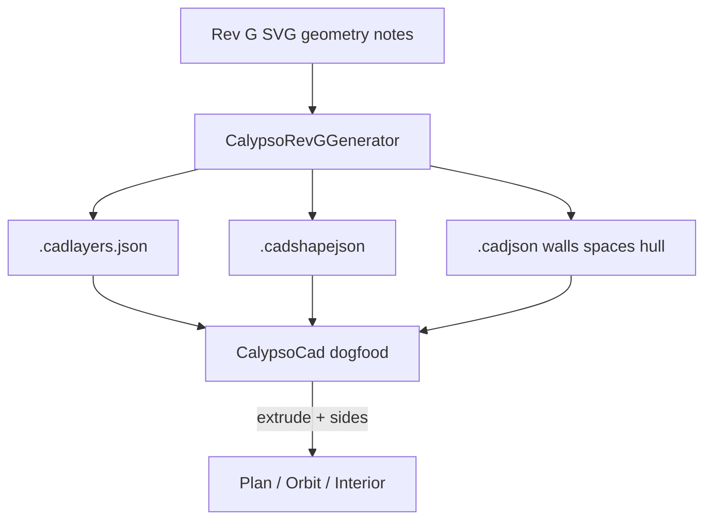

# Calypso CAD dogfood (Rev G deckplans)

## Goal

Recreate the fictional transport **Calypso** from [`calypso-deckplans_revG.svg`](D:/repos/books/content/series/the-calypso-cycle/references/ships/calypso/assets/images/calypso-deckplans_revG.svg) as Novolis CAD documents, with **materials** and **two-sided walls** so interior cameras can show the correct face. Deliver a **generation path** plus a **dogfood app** that builds and draws the ship on startup.

**Source of truth:** Rev G SVG + its footer specs (`65 m LOA | 20 m beam | 12 m height | cargo 22×19×9 m`). Deck stacks: **−1 utilities**, **0 ops/bridge/cargo**, **+1 passengers**. Do not depend on OBJ/models or other artwork.

**Default approach:** hand-port geometry in C# (no runtime SVG parse). Scale: **0.1 m per SVG unit** (hull beam ~196 units ≈ 20 m). Map SVG plan **+Y down** → Novolis **+Z forward / +X starboard**, decks on **+Y**.



## 1. Schema extensions (governance)

Update [`novolis-governance/schemas/cad/novolis.cad.schema.json`](novolis-governance/schemas/cad/novolis.cad.schema.json) (additive, keep `schemaVersion: 1`):

**New entity kinds**

- `wall` — directed baseline (`a`/`b` or `points` for multi-segment), `thickness`, `height`, `deck` (int: -1|0|1), optional `name`, `layerId`, `shapeId` (fallback), and **`sides`**:
  - `a` / `b`: each `{ "shapeId": "uuid" }` — **A = left of directed baseline** looking along `a→b` with world up `+Y` (right-hand). Interior views pick the face whose outward normal points into the active space.
- `space` — closed footprint `points[]`, `deck`, `height` (clear), optional `floorShapeId` / `ceilingShapeId`, `name`, `layerId`. Used for zone fills, labels, and interior camera placement (centroid + eye height).

**Document properties (convention)**

- `properties.deckSpacingMeters` (e.g. `4`), `properties.shipLoaMeters` / `beamMeters` / `heightMeters` for HUD.

Keep existing primitives; hull outer/inner can remain polylines or walls on a hull layer.

Extend [`novolis.cad.shape`](novolis-governance/schemas/cad/novolis.cad.shape.schema.json) only if needed for shared presets (hull steel, corridor paint, cargo deck plate, zone tints). Materials stay under `extensions.material`; appearance under `extensions.appearance`.

Add catalog example [`schemas/cad/examples/calypso-ship.cadlayers.json`](novolis-governance/schemas/cad/examples/calypso-ship.cadlayers.json) (`standard: "custom"`) with ship-oriented names, e.g. `S-HULL`, `A-WALL`, `A-DOOR`, `A-CORR`, `A-ZONE-CARGO|HAB|ENG|UTIL|BRIDGE`, `A-ANNO`.

Update [`novolis-governance/docs/cadjson.md`](novolis-governance/docs/cadjson.md): wall sides rule, space/deck semantics, Calypso example pointer. Still **no CadKit**; still defer full `.archijson`.

## 2. Generator (hand-port Rev G)

New dogfood project library/code under the app (not a published package):

[`novolis-dogfooding/apps/cad/CalypsoCad/Generation/CalypsoRevGGenerator.cs`](novolis-dogfooding/apps/cad/CalypsoCad/Generation/CalypsoRevGGenerator.cs)

- Encode Deck −1 / 0 / +1 rooms, corridors, stairs/elev, airlocks, cargo, doors/hatches from the SVG rectangles/paths (translated + scaled).
- Emit:
  - `calypso.cadlayers.json`
  - `calypso.cadshapejson` (zone + wall side materials: e.g. exterior hull, interior lining, corridor, cargo plate)
  - `calypso.cadjson` (`layersDocument` / `shapesDocument` relative paths; entities with `shapeId` / `sides`)
- Write to `%LocalAppData%\Novolis\CalypsoCad\generated\` on every startup (and via CLI).
- Cargo bay: single tall **space** ~9 m high spanning decks as noted on the sheet; other rooms use per-deck height (~3–4 m clear under 12 m overall).

CLI:

```bash
dotnet run --project apps/cad/CalypsoCad -- --generate-only
```

## 3. Dogfood app `CalypsoCad`

Path: [`novolis-dogfooding/apps/cad/CalypsoCad/`](novolis-dogfooding/apps/cad/CalypsoCad/)

Pattern: leaner MeshBench/Draft Studio — **Avalonia + `Novolis.Avalonia.Raylib` + orbit camera**, PackageReference only (`2026.1.*`), app-local CAD DTOs (mirror Draft Studio models; add `Wall`/`Space`/`Sides`; do **not** ProjectReference `novolis-apps`).

**Startup**

1. Run generator → write companions
2. Load documents
3. Extrude walls to meshes (two materials if sides differ); draw space floors as thin quads with zone colors; hull outline
4. Show UI

**Explore UI**

- Deck filter: All / −1 / 0 / +1
- View mode: **Plan** (top-down orthographic), **Orbit** (exterior), **Interior** (pick space from list → camera inside looking along primary corridor or toward named focus)
- Status: selected space name, active wall side material, path to generated JSON
- Shortcuts: `F` fit, `1/2/3` decks, `P/O/I` view modes

Register in [`Novolis.Dogfooding.slnx`](novolis-dogfooding/Novolis.Dogfooding.slnx) under a `/cad/` folder; add packages to [`Directory.Packages.props`](novolis-dogfooding/Directory.Packages.props) as needed; short [`README.md`](novolis-dogfooding/apps/cad/CalypsoCad/README.md).

## 4. Out of scope

- Runtime SVG import / ACadSharp / DXF
- Full `.archijson` building profile
- Copying books-repo assets into novolis (generator embeds the port)
- Path-trace quality viewport (Preview/Raylib only)
- Publishing any new NuGet from dogfooding

## Implementation order

1. Schema: `wall` + `space` + sides; Calypso layers example; docs
2. App skeleton + DTOs + JSON IO
3. `CalypsoRevGGenerator` (Deck 0 first, then −1/+1)
4. Extruder + Raylib renderer + interior camera
5. Wire startup + `--generate-only` + README + slnx

