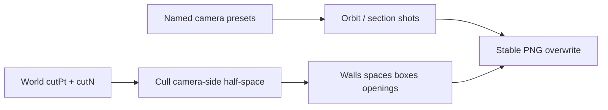

# Calypso cutaway + export angles

## Problem

- Exports under `%LocalAppData%\Novolis\CalypsoCad\generated\exports\` accumulate timestamped duplicates (`*-headless-yyyyMMdd-…png`).
- `CutawayPartial` only runs in **Interior**, and [`GetCutPlane`](d:/novolis/novolis-dogfooding/apps/cad/CalypsoCad/Services/CalypsoRenderer.cs) places a plane **1.1 m in front of the eye** along look — near-clip style, not a shipyard slice.
- Headless tour is mostly plan + one orbit + room solids; missing classic warship / fan-render exterior angles and a readable cutaway shot.

## Approach (locked)

**Slicing plane:** one world plane `(cutPt, cutN)`. Cull any draw whose representative point satisfies `Dot(p - cutPt, cutN) > 0` when `cutN` points **toward the camera** (camera-side half-space discarded). Geometry on/behind the far side of the plane stays. Enable this in **Orbit and Interior** when `WireMeshMode == CutawayPartial`.

**Default orbit cut:** longitudinal centerline (`cutPt = ship mid`, `cutN = ±UnitX` chosen so camera sits on the culled side). Interior cut: vertical plane through selected-space center, normal toward eye (architectural section through the room).

**Exports:** stable basenames overwrite; delete leftover `*-headless-*.png` at start of each headless run.

## Phase 1 — Export cleanup

In [`HeadlessPngExporter.cs`](d:/novolis/novolis-dogfooding/apps/cad/CalypsoCad/Services/HeadlessPngExporter.cs) and [`ViewportPngExporter.AllocatePath`](d:/novolis/novolis-dogfooding/apps/cad/CalypsoCad/Services/ViewportPngExporter.cs):

- Write `{kind}.png` (no timestamp), overwrite in place.
- At headless start: delete `*-headless-*.png` in the exports dir (legacy clutter only).
- Keep UI single-frame export as `{kind}-{timestamp}.png` only when user hits Export PNG (E) so manual snaps do not collide with the tour set.

## Phase 2 — Real slicing-plane cutaway

In [`CalypsoRenderer.cs`](d:/novolis/novolis-dogfooding/apps/cad/CalypsoCad/Services/CalypsoRenderer.cs) + [`CalypsoSession.cs`](d:/novolis/novolis-dogfooding/apps/cad/CalypsoCad/Services/CalypsoSession.cs):

1. Add session fields (or renderer state): `CutPlaneOrigin`, `CutPlaneNormal`, `CutawayEnabled` (driven by `WireMeshMode.CutawayPartial`).
2. Replace `GetCutPlane`:
   - **Orbit:** origin at hull mid `(0, midY, 0)`; normal = `±UnitX` (pick sign so `Dot(eye - origin, normal) > 0`); optional beam cut preset uses `±UnitZ`.
   - **Interior:** origin = selected space center; normal = horizontal toward eye (Y=0), so the near half of the room (camera side) is removed.
3. Enable cutaway culling for **orbit** (today gated `&& interior` in `DrawSpace` / `DrawWall`). Apply the same half-space test to spaces, walls, boxes, openings, props.
4. Draw a thin cut-face cue: vertical line grid / edge strip on the plane (few `DrawLine`s along LOA or beam) so the slice reads in PNGs.
5. Fix cull semantics once: rename helper to `CulledByCutPlane` = camera-side of plane; use consistently everywhere `BehindCut` is used today.

No Raylib `DrawTriangle3D` / stencil — AABB/line cull only (same constraint as detail pass).

## Phase 3 — Warship / fan-render angle presets

Add `ApplyOrbitPreset(string id)` on the renderer (sets `_orbit` yaw/pitch/distance/target). Headless tour captures these **stable** names:

| File | Intent |
|------|--------|
| `plan-deck-m1.png` / `plan-deck-0.png` / `plan-deck-p1.png` | Keep (user already likes deck-0 plan) |
| `orbit-bow-quarter.png` | High 3/4 bow — classic hull read |
| `orbit-broadside.png` | Low beam elevation, full LOA |
| `orbit-stern-quarter.png` | Aft 3/4 + nacelles/ramp |
| `orbit-cutaway-long.png` | Centerline slice + camera on culled beam side |
| `interior-solid-{bridge,crossing,cabin1,galley,cargoVoid,lounge,airlockPort}.png` | Keep solids |
| `interior-cutaway-bridge.png` / `interior-cutaway-cargoVoid.png` | Room-section cutaways only (drop redundant wire from default tour) |

Interior wire variants leave the default tour (still available via UI W).

Preset numbers (approximate, tune after one export pass):

- Bow quarter: yaw ~0.9, pitch ~0.45, distance ~95, target mid-forward
- Broadside: yaw ~0 / π, pitch ~0.22, distance ~100
- Stern quarter: yaw ~2.4, pitch ~0.35, distance ~90
- Cutaway: yaw such that eye is on +X (or −X), pitch ~0.3, distance ~85; enable `CutawayPartial`

## Phase 4 — Verify + README

- Run `--headless`; confirm exports dir is a small stable set (no timestamp pile-up).
- Spot-check: `plan-deck-0.png` still clean; `orbit-cutaway-long.png` shows half-hull with interior partitions; bow/broadside/stern read as intentional gallery shots.
- Update [`README.md`](d:/novolis/novolis-dogfooding/apps/cad/CalypsoCad/README.md) tour checklist to the new filenames + one sentence on cutaway = world slicing plane (camera-side culled).

## Explicitly not in this pass

- Engineering arrangement / WT / vestibule generator work ([calypso_engineering_finish](d:/novolis/.cursor/plans/calypso_engineering_finish_cb90e103.plan.md)) — separate track.
- GPU clip planes / stencil / `DrawTriangle3D`.
- OBJ furniture import.

