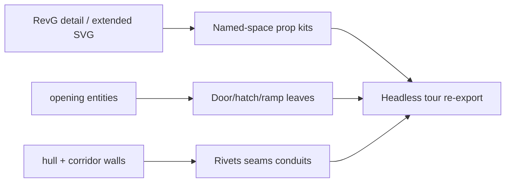

# Calypso detail pass (module-level)

## Goal

The finalize pass delivered the **program** (rooms, openings, cabins, cargo void). This pass adds **readable interior/exterior micro-detail** so headless tour PNGs look like a working freighter, not empty grey boxes.

**Approach:** denser props + corridor/hull cues in [CalypsoRenderer.cs](d:/novolis/novolis-dogfooding/apps/cad/CalypsoCad/Services/CalypsoRenderer.cs), driven by name/hooks already in [CalypsoRevGGenerator.cs](d:/novolis/novolis-dogfooding/apps/cad/CalypsoCad/Generation/CalypsoRevGGenerator.cs). Stay on `World.DrawCube` / `DrawLine` / `DrawCylinder` / `DrawSphere` (no Raylib binding expansion this pass).

**Primary refs:** `calypso-deckplans_revG_details_extended.svg`, `_detail.svg`, `_production.svg` under the books Calypso assets tree.

## Phase 1 — Door / hatch / ramp geometry

In `CalypsoRenderer.DrawOpeningFrame` (and related):

- Draw a **leaf** (thin cube) in each opening footprint: thinner for `door`, thicker for `hatch`.
- `ramp`: stepped wedge of 3–4 cubes sloping aft at the cargo stern opening.
- Keep existing wire lintel/jambs; tint leaves gunmetal / amber for armored cargo door.

## Phase 2 — Module prop kits (selected interior)

Expand `DrawCompartmentProps` (and hollow cargo path) to match detail-card layouts:

| Space | Add |
|-------|-----|
| Crew Cabin / Berth | Bridge + chair cubes, under-bunk strip, vent cube, bunk-head outlet marker, crash-webbing as `DrawLine`s |
| Galley | Counter run + heater/chiller/sink blocks; keep growth-chart post |
| Infirmary | Medbed + side AutoDoc rack cube |
| Airlock | Dual hatch slabs in footprints; 3–4 suit-hook posts; bench |
| Lounge | Bar + stools; overhead screen (already partial) |
| Engineering / Reactor / Power / Life | Rack rows + `DrawCylinder` tanks + short conduit stubs |
| Stairs / Elev | Handrail lines; elev door frame on car |
| Corridor / Crossing | **Triple trunk** (power/data/vent) as parallel thin cubes; keep emergency strips + armory rack |
| Cargo Void (hollow) | Cleats/tie-downs, multi-beam gantry grid, catwalk handrails, aft-ramp steps |

## Phase 3 — Exterior / hull micro-read

- On hull wall segments in **orbit/plan**: panel seam lines along baselines + sparse rivet dots (`DrawSphere` or tiny cubes) every ~1.5–2 m.
- Nacelles: already drawn; add end-cap disks (`DrawCylinder`) and a few panel seams.
- Orbit: keep zone floors very dim so riveted hull + nacelles dominate.

## Phase 4 — Light generator hooks only if needed

Prefer renderer-side density. Only touch the generator if a prop needs a stable anchor:

- Ensure hooks exist for growth chart / owner lock / armory (already present).
- No new room inventory; no schema changes.

## Phase 5 — Re-export verification

Rerun `--headless` tour. Spot-check PNGs:

- `interior-solid-cabin1` — bunks + bridge + webbing readable
- `interior-solid-galley` — appliance run
- `interior-solid-airlockPort` — dual hatches + hooks
- `interior-solid-cargoVoid` — gantry grid + cleats + ramp
- `orbit` — rivet/seam read on hull, nacelle caps

Update [README.md](d:/novolis/novolis-dogfooding/apps/cad/CalypsoCad/README.md) with a short “detail pass” note listing the module kits.

## Explicitly not in this pass

- Wrapping `DrawTriangle3D` / `DrawModel` in novolis-raylib
- Importing OBJ furniture from books `assets/models`
- RevF / C40 stretch

