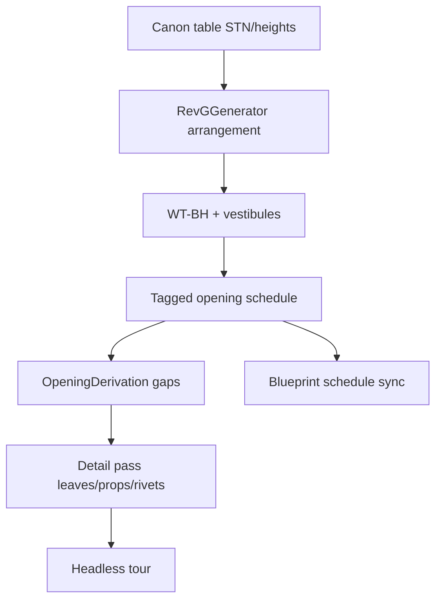

# Calypso engineering finish line

## Problem

[finalize_calypso_transport](d:/novolis/.cursor/plans/finalize_calypso_transport_86a9de75.plan.md) delivered the **program** (rooms, wall gaps, hollow cargo, props). Blueprints claim a **structural GA** that CAD does not emit. [calypso_detail_pass](d:/novolis/.cursor/plans/calypso_detail_pass_d3793fba.plan.md) adds leaves/props/rivets on top of that mismatch.

**Decision locked:** engineering topology + opening schedule first, then detail-pass visuals on that corrected model. No DrawTriangle3D / OBJ import.

## Canon (single source)

| Item | Rule |
|------|------|
| Envelope | 65 × 20 × 12 m · registry ST-7749-63325116 |
| Hab stack | Decks +1 / 0 / −1 fwd–mid only (deck spacing 4.0 m, room clear ≈ 3.6 m) |
| Engineering | One full-OAH void aft of hab (STN ~38.8–47), not three stacked rooms |
| Hold | One hollow volume 22 × 19 × **9** m aft of eng (STN ~47–AP); “full OAH” means continuous void, height **9 m** (not 12) |
| Corridors | Twin port/stbd + cross; ClearWidth **2.0 m** (Rev G `corrFill`) |
| Junctions | Vestibules with N framed openings — never open T by deleting walls |
| Opening dims | `W_open` / `H_open` / `H_sill` = structural cut; `ClearWidth` / `ClearHeight` = liner ≤ cut |

## Phase 1 — Arrangement + WT topology in generator

Update [CalypsoRevGGenerator.cs](d:/novolis/novolis-dogfooding/apps/cad/CalypsoCad/Generation/CalypsoRevGGenerator.cs):

1. **Replace stacked eng rooms** with one continuous engineering void spanning deck −1 floor → +1 ceiling (or documented OAH band), walls only on plan perimeter + WT faces.
2. **Hold** stays one hollow cargo system; align STN/aft extent to 22 m LOA; keep catwalk / armored BH / ramp.
3. **Emit WT bulkheads** as named walls (`wt-bh-eng` @ STN≈38.8, `wt-bh-hold` @ STN≈47) with properties `{ watertight: true, stationMeters }`.
4. **Add vestibule spaces** at VEST-BR (bridge T), VEST-P, VEST-S: small rect solids; route corridor ends into vestibules; place **3 framed openings** per T (legs), not wall deletions.

## Phase 2 — Opening schedule parity

1. Tag every ship opening with schedule IDs matching [calypso-blueprint-master](c:/Users/frank/.cursor/projects/d-novolis/canvases/calypso-blueprint-master.canvas.tsx): `PD-01…`, `AH-P/S`, `PD-C1…5`, `PD-20/21` (corr→eng, ClearWidth 2.0), `PD-22/23` (eng side ~0.9), `CD-P/S`, `RAMP`.
2. Store on opening entities: `tag`, `W_open`, `H_open`, `H_sill`, `ClearWidth`, `ClearHeight`, `hostWallId`, `connects`.
3. Twin WT corridor doors at eng BH (today: one centered eng door).
4. Keep `OpeningDerivation.Apply` for baseline gaps; document that full Boolean ring/sill/seal remains **spec → CAD later** (renderer leaf ≈ leaf only).

## Phase 3 — Blueprint cleanup (coherence only)

Trim [calypso-blueprint-master.canvas.tsx](c:/Users/frank/.cursor/projects/d-novolis/canvases/calypso-blueprint-master.canvas.tsx):

- Hold note: **22×19×9 continuous void** (not “FULL OAH 12 m”).
- BP-03: label corridor PD cut as `W_open` matching ClearWidth 2.0 for WT/corr doors; personnel doors ~0.8–0.9 separately.
- Opening schedule rows must match generator tags 1:1.

## Phase 4 — Detail pass (existing plan, on corrected model)

In [CalypsoRenderer.cs](d:/novolis/novolis-dogfooding/apps/cad/CalypsoCad/Services/CalypsoRenderer.cs), complete [calypso_detail_pass](d:/novolis/.cursor/plans/calypso_detail_pass_d3793fba.plan.md):

1. `DrawOpeningFrame`: leaf by `OpeningType` (door/hatch/ramp steps); armored tint for CD.
2. Expand `DrawCompartmentProps` / `DrawHollowShaft` kits (cabin UI/webbing, galley run, airlock hooks, triple trunk, eng tanks, cargo gantry/cleats/rails).
3. Orbit: hull panel seams + rivet dots; nacelle end caps.
4. Headless re-export + README “detail pass” + **arrangement/opening schedule** note.

## Done when

- Eng = one full-height machinery volume; hold = one 9 m continuous void; hab = three decks only fwd of WT-BH-eng.
- Vestibules exist; corridor T junctions use 3 PDs.
- Opening tags in `.cadjson` match blueprint schedule.
- Tour PNGs show leaves + denser props + riveted orbit hull.
- Blueprint hold/opening notes no longer contradict CAD.

