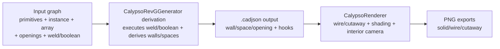

# Calypso toolkit (engineering CAD semantics)

## Scope for this iteration (chosen)

- Deliver **schemas + CalypsoCad dogfood demo** (not DraftStudio core).
- Booleans/wields apply to **both 3D solids and 2D regions** (executed/derived in CalypsoCad, while schemas remain forward-compatible for other apps).

## Target outcome

CalypsoCad will be able to:
- Model door/hatch openings that cut walls and connect spaces.
- Perform weld/union (touching/intersecting shapes merge) for 2D region boundaries and for wall baselines.
- Perform boolean subtract (add holes/voids) to make ship compartments **enclosed yet hollow** (cargo void spanning multiple decks).
- Place repeated parts via array/instance tooling.
- Render in **wire-mesh** and **partial cutaway** modes.
- Expose **hooks** so the runtime can identify “Bridge door”, “Cargo void eye”, etc.
- Detect enclosure/hollowness by analyzing spaces, walls, and openings.
- Render with simplified “physical” shading using `roughness/metalness` from `novolis.cad.shape`.

## Architecture decision (concrete)

1. **Schema is the source of truth**, but CalypsoCad executes operations in a derivation step:
   - inputs: primitives + `boolean`/`weld`/`opening`/`instance`
   - output: concrete `wall`/`space`/basic solids/entities that the current renderer understands.
2. The Raylib renderer remains immediate-mode for this iteration; we enhance “ship feel” via:
   - better deck filtering and enclosure-driven visibility
   - wire-mesh/cutaway draw modes
   - directional lighting approximation using `roughness/metalness`.

## Phase 1 — Governance schema extensions

Update `novolis-governance/schemas/cad/novolis.cad.schema.json` (additive, keep existing `schemaVersion: 1`):

### 1) Hooks
- Extend `entityBase` with:
  - `hooks?: Hook[]`
- New `$defs`:
  - `Hook { id: uuid, tag: string, position: vec3, normal?: vec3, properties?: propertiesBag }`

### 2) Arrays / instances
- Add new entity kinds:
  - `instance` (references `prototypeId: uuid`, with `transform`) 
  - `arrayInstance` (grid/row/column counts + spacing + prototypeId + base transform)
- New `$defs`:
  - `transform` (center vec3, rotation (quat or rotationY), scale vec3)

### 3) Door/hatch/ramp via openings
- Add `opening` entity kind:
  - `openingType: "door"|"hatch"|"window"|"ramp"`
  - `deck`, `height`, `footprint` (polygon points)
  - `hostWallId?: uuid` (optional), and `connectsSides?: ["A","B"]`
  - door-specific `swing` block: start/end angles (radians) and direction.
- Add `ramp` as either:
  - an `openingType:"ramp"` plus ramp elevation parameters, OR
  - a separate `ramp` entity kind if you prefer.

### 4) Booleans and welds
- Add new entity kinds:
  - `boolean` entity kind: `operation: "union"|"subtract"|"intersect"`, `leftId`, `rightId`, `mode: "region"|"solid"`.
  - `weld` entity kind: `memberIds: uuid[]`, `touchEpsilonMeters`.

### 5) Hole/enclosure hints
- Add optional `space.flags?: { enclosed?: boolean, hollow?: boolean }` for caching derivation results.
- Keep algorithmic truth inside CalypsoCad; schema allows persistence.

Docs updates in:
- `novolis-governance/docs/cadjson.md`:
  - describe hooks, instance/array, openings, boolean/weld contracts, and how “enclosed yet hollow” spaces are represented.
- Add at least one new schema example under `novolis-governance/schemas/cad/examples/` showing:
  - a wall + door opening that creates adjacency across spaces
  - a cargo void space spanning deck boundaries

## Phase 2 — CalypsoCad: derivation step and generator upgrade

Update `d:\novolis\novolis-dogfooding\apps\cad\CalypsoCad\Generation\CalypsoRevGGenerator.cs`:

1. Replace current “hand-made walls and spaces only” with an **operation-driven build**:
   - Generate base hull + rooms as region primitives.
   - Use `weld` to merge touching boundary regions into a single room boundary.
   - Use `opening` entities for each door/hatch.
   - Use `boolean(subtract)` to cut walls/deck slabs where needed.
2. Add array-based placement to eliminate repetitive loops:
   - example: place repeated crew cabins / berths as an `arrayInstance` in input graph.
   - still derive explicit walls/spaces for rendering compatibility.
3. Implement hole/enclosure derivation:
   - After deriving final `wall`/`space`/`opening` relationships, compute:
     - enclosure (space connected to outside via openings) 
     - hollow (enclosed spaces with void/open-top connections vertically)
   - Persist results into `space.flags` and/or `properties`.
4. Generate and attach hooks:
   - hooks on key elements: Bridge, Stairs/Elev, Cargo Void access, major doors/hatches.

## Phase 3 — CalypsoCad renderer: wire-mesh, cutaway, enclosure-driven interior camera

Update `d:\novolis\novolis-dogfooding\apps\cad\CalypsoCad\Services\CalypsoRenderer.cs`:

1. Rendering modes controlled by a new session setting (app-local):
   - `wireMeshMode`: none | wire | cutawayPartial
2. Wire-mesh mode:
   - draw wall edges and space outlines only
   - render the cut surfaces with strong edge emphasis (even if simplified)
3. Partial cutaway:
   - define a cut plane relative to the interior camera
   - cull wall/space faces behind the plane to simulate “looking into the void”
4. Interior “ship feel” improvements:
   - interior view must always auto-filter to the selected `space.deck` (already done in previous pass)
   - if selected space is hollow, place camera and optionally lower/raise eye height based on void span
5. Physical shading approximation:
   - read `extensions.material.roughness` / `metalness` from shapes
   - compute a directional-light diffuse term using approximated face normals
   - reduce specular term when roughness is high

Update UI and export:
- `MainWindow.cs`
  - add a mode toggle for wire/cutaway
  - add a “Hook highlight” selector (list hooks by tag)
- `HeadlessPngExporter.cs`
  - add export variants for wire and cutaway modes so dogfood can be regression-checked.

## Phase 4 — Verification and dogfood checkpoints

For CalypsoRevG generated output, ensure these checks:
- Bridge interior shows enclosed corridor space with ceiling plane
- Cargo bay interior shows enclosed but hollow vertical void (no deck stacking artifacts)
- Doors/hatches create visible openings in walls (wall segments removed around openings)
- Hooks can be selected in UI to drive camera targeting
- Headless exports produce:
  - plan/orbit/interior (solid)
  - interior wire
  - interior cutawayPartial

## Mermaid (dataflow)

## Concrete file touch list (for implementation)

Governance:
- `novolis-governance/schemas/cad/novolis.cad.schema.json`
- `novolis-governance/docs/cadjson.md`
- `novolis-governance/schemas/cad/examples/*`

Dogfood app:
- `novolis-dogfooding/apps/cad/CalypsoCad/Generation/CalypsoRevGGenerator.cs`
- `novolis-dogfooding/apps/cad/CalypsoCad/Services/CalypsoRenderer.cs`
- `novolis-dogfooding/apps/cad/CalypsoCad/MainWindow.cs`
- `novolis-dogfooding/apps/cad/CalypsoCad/Services/HeadlessPngExporter.cs`
- `novolis-dogfooding/apps/cad/CalypsoCad/Models/CadModels.cs`

