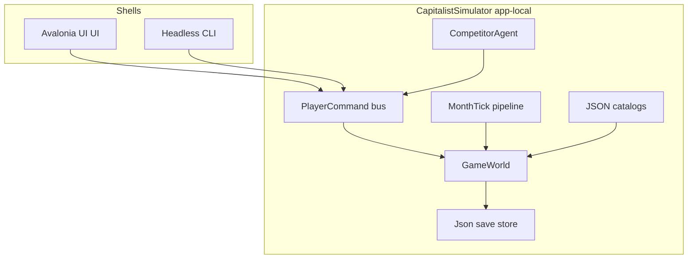

# CapitalistSimulator (Capitalism 2 homage)

## Verdict

New self-contained app at [`d:\novolis\novolis-apps\src\CapitalistSimulator`](d:\novolis\novolis-apps\src\CapitalistSimulator), dual-shell like [`SinsOfACapitalismTycoon`](d:\novolis\novolis-apps\src\SinsOfACapitalismTycoon) (`OutputType=Exe`, `--mode avalonia|headless`). **App-local Cap2 game kernel** (city map + firm interiors + unit links + P/Q/B demand). Use Avalonia UI packages (`Studio`, `Briefing`, `Controls`); do **not** force-fit the freight-oriented `Novolis.Economy.*` world model. Design data is **reauthored JSON** from Cap2 semantics (manual + `1STD.SET` string tables); never ship or parse Cap2 `.SET`/`.gam`/`.ICN`/`.FRM`.

Distinct from existing **Sins of a Capitalism Tycoon** (interstellar tramp freight).

## Design sources (read-only lift)

| Source | Use |
|--------|-----|
| [`D:\Steam\steamapps\common\Capitalism 2\Capitalism 2 Manual.pdf`](D:\Steam\steamapps\common\Capitalism 2\Capitalism 2 Manual.pdf) | Systems rules |
| [`...\tutorial\tut01.res`–`tut08.res`](D:\Steam\steamapps\common\Capitalism 2\tutorial) | Input surface + onboarding flow |
| [`...\Resource\help.res`](D:\Steam\steamapps\common\Capitalism 2\Resource\help.res), `gm_help.res` | Toolbar / setup knobs |
| [`...\gameset\1STD.SET`](D:\Steam\steamapps\common\Capitalism 2\gameset\1STD.SET) | Product/recipe/firm **names & relationships** → JSON catalogs |
| Scenario `.des` | Win-condition templates |

**Not lifted:** sprites, saves, exe logic, media.

## Architecture



### Core model (Cap2-faithful)

- **World** → N cities → tile grid (buildable land, seaport tiles, bank/stock NPC buildings)
- **Firm** on a city tile: type (Retail/Factory/Farm/Extract/Rd/Hq), layout grid of **Units**
- **Units:** Purchasing, Manufacturing, Sales, Inventory, Advertising, Rd, Extract (crop/livestock/mine/forest/oil collapsed to one Extract with resource kind)
- **Links:** directed unit→unit (Purchasing→Manufacturing→Sales); auto-link helper
- **Product:** price, quality, brand awareness/loyalty; retail demand from cohort × attractiveness(P,Q,B)
- **Corporation:** cash, monthly P&L, brand strategy (Corporate / Range / Unique), loans, share class
- **AI corps:** heuristic build/price/ad agents (simplified aggressiveness knob)

### Monthly tick pipeline

1. Apply queued player/AI commands  
2. Purchasing (seaport + inter-firm + internal)  
3. Extract / farm yield  
4. Manufacture (recipes)  
5. Advertising brand update  
6. R&D project progress → tech/quality caps  
7. Retail/consumer clearing + B2B sales  
8. Wages/expenses/loan interest  
9. Stock mark-to-market (earnings + net-worth heuristic)  
10. Win/lose checks + news events  

Time: day clock with speed 0–5; economy resolves **monthly** (Cap2-like reporting cadence). Avalonia default: pause when modal/decision open (bridge HardPause pattern from Calypso, domain-level—not `GameShell`/GL).

## Full player input surface (commands + UI)

All actions exist as typed `PlayerCommand`s and have Avalonia controls (and headless CLI verbs):

| Area | Commands |
|------|----------|
| Game | New (setup knobs), Save/Load, Retire, Speed, Pause |
| Map | Select city, build firm, demolish, zoom levels (UI only) |
| Firm | Open interior, place/remove unit, set link, training slider, private-label toggle |
| Ops | Set purchase links/qty, production recipe+rate, retail slots (4) + prices |
| Brand | Choose strategy; ad budget per product/class |
| R&D | Start/cancel project; auto-apply toggle |
| Finance | Bank borrow/repay; stock buy/sell; issue shares; dividend |
| HQ | Open departments (Finance / Marketing / ImportExport / RdQa) — light automation toggles |
| Reports | Product / Corporate / Firm summary views |
| Info | News feed, market share, seaport catalog |

### Simplified / dropped Cap2 chrome

- No hireable executive skill vectors / mansion vanity  
- No media CPM/rating-point micromanagement → ad **spend → brand** curve  
- No seasonal farm calendar → stable monthly yield ± noise  
- One factory size ladder (S/M/L), not 7 FRM templates  
- Retail types collapsed to ~6 families that still cover product classes (Dept, Super, Convenience, SpecialtyGoods, Auto, Electronics)  
- Private label = Purchasing flag, not separate unit type  
- Hostile tender/merger → majority share control + optional “absorb” when ≥50%  
- Random disasters optional later; start with economic-climate drift only  

## Avalonia UI (bridge, not GL)

Copy bridge composition patterns from [`SinsOfACapitalismTycoon\Ui`](d:\novolis\novolis-apps\src\SinsOfACapitalismTycoon\Ui) and [`EconomyBoard`](d:\novolis\novolis-dogfooding\apps\economy\EconomyBoard):

- Packages: `Avalonia`/`Desktop`/`Fluent`, `Novolis.Avalonia.Studio`, `.Briefing`, `.Controls`, `Avalonia.Controls.DataGrid`, `Novolis.Storage.Json`, `Microsoft.Extensions.Hosting`  
- **Avoid** `Avalonia.Fonts.Inter` as brand look; local `CapitalTheme` (slate boardroom + copper accent; Georgia/Segoe/Consolas like Calypso)  
- Layout: toolbar (build, reports, HQ, stock, speed) · city **Canvas** grid map · firm interior panel · right `FeedPanel`/metrics · product detail (P/Q/B + supply/demand bars)  
- No `Novolis.Avalonia.Gaming` / `TwoDSceneControl` for v1  

## Project layout

```
src/CapitalistSimulator/
  CapitalistSimulator.csproj   # Exe
  Program.cs                   # --mode avalonia|headless, --days, --scenario
  Cli/
  Sim/                         # world, tick, market, AI, commands
  Data/                        # embedded JSON catalogs
  Ui/                          # MainWindow, CapitalTheme, views
  Persistence/
  docs/gameplay.md
tests/CapitalistSimulator.Unit/
```

Wire into [`Novolis.Apps.slnx`](d:\novolis\novolis-apps\Novolis.Apps.slnx), [`README.md`](d:\novolis\novolis-apps\README.md), [`docs/design.md`](d:\novolis\novolis-apps\docs\design.md), [`docs/getting-started.md`](d:\novolis\novolis-apps\docs\getting-started.md). **Not** in Inno/release catalog until a later playable cut (same posture as local-only apps).

Catalog seed (~from Cap2): ~40–60 products (not full 128), key recipes (auto, computer, wine, frozen meat, steel path), seaport import table, 2–3 starter cities, 1 sandbox + 2 scenario goals (retail profit; vertical wine dominance).

## Validation

- Unit tests: link validation, manufacture recipe, retail clearing P/Q/B, loan/stock math, win conditions  
- Headless smoke: `dotnet run --project d:\novolis\novolis-apps\src\CapitalistSimulator -p:NovolisUseProjectReferences=true -- --mode headless --days 36`  
- Policy: `verify-nuget-only` / no Cap2 files in repo  

## Implementation order

1. Scaffold project + catalogs + `GameWorld` + command bus  
2. Tick: purchase → make → sell → P&L (single city sandbox)  
3. Avalonia UI: map + firm interior + prices  
4. Ads/brand, bank, multi-city, AI  
5. Stock/HQ/reports/scenarios + headless smoke  

