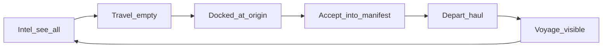

# Captain bridge UX: berth, travel, intel, voyage

## Problem (today)

- **Accept from anywhere:** `PlayerTrampAgent.LiftHaul` never checks berth vs origin; Network / `~` 1-hop board makes remote accepts normal.
- **No travel:** map select is inspect-only; `PlanShipment` rejects empty cargo (`LogisticsEngine.TryDepartItinerary` → `cargo-unavailable`).
- **Opaque voyage:** only a one-line `LastDecision`; no leg/ETA/hold UI.
- **One mushy board:** commodity arb + standby flavor mixed; no charter vs spot split.
- **“Multiple if room” impossible to read:** single drain + no capacity/manifest.

## Locked product rules



1. **See** spot/charter postings network-wide (intel). They can **vanish or shrink** (other tramps / fills) while you steam.
2. **Accept** only when `CurrentHub == job.Origin` (docked at load port).
3. **Travel** empty (or ballast) to any hub you can route to — first-class verb, not a fake haul.
4. **Voyage** is always visible while underway (from → to, profile, phase, remaining capacity).
5. **Spot vs Charter** are separate panels/tabs (not one `ListBox`).
6. **Manifest / room:** while docked, commit multiple same-origin lots up to `HullCargoCapacity` (36); same SKU merges into one `PlanShipment`; different SKUs stage in firm inventory at berth and haul one SKU at a time.
7. **Shells:** Avalonia + `--mode captain` share the same bridge verbs and `CaptainBridgeModel` (CLI mirrors GUI).

## UX shape (one composition)

| Zone | Purpose |
|------|---------|
| **Voyage strip** (always top of right column) | Berth or Underway: hub name, cash, life%, `hold used/36`, decision, and if underway: origin→dest, SKU×qty, profile, phase (`Loading`/`WaitingBerth`/`Underway`), day clock |
| **Map** | Select hub = **Travel target** (not just flavor). Confirm **Travel here** when idle. Highlight Calypso berth + selected target + active leg endpoints |
| **Intel — Spot** | Network sell→buy spreads (read-only). Rows show origin, Δ, qty, **At berth?** / **N ly away**. Accept disabled unless docked at origin |
| **Intel — Charters** | Opportunities standby + escrow-framed short offers (tutorial/short-haul). Accept/Refuse only when rules allow (standby anytime while offered; escrowed charter accept only at stated load hub) |
| **Berth — Manifest** | Only when idle/docked: committed lots, remaining capacity, **Depart** (issues `PlanShipment` for staged same-SKU or chosen SKU) |
| **Transport** | Step 1d / Continue / To horizon (unchanged pause policy: run until decision) |

Copy tone: CCA glass board — “plenty of opportunity; acceptance is a dock act.”

## Domain changes (Sins + small Economy)

### A. Empty travel — Economy

Add `PlanReposition(FirmId, OriginHubId, DestinationHubId, VehicleClassId, TransitProfileCode)` in [`CommandsAndEvents.cs`](novolis-economy/src/Novolis.Economy.Production/CommandsAndEvents.cs) and handle in logistics depart path (allow `quantity == 0` for reposition only; no inventory take; still burns fuel/tolls/wear via existing underway). Tests in Economy.Unit for empty depart + refuse mid-busy.

Sins: `PlayerOrderKind.TravelTo` + `PlayerTrampAgent` enqueue reposition when idle and `CanOperate`.

### B. Berth gate on accept

In `LiftHaul` / new `CommitSpotLot`: require `Agents.Carrier.CurrentHub` matches origin hub; else `LastDecision = "not at load berth"`. Remove Network-accept and soft `~` remote accept. Intel may still list 1-hop/network; Accept is hard-gated.

### C. Spot vs Charter models

- **SpotCandidate** — today’s spread math from [`CaptainJobBoard`](novolis-apps/src/SinsOfACapitalismTycoon/Universe/Player/CaptainJobBoard.cs) (rename/split): `AtOrigin`, `DistanceHint`, `RemainingQty` (live book).
- **CharterCandidate** — from `OpportunitiesPool` (standby) + optional seeded “short charter” rows (tutorial Industrial/Mining &lt;8 ly) that open escrow on accept. Separate list; never mixed into Spot strings.

### D. Manifest (multi if room)

New Sins-local `BerthManifest`:

- `TryAdd(SpotCandidate)` only at origin; reject if `used + qty > 36` or origin mismatch.
- Same `ProductId` → merge qty.
- `Depart(sku?)` → one `PostHubOrder`+`PlanShipment` for chosen/merged SKU; leftover SKUs remain as inventory at berth for next haul.
- Capacity meter on voyage strip.

### E. Interception

Each bridge refresh re-queries `HubOrders`; intel rows update Remaining/disappear. No reserved remote hold until berth accept. Optional flash: “Job gone — filled or lifted.”

### F. Bridge model + UI + CLI

Rewrite [`CaptainBridgeModel`](novolis-apps/src/SinsOfACapitalismTycoon/Ui/CaptainBridgeModel.cs) with Voyage / SpotIntel / Charters / Manifest sections.  
[`MainWindow`](novolis-apps/src/SinsOfACapitalismTycoon/Ui/MainWindow.cs): tabs Spot | Charters | Manifest; Travel on map; Accept enabled only when `AtOrigin`; Depart on Manifest.  
[`CaptainConsole`](novolis-apps/src/SinsOfACapitalismTycoon/Cli/CaptainConsole.cs): `travel <system>`, `spot`, `charters`, `accept N`, `manifest`, `depart`, `refuse`; `--playtest` script: travel to load hub → accept → depart → assert underway → berth gate rejects remote accept.

### G. Docs

Update [`gameplay.md`](novolis-apps/src/SinsOfACapitalismTycoon/docs/gameplay.md) / [`cli-and-reports.md`](novolis-apps/src/SinsOfACapitalismTycoon/docs/cli-and-reports.md) / [`commerce-stack.md`](novolis-apps/src/SinsOfACapitalismTycoon/docs/commerce-stack.md): dock acceptance, empty reposition, spot vs charter, interception.

## Validation

```powershell
dotnet build novolis-apps/src/SinsOfACapitalismTycoon -p:NovolisUseProjectReferences=true
dotnet test novolis-economy/tests/Novolis.Economy.Unit --filter PlanReposition
dotnet run --project novolis-apps/src/SinsOfACapitalismTycoon -p:NovolisUseProjectReferences=true -- --engine campaign --days 60d --seed 1001 --playtest
pwsh -File novolis-governance/scripts/verify-nuget-only.ps1
```

Playtest acceptance: remote `accept` fails; `travel` shows underway empty; at origin `accept` fills manifest; `depart` → visible voyage; spot/charter lists distinct; second lot respects room.

## Out of scope

- Multi-SKU single `PlanShipment` / mid-tick fleet animation / Prize Court
- Publishing Economy packages to GPR in this pass (ProjectRef validation; publish via normal CI when merging Economy)

