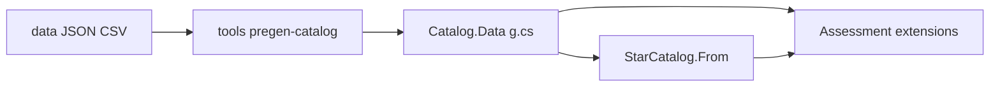

# Pregenerated catalogs + Kopparapu habitability

## Locked decisions

- **Data access:** local pregen → committed `*.g.cs` packs (no RNG, no Roslyn source-gen).
- **Packs (v1):** `NearSol100` and `HygLocal1901` in new package `Novolis.Astro.Catalog.Data`.
- **Habitability API:** `StarSystem` extension methods in `Novolis.Astro.Assessment` (not Catalog).
- **HZ science:** Kopparapu et al. 2013 (+ erratum Table 3 coeffs), still the NASA/VPL calculator baseline. Conservative = runaway greenhouse → maximum greenhouse; optimistic = recent Venus → early Mars. Distance: \(d = \sqrt{L_*/S_\mathrm{eff}}\) AU with \(S_\mathrm{eff}(T_\mathrm{eff})\) polynomial.
- **Fiction stays out:** no Calypso/Compact maps in platform packs; overlays remain separate.



## 1. Catalog store + stellar fields

Update [`StarSystem`](novolis-astro/src/Novolis.Astro.Catalog/StarSystem.cs):

- Optional `double? LuminositySolar`, `double? EffectiveTemperatureK`, `string? SpectralDesignation`, `double? AbsoluteMagnitude`.
- Keep existing ctor overloads / add optional params so current call sites compile.

Update [`StarCatalog`](novolis-astro/src/Novolis.Astro.Catalog/StarCatalog.cs):

- `StarCatalog.From(IEnumerable<StarSystem>)` — materialize ordered array + id map; reject duplicate ids.
- `All` becomes `IReadOnlyList<StarSystem>` (stable order), not `Dictionary.Values`.
- Keep `Add` for mutable/tests; `HygCsvImporter` gains `Enumerate(TextReader)` returning `IEnumerable<StarSystem>` plus existing mutate path as thin wrapper.

## 2. Pregenerated data packs

New project `src/Novolis.Astro.Catalog.Data/`:

- `CatalogPacks.NearSol100` / `CatalogPacks.HygLocal1901` → `IReadOnlyList<StarSystem>`.
- Source under `novolis-astro/data/` (vendored copies): Near-Sol JSON (from dogfood/StarMapLab Johnston list) and HYG-style slice shaped like books [`database.json`](D:/repos/books/tools/starsystems/data/database.json) (~1901). **Copy into novolis-astro** — no path/ProjectReference to `D:\repos\books`.
- Tool: `novolis-astro/tools/pregen-catalog.cs` (file-based) reads sources, sorts (distance-from-origin then id), emits `*.g.cs`. Document “re-run after data refresh” in Catalog.Data README.
- Register package in [`.novolis/packages.json`](novolis-astro/.novolis/packages.json) and solution.

Ids: string ids from Near-Sol (`sol`, …); Hyg pack uses stable stringified catalog ids (`"0"`, `"169"`, …) plus proper/Gliese name when present. Coords in **ly** (convert pc→ly when source is pc, matching Astro frame).

## 3. Habitable zone + habitability rating (Assessment)

Replace spectral switch in [`HabitabilityAssessor`](novolis-astro/src/Novolis.Astro.Assessment/Assessors.cs) with science core + thin `ISystemAssessor` wrapper.

### Types (Assessment)

- `HabitableZoneLimit` — enum: `RecentVenus`, `RunawayGreenhouse`, `MoistGreenhouse`, `MaximumGreenhouse`, `EarlyMars`.
- `HabitableZoneConvention` — `Conservative` (runaway / max greenhouse), `Optimistic` (recent Venus / early Mars).
- `HabitableZone` — `InnerAu`, `OuterAu`, `WidthAu`, `MidAu`, `TeffK`, `LuminositySolar`, `Convention`, `LimitNames`.
- `HabitabilityRating` — `Score` 0–100, `Tier`, `Excluded`, `Zone`, `Reasons[]`.
- Tiers (science-oriented, not colony fiction): `Excluded`, `Hostile`, `Marginal`, `Candidate`, `Favorable`, `Prime`.

### Extension methods on `StarSystem`

```csharp
system.EstimateHabitableZone(HabitableZoneConvention.Conservative);
system.AssessHabitability(HabitableZoneConvention.Conservative);
```

Also `HabitableZoneCalculator.FromStellar(lumSolar, teffK, convention)` for use without a catalog row.

### Kopparapu implementation

- Embed erratum Table 3 coefficients (`Seff☉`, a–d) for the five limits; \(T_* = T_\mathrm{eff} - 5780\); \(S_\mathrm{eff} = S_{\odot} + aT_* + bT_*^2 + cT_*^3 + dT_*^4\); \(r = \sqrt{L_*/S_\mathrm{eff}}\) AU.
- Clamp Teff to 2600–7200 K (model range); outside → no zone / excluded with reason.
- If `LuminositySolar` missing: derive from `AbsoluteMagnitude` via \(L/L_\odot = 10^{0.4(4.83 - M_V)}\) when abs mag present; else spectral-type luminosity estimate.
- If `EffectiveTemperatureK` missing: map from `SpectralDesignation` / `SpectralClass` (+ subtype digit) via a compact Pecaut & Mamajek–style main-sequence table (documented).
- Giants / WD / NS / BH / O–B: excluded; no meaningful Earth-analog HZ rating.

### Habitability score (deterministic, documented weights)

Weighted blend (replace books’ √(L/1.1) heuristic):

| Facet | Weight | Basis |
|-------|--------|--------|
| Stellar class / MS lifetime proxy | 0.30 | G/K favored; F moderate; early M lower; hot/degenerate excluded |
| HZ geometry | 0.30 | Width + mid-a (Earth-like ~0.7–1.5 AU favored); close-in M-dwarf HZ penalized |
| Evolutionary state | 0.15 | V favored; IV down; III+ excluded/zero |
| Activity / irradiation proxy | 0.15 | Hot stars + mid/late M flare/UV penalty (Shields-style qualitative, not full flare model) |
| Data confidence | 0.10 | Presence of Lum, Teff/Spect, coords |

`HabitabilityAssessor.Assess` → `system.AssessHabitability()` mapped into existing `AssessmentScore`.

Document formulas + citations in `Novolis.Astro.Assessment/README.md` (Kopparapu 2013/erratum; Pecaut & Mamajek for Teff fallback).

## 4. Tests

In [`Novolis.Astro.Unit`](novolis-astro/tests/Novolis.Astro.Unit/):

- **Sol HZ:** conservative inner ≈ 0.95–0.99 AU, outer ≈ 1.67 AU (tolerance ~0.05); optimistic wider (Recent Venus ~0.75, Early Mars ~1.77).
- **Determinism:** same system → identical score/zone.
- **Exclusions:** WD / O / giant → Excluded.
- **Catalog packs:** `NearSol100` count 100, contains `sol`; `HygLocal1901` count matches source; `StarCatalog.From` order stable; `RouteGraph.Build` still works on pack.
- Update existing habitability test that expected G → 90/`prime` to new score/tier contract.

## 5. Docs / consumers

- Update Catalog + Assessment READMEs and [`docs/getting-started.md`](novolis-astro/docs/getting-started.md) with `CatalogPacks.NearSol100` + `AssessHabitability()` sample.
- Dogfood retarget (NearSolPolity / StarMapLab / AstroSmoke) to `Catalog.Data` is **follow-up** after GPR publish; not blocking the library PR.

## Out of scope

- Source generators, seeded procedural fields, campaign overlays, full HYG (~100k) pack, 3D climate / planet-specific habitability, copying books `connections.reference.json`.

