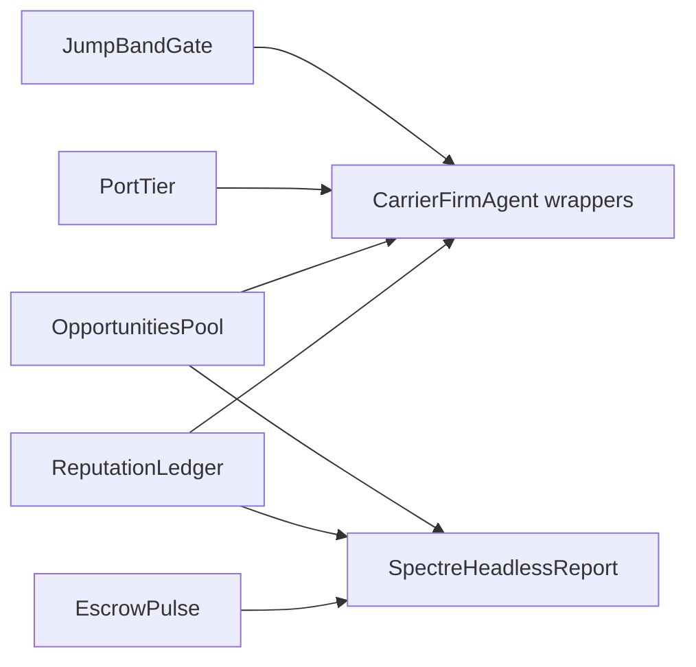

# CCA / Meridian commerce teeth

## Chosen package (from docs)

From [`commerce-stack.md`](novolis-apps/src/SinsOfACapitalismTycoon/docs/commerce-stack.md), [`places-and-stations.md`](novolis-apps/src/SinsOfACapitalismTycoon/docs/places-and-stations.md), [`gameplay.md`](novolis-apps/src/SinsOfACapitalismTycoon/docs/gameplay.md):

1. **Reputation → work** (`known-responsive` becomes state)
2. **Opportunities pool** (recurring ugly standby; refusal ≠ premium hit)
3. **CCA escrow + fee line** (5% issuer / ≥10% contractor on tramp deliveries)
4. **Port-tier overlays** on existing roles (dwell / toll / premium / berth fee spice)
5. **Jump-band refuse** (long+dense Priority refused unless escrow/Priority premium covers wear)
6. **Tramp biographies** in Spectre (mega panel pattern for top owner-masters)
7. **Hull lien on venture default** (debt follows the hull — light)

**Out of this pass:** HILS/C-series, piracy, passengers, Avalonia, Keystone succession, species packs ([`roadmap.md`](novolis-apps/src/SinsOfACapitalismTycoon/docs/roadmap.md)).

Architecture stays **Sins `Universe/` + thin library hooks only** (same rule as living-campaign plan). Ops vs Core never summed.



---

## Phase 1 — Reputation becomes currency

**Today:** [`CampaignDramaHost`](novolis-apps/src/SinsOfACapitalismTycoon/Universe/Drama/CampaignDramaHost.cs) pays a cash kicker and emits `known-responsive`; no lasting state.

**Do:**
- New [`Universe/Commerce/ReputationLedger.cs`](novolis-apps/src/SinsOfACapitalismTycoon/Universe/Commerce/ReputationLedger.cs): per-firm score (0–100), bump on ugly-standby completion / known-responsive / on-time Final delivery; decay slowly weekly.
- Wire into tramp `CarrierFirmAgent` construction in [`SinsAgents.cs`](novolis-apps/src/SinsOfACapitalismTycoon/Universe/Agents/SinsAgents.cs): effective `MinMargin` = `CampaignWorld.MinMargin * (1.05 - score/500)` (high rep → slightly greedier pick / more jobs clear margin).
- Standby / Opportunities prefer highest-rep operable tramp (not first `CanOperate`).
- Spectre: small “Reputation” column or table; milestone stays greppable.

---

## Phase 2 — Opportunities pool (Meridian ugly money)

**Today:** one-shot `UglyStandby` on day 18.

**Do:**
- Extract standby into [`Universe/Commerce/OpportunitiesPool.cs`](novolis-apps/src/SinsOfACapitalismTycoon/Universe/Commerce/OpportunitiesPool.cs): seed-deterministic offers every ~35–45 days (hash `seed ^ day`), retainer from Station, 14-day window, completion kicker.
- **Refusal ≠ premium hit:** declining/missing the window only logs `standby-pass` (no `ActuarialLoad` / premium bump).
- Accept path: same ledger posts as today + `ReputationLedger` bump on completion.
- Keep first d18 event for early life-moment scorecard; later pulses reuse the pool.

---

## Phase 3 — Escrow + fee line (ops-led)

**Today:** freight cash is implicit; no hold-until-delivery.

**Do (app-level, no Core `LossEvent` required):**
- [`Universe/Commerce/EscrowPulse.cs`](novolis-apps/src/SinsOfACapitalismTycoon/Universe/Commerce/EscrowPulse.cs) on day tick:
  - On tramp `PlanShipment` / leg start (observe pending or underway): Station holds **contract value** from Industry/Station buyer (`issuer fee 5%` burned as Station revenue; principal parked in a simple `EscrowBook` dictionary keyed by shipment/firm).
  - On `ShipmentDelivered`: release principal to carrier minus **contractor skim ≥10%** (insurance-adjacent fee → underwriter), rest to tramp cash.
  - On `Cancelled` / stall-abandon: clawback to buyer; optional small lien flag on registry entry.
- Spectre: escrow open / released / clawed counts; `MILESTONE: escrow` rare (first of day or large clawback).
- Money rule: all Ops `FirmLedger` posts; never touch Core books.

---

## Phase 4 — Port tiers + jump-band refuse

**Port tiers** ([`places-and-stations.md`](novolis-apps/src/SinsOfACapitalismTycoon/docs/places-and-stations.md)):
- Map `SystemRole` → tier tag in [`RoleAssigner`](novolis-apps/src/SinsOfACapitalismTycoon/Universe/RoleAssigner.cs) or thin `PortTier.cs`: Capital=`hub`, Industrial=`refinery`, Mining/Transit edge=`edge`, Waypoint=`edge`, etc.
- Apply multipliers when seeding/adjusting hubs in [`AstroEconomyBridge`](novolis-apps/src/SinsOfACapitalismTycoon/Universe/AstroEconomyBridge.cs) / runtime reads: fee-heavy hubs ↑ dwell/toll; shady-orderly ↓ inspection friction (premium mult 0.95); edge ↑ fuel scarcity already exists — add small berth/standing fee via Station posts when carriers use Capital/Industrial hubs (daily aggregate, not per-tick spam).
- Spectre header / bios: role + tier tag (`Sol · hub`).

**Jump-band refuse** ([`commerce-stack.md`](novolis-apps/src/SinsOfACapitalismTycoon/docs/commerce-stack.md) “12 ly dense sprint”):
- In tramp planning wrapper (Sins gate around `CarrierFirmAgent` / `TransitChooser`): if corridor `Difficulty >= 2.5` **and** profile would be Priority **and** cargo is dense (Parts/Goods) **and** haul hours proxy high → refuse unless firm `Reputation >= 40` **or** escrow already open for that firm that day.
- Emit `MILESTONE: jump-refuse` (AddOnce per day) so Spectre shows the James-line rule firing.
- Library change only if needed: optional `Func<…,bool> RefuseJob` on `CarrierFirmAgent` (conservative, default null). Prefer app-side filter before enqueue when possible.

---

## Phase 5 — Hull lien + tramp biographies

**Lien (debt follows hull):**
- On venture creation, tag registry entry `LienPrincipal` from the hull loan.
- If tramp stays uninsured past grace **and** lien > 0: Station clawback / suspend until lien service payment (`DriveMaintenancePulse`-style cash post); `MILESTONE: lien`.
- Keeps Willie cautionary beat without Keystone death sim.

**Tramp bios:**
- Extend [`SpectreHeadlessReport`](novolis-apps/src/SinsOfACapitalismTycoon/Universe/Reporting/SpectreHeadlessReport.cs): after mega panel, show top 2 owner-masters by legs (from existing [`ShipBiographyLog`](novolis-apps/src/SinsOfACapitalismTycoon/Universe/Drama/ShipBiographyLog.cs)).

---

## Docs + rigor

Update: `commerce-stack.md`, `ship-law-and-transit.md`, `gameplay.md`, `cli-and-reports.md`, `places-and-stations.md` (tier→code table), `roadmap.md` “recently landed” bullets.

Validation (ProjectRef, from `d:\novolis`):

```powershell
dotnet build novolis-apps/src/SinsOfACapitalismTycoon -p:NovolisUseProjectReferences=true
dotnet run --project novolis-economy/tests/Novolis.Economy.Unit -p:NovolisUseProjectReferences=true
dotnet run --project novolis-apps/src/SinsOfACapitalismTycoon -p:NovolisUseProjectReferences=true -- --engine campaign --days 100d --seed 1001 --quiet
pwsh -File novolis-governance/scripts/verify-nuget-only.ps1
```

Acceptance greps on `100d`: `MILESTONE: ugly-standby` (or pool), `known-responsive` / rep table, `escrow` or fee evidence, `jump-refuse` or tier tag on bios, tramp biography panel, Bulk River still registered (no GUID clash regression).

