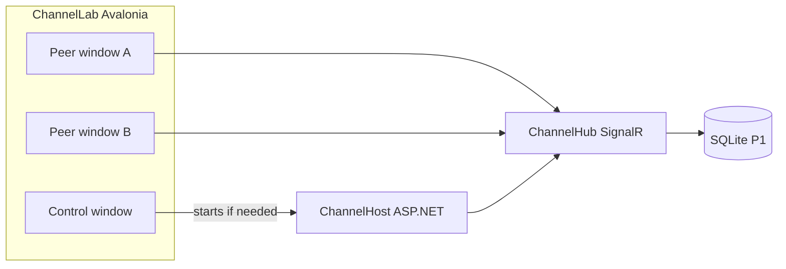

# ChannelLab — Avalonia IRC starting point

## Decision

Build in **[novolis-dogfooding](d:\novolis\novolis-dogfooding)** (not Voxa, not novolis-apps). Product shape from the first-principles canvas: Nick / Channel / Message / Presence; video is a later channel mode, not the host’s reason to exist.

**Defaults locked:** Windows Avalonia app; separate tiny ASP.NET host process; guest `PlayerRef` nicks; single hard-coded channel `#lobby` in P0; SQLite scrollback in P1; WebRTC mesh only after text works.

## Architecture



- **ChannelHost** — one process, one hub, in-memory channel state (P0), SQLite append (P1).
- **ChannelLab** — multi-window: control window boots/stops host and opens peer windows so two nicks prove fan-out on one machine.
- Identity via [`Novolis.Game.Identity`](d:\novolis\novolis-gaming\src\Novolis.Game.Identity) + [`Novolis.Game.Identity.AspNetCore`](d:\novolis\novolis-gaming\src\Novolis.Game.Identity.AspNetCore) claim bridge (`PlayerRefFactory.CreateGuest`, `ToPlayerRefClaim` / `TryGetPlayerRef`).
- Realtime: app-owned `ChannelHub` using ASP.NET SignalR + those claims. Do **not** force-fit [`GameLobbyHubBase`](d:\novolis\novolis-gaming\src\Novolis.Game.Multiplayer.AspNetCore\GameLobbyHubBase.cs) (lobby/ready semantics). Do **not** put SignalR into `novolis-transports` ([gaming-layer-policy](d:\novolis\novolis-governance\docs\gaming-layer-policy.md)).
- History: [`Novolis.Storage.Sqlite`](d:\novolis\novolis-storage\src\Novolis.Storage.Sqlite) in P1 only.
- **Out of scope for this plan’s ship gate:** LiveKit/Coturn, Raven, Duende, YARP, workspaces/admin, WebView video (P2 follow-up once P0–P1 green).

## Layout (UI)

One composition per peer window (IRC classic, not SaaS dashboard):

- Left rail: channel list (P0: `#lobby` only)
- Center: scrollback + single-line composer
- Right: namelist (presence)
- Chrome: nick, connection state, controls to spawn peers / restart host

No Inter brand font; keep Fluent theme. No cards-for-everything — buffer + lists.

## Project layout

```
d:\novolis\novolis-dogfooding\apps\avalonia\ChannelLab\
  ChannelLab.csproj          # WinExe Avalonia
  ChannelHost\
    ChannelHost.csproj        # Web SDK, SignalR
  README.md
```

PackageReferences (central versions already managed in dogfooding): Avalonia / Avalonia.Desktop / Fluent; `Microsoft.AspNetCore.SignalR.Client` on the client; host uses `Microsoft.NET.Sdk.Web`; `Novolis.Game.Identity`, `Novolis.Game.Identity.AspNetCore`; P1 adds `Novolis.Storage.Sqlite`. Consume via PackageReference (GPR); use Platform slnx / `-p:NovolisUseProjectReferences=true` only for local iteration.

## Protocol (minimal)

Host HTTP:

- `POST /api/guest` `{ "nick": "alice" }` → issues cookie or bearer carrying `novolis:player_ref` + display name (simplest: cookie auth for SignalR on localhost).

Hub methods / events:

| Direction | Name | Payload |
|-----------|------|---------|
| Client→Server | `Join` | `channel` |
| Client→Server | `Part` | `channel` |
| Client→Server | `Say` | `channel`, `body` |
| Server→Group | `Message` | `channel`, `nick`, `body`, `at` |
| Server→Group | `Roster` | `channel`, `nicks[]` |

P0: only `#lobby`. Reject empty say; truncate body (e.g. 2k chars).

## Implementation slices

### P0 — Wire (ship gate)

1. **ChannelHost** `Program.cs`: cookie/guest login, `MapHub<ChannelHub>("/hubs/channel")`, in-memory `ChannelDirectory` (members + optional ring buffer of last ~100 messages for late joiners without SQLite yet).
2. **ChannelHub**: resolve caller via `TryGetPlayerRef`; `Groups.AddToGroupAsync` per channel; broadcast `Message` / `Roster`.
3. **ChannelLab**: control window starts `dotnet`/`ChannelHost` on fixed port (e.g. `5177`) if health check fails; peer window = nick prompt → connect → join `#lobby` → bind scrollback/namelist/composer.
4. **Dogfood proof:** open two peers with different nicks; Say in A appears in B; Part updates roster.
5. README with absolute-path run commands.

### P1 — Memory

- On `Say`, append to SQLite via Novolis.Storage.Sqlite under `%LocalAppData%/Novolis/ChannelLab/`.
- On `Join`, send scrollback (last N) as a burst of `Message` or one `History` event.
- Keep SignalR path identical; persistence is host-side only.

### P2 — Face (explicit follow-up, not P0 blocker)

- Same hub grows `Signal` / ICE relay messages; Avalonia embeds a WebView media pane (new Avalonia WebView package — not LiveKit). Mesh only, 3–4 peers. Text path must keep working if WebView fails.

## Run targets (docs)

```powershell
dotnet run --project d:\novolis\novolis-dogfooding\apps\avalonia\ChannelLab\ChannelHost\ChannelHost.csproj
dotnet run --project d:\novolis\novolis-dogfooding\apps\avalonia\ChannelLab\ChannelLab.csproj
```

Prefer control-window auto-start host for the happy path (one F5).

## Non-goals

- Porting or depending on [frankhaugen/Voxa](https://github.com/frankhaugen/Voxa)
- Aspire AppHost / SQL Edge / Redis for P0–P1
- Mobile / Blazor
- Extracting a `Novolis.Chat.*` package before the dogfood loop works

## Success criteria

- Cold start on one Windows machine: control window → two peers → bidirectional chat in `#lobby` without Docker.
- Only Novolis + Avalonia + ASP.NET dependencies.
- README states P2 video is deferred and must not reshape the host.

