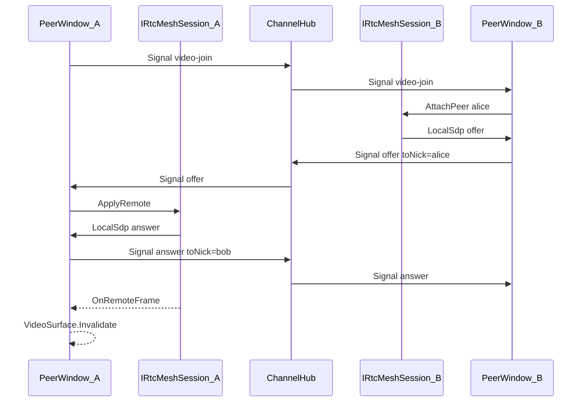

# ChannelLab mesh video (Avalonia + Novolis libraries)

## Approach (locked)

**No WebView, no HTML/JS, no browser WebRTC.** Media plane is native .NET + Avalonia controls. Missing platform pieces are **new Novolis packages**. ChannelHost **SignalR** remains the signaling bus (already in ChannelLab; not a browser UI).

Mesh: up to **4** peers in `#lobby`. No LiveKit / Coturn / SFU.

Third-party (nuget.org only): **SIPSorcery** + **SIPSorceryMedia.Windows** (webcam / encode helpers). Wrapped behind Novolis abstractions so ChannelLab never talks to SIPSorcery types directly.

## New Novolis packages

### In [novolis-audio](d:\novolis\novolis-audio) (realtime media next to capture)

| Package | Role |
|---------|------|
| `Novolis.Media.Rtc.Abstractions` | `VideoFrame` (RGB24/BGRA + width/height/stride), `RtcSignalKind`, `RtcSignalMessage`, `IRtcMeshSession` (JoinVideo / PartVideo / HandleSignal / events for local signals + remote frames + peer list) |
| `Novolis.Media.Rtc` | SIPSorcery `RTCPeerConnection` mesh: polite peer = greater nick; max 4 peers; host provides signaling via callbacks (no HTTP/WebSocket inside the package) |
| `Novolis.Media.Capture.Windows` | Webcam (+ mic if trivial) implementing capture interfaces used by `Novolis.Media.Rtc` on Windows |

Packable, `2026.1.*`, regenerate Platform map via [`Generate-Platform-Slnx.ps1`](d:\novolis\novolis-governance\build\Generate-Platform-Slnx.ps1). Local dogfood builds with `-p:NovolisUseProjectReferences=true` until GPR publish.

### In [novolis-avalonia](d:\novolis\novolis-avalonia)

| Package | Role |
|---------|------|
| `Novolis.Avalonia.Media` | `VideoSurface` — Avalonia control that accepts `VideoFrame` updates onto a `WriteableBitmap` (local preview + remote tiles). No web controls. |

## ChannelHost (signaling only)

In [ChannelHub.cs](d:\novolis\novolis-dogfooding\apps\avalonia\ChannelLab\ChannelHost\Hubs\ChannelHub.cs) + [ChannelDirectory.cs](d:\novolis\novolis-dogfooding\apps\avalonia\ChannelLab\ChannelHost\Services\ChannelDirectory.cs):

- DTO `SignalEnvelope(channel, fromNick, kind, payload, toNick?)`.
- Hub `Signal(channel, kind, payload, toNick?)`: kinds `video-join` / `video-part` / `offer` / `answer` / `ice`; target nick or others-in-group; reject `video-join` at **4** video participants.
- Clear video membership on disconnect / `Part`.
- Text path unchanged.

## ChannelLab client

- [ChannelSession.cs](d:\novolis\novolis-dogfooding\apps\avalonia\ChannelLab\Services\ChannelSession.cs): `SendSignalAsync` + `SignalReceived`.
- New `MeshVideoController`: owns `IRtcMeshSession`, maps SignalR ↔ session, pushes frames to `VideoSurface` instances.
- [PeerWindow.cs](d:\novolis\novolis-dogfooding\apps\avalonia\ChannelLab\Windows\PeerWindow.cs): **Video** toggle; strip of Avalonia `VideoSurface` tiles (local + remotes); chat layout unchanged; Video off or capture failure must not break Say/Join.
- [ControlWindow.cs](d:\novolis\novolis-dogfooding\apps\avalonia\ChannelLab\Windows\ControlWindow.cs): drop “video deferred” copy.
- PackageReferences: `Novolis.Media.Rtc`, `Novolis.Media.Capture.Windows`, `Novolis.Avalonia.Media` (plus existing Identity / SignalR client).

**Explicitly out:** `Avalonia.Controls.WebView`, `mesh.html` / `mesh.js`, LiveKit, Coturn, browser `getUserMedia`.

## Proof / docs / publish

- [ChannelSmoke](d:\novolis\novolis-dogfooding\apps\avalonia\ChannelLab\ChannelSmoke): signaling-only (`video-join` + fake `offer` payload fan-out). No camera in CI.
- Manual: two peer windows, Video on, local + remote tiles (Windows camera permission).
- README: MediaSession = Avalonia + Novolis.Media.Rtc mesh; max 4; no SFU / no WebView.
- After packages land: GPR publish from audio + avalonia; dogfooding stays PackageReference-only on `main`.

## Constraints

- Avalonia UI only for video presentation.
- New capabilities live in Novolis packages, not ad-hoc SIPSorcery calls in the app.
- No “bridge” wording in UI/docs.
- Windows-first capture package; abstractions stay platform-neutral.
