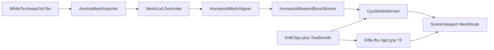

# Character auto-skin framework + CharacterLab

## Problem (from your screenshot)

- Cyan wireframe = AdaptiveMesh **hull**, not WhiteTechwearGirl.
- `WhiteTechwearGirl.fbx` has **0 bones / 0 animations** (Assimp). Nothing to play until we invent weights.
- Rifle is ~2.9M tris and currently rigid-transformed with a bad euler, so it skewers the torso.
- Full-res CPU skin at 60 Hz is not viable (~2.8M character verts).

## Chosen approach

**Auto-skin in platform packages** (nearest-bone linear blend skinning onto `HumanoidBone`), plus a **realtime LOD** of the character. CharacterLab drives that skinned LOD with the existing drill clip + hand IK; rifle stays a **rigid** attachment from the right-hand grip (transform only).

Mixamo/Blender re-export with author weights is a later quality upgrade via Assimp bone-weight import; not required for this pass.

## Platform work

### 1. Realtime LOD — [`novolis-math/src/Novolis.Math.Geometry`](novolis-math/src/Novolis.Math.Geometry)

Add `MeshLod.Decimate(TriangleMesh, int targetTriangleCount)` (simple: spatial-bin / random-face subsample + weld, good enough for dogfood). Target for CharacterLab: **~12k–25k tris**.

### 2. Align + auto-skin — [`novolis-simulation/src/Novolis.Simulation.Humanoid.Skinning`](novolis-simulation/src/Novolis.Simulation.Humanoid.Skinning)

- `HumanoidMeshAligner.FitToBindPose(EditableMesh, HumanoidBindPose)` — uniform scale to height, feet on Y=0, center XZ on hips (assumes upright +Y mesh).
- `HumanoidNearestBoneSkinner.Bind(TriangleMesh, HumanoidBindPose, int influences = 4)` → `SkinnedHumanoidMesh`:
  - For each vertex, weight the K nearest bind joints (distance falloff), normalize.
  - Inverse binds via existing `SkinnedHumanoidMesh.CreateTranslationInverseBinds` (good enough for first dogfood; full rotation binds can follow).
- Unit tests in `Novolis.Simulation.Humanoid.Unit` (single-bone move; multi-bone hand reach).

Document in the Skinning README: unrigged FBX → LOD → Align → Bind → `CpuSkinDeformer`.

### 3. Optional Assimp skin hook (thin)

In [`AssimpMeshImporter`](novolis-cad/src/Novolis.Modeling.Import/AssimpMeshImporter.cs) (or sibling): if `mesh.HasBones`, export weights mapped by bone name → `HumanoidBone` when names match Mixamo; otherwise ignore. Unblocks a future Mixamo FBX without blocking this demo.

## CharacterLab dogfood

Rewrite [`DrillParadeDriver.cs`](novolis-dogfooding/apps/avalonia/CharacterLab/Demo/DrillParadeDriver.cs):

1. Load `assets/character/WhiteTechwearGirl.fbx` → LOD → align → `HumanoidNearestBoneSkinner.Bind`.
2. Each tick: sample drill clip → IK hands onto rifle grips → `CpuSkinDeformer.Deform` → `MeshEditBake.WriteBaked` on the **character** `MeshNode`.
3. Remove AdaptiveMesh as the primary visible body (optional: debug toggle for hull).
4. Rifle: keep Assimp import once; each frame set `Transform` from **grip matrix** (hand position + barrel axis Order/Present/Salute)—fix the current euler so it no longer lies through the chest.
5. UI copy: phase label + one honest line that weights are auto-assigned (FBX had no skeleton).

Packages to add on [`CharacterLab.csproj`](novolis-dogfooding/apps/avalonia/CharacterLab/CharacterLab.csproj): already has Skinning; ensure Math.Geometry LOD is reachable.

## Success criteria

- Viewport shows **WhiteTechwearGirl** (shaded LOD), not cyan T-pose hull alone.
- Body moves through Order → Present → Salute in 3D.
- Rifle stays at the side / in hands / steadied on salute—not stuck through the torso.
- Auto-skin APIs are reusable outside CharacterLab (tests green).

