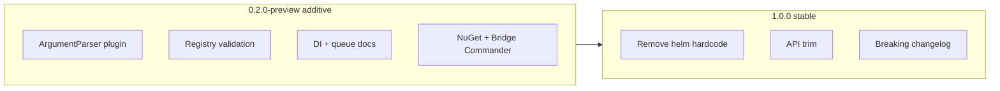

# novolis-commands: production shippable plan

## Current state (baseline)

| Area | Status |
|------|--------|
| Architecture | Clear parse vs execute split ([design.md](d:\novolis\novolis-commands\docs\design.md)) |
| Tests | ~1,179 engine + queue + abstractions tests; bridge scenes + natural orders |
| CI / release | [ci.yml](d:\novolis\novolis-commands\.github\workflows\ci.yml) + [release.yml](d:\novolis\novolis-commands\.github\workflows\release.yml) via novolis-workflows |
| Registry | Listed in novolis-registry (`0.1.0-preview.1`) |
| Consumers | [BridgeCommander](d:\novolis\novolis-dogfooding\apps\BridgeCommander) uses **project refs**, not NuGet |
| Blocker | Engine hardcodes `helm.set-heading` + [HeadingArgumentParser](d:\novolis\novolis-commands\src\Novolis.Commands.Engine\HeadingArgumentParser.cs) (contradicts “no game-specific definitions”) |
| Docs drift | [getting-started.md](d:\novolis\novolis-commands\docs\getting-started.md) still shows `Integer("heading")`; design doc omits `help` built-in |

## Definition of done

**0.2.0-preview:** Additive only; published to NuGet; Bridge Commander consumes packages; heading grammar works via extension (old hardcoded path can remain deprecated parallel); registry validation; queue semantics documented and tested.

**1.0.0:** Remove deprecated paths and dead API; engine has zero domain command names; stable docs; second consumer sign-off or explicit platform approval; semver policy in CHANGELOG.



---

## Release 0.2.0-preview (additive)

### 1. Pluggable argument parsing (additive; keep legacy path)

**Goal:** Hosts register custom parsers without forking the engine. Bridge Commander owns 3D heading grammar.

**New surface (Engine + Abstractions as needed):**

- `ICommandArgumentParser` — `bool TryParse(CommandDefinition definition, IReadOnlyList<string> argumentTokens, out IReadOnlyDictionary<string, object?> arguments, out ParseFailure? failure)`
- `ICommandArgumentParserRegistry` — resolve parser by command name or by `CommandDefinition.ArgumentParserKey`
- Extend [CommandDefinition](d:\novolis\novolis-commands\src\Novolis.Commands.Engine\CommandDefinition.cs) / builder with optional `argumentParserKey` (e.g. `"heading3d"`)
- [CommandParser.BuildSuccess](d:\novolis\novolis-commands\src\Novolis.Commands.Engine\CommandParser.cs): if key present → registry; else if name is `helm.set-heading` → **existing** `HeadingArgumentParser` (deprecated, `[Obsolete]` comment in code); else default int/string/double loop

**Bridge Commander:**

- New file e.g. `Bridge/BridgeHeadingArgumentParser.cs` — move logic from [HeadingArgumentParser.cs](d:\novolis\novolis-commands\src\Novolis.Commands.Engine\HeadingArgumentParser.cs) + [AxisNumberParser.cs](d:\novolis\novolis-commands\src\Novolis.Commands.Engine\AxisNumberParser.cs) (or reference engine internals if kept `internal` — prefer **copy/move to dogfood** for 1.0 removal)
- Wire parser in `BridgeCommandService` / engine construction: `new CommandEngine<>(registry, resolver, parsers: registryWithHeading3d)`
- Register `helm.set-heading` with `argumentParserKey: "heading3d"` in [BridgeCommandRegistry.cs](d:\novolis\novolis-dogfooding\apps\BridgeCommander\Bridge\BridgeCommandRegistry.cs)

**Tests:**

- Engine: generic parser registry tests (mock parser)
- Move heading/comma-decimal tests to Bridge Commander test project **or** keep in engine against `HeadingArgumentParser` until 1.0 (mark `[Obsolete]` tests)
- All existing [NaturalOrderTests](d:\novolis\novolis-commands\tests\Novolis.Commands.Engine.Tests\NaturalOrderTests.cs) still pass via legacy path in 0.2

### 2. Registry validation at build/DI time

**New:** `CommandRegistryValidator` + optional `IValidateOptions<CommandRegistryOptions>` or validate inside `CommandRegistryBuilder.Build()`.

**Checks:**

- Duplicate verb phrases within same context → build exception with clear message
- Duplicate command names
- Empty verb list
- Unknown `argumentParserKey` (no parser registered when engine is constructed — validate at engine ctor if registry passed in)
- Warn (or fail) when same phrase appears in **different** contexts (informational in 0.2)

**Tests:** dedicated `CommandRegistryValidatorTests.cs`

### 3. Queue contract clarity (behavior + tests, minimal code change)

Document and test actual semantics:

| Flag / command | Current behavior | 0.2 action |
|----------------|------------------|------------|
| `InterruptsCurrentCommand` | Runner cancels in-flight CTS, awaits task | Keep; add integration test |
| `CancelsQueuedCommands` | Flag on envelope only; channel **not** drained | Document in design + XML; add `ICommandQueue` optional `ClearAsync()` **or** runner skips until drain API in 1.0 |
| `repeat last` | Host/processor only | Document as host responsibility |

**0.2 minimum:** extend [CommandQueueRunnerTests](d:\novolis\novolis-commands\tests\Novolis.Commands.Queueing.Tests\CommandQueueRunnerTests.cs) + design.md table for `help`; add test that enqueue-after-`clear queue` behavior is explicit (even if still host-defined).

**Optional 0.2 additive:** `ChannelCommandQueue.ClearPendingAsync()` + runner calls it when processing `system.clear-queue` — only if you want built-in clear to be real without breaking hosts (feature-flag or new interface member).

### 4. DI and host wiring story

Extend [ServiceCollectionExtensions](d:\novolis\novolis-commands\src\Novolis.Commands.DependencyInjection\ServiceCollectionExtensions.cs):

```csharp
AddNovolisCommands<TContext>(
    Action<CommandRegistryBuilder>? configureRegistry,
    Action<CommandEngineOptions>? configureEngine = null)
```

`CommandEngineOptions`: register `ICommandArgumentParser` instances, optional custom `BuiltInCommandMatcher`.

Add overload or extension `AddNovolisCommandRunner<TContext>()` registering `CommandQueueRunner<TContext>` (processor still host-provided).

Update [getting-started.md](d:\novolis\novolis-commands\docs\getting-started.md) with full wiring diagram and 3D heading example via custom parser.

### 5. Parse UX (additive, optional but recommended for 0.2)

**Failure hints:** when `UnknownCommand`, attach `ParseFailure` detail or `ParseResult.Suggestions` (top 3 verb phrases by Levenshtein from registry for current context). Bridge Commander can show in history secondary lines.

Keep behind small internal `CommandSuggestionService` — no NLP.

### 6. Documentation and packaging (0.2)

| Artifact | Action |
|----------|--------|
| [docs/design.md](d:\novolis\novolis-commands\docs\design.md) | Add `help`, argument parser plugin, queue clear semantics |
| [docs/getting-started.md](d:\novolis\novolis-commands\docs\getting-started.md) | Match current API (phrases, comma decimals, parser registration) |
| `CHANGELOG.md` | Start; document 0.1 → 0.2 additive |
| XML docs | All public types in Abstractions + Engine + Queueing |
| Version | Bump all csproj + [novolis-registry](d:\novolis\novolis-registry\packages) to `0.2.0-preview.1` |

### 7. Bridge Commander on NuGet (dogfood gate)

- Switch [BridgeCommander.csproj](d:\novolis\novolis-dogfooding\apps\BridgeCommander\BridgeCommander.csproj) from project refs to `PackageReference` `0.2.0-preview.1`
- Manual checklist: four natural orders + KR-12 scene + belay interrupt
- Fix dogfooding solution CI if package restore path needed

### 8. CI quality gates (0.2)

- Ensure shared workflow runs `dotnet test` on all test projects (including [Abstractions.Tests](d:\novolis\novolis-commands\tests\Novolis.Commands.Abstractions.Tests))
- Add coverage threshold (suggest 80% line on Engine + Queueing) in workflow if novolis-workflows supports it
- Publish GitHub release → verify NuGet push

---

## Release 1.0.0 (breaking cleanup, after NuGet dogfood)

### 9. Remove domain leakage from engine

- Delete `HeadingArgumentParser`, `AxisNumberParser` from Engine (live only in Bridge Commander)
- Remove `helm.set-heading` branch from [CommandParser.cs](d:\novolis\novolis-commands\src\Novolis.Commands.Engine\CommandParser.cs)
- Engine tests: drop legacy heading-specific cases from engine; keep grammar tests in dogfood or new `BridgeCommander.Tests` if added

### 10. Public API audit (breaking)

| Item | 1.0 action |
|------|------------|
| `GetActiveContextWord` | Remove from [ICommandContextResolver](d:\novolis\novolis-commands\src\Novolis.Commands.Engine\ICommandContextResolver.cs) or mark obsolete in 0.2, remove in 1.0 |
| `ParseFailureCode.NotAllowed` / `RequiresConfirmation` | Remove **or** implement (recommend remove unless product needs them) |
| `CommandCandidate.Confidence` | Document as heuristic 0–1 or remove if unused |
| `CommandArgumentKind.Double` | Keep if default parser uses it; else consolidate |

### 11. Queue: production semantics for `clear queue`

Pick one policy for 1.0 and test it:

- **A (recommended):** `CommandQueueRunner` drains pending channel items when envelope has `CancelsQueuedCommands` before starting next command
- **B:** `clear queue` only sets flag; documented host must drain — remove `CancelsQueuedCommands` from abstractions

Implement A + tests so Bridge Commander behavior matches player expectation.

### 12. 1.0 docs and release

- `CHANGELOG.md` — breaking changes section
- `docs/migration-v02-to-v10.md` — parser registration, removed APIs
- Version `1.0.0` on NuGet + registry
- Bridge Commander → `1.0.0` package refs
- Governance row in [frank-naming-and-structure.md](d:\novolis\novolis-governance\docs\frank-naming-and-structure.md) updated to stable

---

## Risk register

| Risk | Mitigation |
|------|------------|
| `helm course` vs `nav course` phrase collision | Registry validator warns on cross-context shared phrases; document in host guide |
| Breaking Bridge Commander on 1.0 | Dogfood entire 0.2 preview cycle on NuGet first |
| Scope creep (full NLP) | Explicit non-goal; suggestions = Levenshtein on registered phrases only |
| Clear-queue semantics change breaks hosts | Additive drain in 0.2 behind runner check; default on in 1.0 with release note |

---

## Suggested execution order

1. Argument parser plugin + Bridge heading parser (0.2)
2. Registry validator (0.2)
3. Docs + CHANGELOG + version bump (0.2)
4. Bridge Commander NuGet dogfood (0.2 gate)
5. Failure suggestions (0.2 if time)
6. Queue drain + DI extensions (0.2/1.0 split as above)
7. 1.0 breaking removal + stable release

---

## Out of scope (post-1.0)

- Speech / LLM intent parsing
- Source-generated registries from attributes
- Localization of failure messages
- `Novolis.Commands.Parsers.*` optional packages (only if a second game needs heading3d)

