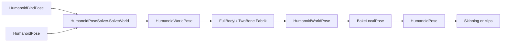

# Complete kinematics & IK

## Baseline (already done — do not redo)

From [kinematics_ik_roadmap_099d1f86.plan.md](d:\novolis\.cursor\plans\kinematics_ik_roadmap_099d1f86.plan.md):

- Placement docs (Humanoid vs Kinematics vs Joints)
- [`FabrikChain`](d:\novolis\novolis-simulation\src\Novolis.Simulation.Humanoid\FabrikChain.cs), [`HumanoidChainIk`](d:\novolis\novolis-simulation\src\Novolis.Simulation.Humanoid\HumanoidChainIk.cs), [`HumanoidFullBodyIk`](d:\novolis\novolis-simulation\src\Novolis.Simulation.Humanoid\HumanoidFullBodyIk.cs)
- Unit tests + Reach pane (auto-oscillation only)
- Canvas gap rows marked ready

## Remaining gaps

| Gap | Why it blocks “complete” |
|-----|--------------------------|
| No world→local bake | IK mutates `HumanoidWorldPose` only; clips/`HumanoidPose` cannot consume results |
| Reach is auto-only | Roadmap Phase 3 asked for drag/target; [`ReachDemo`](d:\novolis\novolis-dogfooding\apps\avalonia\HumanoidLab\Demo\ReachDemo.cs) only oscillates |
| No joint limits | Limbs can hyperextend / twist through poles |
| No headless smoke | Walk/Bow/Reach not covered by a CI-friendly smoke like ClothPlay |
| GPR | Consumers still need ProjectRef until Humanoid publishes |

Still **out of scope** (same as prior plan): Jacobian, CCD, rename `Simulation.Kinematics`, separate `Simulation.Ik` package.



## Phase A — Bake local pose

Add to [`HumanoidPoseSolver`](d:\novolis\novolis-simulation\src\Novolis.Simulation.Humanoid\HumanoidPoseSolver.cs) (or sibling static helper):

- `BakeLocal(HumanoidBindPose bind, HumanoidWorldPose world, HumanoidPose destination)`
  - Root: `destination.RootTranslation = world.Position(Hips)`; local hip rotation from world
  - For each non-root bone: `local = Inverse(parentWorldRot) * childWorldRot` (normalize)
- Round-trip unit test: FK → bake → FK reproduces positions within ~1e-3

## Phase B — Soft joint limits

In `TwoBoneIk.ApplyLimb` (bind-aware path) and/or a thin `HumanoidIkLimits` helper used by `HumanoidFullBodyIk`:

- Clamp mid-joint bend so elbow/knee stay on the correct side of the pole (reject inverted bend)
- Optional max stretch already implied by bone lengths; document poles
- Unit test: target that would invert the knee still yields correct-side mid joint

## Phase C — Interactive Reach dogfood

Update HumanoidLab:

1. [`StickFigurePane`](d:\novolis\novolis-dogfooding\apps\avalonia\HumanoidLab\Ui\StickFigurePane.cs) — pointer hit-test in FrontXy: pick nearest overlay target (L/R hand, head); drag updates world-plane X/Y; expose `TryScreenToWorld` / drag callbacks
2. [`ReachDemo`](d:\novolis\novolis-dogfooding\apps\avalonia\HumanoidLab\Demo\ReachDemo.cs) — keep idle sway when not dragging; while dragging, pin selected effector and call `HumanoidFullBodyIk.Apply`; after IK, `BakeLocal` so pose state persists across frames
3. README — note click-drag on Reach pane

## Phase D — Smoke + docs + publish path

- Add `HumanoidLab --smoke` (or small console smoke in the same project): bind → FK → FullBodyIk dual hands → bake → assert hand error &lt; 1e-2 and hips stable
- Short “IK” subsection in Humanoid README (already partially there) + one recipe in simulation docs if a getting-started IK section exists
- Verify:

```powershell
dotnet test d:\novolis\novolis-simulation\tests\Novolis.Simulation.Humanoid.Unit\Novolis.Simulation.Humanoid.Unit.csproj -p:NovolisUseProjectReferences=true
dotnet run --project d:\novolis\novolis-dogfooding\apps\avalonia\HumanoidLab -p:NovolisUseProjectReferences=true -- --smoke
```

- After merge to `main`, CI publishes `Novolis.Simulation.Humanoid` to GitHub Packages (no local feed)

