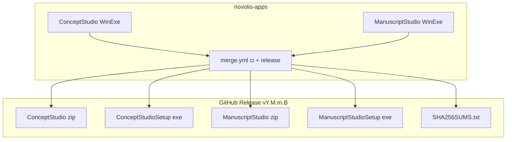
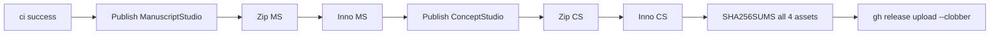

# Concept Studio — simple 2D/3D concept CAD for book ship art

## What you asked for vs what exists

| Need | Off-the-shelf gap | Novolis today |
|------|-------------------|---------------|
| Simple 3D blockout (not FreeCAD) | Most tools are either toy (TinkerCAD) or heavy | [Mesh Studio (MeshBench)](d:\novolis\novolis-dogfooding\apps\rendering\MeshBench) — box/sphere, orbit preview, CAD-ish `MaterialPresets` |
| C4D-style primitives | — | Only box + sphere in MeshBench; cylinder/cone exist in math but unwired |
| CAD materials (matte hull, metal, glass) | Blender = node graphs | [`MaterialPresets`](d:\novolis\novolis-rendering\src\Novolis.Rendering.Materials\Materials.cs) — Standard / Metal / Glass / Emissive presets |
| 2D technical views + dimensions | LibreCAD = 2D only, no linked 3D | **Missing** — no ortho 3D camera, no dimension model, no SVG export |
| Book-ready exports | — | PNG via Silk 2D capture; path-trace quality mode in MeshBench |
| Shipped installer | — | Manuscript Studio pattern in [`novolis-apps`](d:\novolis\novolis-apps) — Inno + merge release |

**Recommendation:** Build a **new shipped app** in `novolis-apps`. Fork Mesh Studio viewport patterns from dogfooding; reuse Manuscript Studio shell, packaging, and CI/CD infrastructure.



---

## Product shape (deliberately small scope)

**In scope (CAD-lite, not FreeCAD):**
- Primitive parts: box, cylinder, cone, wedge, sphere, ground plane
- Numeric transforms (position, uniform/non-uniform scale, Y-axis rotation for v1)
- Part hierarchy with rename/group (e.g. `Ship > Hull > Bridge`)
- Material picker: Hull (matte), Metal, Glass, Emissive — maps to existing `MaterialPresets`
- 3D orbit viewport + fixed orthographic views (Plan / Profile / Bow)
- Dimension lines and labels on ortho sheets
- Export: PNG renders + SVG technical sheet

**Explicitly out of scope (v1):**
- Constraint solver, parametric history, boolean CSG, loft/surface NURBS
- DXF/DWG import, full 2D sketcher like LibreCAD
- Blender-style node materials or sculpting
- Exact naval architecture (stations, waterlines as parametric curves) — v2+ if needed

---

## App location and repo wiring

| Decision | Choice |
|----------|--------|
| Repo | [`novolis-apps`](d:\novolis\novolis-apps) — shipped app alongside Manuscript Studio |
| Path | `src/ConceptStudio/` |
| Solution | Add to [`Novolis.Apps.slnx`](d:\novolis\novolis-apps\Novolis.Apps.slnx) |
| Bootstrap | Copy MeshBench `Program.cs` DI host + Manuscript Studio `StudioChrome` usage |
| Resizable layout | Copy [`MarkdownAuthoringWorkspace`](d:\novolis\novolis-apps\src\ManuscriptStudio\Components\MarkdownAuthoringWorkspace.cs) pattern (left tree \| center viewport \| right inspector + persisted column widths in `settings.json`) |
| Data root | `%LocalAppData%\Novolis\Concept Studio\` (matches Inno install dir convention) |
| History | **Optional v1.1:** workspace/timeline packages; plain JSON save for MVP |

### Package references (`ConceptStudio.csproj`)

Add to [`Directory.Packages.props`](d:\novolis\novolis-apps\Directory.Packages.props) (GPR `2026.1.*`, nuget.org for Avalonia):

| Package | Role |
|---------|------|
| `Novolis.Avalonia.Studio` | Chrome, feedback |
| `Novolis.Avalonia.Raylib` | Embedded 3D preview |
| `Novolis.Avalonia.Rendering` | `Rgba32FrameControl` (quality mode) |
| `Novolis.Avalonia.Packaging.Inno` | MSBuild `NovolisGenerateInnoScript` (PrivateAssets) |
| `Novolis.Raylib` | Scene draw helpers |
| `Novolis.Rendering.Scene`, `.Materials`, `.Compile`, `.Runtime`, `.Backends.Igpu`, `.DependencyInjection` | Scene compile + path trace |
| `Novolis.Rendering.Presentation.Silk` | `SilkOrbitCamera` |
| Avalonia 12, `Microsoft.Extensions.Hosting` | Shell |

**NuGet-only:** no `ProjectReference` into dogfooding or sibling repos. MeshBench code is **copied/adapted** into ConceptStudio, not referenced.

### Design doc update

Add Concept Studio section to [`docs/design.md`](d:\novolis\novolis-apps\docs\design.md) mirroring Manuscript Studio table.

---

## CI/CD and Inno installer

Follow the established Manuscript Studio pattern ([`merge.yml`](d:\novolis\novolis-apps\.github\workflows\merge.yml), [`build-installer.ps1`](d:\novolis\novolis-apps\scripts\build-installer.ps1), [`docs/release.md`](d:\novolis\novolis-apps\docs\release.md)).

### Versioning

Single repo version from [`build/version.json`](d:\novolis\novolis-apps\build\version.json) + `read-version` action. **Both apps share one GitHub Release tag** (`v{Y.M.m.B}`) with distinct asset filenames.

### Linux CI job (unchanged structure)

Existing `ci` job builds entire [`Novolis.Apps.slnx`](d:\novolis\novolis-apps\Novolis.Apps.slnx) on Ubuntu. Concept Studio must compile on Linux even though release publish targets `win-x64` only (Avalonia + no native P/Invoke at build time).

### Windows release job — extend for two apps

Refactor [`merge.yml`](d:\novolis\novolis-apps\.github\workflows\merge.yml) `release` job to publish **both** apps in one job (sequential steps, shared Inno Setup install):



**Concept Studio release env vars:**

| Variable | Value |
|----------|-------|
| `APP_PROJECT` | `src/ConceptStudio/ConceptStudio.csproj` |
| `APP_PUBLISH_DIR` | `artifacts/concept-studio/app` |
| `INSTALLER_DIR` | `artifacts/concept-studio/installer` |
| `STAGING_DIR` | `artifacts/concept-studio` |

**Inno MSBuild properties** (via `NovolisGenerateInnoScript`):

| Property | Value |
|----------|-------|
| `NovolisInnoAppName` | `Concept Studio` |
| `NovolisInnoAppExeName` | `ConceptStudio.exe` |
| `NovolisInnoAppId` | `Novolis.ConceptStudio` |
| `NovolisInnoDefaultGroupName` | `Concept Studio` |
| `NovolisInnoInstallDirName` | `Novolis\Concept Studio` |
| `NovolisInnoOutputBaseFilename` | `ConceptStudioSetup-{version}-win-x64` |
| `NovolisInnoScriptPath` | `{installerDir}\concept-studio.iss` |
| `NovolisInnoAppSupportURL` | `https://github.com/Novolis-Platform/novolis-apps/issues` |
| `NovolisInnoAppUpdatesURL` | `https://github.com/Novolis-Platform/novolis-apps/releases` |

**Release assets per merge to `main`:**

| Asset | Pattern |
|-------|---------|
| Manuscript Studio installer | `ManuscriptStudioSetup-{version}-win-x64.exe` |
| Manuscript Studio portable | `ManuscriptStudio-{version}-win-x64.zip` |
| Concept Studio installer | `ConceptStudioSetup-{version}-win-x64.exe` |
| Concept Studio portable | `ConceptStudio-{version}-win-x64.zip` |
| Checksums | `SHA256SUMS.txt` (all four files) |

Release title: `"Novolis Apps {version}"` (or keep per-app title with both asset groups listed in notes).

### Local build script

Generalize [`scripts/build-installer.ps1`](d:\novolis\novolis-apps\scripts\build-installer.ps1):

```powershell
param(
    [ValidateSet('ManuscriptStudio', 'ConceptStudio', 'All')]
    [string]$App = 'All',
    ...
)
```

Extract shared helper `Publish-NovolisApp` with per-app Inno property hashtable. Keeps local parity with CI.

### Manual republish workflow

Update [`release.yml`](d:\novolis\novolis-apps\.github\workflows\release.yml) to match `merge.yml` (currently stale — still calls deleted `generate-manuscript-studio-iss.ps1`). Add `workflow_dispatch` input `app: All | ManuscriptStudio | ConceptStudio`.

### Docs

Update [`docs/getting-started.md`](d:\novolis\novolis-apps\docs\getting-started.md):
- Download Concept Studio installer from GitHub Releases
- Checksum verification (reuse SHA256SUMS pattern)
- Upgrade vs portable guidance
- SmartScreen note (unsigned, same as Manuscript Studio)

Update [`docs/release.md`](d:\novolis\novolis-apps\docs\release.md) asset table.

Update [`README.md`](d:\novolis\novolis-apps\README.md) app list.

### Verify before merge

```powershell
dotnet build Novolis.Apps.slnx -c Release
pwsh scripts/build-installer.ps1 -App ConceptStudio
pwsh novolis-governance/scripts/verify-nuget-only.ps1
```

### Dependency order

Concept Studio pulls `Novolis.Avalonia.Raylib`, `Novolis.Rendering.*`, `Novolis.Raylib` from GPR. If dogfooding uses APIs not yet published, **merge and publish upstream repos first** (same rule as Manuscript Studio / Avalonia.Markdown).

---

## Document model

Extend MeshBench's [`MeshPartRecord`](d:\novolis\novolis-dogfooding\apps\rendering\MeshBench\Models\MeshPartRecord.cs) into a richer schema:

```json
{
  "parts": [
    {
      "id": "...",
      "name": "Main hull",
      "parentId": null,
      "kind": "cylinder",
      "transform": { "position": [0, 1, 0], "rotationY": 0, "scale": [4, 1, 12] },
      "params": { "radius": 1, "height": 2 },
      "material": "hull"
    }
  ],
  "annotations": [
    { "view": "profile", "type": "linear", "from": [0,0], "to": [24,0], "label": "120 m" }
  ],
  "camera": { "yaw": 0.9, "pitch": 0.35, "distance": 40 }
}
```

- **`kind`:** `box | cylinder | cone | wedge | sphere | group`
- **`material`:** enum → `MaterialPresets` (Hull = high-roughness Standard, Metal, Glass, Emissive)
- **Groups:** container nodes; children inherit no geometry until leaf primitives
- **Units:** meters internally; display scale factor for book (e.g. 1 unit = 10 m)

---

## Phase 0 — Repo scaffold + CI (do first)

**Goal:** Empty-ish app that builds, installs, and releases before feature work.

1. Create `src/ConceptStudio/` — WinExe, Avalonia `MainWindow` placeholder, `Program.cs` host
2. Register in slnx + `Directory.Packages.props`
3. Wire merge.yml release steps + generalized `build-installer.ps1`
4. Confirm Linux CI green + local Inno compile
5. First merge produces Concept Studio zip + setup exe (placeholder UI is fine)

**Exit criteria:** GitHub Release contains Concept Studio assets; installer lands in `%LOCALAPPDATA%\Programs\Novolis\Concept Studio`.

---

## Phase 1 — 3D blockout MVP

**Goal:** Block out a ship in minutes with primitives; orbit preview; save/load; PNG export.

### 1.1 App scaffold
- `MainWindow` — 3-column resizable shell (Manuscript workspace pattern)
- Left: part tree (add primitive, duplicate, delete, rename)
- Center: Raylib viewport (reuse [`RaylibHostControl`](d:\novolis\novolis-avalonia\src\Novolis.Avalonia.Raylib\RaylibHostControl.cs) + [`ViewportModeCoordinator`](d:\novolis\novolis-dogfooding\apps\rendering\MeshBench\Services\ViewportModeCoordinator.cs) pattern — copy into app)
- Right: inspector (debounced numeric fields like [`PartInspectorPanel`](d:\novolis\novolis-dogfooding\apps\rendering\MeshBench\Ui\PartInspectorPanel.cs))

### 1.2 Primitive tessellation bridge (new service)
Add `ConceptPrimitiveBuilder` in the app:

| Kind | Source | Output |
|------|--------|--------|
| box | `SceneBuilder.AddBox` | existing |
| sphere | MeshBench `CreateUvSphere` | copy from MeshBench |
| cylinder | `PolygonFactory.CreateCylinder` | proper indexed `TriangleMesh` tessellation |
| cone | `PolygonFactory.CreateCone` | same bridge |
| wedge | hand-built 5-vertex prism | app-local |

Wire into [`SceneBuilder.AddMesh`](d:\novolis\novolis-rendering\src\Novolis.Rendering.Scene\SceneBuilder.cs) with part `Matrix4x4` from transform.

### 1.3 Interaction (MeshBench parity + ship scale)
- Orbit / pan / zoom / Fit (F)
- Shift+drag moves selected part on XZ
- Shortcuts: `B` box, `C` cylinder, `N` cone, `S` sphere, `Ctrl+D` duplicate, `Delete`, `Ctrl+S` save
- Default scene: elongated hull cylinder + bridge box + engine spheres (ship starter template)

### 1.4 Export
- **PNG:** Raylib framebuffer capture from embedded host (single perspective view)
- Save document to `%LocalAppData%\Novolis\Concept Studio\default-workspace\concept.json`

**Phase 1 exit criteria:** User can block out a recognizable ship hull + superstructure, assign hull/metal materials, orbit smoothly, save/reopen, export PNG.

---

## Phase 2 — Orthographic technical views

**Goal:** Plan, Profile, and Bow views derived from the same 3D document — the "LibreCAD half" of the tool.

### 2.1 Orthographic cameras in Raylib preview
Add `ConceptViewMode` toggle: **Orbit | Plan | Profile | Bow**

Implementation using [`Novolis.Raylib.Runtime` `Camera`](d:\novolis\novolis-raylib\src\Novolis.Raylib.Bindings\Rendering\Camera.cs):
- Plan: camera above +Y looking down (XZ plane)
- Profile: camera on +X looking at YZ
- Bow: camera on +Z looking at XY
- Orthographic projection (`CAMERA_ORTHOGRAPHIC`)

Reuse [`RaylibSceneRenderer`](d:\novolis\novolis-dogfooding\apps\rendering\MeshBench\Services\RaylibSceneRenderer.cs) pattern; extend to draw all primitive kinds.

### 2.2 Wireframe + hidden-line toggle
- **Wireframe overlay:** `DrawCubeWiresV` / line loops per mesh AABB or extracted edges
- **Flat shaded + edges:** CAD-style (filled faces + black edge lines)

### 2.3 Multi-view sheet layout
Center viewport tabs or 2×2 grid: Perspective + Plan + Profile + Bow.

### 2.4 Export all views
Batch PNG export: `{ship-name}-plan.png`, `-profile.png`, `-perspective.png`

---

## Phase 3 — Dimensions, grid, SVG technical sheets

**Goal:** Annotated drawings suitable for book insert pages.

### 3.1 Grid and snap
- Ortho views: meter grid overlay (major/minor lines)
- Snap selected part centers and edges to 0.5 m grid (Shift disables snap)
- Scale bar widget on each ortho view

### 3.2 Dimension annotations
New `AnnotationRecord` model (stored in document):
- Linear dimension between two world points, projected onto current ortho view
- Label text (auto-compute distance × unit scale)
- Avalonia vector overlay (`Canvas` + `Line` + `TextBlock`)
- Inspector: edit dimension endpoints and label override

### 3.3 SVG export (new code, app-local v1)
`ConceptSheetExporter` writes SVG with 3 ortho viewports + title block.

### 3.4 Optional 2D profile sketch (stretch)
Simple polyline on Profile view → extrude along X. Defer if Phase 1–2 sufficient.

**Phase 3 exit criteria:** Export a 3-view SVG/PDF sheet with at least two dimension callouts.

---

## Phase 4 — Illustration quality + Manuscript Studio hook

**Goal:** Pretty hero renders for the book + workflow link to writing.

### 4.1 Quality render mode
Port MeshBench path-trace toggle ([`PathTraceViewport`](d:\novolis\novolis-dogfooding\apps\rendering\MeshBench\Services\PathTraceViewport.cs)):
- Preview = Raylib (instant)
- Quality = ILGPU path trace with `MaterialPresets`
- Export high-res PNG (1920×1080 or user size)

### 4.2 Ship material presets

| Preset | Mapping |
|--------|---------|
| Hull | `Standard(color, roughness: 0.85)` |
| HullDark | `Standard(dark, roughness: 0.9)` |
| Metal | `Metal(silver, 0.12)` |
| Glass | `Glass(tint, 0.02)` |
| EngineGlow | `Emissive(orange, 3)` |

### 4.3 Manuscript Studio integration (same repo, later phase)
Add **`ConceptAssetExtension`** inside Manuscript Studio:
- Link chapter metadata `[!concept: my-ship]` → path to `concept.json`
- Preview pane embeds latest exported PNG/SVG
- Export pipeline copies concept sheet into `{dataRoot}/exports/{series}/{book}/concepts/`

No cross-app `ProjectReference` — extension reads exported files from disk only.

---

## Key files to reuse (copy/adapt, don't rewrite)

| Pattern | Path |
|---------|------|
| Shipped app + Inno | [`ManuscriptStudio.csproj`](d:\novolis\novolis-apps\src\ManuscriptStudio\ManuscriptStudio.csproj) |
| Merge release job | [`merge.yml`](d:\novolis\novolis-apps\.github\workflows\merge.yml) |
| Local installer script | [`build-installer.ps1`](d:\novolis\novolis-apps\scripts\build-installer.ps1) |
| Mesh studio viewport | [`MeshBench/MainWindow.cs`](d:\novolis\novolis-dogfooding\apps\rendering\MeshBench\MainWindow.cs) |
| Resizable shell | [`MarkdownAuthoringWorkspace.cs`](d:\novolis\novolis-apps\src\ManuscriptStudio\Components\MarkdownAuthoringWorkspace.cs) |
| Material presets | [`Materials.cs`](d:\novolis\novolis-rendering\src\Novolis.Rendering.Materials\Materials.cs) |

---

## Platform constraints

- **NuGet-only:** All cross-repo refs via GPR `2026.1.*`; run [`verify-nuget-only.ps1`](d:\novolis\novolis-governance\scripts\verify-nuget-only.ps1) before done
- **No NuGet publish from novolis-apps:** `IsPackable=false`; release job ships GitHub Release assets only
- **Per-user install:** Inno `PrivilegesRequired=lowest`, `%LOCALAPPDATA%\Programs\Novolis\Concept Studio`
- **Cameras:** App-local camera state (MeshBench pattern) for v1
- **Coordinates:** +Y up, ship length on **Z**, beam on **X**

---

## Suggested ship blockout workflow (your book use case)

1. Install Concept Studio from GitHub Releases (or run from portable zip)
2. New document from **Ship template** (tapered hull cylinder + deck box + nacelle spheres)
3. Orbit mode — rough proportions with numeric inspector (length 120 m, beam 18 m)
4. Assign Hull / Metal / EngineGlow materials
5. Switch to Plan + Profile — add dimension callouts
6. Export SVG sheet for reference while writing; export Quality PNG for print edition
7. (Later) link asset from Manuscript Studio chapter metadata

---

## Risk / complexity notes

| Risk | Mitigation |
|------|------------|
| GPR missing Raylib/Rendering APIs | Publish upstream before apps merge; pin versions in Directory.Packages.props |
| Release job duration doubles | Sequential publish in one Windows job; shared Inno Setup install step |
| Cylinder/cone tessellation quality | Unit tests; cap segment count (24) |
| SVG hidden-line correctness | v1: export all edges; good enough for concept sheets |
| Scope creep toward FreeCAD | Hard gate: no constraints, no booleans in v1–v3 |
| release.yml drift | Align with merge.yml MSBuild Inno target when touching CI |

