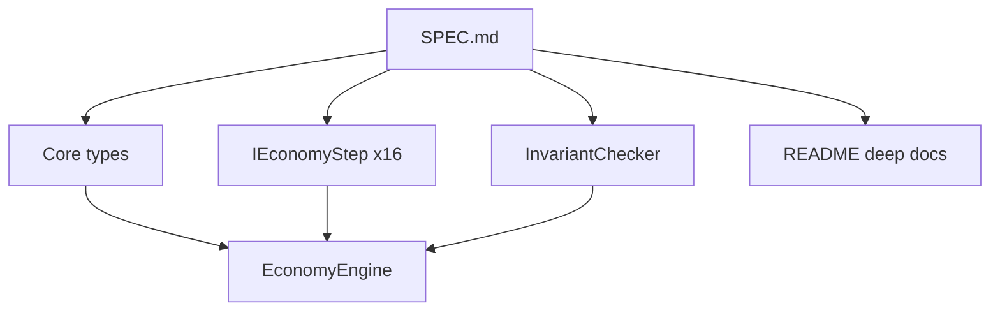

# Implement SPEC in Novolis.Economy.Core

Source of truth: [`SPEC..md`](novolis-economy/src/Novolis.Economy.Core/SPEC..md) (rename to [`SPEC.md`](novolis-economy/src/Novolis.Economy.Core/SPEC.md) as part of docs). Stay **self-contained** and **`IsPackable=false`**. Do not weave into Simulation/Logistics/NearSol in this pass.

## Locked decisions

- **One todo = one SPEC section (§1–§23).**
- **Working economics, not stubs:** each of the 16 period steps in §20 mutates state with the rules in the SPEC (min-constraints production, obligation settlement, bank vs lender lending, etc.).
- **Demand/matching (§20.6–8):** regional posted unit prices on resources (dictionary on state or derived offers), quantity rationing when short—**no order book** (aligned with §22 exclusions).
- **Participation rate:** omit (SPEC allows); effective labor = count × hours × `LaborQuality`.
- **Share model:** adopt SPEC shape (`ShareClass` + `ShareHolding` with `Units` + class name), replace current fraction-only holding.
- **`EconomyState`:** match §21 fields; keep a `Resources` catalog dictionary as an explicit extension (needed for named kinds) documented in README.
- **Docs:** expand [`README.md`](novolis-economy/src/Novolis.Economy.Core/README.md) into the primary deep doc (boundary, grammar, stock–flow, citations); keep `SPEC.md` as normative type/spec text.
- **Tests:** scenario tests under `tests/Novolis.Economy.Unit` (or `EconomyCore*`) covering invariants and each major mechanism.
- **No GPR publish.**



## Documentation standard (all sections)

README must include for each major pillar: **what it is**, **what it excludes**, **stock vs flow**, **invariants**, and **citations** where rigor claims are made. Baseline references to weave in:

- Godley & Lavoie — stock–flow consistent (SFC) accounting
- Minsky — financial instability / liquidity vs solvency
- Tobin — portfolio / claims as assets
- Post-Keynesian / endogenous money literature — bank loan creates deposit
- Arrow–Debreu / general equilibrium only as contrast (BM is not GE clearing of everything)

Also document mapping notes: Core Region ≈ future weave to `GeographicAreaId`; Core transfer ≈ Logistics shipment meaning.

## Implementation map by SPEC section

### §1 Boundary
Document boundary list and relationships in README; `docs/` optional only if README grows too large—prefer single deep README + `SPEC.md`.

### §2 Legal entities
Align kinds/rules; enforce Household cannot be share issuer / cannot appear as `ShareHolding.Issuer`; Firm/State/Bank/Lender/Insurer capabilities as validation helpers (`EntityRules`).

### §3 Regions
Living / production / logistics capacity helpers + enforcement in install/migrate/transfer steps.

### §4 Cohorts
`HouseholdMath.TotalCash`; document per-hh vs aggregate; link optional `HouseholdEntityId` only if needed for claims—SPEC cohort record has no entity id; **drop extra field or document as Core extension**—plan: keep optional link for dividends/wages to a Household entity, documented.

### §5 Labor capacity
Keep `HouseholdLabor`; add `LaborSupply.Calculate(region, cohorts)` → effective hours; document capacity vs quality vs productivity.

### §6 Activities
`ProductionCalculator.ActualRuns(...)` = min(installed, space, labor, inputs); apply recipe consume/produce on holdings.

### §7–8 Resources / holdings
Catalog + holding upsert keyed Owner×Region×Resource; no silent owner change.

### §9 Transport
Lanes + transfers: start transfer (debit origin holding, respect logistics capacity), tick remaining periods, complete (credit destination). Document trade vs carriage.

### §10 Shares
Add `ShareClass`; holdings use units; consistency check Σ units + treasury = issued.

### §11 Loans
Performing/Delinquent/Defaulted/Repaid; accrue interest into obligations; lender asset / borrower liability symmetry.

### §12 Credit
`CreditFacility`; available = Limit − Drawn; draw creates/increases loan; only **committed** undrawn counts in liquidity.

### §13 Obligations
Full enums; create wage/tax/interest/premium obligations; settle by priority (e.g. Wage → Tax → Interest → Principal → …).

### §14 Liquidity
`LiquidityPosition` derived; optional simple solvency helper (cash+deposits+holding book value − loans).

### §15 Banks / deposits
`Deposit`; non-bank lend = cash transfer; bank lend = +loan asset +deposit liability (endogenous money).

### §16 Insurance
`InsuranceCoverage` + `RiskKind`; premium obligations; on loss event (injected or deterministic seed rule) create claim obligation.

### §17 State policy
`StatePolicy` on state; tax/transfer flows conserve money.

### §18 Stocks and flows
`PeriodFlowLedger` or flow counters on step context; reconcile at end of period.

### §19 Invariants
`InvariantChecker.AssertAll(state)` (and soft report mode); called by reconcile step / tests.

### §20 Period execution
Sixteen named `IEconomyStep` classes in `Steps/` matching the numbered list; `DefaultPeriodPipeline` wires order.

### §21 Aggregate state + engine
Expand `EconomyState` to §21; keep `EconomyEngine.Advance`.

### §22 Exclusions
README “Non-goals” table matching SPEC.

### §23 Grammar
README closing “economic grammar” + relationship diagram.

## File layout (target)

```text
src/Novolis.Economy.Core/
  SPEC.md                 (renamed)
  README.md               (deep)
  Money.cs, Identifiers.cs, Enums.cs
  ModelTypes.cs           (split if large: Parties, Regions, Production, Finance, …)
  EconomyState.cs
  EconomyEngine.cs
  Labor/LaborSupply.cs
  Production/ProductionCalculator.cs
  Holdings/HoldingLedger.cs
  Transport/TransferEngine.cs
  Finance/...
  Invariants/InvariantChecker.cs
  Steps/01_ApplyPolicyStep.cs … 16_ReconcileStep.cs
  Steps/DefaultPeriodPipeline.cs
```

## Verification

- `dotnet build` Core + Unit
- Unit tests: empty advance; production bottleneck; transfer ownership preserved; bank loan creates deposit; obligation illiquidity → delinquent; share consistency; capacity clamps; money conservation on tax/transfer
- No pack / no GPR

## Out of scope

- Packaging / PackageId publish
- NearSol / Simulation / Logistics weave
- Order books, vehicles, individual workers

