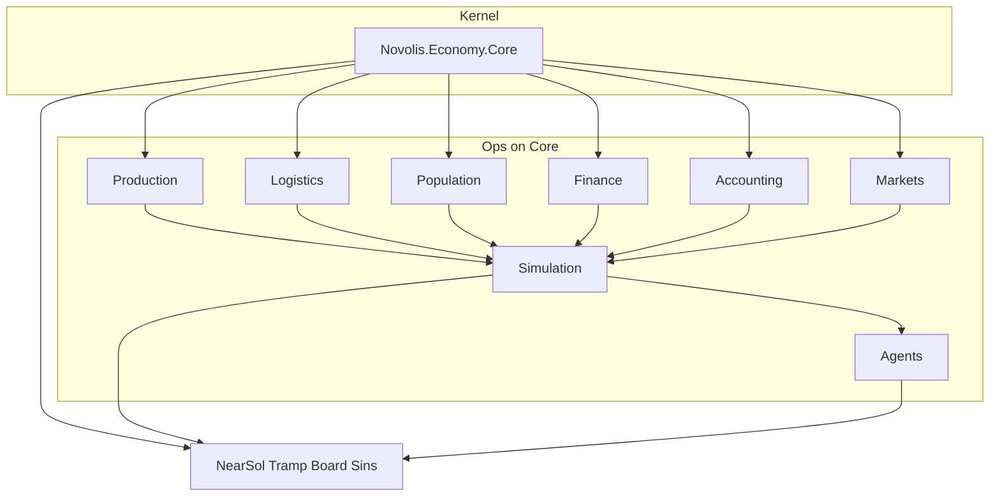

# Pivot Economy stack onto Novolis.Economy.Core

## Locked decisions

- **PackageId:** consumers PackageReference **`Novolis.Economy.Core` only** — retire `Novolis.Economy` (no shim).
- **Time:** Core **period** is economic authority; **hours** only advance transfers/vehicles/fuel; call `EconomyEngine.Advance` at period boundaries.
- **Core is read-only BM:** do **not** enlarge Core with unused “shared primitives.” If Core does not use a type locally, it does not belong in Core — put it in Logistics / Simulation / Production / etc.
- **True fold:** colliding *economic* concepts resolve to Core (`Money`, party id → `LegalEntityId`, area → `RegionId`, good → `ResourceId`, ownership → shares). Ops vocabulary stays in ops packages.

## Target dependency rule

| Layer | Depends on | Owns |
|-------|------------|------|
| **Core** | nothing | `EconomyState`, `Money`, entities/regions/resources/holdings/claims, 16 steps, invariants |
| **Logistics** | Core (+ Production if still needed for batches) | hubs, corridors, vehicles, hour clock helpers, in-flight shipment schedule that **mutates Core transfers/holdings** |
| **Production / Population / Finance / Accounting / Markets** | Core | recipe/facility/cohort/ledger/book detail mapped onto Core stocks |
| **Simulation** | Core + ops packages | host: hour loop + period boundary `Advance`; holds ops side-state next to Core state |
| **Agents / dogfood** | Simulation + Core | enqueue ops intents; economic truth is Core |

Delete project [`novolis-economy/src/Novolis.Economy/`](novolis-economy/src/Novolis.Economy/) after types are relocated or replaced.

## Type migration map (no orphans in Core)

| Old (`Novolis.Economy`) | New home |
|-------------------------|----------|
| `Money` | **Core** `Money` (delete prim duplicate) |
| `FirmId` / `LegalEntity` | **Core** `LegalEntityId` / `LegalEntity` |
| `GeographicAreaId` | **Core** `RegionId` (+ hub↔region map in Logistics/Simulation) |
| `ProductId` | **Core** `ResourceId` |
| `ConsumerCohortId` / household productivity | **Core** `CohortId` / `HouseholdLabor*` |
| `OwnershipClaim` | **Core** `ShareClass` / `ShareHolding` |
| `LoanId` (prim) | **Core** `LoanId` |
| `Quantity`, `Percentage` | **Production** and/or **Logistics** (where used) — not Core unless a Core API needs them later |
| `SimulationHour` / `Date` / `Duration` | **Simulation** (or small `Novolis.Economy.Simulation.Time` types) |
| Transport IDs, `ShipmentId`, … | **Logistics** |
| Facility / process / inventory location IDs | **Production** / **Simulation** |
| `IEconomyCommand` / events / RNG | **Simulation** (command bus stays ops host) |
| Hub order book / `HubOrderSide` | **Markets** or **Simulation** — economic matching remains Core posted prices + rationing at period settle; book can be a UI/ops overlay that writes Core prices/intents |

## Phase plan

### Phase 0 — Inventory and guardrails

- Freeze new features on prim `Novolis.Economy`.
- Document map above in [`novolis-economy/docs/design.md`](novolis-economy/docs/design.md).
- Confirm Sins ([`novolis-apps/.../SinsOfACapitalismTycoon`](novolis-apps)) already Core-only — leave alone except if Money/API churn.

### Phase 1 — Retarget packages onto Core (compile green)

For each `src/Novolis.Economy.*` (except Core):

1. Replace `ProjectReference` to `Novolis.Economy` with `Novolis.Economy.Core`.
2. Fix namespaces / type renames per map.
3. Relocate prim-only source files into the owning ops project (do not dump into Core).
4. Keep Core SPEC/README/API unchanged.

Order (leaf → root): Production, Markets, Accounting, Logistics, Finance, Population, Simulation, Agents.

Publish via merge CI after each coherent chunk (or one big PR if preferred) so GPR stays usable under ProjectRef mode for local work.

### Phase 2 — Simulation clock: hours + period settle

In [`EconomySimulation`](novolis-economy/src/Novolis.Economy.Simulation/) / phase pipeline:

- Hold `EconomyState` as authority (immutable replace each period).
- Hour phases: Logistics `AdvanceHour` updates in-flight carriage → apply completions into Core holdings/transfers **without** running full 16 steps every hour.
- At `PeriodHours` boundary: run `DefaultPeriodPipeline` / `EconomyEngine.Advance`.
- Wages, retail sink, loans, production throttle: migrate off parallel cash ledgers onto Core cash/obligations/holdings as each phase is touched (incremental; delete duplicate ledgers when drained).

### Phase 3 — Logistics on Core transfers

- Treat Core `ResourceTransfer` / lanes as economic carriage.
- Existing hub/corridor/vehicle engine becomes the **scheduler** that starts/ticks/completes Core transfers (fuel/berth/crew = ops cost → Core obligations or cash when period settles).
- NearSol dogfood keeps Astro bridge; map hubs → `RegionId`.

### Phase 4 — Retire PackageId `Novolis.Economy`

- Remove [`Novolis.Economy.csproj`](novolis-economy/src/Novolis.Economy/Novolis.Economy.csproj) from slnx.
- Update [`novolis-dogfooding/Directory.Packages.props`](novolis-dogfooding/Directory.Packages.props): drop `Novolis.Economy`; ensure `Novolis.Economy.Core`.
- Update NearSol / Tramp / EconomyBoard csprojs.
- Regen platform map: `Generate-Platform-Slnx.ps1`.
- `verify-nuget-only.ps1` + `verify-project-ref-mode.ps1`.
- GPR: stop publishing `Novolis.Economy` (delist/mark obsolete in docs; junk-version hygiene via gpr scripts if needed).

### Phase 5 — Dogfood cutover

- NearSol: seed Core state + ops overlays; period report from Core insights; keep headless milestones.
- Smoke: `NearSol --headless 100d` under ProjectRef mode, then GPR float.
- TrampFreighter* / EconomyBoard: same dependency swap; reduce reliance on deleted prim usings.

### Phase 6 — Docs and consumer guidance

- Rewrite design package-split diagram: Core kernel, no Primitives package.
- Note breaking change for any external `PackageReference Include="Novolis.Economy"`.
- Sins remains Core-period app (already aligned with 2a).

## Explicit non-goals (this pivot)

- Do not add order books, vehicles, or hour clock into Core.
- Do not rewrite Sins into NearSol.
- Do not keep a dual Money/ledger forever — Phase 2–3 delete parallels.

## Done criteria

- No project references PackageId `Novolis.Economy`.
- Core package surface unchanged aside from zero/minimal true shared needs proven by Core compilation (expect **none**).
- Logistics/Simulation compile and run against Core; NearSol 100d smoke green.
- Platform map lists Core; verify scripts exit 0.
- Sins still restores/runs on Core from GPR.

