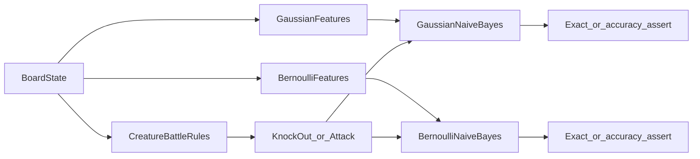

# Creature Battle Card Game Naive Bayes tests

## Goal

Delete [NaiveBayesCardGameDuelTests.cs](d:\novolis\novolis-machinelearning\tests\Novolis.MachineLearning.Unit\Algorithms\NaiveBayesCardGameDuelTests.cs) and add a small **Creature Battle Card Game** test domain plus multiple extensive TUnit classes exercising Gaussian and Bernoulli Naive Bayes. Keep [NaiveBayesTests.cs](d:\novolis\novolis-machinelearning\tests\Novolis.MachineLearning.Unit\Algorithms\NaiveBayesTests.cs) as the general contract/validation suite.

No third-party TCG IP / names — original types and terms only (`Ember`, `Tide`, `Verdant`, etc. if named at all).

## Mini ruleset (test oracle only)

Shared pure helpers under `tests/.../Algorithms/CreatureBattle/`:

```text
effectiveDamage = baseDamage
  + (hasWeakness ? 20 : 0)
  - (hasResistance ? 10 : 0)

canPay = attachedEnergy >= attackCost
KnockOut  iff canPay && effectiveDamage >= defenderHp
Survive   otherwise

Attack choice (two candidates A/B):
  legal = canPay
  pick highest effectiveDamage among legal; if neither legal → Retreat
```

Board fields used as inputs: `baseDamage`, `defenderHp`, `hasWeakness`, `hasResistance`, `attachedEnergy`, `attackCost` (plus a second attack’s base/cost for choice tests).

**Feature encoding (honest):**

| Trainer | Features — no outcome bits |
|---|---|
| Gaussian | `Features<double>(base, hp, weakness?, resistance?, energy, cost)` |
| Bernoulli | thresholds only, e.g. `base>=50`, `hp<=40`, `weakness`, `resistance`, `energy>=cost`, `base+20>=hp`, `base-10>=hp` — never a single `isKnockOut` / `wins` flag |

Train on a discrete grid with **held-out** slices (e.g. train even `defenderHp`, evaluate odd; or hold out one energy band). Assert **absolute** correctness / accuracy floors — not “who won the duel.”



## Files to add

Under [tests/Novolis.MachineLearning.Unit/Algorithms/](d:\novolis\novolis-machinelearning\tests\Novolis.MachineLearning.Unit\Algorithms\):

| File | Role |
|---|---|
| `CreatureBattle/CreatureBattleRules.cs` | Oracle + `BoardState` / `AttackOption` records |
| `CreatureBattle/CreatureBattleFeatures.cs` | `ToGaussian` / `ToBernoulli` encoders |
| `CreatureBattleKnockOutGaussianTests.cs` | Grid train/holdout; exact labels on representative boards; score normalization spot-check |
| `CreatureBattleKnockOutBernoulliTests.cs` | Same oracle; Bernoulli encoding; accuracy floor on full holdout |
| `CreatureBattleAttackChoiceTests.cs` | Two-attack choice + Retreat; both trainers |
| `CreatureBattleEdgeCaseTests.cs` | Exact KO boundary (`damage == hp`), insufficient energy, weakness/resistance cancel nets, empty-train/length mismatch still via library where relevant |

## Coverage targets (extensive)

- **KnockOut Gaussian:** train ~even HP × energy/cost/flags grid; evaluate odd HP; assert every held-out board matches oracle (or ≥98% if float noise — prefer exact with integer-valued doubles).
- **KnockOut Bernoulli:** same split; assert ≥90% on holdout (threshold features are lossy by design — document floor in test name/comment).
- **Attack choice:** enumerate pairs of attacks; assert `Predict` equals oracle on held-out energy values for both trainers where encoding allows; Gaussian should be near-exact with raw numbers.
- **Edges:** `effectiveDamage == defenderHp` → KnockOut; `energy == cost - 1` → Survive even if damage would KO; weakness alone vs resistance alone vs both.
- **API smoke in-domain:** `PredictScores` probabilities sum ≈ 1 on a creature board; `FeatureCount` matches encoder arity.

## Out of scope

- No production library changes under `src/` (rules live in tests only).
- No ML.NET `ClassicTrainers` involvement.
- No algo-vs-algo winner enum / soft Tie asserts.

## Verify

```powershell
dotnet build d:\novolis\novolis-machinelearning\tests\Novolis.MachineLearning.Unit\Novolis.MachineLearning.Unit.csproj -c Release
dotnet run --project d:\novolis\novolis-machinelearning\tests\Novolis.MachineLearning.Unit\Novolis.MachineLearning.Unit.csproj -c Release --no-build -- --treenode-filter "/Novolis.MachineLearning.Unit/Novolis.MachineLearning.Algorithms.Tests/*"
```

Expect prior `NaiveBayesTests` + new creature classes green; duel class gone.
