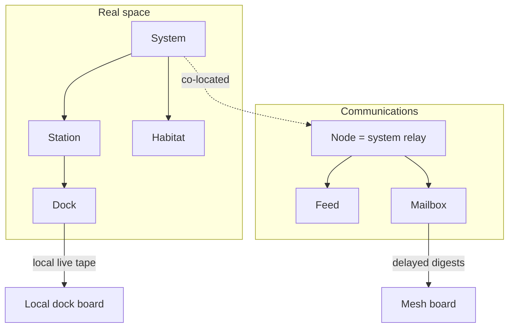

# Dock / Mesh terminology upgrade

## Glossary (source of truth)

Add [`novolis-apps/src/SinsOfACapitalismTycoon/docs/terminology.md`](novolis-apps/src/SinsOfACapitalismTycoon/docs/terminology.md) and link it from [`docs/README.md`](novolis-apps/src/SinsOfACapitalismTycoon/docs/README.md).

| Domain | Preferred | Ban in UX / new Sins code |
|--------|-----------|---------------------------|
| Docked at infrastructure | **Dock**, **Docked**, **at dock** | Berth (bunk sense) |
| Same star system | **Local**, **in system** | — |
| Comms fabric | **Mesh**, **Node**, **Feed**, **Mailbox** | Network (as intel board name) |
| Real space | **System**, **Habitat**, **Station** | Hub (player glass) |

Economy package types stay: `TransportHub`, `TransportHubId`, `ShipmentPhase.WaitingBerth`. Sins code may keep those identifiers when calling Economy APIs; display strings and Sins-owned APIs use the glossary.

## Pass 1 — Player UX (strings, CLI, Avalonia)

- [`Ui/MainWindow.cs`](novolis-apps/src/SinsOfACapitalismTycoon/Ui/MainWindow.cs): combo `Network`/`Berth` → `Mesh`/`Dock`; help copy “accept at dock”; “berth manifest” → “dock manifest”.
- [`Cli/CaptainConsole.cs`](novolis-apps/src/SinsOfACapitalismTycoon/Cli/CaptainConsole.cs): `board mesh|dock` (accept legacy `network`/`berth`/`local` as aliases); `[SPOT mesh|dock]`; `accept-at-berth` → `accept-at-dock` (+ old alias).
- [`Cli/Args.cs`](novolis-apps/src/SinsOfACapitalismTycoon/Cli/Args.cs): `--board mesh|dock` (aliases `network`/`berth`/`local`).
- [`Ui/CaptainBridgeModel.cs`](novolis-apps/src/SinsOfACapitalismTycoon/Ui/CaptainBridgeModel.cs): subtitle `intel dock|mesh`; `MeshLine` “mesh digests” not “network digests”; voyage `BERTH` → `DOCK` where it means docked.
- Distance hints: `AT BERTH` → `AT DOCK` in [`CaptainJobBoard.cs`](novolis-apps/src/SinsOfACapitalismTycoon/Universe/Player/CaptainJobBoard.cs), [`SpotDigestCodec.cs`](novolis-apps/src/SinsOfACapitalismTycoon/Universe/Mesh/Sins/SpotDigestCodec.cs).
- Coach / vox / life-moment copy that says berth/network/hub in player voice ([`CaptainCoach.cs`](novolis-apps/src/SinsOfACapitalismTycoon/Universe/Player/CaptainCoach.cs), [`VoxBank.cs`](novolis-apps/src/SinsOfACapitalismTycoon/Universe/Drama/VoxBank.cs)).
- Docs: [`gameplay.md`](novolis-apps/src/SinsOfACapitalismTycoon/docs/gameplay.md), [`mesh-and-communications.md`](novolis-apps/src/SinsOfACapitalismTycoon/docs/mesh-and-communications.md), [`cli-and-reports.md`](novolis-apps/src/SinsOfACapitalismTycoon/docs/cli-and-reports.md), [`places-and-stations.md`](novolis-apps/src/SinsOfACapitalismTycoon/docs/places-and-stations.md) (tier “hub” → capital/station wording), [`AGENT-SMOKE.md`](novolis-apps/src/SinsOfACapitalismTycoon/AGENT-SMOKE.md) (`AT DOCK`).

## Pass 2 — Sins-owned identifiers

Rename for clarity; keep JSON save compatibility with `[JsonPropertyName]` / dual read:

| Current | New |
|---------|-----|
| `PlayerControlState.LocalBoardOnly` | `DockBoardOnly` (save: still write/read `LocalBoardOnly` or both) |
| `CaptainJobBoard.ListSpot(..., berthOnly:)` | `dockOnly:` |
| `LiveSession.CurrentHubSystemId` | `CurrentSystemId` (wrapper; old name obsolete alias if needed) |
| Bridge `CurrentHubName` / `CurrentHubSystemId` | `CurrentSystemName` / `CurrentSystemId` |
| UI/docs “berth fee” standing | “dock fee” / “station standing fee” in Sins copy ([`JumpBandGate`](novolis-apps/src/SinsOfACapitalismTycoon/Universe/Commerce/JumpBandGate.cs) player-facing strings) |

`PortTier.Hub` (Sins enum): rename to `PortTier.Capital` (or `Core`) and update [`PortTier.cs`](novolis-apps/src/SinsOfACapitalismTycoon/Universe/Commerce/PortTier.cs) + call sites / docs. Do **not** rename Economy corridor/hub APIs.

Bridge ([`AstroEconomyBridge.cs`](novolis-apps/src/SinsOfACapitalismTycoon/Universe/Bridge/AstroEconomyBridge.cs)): keep `HubBinding` as the Economy mapping type, but comments and any Sins display helpers say **system/station**; prefer exposing `SystemId` in new code paths.

## Pass 3 — Explicit non-goals

- No rename of `Novolis.Economy` `TransportHub` / `WaitingBerth` / `HubOrder` (cross-package break).
- No rename of mesh kernel `MeshNode` / `Mailbox` / `Feed` (already correct).
- Lore fiction that uses “hub” as a place nickname can stay in deep canon docs only if tagged; new copy uses station/system.

## Pass 4 — Tests and verify

- Update unit/smoke strings (`AT DOCK`, board aliases).
- `dotnet build` + unit test run with ProjectReference mode; kill `SinsOfACapitalismTycoon.exe` if DLL locks.
- Grep Sins for remaining player-facing `\b[Bb]erth\b`, `\b[Nn]etwork\b` board sense, and `\b[Hh]ub\b` in UI/CLI/docs (allow Economy type names and `WaitingBerth` references).

