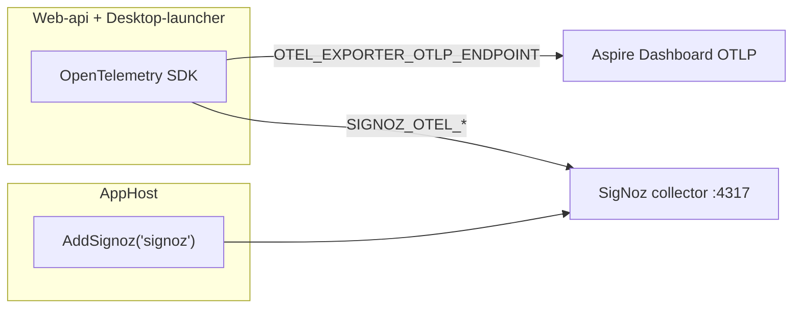

# SigNoz + no Jaeger in StarConflictsRevolt

**Target repo:** [`D:\github\StarConflictsRevolt\aspire`](D:\github\StarConflictsRevolt\aspire) (not novolis-dogfooding).

**Goals:**

- **Remove Jaeger completely** — delete `AddJaegerIfEnabled`, `LocalObservabilityStack.Jaeger`, default-to-jaeger behavior, manifest `jaeger` bindings, and all docs/scripts referencing Jaeger.
- **Use SigNoz** — in-graph via **`Novolis.Aspire.Hosting.Signoz`** (`AddSignoz` / `WithSignozOtlpExporter`), dogfooding the novolis-aspire package.
- **Keep Aspire default telemetry** — do **not** overwrite `OTEL_EXPORTER_OTLP_ENDPOINT` (Aspire dashboard OTLP). Also export to SigNoz via secondary env vars + named OTLP exporters.



---

## Prerequisite: novolis-aspire package fix

[`WithSignozOtlpExporter`](d:\novolis\novolis-aspire\src\Novolis.Aspire.Hosting.Signoz\SignozHostingExtensions.cs) currently sets `OTEL_EXPORTER_OTLP_ENDPOINT`, which **replaces** the dashboard sink. Fix in **novolis-aspire** first (or in same PR if both repos change):

| Env var | Purpose |
|---------|---------|
| `OTEL_EXPORTER_OTLP_ENDPOINT` | **Untouched** — Aspire injects dashboard OTLP |
| `SIGNOZ_OTEL_EXPORTER_OTLP_ENDPOINT` | SigNoz collector gRPC URI from `signoz.Resource.OtlpGrpcUriExpression` |
| `SIGNOZ_OTEL_EXPORTER_OTLP_PROTOCOL` | `grpc` |

Keep `.WithReference(signoz)` for dashboard connection strings.

Add unit test: `WithSignozOtlpExporter` must **not** add `OTEL_EXPORTER_OTLP_ENDPOINT` env annotation.

**Package consumption in StarConflicts:** Add `Novolis.Aspire.Hosting.Signoz` to [`Directory.Packages.props`](D:\github\StarConflictsRevolt\Directory.Packages.props) and [`StarConflictsRevolt.Aspire.AppHost.csproj`](D:\github\StarConflictsRevolt\aspire\StarConflictsRevolt.Aspire.AppHost\StarConflictsRevolt.Aspire.AppHost.csproj). Use published NuGet `0.1.0-preview.1` (or local feed / `dotnet pack` from `d:\novolis\novolis-aspire` until published).

---

## 1. Simplify local observability (AppHost)

**File:** [`LocalObservabilityAppHostExtensions.cs`](D:\github\StarConflictsRevolt\aspire\StarConflictsRevolt.Aspire.AppHost\LocalObservabilityAppHostExtensions.cs)

| Before | After |
|--------|-------|
| `LocalObservabilityStack`: `None`, `Jaeger`, `Signoz` | `None`, `Signoz` only |
| Unset env → **Jaeger** | Unset env → **Signoz** (in-graph stack) |
| `AddJaegerIfEnabled` | **Delete** |
| `Signoz` → hard-coded `http://127.0.0.1:4318` | `WithSignozOtlpExporter(signoz)` from novolis package |
| `WithLocalObservabilityOtlp(..., jaeger)` | `WithLocalObservabilityOtlp(..., signoz)` — `none` = no-op; `signoz` = `.WithSignozOtlpExporter(signoz)` |

**File:** [`AppHost.cs`](D:\github\StarConflictsRevolt\aspire\StarConflictsRevolt.Aspire.AppHost\AppHost.cs)

```csharp
var localObsStack = LocalObservabilityAppHostExtensions.ParseLocalObservabilityStack();
var signoz = builder.AddSignozIfEnabled(localObsStack); // wraps AddSignoz when stack != None

// Web-api / Desktop-launcher:
.WithLocalObservabilityOtlp(localObsStack, signoz);
```

- Remove `jaeger` variable and `ApplyGameClientEnvs` jaeger parameter.
- `AddSignozIfEnabled`: when stack is `Signoz`, call `builder.AddSignoz("signoz")`; return `null` for `None`.
- Do **not** `WaitFor(signoz)` on projects (same resilience as old Jaeger — slow/broken observability must not block Web-api / launcher).

**Deprecate external compose workflow:** [`scripts/local-obs-signoz.ps1`](D:\github\StarConflictsRevolt\scripts\local-obs-signoz.ps1) and [`tools/local-observability/signoz/`](D:\github\StarConflictsRevolt\tools\local-observability\signoz) — remove or mark archived; primary path is AppHost `AddSignoz`.

---

## 2. Dual OTLP export (ServiceDefaults + worker)

OpenTelemetry .NET cannot call `UseOtlpExporter()` twice ([issue #5538](https://github.com/open-telemetry/opentelemetry-dotnet/issues/5538)). When `SIGNOZ_OTEL_EXPORTER_OTLP_ENDPOINT` is set, use **named** `AddOtlpExporter` for dashboard + SigNoz; otherwise keep existing `UseOtlpExporter()` for dashboard-only.

**New shared helper** (e.g. `OpenTelemetryOtlpExporterExtensions.cs` in [`StarConflictsRevolt.Aspire.ServiceDefaults`](D:\github\StarConflictsRevolt\aspire\StarConflictsRevolt.Aspire.ServiceDefaults)):

- `AddDualOtlpExporters(IOpenTelemetryBuilder, IConfiguration)` — registers:
  - **dashboard** exporter when `OTEL_EXPORTER_OTLP_ENDPOINT` is set (reads standard env/protocol).
  - **signoz** exporter when `SIGNOZ_OTEL_EXPORTER_OTLP_ENDPOINT` is set (protocol from `SIGNOZ_OTEL_EXPORTER_OTLP_PROTOCOL`, default `grpc`).
- Applies to logging, metrics, and tracing (mirror current `UseOtlpExporter` coverage).

**Update:**

- [`Extensions.cs`](D:\github\StarConflictsRevolt\aspire\StarConflictsRevolt.Aspire.ServiceDefaults\Extensions.cs) — replace `if (useOtlpExporter) openTelemetry.UseOtlpExporter()` with dual helper.
- [`WorkerOpenTelemetryHostBuilderExtensions.cs`](D:\github\StarConflictsRevolt\src\StarConflictsRevolt.Observability.Hosting\WorkerOpenTelemetryHostBuilderExtensions.cs) — same (reference ServiceDefaults or duplicate minimal helper in Observability.Hosting to avoid circular refs; prefer shared static helper in ServiceDefaults referenced by worker project).

Adjust `useOtlpExporter` / console-exporter gating: treat “any OTLP configured” as `OTEL_EXPORTER_OTLP_ENDPOINT` **or** `SIGNOZ_OTEL_EXPORTER_OTLP_ENDPOINT`.

---

## 3. Scripts, manifest, docs

| File | Change |
|------|--------|
| [`scripts/aspire-run.ps1`](D:\github\StarConflictsRevolt\scripts\aspire-run.ps1) | `-LocalObsStack` values: `none`, `signoz` only; default comment = SigNoz in-graph |
| [`aspire-manifest.json`](D:\github\StarConflictsRevolt\aspire\StarConflictsRevolt.Aspire.AppHost\aspire-manifest.json) | Remove `jaeger` resource and `{jaeger.bindings.otlp.url}`; add SigNoz OTLP connection refs if manifest is hand-maintained (regenerate via `aspire manifest` if that is the repo norm) |
| [`docs/operations/aspire.md`](D:\github\StarConflictsRevolt\docs\operations\aspire.md) | Local APM section: SigNoz default, no Jaeger, dual export behavior |
| [`tools/local-observability/README.md`](D:\github\StarConflictsRevolt\tools\local-observability\README.md) | Replace Jaeger table with SigNoz in-graph + `none` |
| [`docs/operations/troubleshooting.md`](D:\github\StarConflictsRevolt\docs\operations\troubleshooting.md) | Jaeger troubleshooting → SigNoz container health |
| [`docs/operations/cursor-agent-setup.md`](D:\github\StarConflictsRevolt\docs\operations\cursor-agent-setup.md) | Point agents at **signoz** UI endpoint, not jaeger |

---

## 4. Validation

1. `dotnet pack` / publish `Novolis.Aspire.Hosting.Signoz` if not on feed; restore AppHost.
2. `pwsh ./scripts/aspire-run.ps1` (default SigNoz stack starts with AppHost).
3. **Aspire dashboard:** structured logs and traces for **Web-api** / **Desktop-launcher** still appear.
4. **SigNoz UI:** open `signoz-signoz` HTTP endpoint from dashboard; traces/metrics from apps visible.
5. **No** `jaeger` resource in `aspire describe`.
6. `pwsh ./scripts/aspire-run.ps1 -LocalObsStack none` — no SigNoz containers; dashboard OTLP only.

---

## Out of scope

- novolis-dogfooding AppHost (wrong repo for this task).
- CI running full SigNoz stack (container-heavy).
- Changing Garnet / Raven / Azurite orchestration.

## Dependency order

1. novolis-aspire: `WithSignozOtlpExporter` env-var fix + test  
2. StarConflicts: dual OTLP helper  
3. StarConflicts: AppHost + observability refactor + docs  
4. Manual validation

