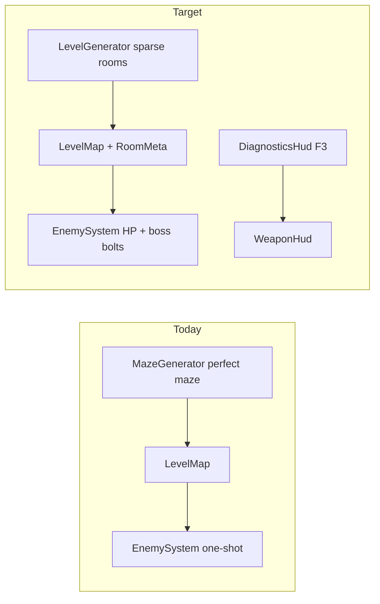

# DoomLite3D: diagnostics, sparse rooms, boss, art

## Current state

- Level layout lives in [`MazeGenerator.cs`](d:\novolis\novolis-dogfooding\apps\DoomLite3D\Game\MazeGenerator.cs): 35×35 grid, 11×11 logical perfect maze, **2-cell** corridors (`CarveLink*` clears 2-wide), visits **every** logical node → map is mostly floor.
- Enemies are **one-shot** kills in [`EnemySystem.TryHit`](d:\novolis\novolis-dogfooding\apps\DoomLite3D\Game\EnemySystem.cs) (`enemy.Alive = false`).
- HUD uses `ctx.HudText` / `ctx.HudRect` ([`WeaponHud.cs`](d:\novolis\novolis-dogfooding\apps\DoomLite3D\Game\WeaponHud.cs)); F1 regen uses raw key `290` in [`DoomLiteGame.cs`](d:\novolis\novolis-dogfooding\apps\DoomLite3D\Game\DoomLiteGame.cs).
- Assets folder has [`CREDITS.md`](d:\novolis\novolis-dogfooding\apps\DoomLite3D\Assets\CREDITS.md) but **no PNGs in tree** right now — runtime falls back to glow spheres.



---

## 1. Diagnostics overlay (F3 toggle)

**New file:** [`DiagnosticsHud.cs`](d:\novolis\novolis-dogfooding\apps\DoomLite3D\Game\DiagnosticsHud.cs)

- `bool Visible` toggled on **F3** (`(KeyboardKey)292`, same pattern as F1).
- When visible, draw a semi-transparent panel (top-left, below health bar ~y=40) with:
  - **FPS:** smoothed `1f / ctx.DeltaSeconds` (EMA, e.g. α=0.1).
  - **Frame ms:** `ctx.DeltaSeconds * 1000`.
  - **Working set:** `Process.GetCurrentProcess().WorkingSet64 / (1024*1024)` MB.
  - **GC heap:** `GC.GetTotalMemory(false) / (1024*1024)` MB (optional gen0 collections count).
  - **Enemies:** alive / total.
  - **Level seed** (once `LevelMap` exposes it — see §3).

Wire in [`DoomLiteGame.Update`](d:\novolis\novolis-dogfooding\apps\DoomLite3D\Game\DoomLiteGame.cs): toggle on key press; call `DiagnosticsHud.Draw` after `_hud.Draw`.

Update control hint in [`WeaponHud.cs`](d:\novolis\novolis-dogfooding\apps\DoomLite3D\Game\WeaponHud.cs): `F3 diagnostics | F1 new maze | ...`.

No change to `RayGame.Run` global `showFps` — overlay stays in-app and toggleable.

---

## 2. Sparse room-based level generation

**Replace** the logical perfect-maze path in [`MazeGenerator.cs`](d:\novolis\novolis-dogfooding\apps\DoomLite3D\Game\MazeGenerator.cs) (or rename to `LevelGenerator.cs` and keep `MazeGenerator.Generate` as a thin forwarder for minimal churn).

| Parameter | Today | Target |
|-----------|-------|--------|
| Grid `Size` | 35 | **55** (more dead wall margin) |
| Corridor width | 2 cells | **3 cells** (`CarveThickCorridor`) |
| Map fill | All visited nodes carved | **Only** calm room + N pack rooms + 1 boss room + MST corridors |
| Scatter spawns | 25%, max 22 | **~45%** of eligible corridor cells, **max 38** |
| Pack rooms | — | **5–6** rooms, **7×7** floor, **4–6** grunts each |
| Boss room | — | **1** room, **9×9** floor, farthest from spawn |

**Algorithm (deterministic from seed):**

1. Fill grid with walls; carve calm **7×7** at `(1,1)` (unchanged spawn).
2. Sample **6** pack room centers + **1** boss center in interior (e.g. x,z ∈ [8, Size-10]), with min separation **10** cells and min distance from spawn **14**.
3. Carve axis-aligned room rects; tag sites `RoomKind.Pack` / `RoomKind.Boss`.
4. **Connect** spawn + all rooms with a **minimum spanning tree** on room centers (Kruskal by Manhattan distance). For each edge, carve an **L-shaped** path (horizontal then vertical, or pick shorter split) using **3-cell-wide** brush (`CarveRect` / Bresenham with perpendicular offset ±1).
5. **Enemy placement:**
   - Pack rooms: place 4–6 `EnemySpawn` on random floor cells inside room (min spacing 2).
   - Boss room: single `EnemySpawn` with `EnemyKind.Boss`.
   - Corridors: existing scatter loop on floor cells outside calm exclusion, higher density cap.
6. Retain diameter guard (`MaxDiameter`) so sprawling stays bounded; bump limit slightly for larger grid (~70).

**Dead space:** unconnected regions stay wall by construction — no backtracker visit of full logical grid.

**Level metadata:** extend [`LevelMap`](d:\novolis\novolis-dogfooding\apps\DoomLite3D\Game\LevelMap.cs) with `int Seed` and optional `IReadOnlyList<RoomRect>` for minimap tinting (pack = amber dot, boss = red larger dot in [`MinimapHud.cs`](d:\novolis\novolis-dogfooding\apps\DoomLite3D\Game\MinimapHud.cs)).

---

## 3. Enemy kinds, HP, and boss ranged attack

**Types** in [`LevelMap.cs`](d:\novolis\novolis-dogfooding\apps\DoomLite3D\Game\LevelMap.cs):

```csharp
enum EnemyKind { Grunt, Boss }
record struct EnemySpawn(GridIndex Cell, int SpriteIndex, EnemyKind Kind = EnemyKind.Grunt);
```

**`Enemy` fields** ([`EnemySystem.cs`](d:\novolis\novolis-dogfooding\apps\DoomLite3D\Game\EnemySystem.cs)):

| Field | Grunt | Boss |
|-------|-------|------|
| `Health` / `MaxHealth` | 30 | 200 |
| `BillboardSize` | 1.35 | **2.1** |
| `EnemyRadius` / `HitRadius` | 0.55 / 1.1 | **0.65 / 1.6** |
| `ChaseSpeed` | 1.8 | **1.0** |
| Weapon damage to kill | 1–2 shots (15 dmg/shot) | many shots |

**Combat:** add `PlayerCombatState.WeaponDamage = 15f`; `TryHit` subtracts damage instead of `Alive = false`; death when `Health <= 0`.

**Boss ranged** (simple, no new physics package):

- `List<BossBolt>` on `EnemySystem` — position, velocity, TTL.
- When boss has LOS, player in **5–16** units, and `RangedCooldown <= 0`: spawn bolt from boss chest height toward player eye; speed **~5 u/s**, lifetime **4s**.
- Each frame: move bolt; **wall** stop via existing `GridCollision2D.TryRaycastWall` on XZ; **player hit** if within **0.9** units → `combat.TakeDamage(10f)` and remove bolt.
- Draw with existing `ctx.DrawBolt` (same as muzzle flash).
- Cooldown **~2.5s**; boss still melees in close range.

Grunts remain melee-only (current behavior).

---

## 4. More art (committed assets)

**Goal:** visible billboards and slightly richer world without blocking on manual Kenney download.

1. **Regenerate / commit PNGs** under `Assets/` (64×64, distinct silhouettes):
   - `enemies/imp.png`, `enemies/demon.png` (grunt variants)
   - `enemies/brute.png` (pack room bias)
   - `enemies/boss.png` (large red/purple silhouette)
   - `weapon.png`
   - Optional: `tiles/floor.png`, `tiles/wall.png` for textured quads

   Small **build-time or script** helper: `scripts/generate-placeholder-assets.ps1` writes PNGs if missing (so CI clones work). Update [`fetch-kenney-assets.ps1`](d:\novolis\novolis-dogfooding\apps\DoomLite3D\scripts\fetch-kenney-assets.ps1) to copy named Kenney files into those paths when zip is present.

2. **Load in code:**
   - [`EnemySystem.Initialize`](d:\novolis\novolis-dogfooding\apps\DoomLite3D\Game\EnemySystem.cs): add `brute.png`, `boss.png`; map `SpriteIndex` / `EnemyKind` to texture; scale billboard per kind in `Draw`.
   - [`LevelRenderer.cs`](d:\novolis\novolis-dogfooding\apps\DoomLite3D\Game\LevelRenderer.cs): if floor/wall textures load, `DrawTexturePro` on a single large floor plane + per-wall billboards **or** keep colored boxes and only tint pack/boss room floors via one extra colored plane per room (lighter scope: **floor tint quads in pack/boss rooms only**).

3. Update [`CREDITS.md`](d:\novolis\novolis-dogfooding\apps\DoomLite3D\Assets\CREDITS.md) table with new files.

`DoomLite3D.csproj` already copies `Assets\**\*` — no csproj change needed.

---

## 5. Tuning summary

| Knob | Value |
|------|-------|
| Corridor width | 3 cells |
| `MaxEnemies` (corridor scatter) | 38 |
| Scatter probability | ~45% of eligible cells |
| Pack room grunts | 4–6 per room |
| Boss | 1 per run, tank + slow bolts |

---

## 6. Tests and verification

- **Manual:** run `dotnet run --project apps/DoomLite3D/DoomLite3D.csproj`; F3 shows FPS/memory; F1 regen shows sparse map with isolated rooms; pack rooms have clusters; boss room at far end shoots and takes many hits.
- **Optional unit test** in dogfood test project (if exists): `LevelGenerator` produces connected spawn→boss BFS path and boss room floor area ≥ 81 cells.
- No novolis-math changes required unless corridor LOS tests are added later.

---

## File touch list

| File | Change |
|------|--------|
| `Game/DiagnosticsHud.cs` | **New** |
| `Game/DoomLiteGame.cs` | F3 toggle, diagnostics draw |
| `Game/MazeGenerator.cs` | Sparse rooms, wider corridors, spawn tuning |
| `Game/LevelMap.cs` | `EnemyKind`, seed, room metadata |
| `Game/EnemySystem.cs` | HP, boss scale, bolts, damage |
| `Game/PlayerCombatState.cs` | `WeaponDamage` |
| `Game/WeaponHud.cs` | F3 hint |
| `Game/MinimapHud.cs` | Room / boss markers |
| `Game/LevelRenderer.cs` | Optional room floor tint / textures |
| `Assets/*` | PNGs + CREDITS |
| `scripts/*.ps1` | Placeholder gen + Kenney copy map |

