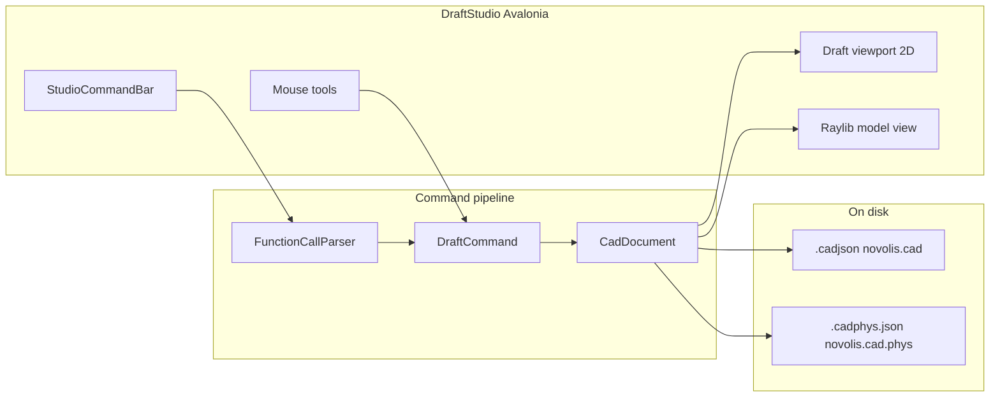
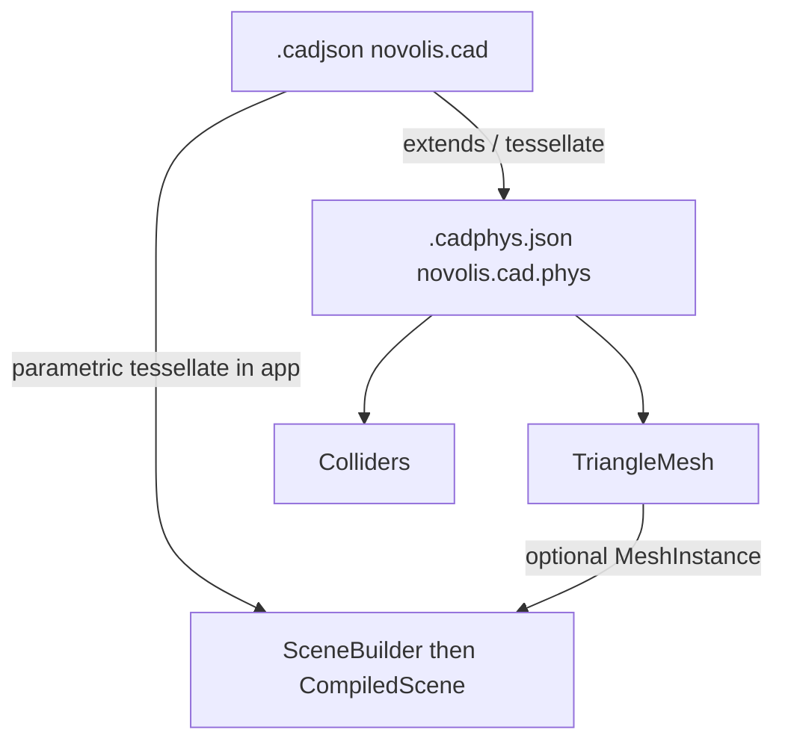

# Draft Studio — command-driven CAD-light

## Decisions (locked)

| Choice | Value |
|--------|--------|
| Product | **New sibling app** — Concept Studio stays as 3D blockout |
| Name / path | **Draft Studio** → [`novolis-apps/src/DraftStudio/`](novolis-apps/src/DraftStudio/) |
| Commands | **Both**: typed function-call DSL + mouse tools that emit the **same** command objects |
| CadKit | **None** (governance: apps compose Math + Avalonia + Commands) |
| Document formats | **`.cadjson`** (authoring, interchange-ready) + **`.cadphys.json`** (meshes + colliders) |
| Splines | **NURBS curves** on disk (`degree`/`knots`/`controlPoints`/`weights`); fit points optional authoring hint |

## Product shape (v1)

**In scope**

- 2D drafting as primary mode (plan/XZ plane, `Vector3` with `Y = 0` per [library-boundaries](novolis-governance/docs/library-boundaries.md))
- Sketch entities including **spline** (NURBS curve on disk; tool may collect fit points and bake control/knot data on commit)
- Light 3D model mode: solids (`Box`, `Cylinder`, `Sphere`) + sketch entities drawn on the ground plane
- Command bar: type `Line(0,0,1,0)`, `Circle(0,0,5)`, `Spline(...)`, `Box(1,1,1)`, `Undo`, `Delete`, …
- Interactive tools: **Line** / **Circle** / **Rect** / **Spline** (or type verb with no args) → prompt for points; finished gesture builds the same command as the typed form
- Grid + snap, pan/zoom, entity selection, undo/redo stack
- Persist as **`.cadjson`** under `%LocalAppData%\Novolis\Draft Studio\` — format kept **interchange-ready** (not a minimal toy dump)
- Export (or sidecar write) **`.cadphys.json`** for mesh + collider consumers
- StudioChrome shell, Inno/CI catalog entry like other apps

**Out of scope (v1)**

- Constraint solver, parametric history, CSG, **NURBS surfaces** / solids (curves yes; BREP/STEP writer no)
- Shipping DXF/DWG/glTF/STEP exporters in v1 (format must still carry enough data that a later converter is not guesswork)
- Serializing `CompiledScene` / BVH / GPU buffers
- Sharing code with Concept Studio via ProjectReference
- Replacing Concept Studio
- Migrating Concept Studio off `concept.json` (optional later; formats designed so it *can*)



---

## Document standards

Authoritative schemas live in **`novolis-governance/schemas/cad/`** (cross-repo contract; same role as registry schemas). Draft Studio implements load/save against them. No CadKit NuGet — optional thin C# DTOs stay app-local until a second consumer needs a shared package.

### Shared conventions (both formats)

| Rule | Value |
|------|--------|
| Encoding | UTF-8 JSON, camelCase, indented (match Concept Studio / workspace manifests) |
| Versioning | `format` string + `schemaVersion` int (start at `1`); bump version on breaking changes |
| Coordinates | Right-handed, **+Y up**, planar sketch on **XZ** (`y = 0`); document also records `handedness` + `forwardAxis` for exporters |
| Units | SI meters via `unitScaleMeters`; also explicit `linearUnit: "meter"` (DXF `$INSUNITS` mapping) |
| Angles | Radians in JSON; `angleUnit: "radian"` stated so converters do not guess degrees |
| Vectors | `number[3]` = `[x, y, z]` — never `{x,y,z}` objects, never `(x\|y\|z)` text |
| Quaternions | `number[4]` = `[x, y, z, w]` when used |
| Colors | `number[3]` RGB 0–1 or `number[4]` RGBA; optional `colorIndex` (ACI 1–255) for DXF round-trip |
| Ids | UUID strings (stable handles for xref / converter identity) |
| Transforms | Prefer TRS (`center`, `rotation`/`rotationY`, `scale`) over full matrices in authoring JSON |
| Extensibility | Every document and entity may carry `properties: { [key: string]: string \| number \| boolean }` for round-trip / app data |

**Do not** put in either file: `CompiledScene`, BVH, material *runtime* graphs, workspace manifests (`workspace.json` stays separate).

### Interchange readiness (anti–data-poor)

v1 does **not** ship DXF/glTF/STEP writers, but the on-disk model must not force converters to invent geometry or frame conventions. Design bar:

| Target (later) | Data we keep now |
|----------------|------------------|
| DXF / LibreCAD | Layers with name + visibility/lock; entity `style` (linetype, lineWeightMm, color/colorIndex); arcs with normal + CCW angles; **spline as NURBS** (degree, knots, controlPoints, weights, closed); stable ids |
| glTF / mesh tools | `.cadphys` meshes with optional `normals` / `uvs`; winding; `space`; materials as named presets + RGB |
| Physics / engines | Explicit collider kinds + optional body mass/inertia; mesh refs separate from visuals |
| STEP / BREP (far) | Parametric solids keep analytic fields (`center`/`halfExtents`/`radius`/`height`) — never replace authoring with tessellation-only in `.cadjson` |
| Generic converters | Document `generator` (`name`, `version`); `createdAt` / `modifiedAt` (ISO-8601); `coordinateSystem` block; open `properties` bags |

**Rule:** Sketch/solids stay **analytic** in `.cadjson`. Tessellation is derived into `.cadphys.json` (or at draw time). Fit-point editing UI may exist, but commit to disk must store **evaluable NURBS** (or both fitPoints + derived NURBS), not only opaque polylines.

---

### 1. `novolis.cad` — file extension `.cadjson`

**Purpose:** Authoring description of 2D sketch + 3D solid objects (parametric / constructive), layers, styles, optional view state — rich enough for later interchange.

**Top-level**

```json
{
  "format": "novolis.cad",
  "schemaVersion": 1,
  "name": "Untitled",
  "generator": { "name": "DraftStudio", "version": "2026.1.0" },
  "createdAt": "2026-07-28T20:00:00Z",
  "modifiedAt": "2026-07-28T20:00:00Z",
  "unitScaleMeters": 1,
  "linearUnit": "meter",
  "angleUnit": "radian",
  "coordinateSystem": {
    "handedness": "right",
    "upAxis": "y",
    "forwardAxis": "z"
  },
  "layers": [
    { "id": "…", "name": "0", "visible": true, "locked": false, "color": [0.8, 0.8, 0.8] }
  ],
  "linetypes": [
    { "name": "Continuous" },
    { "name": "Dashed", "pattern": [6, -3] }
  ],
  "entities": [],
  "camera": {
    "yaw": 0.9,
    "pitch": 0.35,
    "distance": 40,
    "target": [0, 1, 0]
  },
  "properties": {}
}
```

**Entity common fields:** `id`, `name?`, `layerId?`, `parentId?`, `kind`, optional `style`, optional `properties`.

**`style` (CAD stroke metadata):**

| Field | Type | Notes |
|-------|------|-------|
| `linetype` | string | Name from document `linetypes` (default `Continuous`) |
| `lineWeightMm` | number | Plot weight; `0` = default |
| `color` | `number[3]` | Entity override |
| `colorIndex` | int? | Optional ACI for DXF |

**Entity kinds**

| `kind` | Required fields | Notes |
|--------|-----------------|-------|
| `group` | — | Hierarchy only |
| `line` | `a`, `b` | Sketch; typically `y=0` |
| `polyline` | `points: number[3][]`, `closed: bool` | Optional `bulges: number[]` (DXF LWPOLYLINE bulge per segment) |
| `circle` | `center`, `radius`, `normal?` (default `[0,1,0]`) | |
| `arc` | `center`, `radius`, `startAngle`, `endAngle`, `normal?` | Radians, CCW about `normal` |
| `rect` | `center` or `min`/`max`, `halfExtents` or corners | Axis-aligned in plane |
| `spline` | see below | **NURBS curve** (interchange-grade) |
| `box` | `center`, `halfExtents`, `rotationY?` or `rotation?` | Solid |
| `sphere` | `center`, `radius` | |
| `cylinder` | `center`, `radius`, `height`, `rotationY?` | Axis +Y local |
| `cone` | `center`, `radius`, `height`, `rotationY?` | |
| `wedge` | `center`, `halfExtents`, `rotationY?` | Concept-compatible |

Optional visual on solids: `material` (preset string), `color: number[3]`.

#### `spline` entity (NURBS curve)

Aligns with DXF `SPLINE` / STEP curve data so exporters do not approximate from polylines.

| Field | Required | Notes |
|-------|----------|-------|
| `degree` | yes | Integer ≥ 1 (cubic = 3 typical) |
| `controlPoints` | yes | `number[3][]` |
| `knots` | yes | Nondecreasing; length = `controlPoints.length + degree + 1` (clamped open) |
| `weights` | no | Same length as control points; default all `1` (B-spline). Non-1 → rational NURBS |
| `closed` | no | Default `false` |
| `periodic` | no | Default `false` |
| `fitPoints` | no | Authoring/edit hints; **not** a substitute for control/knot data on disk |
| `normal` | no | Plane hint for planar splines; default `[0,1,0]` |

UI may collect fit points (`Spline` tool), then on commit compute `degree`/`controlPoints`/`knots`/`weights` (or store both). Display may tessellate; **file of record remains NURBS**.

**Example sketch + spline + solid**

```json
{
  "format": "novolis.cad",
  "schemaVersion": 1,
  "name": "Hull blockout",
  "generator": { "name": "DraftStudio", "version": "2026.1.0" },
  "linearUnit": "meter",
  "angleUnit": "radian",
  "unitScaleMeters": 1,
  "coordinateSystem": { "handedness": "right", "upAxis": "y", "forwardAxis": "z" },
  "layers": [{ "id": "a0000000-0000-4000-8000-000000000001", "name": "0", "visible": true, "locked": false }],
  "linetypes": [{ "name": "Continuous" }],
  "entities": [
    {
      "id": "a0000000-0000-4000-8000-000000000010",
      "kind": "line",
      "layerId": "a0000000-0000-4000-8000-000000000001",
      "name": "keel",
      "style": { "linetype": "Continuous", "lineWeightMm": 0.25 },
      "a": [0, 0, 0],
      "b": [0, 0, 12]
    },
    {
      "id": "a0000000-0000-4000-8000-000000000012",
      "kind": "spline",
      "name": "sheer",
      "degree": 3,
      "closed": false,
      "controlPoints": [[0, 0, 0], [2, 0, 3], [2, 0, 9], [0, 0, 12]],
      "knots": [0, 0, 0, 0, 1, 1, 1, 1],
      "weights": [1, 1, 1, 1],
      "fitPoints": [[0, 0, 0], [2, 0, 6], [0, 0, 12]]
    },
    {
      "id": "a0000000-0000-4000-8000-000000000011",
      "kind": "box",
      "name": "hull",
      "center": [0, 1, 6],
      "halfExtents": [2, 1, 6],
      "material": "hull",
      "color": [0.72, 0.35, 0.28]
    }
  ]
}
```

**Maps to:** Draft Studio document; Concept Studio `ConceptDocument` is a *subset* of solids/groups (migration path later). Tessellation stays at compile time for rendering / phys export.

**Schema file:** [`novolis-governance/schemas/cad/novolis.cad.schema.json`](novolis-governance/schemas/cad/novolis.cad.schema.json)

---

### 2. `novolis.cad.phys` — file extension `.cadphys.json`

**Purpose:** Extension of `novolis.cad` that adds **explicit triangle meshes** and **colliders** for rendering/physics consumers. Same entity tree may be inlined (superset document) or referenced.

**Extension rules**

1. Every `.cadphys.json` **is** a valid `novolis.cad` document **plus** required extension fields below (same `entities` / `layers` / header conventions).
2. `format` must be `"novolis.cad.phys"` (not `"novolis.cad"`).
3. `schemaVersion` is independent per format (both start at `1`).
4. Optional `baseDocument`: relative path to a `.cadjson` when the phys file is a **sidecar** that only carries meshes/colliders + entity id bindings (entities may be omitted if `baseDocument` is set; loaders merge).

**Additional top-level**

```json
{
  "format": "novolis.cad.phys",
  "schemaVersion": 1,
  "name": "Hull blockout",
  "unitScaleMeters": 1,
  "upAxis": "y",
  "baseDocument": "hull.cadjson",
  "meshes": [],
  "colliders": [],
  "entities": []
}
```

**`meshes[]`** — maps 1:1 toward [`TriangleMesh`](novolis-math/src/Novolis.Math.Geometry/TriangleMesh.cs) / `StaticTriangleMesh` (and later glTF primitives)

| Field | Type | Notes |
|-------|------|-------|
| `id` | string UUID | |
| `name?` | string | |
| `entityId?` | string | Visual/authoring entity this mesh realizes |
| `vertices` | `number[3][]` | World or local; see `space` |
| `indices` | `number[]` | Length % 3 == 0; triangle list |
| `normals?` | `number[3][]` | Per-vertex; length = vertices (glTF-ready) |
| `uvs?` | `number[2][]` | Per-vertex; **exception**: UV is 2D param space, not Math stack — allowed only in phys mesh payload |
| `winding` | `"ccw"` \| `"cw"` | Default `"ccw"` |
| `space` | `"local"` \| `"world"` | Default `"local"`; if local, apply entity TRS |
| `material?` | string | Preset name for glTF/material mapping |

**`colliders[]`** — shapes separate from visual mesh (may share mesh id)

| Field | Type | Notes |
|-------|------|-------|
| `id` | string UUID | |
| `entityId?` | string | Bind to authoring entity |
| `kind` | string | `box` \| `sphere` \| `capsule` \| `triangleMesh` |
| `center?` / `halfExtents?` | for `box` | Match Math AABB semantics |
| `radius?` | for `sphere` / `capsule` | |
| `a?` / `b?` | for `capsule` | Endpoints `number[3]` |
| `meshId?` | for `triangleMesh` | Ref into `meshes[]` |
| `isTrigger?` | bool | Default false |
| `body?` | object | Optional rigid-body seed: `mass`, `inertiaDiagonal: number[3]`, `kinematic: bool` — aligns with physics `RigidBodyState` fields without inventing numerics |

**Example (sidecar style)**

```json
{
  "format": "novolis.cad.phys",
  "schemaVersion": 1,
  "name": "Hull blockout",
  "unitScaleMeters": 1,
  "upAxis": "y",
  "baseDocument": "hull.cadjson",
  "meshes": [
    {
      "id": "b0000000-0000-4000-8000-000000000001",
      "entityId": "a0000000-0000-4000-8000-000000000011",
      "name": "hull-mesh",
      "space": "local",
      "winding": "ccw",
      "vertices": [[-2, -1, -6], [2, -1, -6], [2, 1, -6], [-2, 1, -6]],
      "indices": [0, 1, 2, 0, 2, 3]
    }
  ],
  "colliders": [
    {
      "id": "c0000000-0000-4000-8000-000000000001",
      "entityId": "a0000000-0000-4000-8000-000000000011",
      "kind": "box",
      "center": [0, 1, 6],
      "halfExtents": [2, 1, 6],
      "body": { "mass": 1, "inertiaDiagonal": [1, 1, 1], "kinematic": false }
    }
  ]
}
```

**Pipeline:** `.cadjson` → (tessellate / export) → `.cadphys.json` → Math `TriangleMesh` + Physics colliders. Never write `CompiledScene`.

**Schema file:** [`novolis-governance/schemas/cad/novolis.cad.phys.schema.json`](novolis-governance/schemas/cad/novolis.cad.phys.schema.json)

Also add short doc: [`novolis-governance/docs/cadjson.md`](novolis-governance/docs/cadjson.md) linking both schemas + examples under `schemas/cad/examples/`.



---

## Where fundamentals go

| Concern | Home | What to add |
|---------|------|-------------|
| Format contracts | **`novolis-governance/schemas/cad/`** + `docs/cadjson.md` | JSON Schema + examples; no CadKit package |
| `Name(arg,…)` parsing | **`novolis-commands`** → `Novolis.Commands.Expressions` | Pure function-call parser → bind to app commands |
| Command bar UI | **`novolis-avalonia`** → `Novolis.Avalonia.Studio` | `StudioCommandBar` (events only) |
| Geometry primitives | **Reuse** Math Topology/Geometry; **add** thin NURBS curve evaluate/tessellate helper in `Novolis.Math.Geometry` if missing (degree/knots/controls → polyline samples) — no CadKit |
| 2D CAD canvas | **App-local first** | Avalonia `DrawingContext` viewport |
| 3D preview | Existing Avalonia.Raylib packages | Thin app renderer |
| Document / tools / undo / export | **`DraftStudio`** | Load/save `.cadjson`; export `.cadphys.json` |

## App architecture

Scaffold mirrors Concept Studio bootstrap under `src/DraftStudio/`:

- `Models/` — DTOs matching `novolis.cad` / optional phys export DTOs
- `Commands/` — `IDraftCommand` + bus; factories from DSL and tools
- `Services/DraftSession.cs` — load/save `.cadjson`
- `Services/CadPhysExporter.cs` — tessellate solids → meshes + default matching colliders
- `Services/DraftSceneBridge.cs` — document → Raylib / 2D paint
- `Ui/DraftViewport.cs`, `Ui/ToolController.cs`, `MainWindow.cs`

### Command surface (v1)

| Typed | Interactive | Effect |
|-------|-------------|--------|
| `Line(x1,z1,x2,z2)` | Line tool: 2 clicks | Add line entity |
| `Circle(cx,cz,r)` | Circle: center + radius | Add circle |
| `Rect(x1,z1,x2,z2)` | Rect: 2 corners | Add rect |
| `Spline(...)` / fit-point form | Spline tool: N clicks + Enter | Add NURBS spline (bake knots/controls on commit) |
| `Box(w,h,d)` / `Box(x,y,z,w,h,d)` | optional | Add box |
| `Move(dx,dy,dz)` | drag selected | Translate |
| `Delete` / `Undo` / `Redo` / `Fit` | hotkeys | Stack / view |

Ambiguous `Line` / `Spline` with no args → enter tool. Parser errors → `StudioFeedback`.

## Packaging and publish order

1. Land schemas + `cadjson.md` in **novolis-governance** (no NuGet required for contracts)
2. `Novolis.Commands.Expressions` → map regen → GPR
3. `StudioCommandBar` → GPR
4. DraftStudio app + installer/CI/docs (PackageReference only)
5. Policy checks: `verify-nuget-only.ps1` + `verify-project-ref-mode.ps1`

## Explicit non-goals for this plan

- Editing Concept Studio’s REPL or forcing migration off `concept.json` in v1
- Shipping DXF/DWG/glTF/STEP exporters in v1 (schemas stay converter-ready)
- NURBS *surfaces* / BREP / boolean solids
- In-repo shared library between DraftStudio and ConceptStudio
- Formal C# shared DTO package until a second product needs it
- Storing sketch geometry as tessellated polylines only (forbidden — use analytic + NURBS)

