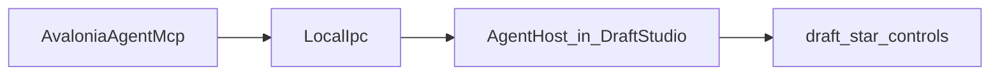

# Draft Studio Avalonia agent wiring

## Scope (locked)

**Generic `ui.*` only** — reuse existing [`Novolis.Avalonia.Agent`](novolis-avalonia/src/Novolis.Avalonia.Agent/) + Cursor MCP [`AvaloniaAgentMcp`](novolis-dogfooding/apps/AvaloniaAgentMcp/). No `draft.dispatch` / domain LocalIpc methods (still out of scope per the agent protocol plan).

Agents drive Draft Studio by: `UiTree` → `UiClick`/`UiType` on tagged controls → `UiScreenshot`, and/or typing CAD DSL into `draft.commandBar` (same path as the human command bar).



## Changes

### 1. Package refs — [`DraftStudio.csproj`](novolis-apps/src/DraftStudio/DraftStudio.csproj) + [`Directory.Packages.props`](novolis-apps/Directory.Packages.props)

Add central versions (mirror dogfooding lab):

- `Novolis.Avalonia.Agent` `2026.1.*`
- `Novolis.Avalonia.Agent.Protocol` `2026.1.*`

On the app (same ProjectRef transitive fix as StudioChromeLab):

- `PackageReference` for Agent, Agent.Protocol, and `MessagePack` (already versioned in apps props)

Build consumers with `-p:NovolisUseProjectReferences=true` until GPR publishes the new packages.

### 2. Attach host — [`App.cs`](novolis-apps/src/DraftStudio/App.cs)

Mirror [`StudioChromeLab/App.cs`](novolis-dogfooding/apps/avalonia/StudioChromeLab/App.cs):

```csharp
var window = Program.ApplicationHost.Services.GetRequiredService<MainWindow>();
desktop.MainWindow = window;
s_agentHost = AgentHost.TryAttachFromEnvironment(window);
```

Env gate: `NOVOLIS_AVALONIA_AGENT=1`.

### 3. Tag controls — [`MainWindow.cs`](novolis-apps/src/DraftStudio/MainWindow.cs)

Extend local `Btn(...)` to accept an agent id and call `AgentProperties.SetId(button, id, AgentRoleNames.Button)`.

Stable ids:

| Id | Control |
|----|---------|
| `draft.tool.save` / `.select` / `.line` / `.circle` / `.rect` / `.spline` / `.box` / `.delete` | toolbar tools |
| `draft.undo` / `draft.redo` | Undo / Redo |
| `draft.fit` / `draft.view.draft` / `draft.view.model` / `draft.export.phys` | remaining toolbar |
| `draft.toolbar` | toolbar `StackPanel` |
| `draft.viewport` | `_draftViewport` |
| `draft.viewport.model` | `_raylibHost` |
| `draft.commandBar` | `_commandBar` |
| `draft.entities` | `_entityList` (`ListBox` role) |
| `draft.inspector` | `_inspector` |
| `draft.status` / `draft.flash` | `chrome.StatusLine` / `chrome.FlashLine` |

### 4. Smoke doc

Add [`novolis-apps/src/DraftStudio/AGENT-SMOKE.md`](novolis-apps/src/DraftStudio/AGENT-SMOKE.md): build with ProjectRef → run with `NOVOLIS_AVALONIA_AGENT=1` → MCP `UiHello` / `UiTree` (expect `draft.tool.line`) / `UiClick`(`draft.tool.line`) / type into `draft.commandBar` / `UiScreenshot`.

### 5. Validate

```powershell
dotnet build novolis-apps/src/DraftStudio -p:NovolisUseProjectReferences=true
pwsh -File novolis-governance/scripts/verify-nuget-only.ps1
```

No platform map regen needed (no new packable projects).

## Out of scope

- Draft-specific MCP tools / LocalIpc methods
- Sins Captain Bridge wiring
- Changing AvaloniaAgentMcp (already registered)
