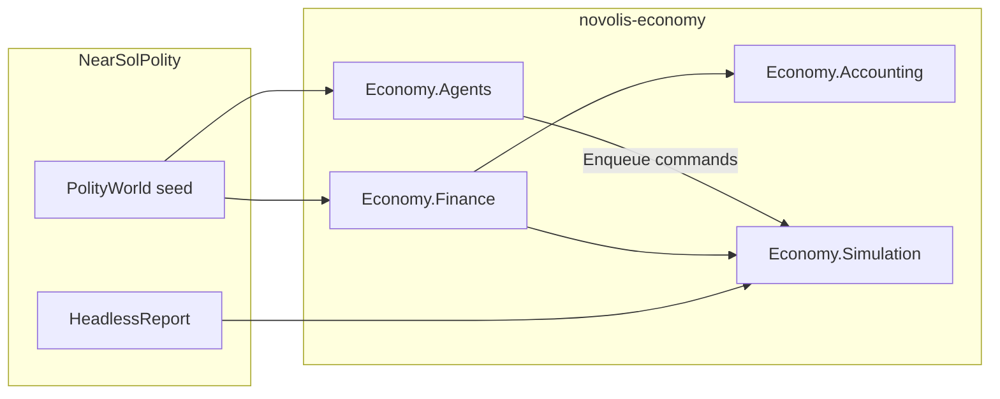

# Economic Agents + Finance fundamentals

## Locked scope

**In:** `Novolis.Economy.Agents`, thin `Novolis.Economy.Finance`, NearSol retarget, richer headless report, GPR publish, nuget-only dogfood.

**Out:** Labor market (keep flat `WageRatePerHour` + `SetAvailableLabor`), product/Avalonia UI, Astro packages, sci-fi vocabulary in libraries, ML/planners, full banking UI, bankruptcy liquidation drama beyond default hooks.

**Naming (locked):**

| Term | Meaning |
|------|---------|
| **Agent** | Economic decision-maker: observes world → enqueues commands (heuristics + `DeterministicRandom` only) |
| **Firm** | Id + ledger + facilities (unchanged) |
| **Cohort** | Population demand/budget unit; “households” in reports = Σ cohort budgets |
| **Policy** | Pure threshold/config for an agent (floors, caps, margins) — not ML policy |
| **Loan** | Finance contract between two firms |



## 1. Kernel — Finance (`Novolis.Economy.Finance`)

New package, depends on Accounting + core Economy. Wire settle into Simulation phases.

**Types (generic, no setting fiction):**

- `LoanId`, `Loan` — lender/borrower `FirmId`, principal remaining, annualized rate (or per-period rate), accrued interest, due hour, status `{ Active, Defaulted, Closed }`
- `EconomyWorld.Loans` list (or dict) on Simulation world

**Account roles** (extend [`AccountingModels.cs`](novolis-economy/src/Novolis.Economy.Accounting/AccountingModels.cs)):

- `NotesReceivable`, `NotesPayable`, `InterestIncome`, `InterestExpense`

**Commands / events** (in [`CommandsAndEvents.cs`](novolis-economy/src/Novolis.Economy/CommandsAndEvents.cs) or Finance-owned DTOs re-exported via Simulation):

- `OriginateLoan(lender, borrower, principal, rate, termHours)`
- `RepayLoan(loanId, amount)`
- `LoanOriginated`, `InterestAccrued`, `LoanRepaid`, `LoanDefaulted`

**Phase** `SettleFinance` (after wages/invoices or adjacent): accrue interest; attempt scheduled repayment from borrower cash; on miss → `Defaulted` + stop further credit draws (hook only — no forced asset fire-sale this pass).

**Ledger:** principal draw = cash to borrower + NotesPayable / NotesReceivable; interest = expense/income + cash or payable; repay reduces principal.

**Tests:** originate → accrue → repay; default when cash insufficient; liquid stock-flow still holds under closed policy (interest is firm↔firm transfer).

## 2. Kernel — Agents (`Novolis.Economy.Agents`)

New package depending on Simulation (read world + enqueue). **No** Astro, roles, or SKU story names.

**Core API:**

```csharp
public interface IEconomicAgent
{
  FirmId FirmId { get; }
  void Tick(AgentContext context);
}

public sealed class AgentContext
{
  public EconomySimulation Simulation { get; }
  public EconomyWorld World => Simulation.State.World;
  public SimulationHour Clock { get; }
  public DeterministicRandom Rng { get; }
  public void Enqueue(IEconomyCommand command);
}
```

**Reusable heuristic agents** (config-driven `*AgentPolicy` records with `ProductId`s, floors, caps, margins — dogfood supplies NearSol numbers):

| Agent | Maps from NearSol | Behavior (library) |
|-------|-------------------|--------------------|
| `ExtractiveFirmAgent` | MiningHeuristic | Throttle output via `ProductionThrottle`; sell surplus on hub book; buy input when below floor |
| `ManufacturingFirmAgent` | IndustryHeuristic | Buy inputs; multi-product plans + throttle; sell outputs |
| `RetailFirmAgent` | StationHeuristic | `SetRetailPrice` + pressure pricing; buy stock; optional procurement when local book dry; sell bunker surplus |
| `CarrierFirmAgent` | CarrierHeuristic | Cross-hub sell@A+buy@B spreads via `HaulCostEstimator`; lift/match + `PlanShipment`; bunker gate; RNG only for near-tied routes |
| `TreasuryFirmAgent` (thin) | Station toll role | Optional: hold cash floor; originate small working-capital loans to firms below cash floor (uses Finance) |

Also: `AgentScheduler` / pulse helper — ordered `Tick` then caller runs `AdvanceAsync` (dogfood keeps pulse ownership).

Unit tests: agent posts orders that Match fills in a tiny two-firm hub world; carrier finds positive-margin spread; treasury originates loan when borrower cash &lt; floor.

## 3. Simulation wiring

- Register `SettleFinancePhase` in [`PhasePipeline`](novolis-economy/src/Novolis.Economy.Simulation/PhasePipeline.cs) / phase order enum.
- `EconomyWorldBuilder` helpers: `AddLoan` optional; ensure new account roles on `EnsureFirm`.
- Docs: [`docs/design.md`](novolis-economy/docs/design.md), [`docs/release.md`](novolis-economy/docs/release.md) — Agents + Finance; terminology note (“economic agents, not ML”).

## 4. NearSol dogfood retarget

- Delete/replace app heuristics with thin wiring: build `*AgentPolicy` from [`PolityWorld`](novolis-dogfooding/apps/economy/NearSolPolity/PolityWorld.cs) constants + product ids; construct library agents.
- Keep Astro bridge, `SystemRole`, SKU labels, cruise d/ly **only in the app**.
- Seed optional **working-capital loans** (Station/treasury → Mining/Industry) so Finance is exercised without sci-fi framing.
- Pulse: agents in order Extractive → Manufacturing → Retail → Carrier → (optional Treasury) → `AdvanceAsync`.

## 5. Headless report extension

Extend [`HeadlessReport`](novolis-dogfooding/apps/economy/NearSolPolity/HeadlessReport.cs) + [`CreditCirculation`](novolis-dogfooding/apps/economy/NearSolPolity/CreditCirculation.cs) incremental counters:

- Per-firm: cash, revenue, COGS proxy, wage expense, transport expense, **interest expense/income**, **notes payable/receivable**
- Finance: active loans count, principal outstanding, interest accrued/paid, defaults
- Markets: book open buy/sell depth (top products), fill count/qty (already), produced vs retail sold vs B2B fill qty
- Money: liquid Δ vs imports (keep); inventory book value (sum lots × unit cost) as working-capital line
- Agents: last decision line per firm (from agent `LastDecision` strings)

Acceptance `--headless 100d` then `1000d`: households not ~0; `|ΔLiquid+imports|` small; book fills grow after day 100; loans either service or show defaults without freezing tramp; wall clock stays in the fast regime (~tens of seconds for 1000d).

## 6. Release path

1. Economy unit tests → commit/push → GPR `2026.1.*`
2. Dogfood restore nuget.org+github only → retarget → report → commit/push
3. Run `novolis-governance/scripts/verify-nuget-only.ps1`

## Non-goals

Labor matching, equity markets, taxes, Avalonia, Astro-in-Economy, LLM agents, capacity investment UI, soft narrative bankruptcy cutscenes.

