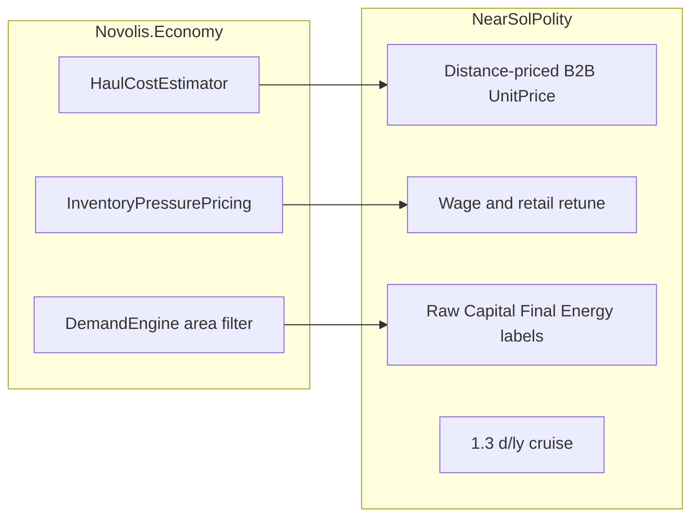

# Economic rigor pass (intuitive, not maximalist)

## Locked defaults

- **Keep** one co-op + tramp (no firm split this pass).
- **Do** lift area-local demand, haul-cost quoting, and soft inventory-pressure pricing into Economy libraries.
- **Travel:** set NearSol cruise to **1.3 days/ly** (user preference); fuel burn retuned so short ≤10 ly still fits tank.
- **SKU story (labels + demand weights, not a full rename of IDs):** Ore = raw materials; Parts = intermediate/capital; Goods = final goods (& services abstracted); Fuel = energy. Stop treating Parts as the main consumer “services” SKU.

## 1. Kernel — area-scoped retail demand

**Files:** [`FacilityBinding`](novolis-economy/src/Novolis.Economy.Simulation/EconomyWorld.cs), [`DemandEngine`](novolis-economy/src/Novolis.Economy.Population/DemandEngine.cs), resolve phase in [`StubPhases`](novolis-economy/src/Novolis.Economy.Simulation/Phases/StubPhases.cs).

- Add optional `GeographicAreaId? Area` on `FacilityBinding` (default null).
- Extend `RetailFacilityMap()` / resolve call so each facility exposes area.
- In `DemandEngine.ResolvePurchases`: when `cohort.Definition.Area` is set **and** the offer facility has a non-null area, require equality; facilities with null area remain globally visible (backward compatible for commodity-chain / tramp tests).
- Unit test: cohort in area A cannot buy stock only listed at facility in area B; can buy when areas match.

## 2. Kernel — haul cost estimator (general)

**New helper** in [`Novolis.Economy.Logistics`](novolis-economy/src/Novolis.Economy.Logistics) e.g. `HaulCostEstimator.Estimate(itinerary, corridors, vehicle, wageRate, fuelUnitCost) → (UnderwayHours, FuelUnits, Tolls, CrewHours, TotalVariableCost)`.

- Pure function; no world mutation. Same math tramp already does inline in [`TrampFleetAutopilot`](novolis-dogfooding/apps/economy/NearSolPolity/TrampFleetAutopilot.cs) `Quote`.
- Unit test: known corridor → deterministic cost.

## 3. Kernel — inventory-pressure posted price

**New helper** in [`Novolis.Economy.Markets`](novolis-economy/src/Novolis.Economy.Markets) e.g. `InventoryPressurePricing.Adjust(basePrice, onHand, targetOnHand, maxPremium, maxDiscount)`:

- Soft curve: stock ≫ target → discount; stock ≪ target → premium; clamp to bands (toy-but-legible, not a full GE solver).
- NearSol retail posting uses this; tramp ask prices may too.
- Unit test: high stock → lower price; low stock → higher; clamps hold.

## 4. NearSol — distance-priced B2B

In [`TrampFleetAutopilot`](novolis-dogfooding/apps/economy/NearSolPolity/TrampFleetAutopilot.cs):

- Settle/lift `TransferGoodsForCash.UnitPrice` = **gate + (haulVariableCost / qty) + thin premium**, not flat `OreFreightUnit` / `PartsFreightUnit`.
- Keep `MinMargin` on *net* margin after that haul cost (already quoted); remove double-counting.
- Flat constants become **gate baselines** only (`OreBuy`, `PartsBuy`).

## 5. NearSol — wage / price retune so households don’t starve

In [`PolityWorld`](novolis-dogfooding/apps/economy/NearSolPolity/PolityWorld.cs) + controller:

- Raise `WageRatePerHour` and/or available labor so long-run **wages→hh** can sustain retail (target: after multi-year headless run, `Households` not stuck at ~0 while firms hoard).
- Soften retail bases (`GoodsSell`, etc.) via pressure pricing around targets; bias cohort prefs heavily to **Goods** (final), light on Parts, near-zero on Ore.
- Keep `HouseholdCreditFromWages` + `CarryForward` + toll treasury.

Acceptance via `--headless 100d` (and a longer smoke if cheap): liquid Δ ≈ −imports; **hh budget remaining > 0** or oscillating, not permanently zero.

## 6. NearSol — SKU clarity + cruise 1.3 d/ly

- [`AstroEconomyBridge.CruiseDaysPerLy = 1.3`](novolis-dogfooding/apps/economy/NearSolPolity/AstroEconomyBridge.cs); retune `FuelBurnPerDifficultyHour` so short ≤10 ly burn ≈ tank 6.
- Dashboard / report / README: show **Raw / Capital / Final / Energy** labels next to ore/parts/goods/fuel.
- Headless report includes wage recirculation and freight model one-liner.

## 7. Release path (NuGet-only)

1. Economy unit tests green → commit/push `novolis-economy` → CI publish `2026.1.*`.
2. Dogfood restore (no local feeds) → NearSol changes → commit/push `novolis-dogfooding`.
3. Update [`novolis-economy/docs/design.md`](novolis-economy/docs/design.md) + [`release.md`](novolis-economy/docs/release.md) briefly (area demand, haul cost, pressure pricing).

## Explicit non-goals this pass

- Splitting co-op into mining/industry/retail firms.
- Full endogenous price auction / GE solver.
- Astro coupling inside Economy.
- Soft loans / bankruptcy drama.

