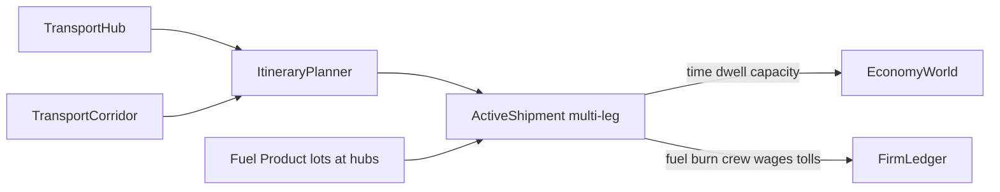

# Economic transport (hubs, fuel, time, capacity)

## Goal

Make **transport an economic phenomenon** in [`novolis-economy`](d:\novolis\novolis-economy): moving goods incurs **time**, consumes **fuel/energy stock**, binds **crew labor**, and is limited by **routing topology and capacity**—not a prettier map and not a Space Tycoon product.

**Locked preference:** institutional / logistics vocabulary (hub, corridor, leg, bunker/fuel stock, dwell) over astrographics. Space FTL tradeoffs map to the same abstractions as trucking (range → max leg length / fuel; jump points → hubs; lanes → corridors). **No** `Novolis.Astro.*` references in Economy.

**Default fuel model:** fuel/energy is an **inventory commodity** bought/held at hubs and consumed per leg (conservation). Optional money surcharge for tolls/port fees stays Money on the ledger.

## Analogies (one model, two skins)

| Economic concept | Terrestrial | Space (not Astro-coupled) |
|------------------|-------------|---------------------------|
| Hub | Port, rail yard, transfer warehouse | Starport / jump staging dock |
| Corridor / leg | Highway segment, sea lane | Allowed hop between hubs |
| Range / bunker stop | Gas station / bunker port | Must refuel or stage at hub |
| Capacity | Truck/ship tonnage, berth limits | Hold / jump tonnage |
| Dwell | Loading hours at warehouse | Dock turnaround |
| In-transit inventory | Goods on the road | Goods in the hold (working capital locked) |

## Current gap

Today [`FreightRoute`](d:\novolis\novolis-economy\src\Novolis.Economy.Logistics\LogisticsModels.cs) is a single origin→destination edge with fixed `TransitHours` and capacity; [`LogisticsEngine`](d:\novolis\novolis-economy\src\Novolis.Economy.Logistics\LogisticsEngine.cs) only ages hours and delivers. No fuel, no multi-leg itinerary, no hub dwell, no crew cost while underway.

## Architecture

Keep packages; deepen Logistics + wire Transport/Acquire/Settle phases.



### New / extended types (`Novolis.Economy.Logistics`)

- **`TransportHub`**: `InventoryLocationId` + optional berth capacity (shipments handled per hour) + dwell hours for load/unload.
- **`TransportCorridor`**: directed hubA→hubB, `TransitHours`, `MaxCargo`, optional `MaxRangeMetric` (unitless “leg difficulty”; fuel burn scales with it), toll `Money` per departure.
- **`VehicleClass`** (thin): cargo capacity, fuel burn per difficulty-hour, crew seats (labor hours per underway hour).
- **`Itinerary`**: ordered list of corridor ids from origin hub to destination (explicit path; no map UI).
- **`ActiveShipment`**: extend to track `Itinerary`, `LegIndex`, phase (`Loading` | `Underway` | `Unloading` | `Delivered`), remaining dwell/transit hours, assigned `VehicleClass`, cargo lots + optional fuel lots onboard.

Keep existing `FreightRoute` as a **compat shim**: one-corridor itinerary so current restock scenarios keep working.

### Engines

- **`ItineraryPlanner`**: given hubs/corridors graph and max vehicle range/fuel, find a feasible path (Dijkstra on transit hours or hop count). Failure = cannot ship (economic scarcity of connectivity)—not a fancy map.
- **`LogisticsEngine`** rewrite:
  - Depart: pull cargo (+ optional fuel for the whole itinerary or per-leg bunker strategy: **default = bunker at each hub** when corridor burn exceeds onboard fuel).
  - Each Transport hour: advance dwell or transit; while underway accrue crew labor → wage accrual; burn fuel from onboard or refuse to enter leg.
  - At intermediate hub: unload/reload dwell; buy fuel from hub inventory if available (cash purchase via ledger); respect berth capacity queue (FIFO delay).
  - Final hub: deliver cargo into destination inventory.

### Accounting / labor hooks

- Fuel purchase: existing cash→inventory posts.
- Fuel burn: write off fuel inventory to COGS/opex (`TransportFuelExpense` account role or COGS).
- Tolls: cash debit on leg start.
- Crew: reuse wage accrual path (allocated “crew hours” while `Underway`).
- In-transit cargo remains off destination shelves (already true)—document as **working capital lockup**.

### Commands / events

- `PlanShipment(Firm, OriginHub, DestHub, Product, Qty, VehicleClass)` → builds itinerary or fails.
- `IssueShipment` remains for explicit corridor/route.
- Events: `ShipmentLegStarted`, `ShipmentHubArrived`, `FuelBunkered`, `TransportTollPaid`, `ShipmentDelivered` (extend existing).

### World / phases

- `EconomyWorld`: hub registry, corridor graph, vehicle classes, berth queues.
- `TransportInventoryPhase`: multi-leg advance + bunkering.
- `AllocateLaborPhase`: include underway crew demand.
- Restock retail can keep single-leg shim.

## Scenario / verification (machine speed)

Add **Hub network trade** fixture (names generic: Hub North / Hub South / Transfer):

1. Two demand regions, one producer, one transfer hub; fuel product sold only at hubs.
2. Corridors with different hours/burn; one “long” corridor needs mid-hub bunker.
3. Advance hundreds of hours at machine speed; report: cargo delivered, fuel consumed, wages, tolls, time-in-transit distribution, failed plans when fuel stockout, ledger balance, determinism hash.

No Astro catalog, no SVG map.

## Docs

Update [`docs/design.md`](d:\novolis\novolis-economy\docs\design.md): transport economics section + analogy table; explicit non-goals (Astro coupling, tycoon UI, continuous orbital physics).

## Non-goals

- `Novolis.Astro.*` package references or star catalogs inside Economy
- Graphics / StarMap / “tycoon” gameplay loop
- Full vehicle fleets with maintenance minigames
- Continuous spaceflight physics (Physics.Orbits)

## Verification

```powershell
cd d:\novolis\novolis-economy
dotnet build Novolis.Economy.slnx -c Release
dotnet test --project tests/Novolis.Economy.Unit -c Release
# machine-speed hub-network smoke printing fuel/time/cash aggregates
```

