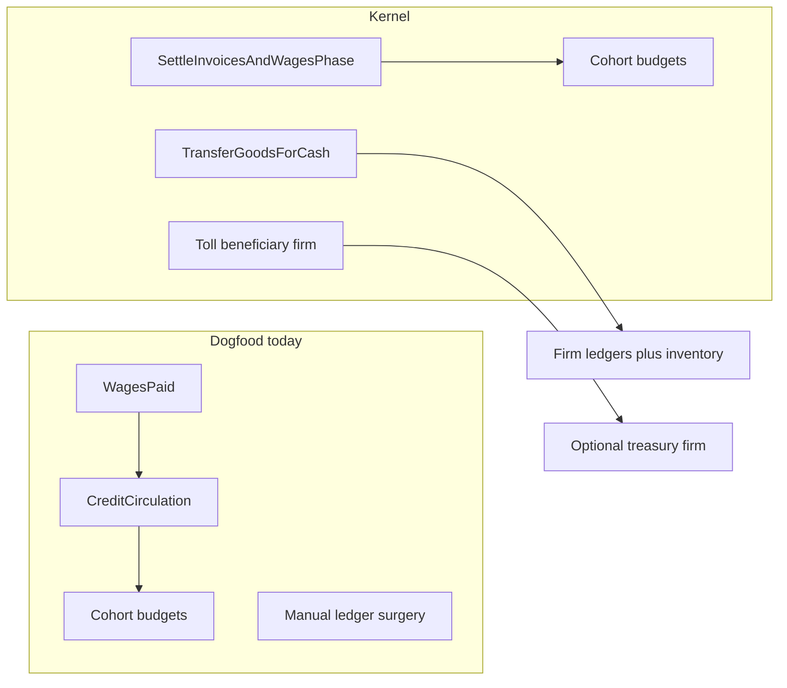

# Lift NearSol fundamentals into Economy kernel

## Default scope (locked)

**In this lift:** wage→household credits, period budget mint policy, firm↔firm inventory+cash transfer, optional toll treasury beneficiary.

**Out:** area-local demand, generic feeder/autopilot agents, Astro coupling (bridge stays in dogfood).

Existing scenarios keep working via **opt-in policy flags** (defaults preserve today’s mint-on-period-close and wage cash destruction).

## 1. Policy knobs — [`EconomyWorld.cs`](novolis-economy/src/Novolis.Economy.Simulation/EconomyWorld.cs)

Extend `EconomyPolicy`:

- `HouseholdCreditFromWages` (bool, default `false`) — when true, paid wages increase cohort `BudgetRemaining` (population-weighted), matching [`CreditCirculation`](novolis-dogfooding/apps/economy/NearSolPolity/CreditCirculation.cs).
- `CohortBudgetResetMode` enum:
  - `MintFromDisposableIncome` (default) — current `ResetBudget()` behavior in [`CloseAccountingPeriodPhase`](novolis-economy/src/Novolis.Economy.Simulation/Phases/StubPhases.cs)
  - `CarryForward` — do not remint; leave `BudgetRemaining` as-is (NearSol closed loop)
- `TollBeneficiaryFirmId` (`FirmId?`, default null) — when set, corridor tolls credit that firm’s cash/revenue after debiting the shipper (replaces NearSol’s post-hoc treasury credit).

Document in [`docs/design.md`](novolis-economy/docs/design.md) under accounting / population (money conservation modes).

## 2. Wage → household credits — [`SettleInvoicesAndWagesPhase`](novolis-economy/src/Novolis.Economy.Simulation/Phases/StubPhases.cs)

After each successful `LedgerEngine.PayWages` / `WagesPaid` emission:

- If `HouseholdCreditFromWages`, distribute `pay.Amount` across `world.Cohorts` by `Population` (same split rules as the dogfood helper; remainder to largest cohort).
- Emit a small event e.g. `HouseholdCreditsIssued(Hour, FirmId, Money Amount)` for observability/hash-friendly traces.

No change when flag is false (TrampFreighter / EconomyBoard / unit tests unchanged).

## 3. Period close mint policy — same phase file

In `CloseAccountingPeriodPhase`, switch on `CohortBudgetResetMode` instead of always calling `ResetBudget()`.

## 4. Firm↔firm sale command — kernel surface

Today NearSol does inventory `TryTake`/`Add` + `PostCashSale`/`PostCashPurchase` by hand. Invoices exist on [`EconomyWorld.Invoices`](novolis-economy/src/Novolis.Economy.Simulation/EconomyWorld.cs) but nothing posts inter-firm goods sales.

Add:

- Command `TransferGoodsForCash(SellerFirmId, BuyerFirmId, LocationId, ProductId, Quantity, UnitPrice)` in [`CommandsAndEvents.cs`](novolis-economy/src/Novolis.Economy/CommandsAndEvents.cs)
- Event `GoodsSoldInterFirm(...)` (or reuse patterns from `GoodsSold` with buyer firm)
- Handle in `ApplyDecisionsPhase` / acquire phase: require seller stock + buyer cash ≥ spend; move lots FIFO; post seller sale + buyer purchase; if unaffordable/unstocked, no-op or emit `TransferGoodsFailed(Reason)` (cash / stock)

Helper on [`LedgerEngine`](novolis-economy/src/Novolis.Economy.Accounting/AccountingModels.cs) is optional; prefer one place in the phase for determinism.

## 5. Toll treasury — logistics settlement path

Where shipper tolls are posted today (`TryPostToll` in transport advance ~line 250 of StubPhases): if `TollBeneficiaryFirmId` is set and differs from payer, credit beneficiary `Post(Cash, Revenue, toll)` so liquid firm cash is conserved (payer expense ↔ treasury revenue). Null beneficiary keeps current “toll burns cash” behavior for old tests.

## 6. Tests — [`tests/Novolis.Economy.Unit`](novolis-economy/tests/Novolis.Economy.Unit)

New focused scenarios (deterministic hashes):

- **ClosedLoopCredits:** `HouseholdCreditFromWages` + `CarryForward`; pay wages → cohort budget rises by same amount; firm cash down; no period remint after `PeriodHours`.
- **InterFirmTransfer:** seller stock + buyer cash → inventory moves; ledgers balance; failure when buyer broke.
- **TollTreasury:** with beneficiary, sum of payer+beneficiary cash unchanged by toll (modulo other flows).

Keep existing commodity-chain / tramp tests green under default policy.

## 7. Thin NearSolPolity

After publishing kernel:

- Set NearSol `EconomyPolicy` to `HouseholdCreditFromWages = true`, `CohortBudgetResetMode = CarryForward`, `TollBeneficiaryFirmId = polity`.
- Replace B2B settle / mine-lift ledger surgery with `TransferGoodsForCash`.
- Delete or gut [`CreditCirculation`](novolis-dogfooding/apps/economy/NearSolPolity/CreditCirculation.cs) to a thin **dashboard metric** helper (liquid stock / import tally only), not economic authority.
- Keep scenario content in app: catalog, roles, Astro bridge, recipes, feeders, tramp heuristics, Spectre UI.

## 8. Release path (NuGet-only)

1. `dotnet test` economy unit  
2. Bump/publish `Novolis.Economy.*` to GitHub Packages (`2026.1.*`)  
3. Dogfood restore against nuget.org + github only  
4. `verify-nuget-only.ps1`  
5. Update [`docs/release.md`](novolis-economy/docs/release.md) with a short “closed-loop credits + inter-firm transfer” note  

## Non-goals (explicit)

- Moving NearSol recipes, role assigner, Astro bridge, or autopilot into Economy  
- Soft loans / bankruptcy drama (design non-goal)  
- DemandEngine hub/area locality (follow-up)  

